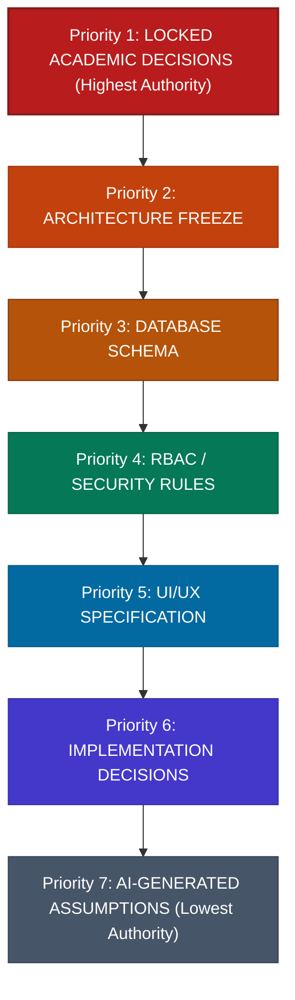

# NIET Dissertation Management System — Canonical Project Master Document

**Document ID:** `DOC-00-MASTER`  
**File Path:** [`docs/00_PROJECT_MASTER.md`](file:///c:/Users/user/Desktop/niet-dissertation-management-system/docs/00_PROJECT_MASTER.md)  
**Document Status:** CANONICAL SOURCE OF TRUTH (GOVERNANCE BASELINE)  
**Last Revised:** 2026-08-15  
**Institution:** Noida Institute of Engineering & Technology (NIET), Greater Noida  
**Academic Target:** M.Tech / M.Tech Integrated Dissertation  

---

## 1. Document Authority & Purpose

This document is the **CANONICAL SOURCE OF TRUTH** for the entire NIET Dissertation Management System project.

Every future AI agent, software engineer, coding agent, system architect, database designer, UI/UX designer, and implementation agent **MUST** strictly adhere to this document and the authority hierarchy defined herein.

### Primary Purpose & Objectives
The primary purpose of this master governance document is to prevent AI agents and contributors from:
- Hallucinating academic or business requirements
- Inventing academic regulations, grading formulas, or workflows
- Silently altering or drifting business logic
- Resolving institutional ambiguities without explicit authorization
- Overwriting faculty-confirmed and institutionally locked decisions
- Introducing architectural inconsistencies
- Designing database schemas or APIs that contradict institutional requirements

> [!IMPORTANT]
> **DOCUMENT AUTHORITY MODEL**  
> Documentation is authoritative **ONLY** when it has been explicitly approved/frozen at the appropriate project stage.  
> AI-generated documentation is **NOT** automatically authoritative. A generated document becomes authoritative only after human/faculty review and explicit acceptance/freeze.

---

## 2. Current Project Status

| Area | Status | Governance Notes |
| :--- | :--- | :--- |
| **Overall Project Status** | **REQUIREMENTS / GOVERNANCE FOUNDATION** | Baseline governance established |
| **Implementation Status** | **NOT STARTED** | No application code to be written |
| **Architecture Status** | **NOT FROZEN** | Architectural proposals pending freeze |
| **Database Status** | **NOT FROZEN** | Schema proposals pending freeze |
| **RBAC / Security Status** | **NOT FROZEN** | Permissions matrix pending freeze |
| **UI/UX Status** | **NOT FROZEN** | Design system & wireframes pending freeze |
| **API Status** | **NOT FROZEN** | API contracts pending freeze |
| **Production Deployment** | **NOT STARTED** | Infrastructure pending specification |

---

## 3. Mandatory Source-of-Truth Hierarchy

All agents and contributors must evaluate decisions according to the following strict 7-tier priority hierarchy. Higher-priority sources strictly supersede lower-priority sources at all times.



### Priority 1: LOCKED ACADEMIC DECISIONS
- **Definition:** Faculty-confirmed and institutionally confirmed academic and business rules.
- **Authority:** Highest authority in the project.
- **Scope Includes:** Latest faculty-confirmed workflow decisions, locked DCEC mechanics, locked Guide/Co-Guide allocation rules, locked P1/P2/P3 evaluation rules, and explicitly confirmed institutional forms/annexures.
- **Rule:** These **MUST NOT** be overridden by architecture, database, UI, code, or AI assumptions.

### Priority 2: ARCHITECTURE FREEZE
- **Definition:** Formally frozen system architecture and structural design decisions.
- **Authority:** Authoritative for technical design and implementation.
- **Rule:** Architecture **MUST NOT** override a locked academic decision. If an architectural design conflicts with a locked academic decision, **DO NOT GUESS**, **DO NOT** silently modify either—record the issue immediately as an `OPEN_DECISION`.

### Priority 3: DATABASE SCHEMA
- **Definition:** Approved data models, relational constraints, entity definitions, and schemas.
- **Authority:** Authoritative technical representation of approved business and architecture specifications.
- **Rule:** Database design **MUST NOT** invent academic rules, bypass institutional constraints, or contradict academic state machines.

### Priority 4: RBAC / SECURITY RULES
- **Definition:** Approved authorization policies, permission matrices, and security models.
- **Authority:** Authoritative for access control and security enforcement.
- **Rule:** RBAC/security rules **MUST NOT** grant permissions that contradict locked academic authority. *Example:* System `ADMIN` technical privileges must **NOT** automatically confer academic approval authority.

### Priority 5: UI/UX SPECIFICATION
- **Definition:** Approved user interface layouts, navigation flows, and design systems.
- **Authority:** Authoritative for client-side presentation and interaction.
- **Rule:** UI/UX **MUST NOT** alter business rules or academic workflows. The UI is strictly an expression of the workflow, never the authority defining the workflow.

### Priority 6: IMPLEMENTATION DECISIONS
- **Definition:** Framework selections, code structure, internal libraries, helper functions, and deployment configurations.
- **Authority:** Authoritative for software mechanics.
- **Rule:** Implementation **MUST** strictly follow higher-priority decisions. Implementation cannot redefine functional requirements or academic rules.

### Priority 7: AI-GENERATED ASSUMPTIONS
- **Definition:** Inferences, default behaviors, or suggestions generated by AI models.
- **Authority:** **LOWEST** authority in the project.
- **Rule:** An AI agent must **NEVER** treat its own generated assumption as an institutional requirement. If an AI agent encounters uncertainty, it must explicitly identify the uncertainty.

---

## 4. Critical Anti-Hallucination Rule

> [!CAUTION]
> # CRITICAL ANTI-HALLUCINATION RULE
> 
> If **ANY** agent encounters a conflict, ambiguity, contradiction, missing requirement, or uncertain business rule:
> 
> 1. **DO NOT GUESS.**
> 2. **DO NOT INVENT.**
> 3. **DO NOT SILENTLY CHANGE REQUIREMENTS.**
> 4. **DO NOT ASSUME THAT THE MOST CONVENIENT IMPLEMENTATION IS CORRECT.**
> 5. **DO NOT OVERRIDE A HIGHER-PRIORITY SOURCE.**
> 6. **DO NOT CONVERT AN ASSUMPTION INTO A REQUIREMENT.**
> 
> **MANDATORY RESOLUTION PROCEDURE:**
> 1. **Stop** the affected decision or implementation task immediately.
> 2. **Identify** the exact conflict, ambiguity, or missing requirement.
> 3. **Explain** which sources conflict and what data is missing.
> 4. **Preserve** the existing higher-priority rule.
> 5. **Record** the issue formally as an `OPEN_DECISION` in [`docs/15_OPEN_DECISIONS.md`](file:///c:/Users/user/Desktop/niet-dissertation-management-system/docs/15_OPEN_DECISIONS.md) and reference it here.
> 6. **Ask** for human/faculty confirmation when necessary.
> 7. **Do not implement** the disputed behavior until resolution is formally approved.

---

## 5. Open Decision Management

Unresolved questions, missing institutional policies, or conflicting specifications must be recorded using the standardized Open Decision format.

### Standard Open Decision Template
Every `OPEN_DECISION` must contain the following schema:
- **ID:** Standard identifier (`OD-XXX`)
- **Title:** Short descriptive summary
- **Status:** `OPEN` | `UNDER_FACULTY_REVIEW` | `RESOLVED` | `REJECTED`
- **Description:** Clear explanation of the question or ambiguity
- **Why it is unresolved:** Context on why institutional clarity is missing
- **Conflicting sources:** References to documents or requirements in conflict
- **Current understanding:** What is known versus what is assumed
- **Impacted modules:** Affected modules, schemas, or workflows
- **Temporary behavior (if absolutely necessary):** Safe default/fallback or unimplemented placeholder
- **Decision owner:** Assigned human/faculty role or architect
- **Date created:** ISO Date (`YYYY-MM-DD`)
- **Resolution:** Explicit recorded resolution once decided
- **Date resolved:** ISO Date (`YYYY-MM-DD`)

### Baseline Example: OD-001
```markdown
ID: OD-001
Title: DCEC Quorum Mechanism
Status: OPEN
Description: The exact DCEC quorum/voting mechanism has not been institutionally confirmed.
Why it is unresolved: Institutional guidelines specify DCEC review but do not define minimum voting member threshold or unanimous vs. majority voting rules.
Conflicting sources: Academic Manual vs. Digital Workflow Specification.
Current understanding: DC verifies and prepares; HOD (or authorized D.HOD delegate) provides final screening/approval decision.
Impacted modules: DCEC Screening, Title Approval, Final Review.
Rule: Do not invent a voting mechanism.
Temporary behavior: Keep the mechanism configurable / unimplemented until formal faculty confirmation.
Decision owner: Dean Academics / HOD CSE
Date created: 2026-08-15
Resolution: Pending institutional confirmation
Date resolved: Unresolved
```

---

## 6. Project Context & Scope

- **Project Name:** NIET Dissertation Management System
- **Institution:** Noida Institute of Engineering & Technology (NIET), Greater Noida
- **Academic Context:** M.Tech and M.Tech Integrated Dissertation Lifecycle
- **System Nature:** The system is an institutional governance, compliance, and academic workflow management platform. It is **NOT** merely a basic CRUD application.

---

## 7. Canonical Academic Workflow

The following lifecycle represents the **currently approved high-level academic workflow**. All state machines, permissions, and database models must reflect this exact sequence.

```mermaid
flowchart TD
    A["Student Authentication"] --> B["Annexure 1 — Thesis Title Proposal"]
    B --> C["DCEC Screening"]
    C --> D["Guide + Co-Guide Allocation (D.HOD)"]
    D --> E["Student + Guide + Co-Guide Collaboration"]
    E --> F["Domain / Problem / Title Finalization"]
    F --> G["Annexure 2 — Title Approval"]
    G --> H["DCEC Review"]
    H --> I["Research Execution & Lab Work"]
    I --> J["Meetings / Digital Logbook (Annexure 4)"]
    J --> K["Weekly / Monthly Progress Tracking"]
    K --> L["P1 Evaluation (/100)"]
    L --> M["P2 Evaluation (/100)"]
    M --> N["P3 Evaluation (/100)"]
    N --> O["Final Dissertation Preparation"]
    O --> P["Annexure 5 — Final Submission"]
    P --> Q["Guide + Co-Guide Review"]
    Q --> R["Annexure 6 — Confidential Supervisor Evaluation"]
    R --> S["2-Member Expert Panel Formation"]
    S --> T["Final Viva / Defense"]
    T --> U["DCEC / HOD Final Review"]
    U --> V["Final Result Calculation"]
    V --> W["Institutional Archive"]

    style C fill:#fef08a,stroke:#ca8a04,color:#000;
    style D fill:#bbf7d0,stroke:#16a34a,color:#000;
    style G fill:#fef08a,stroke:#ca8a04,color:#000;
    style L fill:#fed7aa,stroke:#ea580c,color:#000;
    style M fill:#fed7aa,stroke:#ea580c,color:#000;
    style N fill:#fed7aa,stroke:#ea580c,color:#000;
    style R fill:#fecaca,stroke:#dc2626,color:#000;
    style T fill:#e9d5ff,stroke:#9333ea,color:#000;
    style W fill:#cbd5e1,stroke:#475569,color:#000;
```



### Critical Workflow Directives
1. **Allocation Sequence:** Guide/Co-Guide allocation occurs **AFTER** Annexure 1 screening and **BEFORE** Annexure 2 title approval.
2. **Superseded Workflows:** The legacy workflow where allocation occurred after Annexure 2 is **FORMALLY SUPERSEDED**.
3. **No Guide Acceptance/Decline:** There is **NO** Guide acceptance/decline workflow in the system. Guide and Co-Guide assignments by D.HOD are authoritative upon assignment.

---

## 8. Locked Faculty & Product Decisions

The following decisions are **FACULTY / PRODUCT CONFIRMED** and represent locked institutional rules:

### 1. DCEC Chair / Maker-Checker Pattern
- **Workflow:** `DCEC Queue` $\rightarrow$ `DC (Maker / Secretary: Preparation & Verification)` $\rightarrow$ `HOD (Default DCEC Chair / Checker: Approval)`.
- **Delegation:** When HOD is unavailable, authorized delegation may permit an authorized D.HOD to act as DCEC Chair.
- **Administrative Separation:** System `ADMIN` must **NOT** automatically receive academic approval authority. Academic approval authority must be modeled explicitly (`DCEC_CHAIR_APPROVE` $\neq$ `ADMIN_CAN_APPROVE`).

### 2. Guide & Co-Guide Allocation Rules
- **Authority:** D.HOD is the sole authority for manual Guide/Co-Guide allocation in V1.
- **Allocation Method:** D.HOD manually assigns both `Guide` and `Co-Guide`.
- **Hard Institutional Constraints:**
  - $\text{Guide Load} \le 3$
  - $\text{Co-Guide Load} \le 3$
  - $\text{Guide} \neq \text{Co-Guide}$ (A faculty member cannot be both Guide and Co-Guide for the same dissertation).
- **History Preservation:** Every allocation and reallocation action must maintain an immutable audit trail and historical record.
- **Scope Limit:** Automated/algorithmic allocation is **NOT** part of V1.

### 3. P1 / P2 / P3 Progress Evaluations
- **Scoring Structure:**
  - Progress Presentation 1 (P1): Scored out of $100$ ($/100$)
  - Progress Presentation 2 (P2): Scored out of $100$ ($/100$)
  - Progress Presentation 3 (P3): Scored out of $100$ ($/100$)
- **Contribution Rule:** Only **P3** contributes directly to the final dissertation grade calculation.
- **Constraint:** **DO NOT** invent or assume remaining final-result weighting formulas without explicit institutional authorization.

### 4. Annexure 4 — Digital Meetings & Logbook
- **Meeting Modes:** Supports both **Online** and **Offline** interactions.
  - *Online:* System captures and stores valid meeting link and metadata.
  - *Offline:* System captures and stores physical meeting location/room details.
- **Third-Party Video Conferencing:** The DMS does **NOT** build or host an internal video conferencing platform.
- **Workflow:** Student creates the meeting logbook record $\rightarrow$ Guide/Co-Guide reviews and verifies $\rightarrow$ Incorrect records can be returned to the student with feedback for correction.

### 5. Document Versioning & Immutability
- **Revision History:** Revised academic submissions must generate sequential versions (e.g., Version 1 $\rightarrow$ Review $\rightarrow$ Revision Required $\rightarrow$ Version 2).
- **Audit Rule:** The system must never overwrite or silently destroy historical document versions.

### 6. Plagiarism & AI-Generated Content Compliance
- **Documented Benchmarks:**
  - Plagiarism similarity: $< 10\%$
  - AI-generated content similarity: $= 0\%$
- **System Boundary:** Unless an approved institutional API integration exists, the DMS must **NOT** claim that it independently detects plagiarism or AI content. Uploaded similarity reports from verified tools (e.g., Turnitin, DrillBit) are stored and treated as audit evidence.

---

## 9. Role Principles & Permissions

The system models academic hierarchy and departmental responsibility through distinct roles:

1. **STUDENT:** Candidate enrolled in M.Tech/M.Tech Integrated dissertation.
2. **GUIDE:** Primary faculty supervisor.
3. **CO-GUIDE:** Secondary/collaborating faculty supervisor.
4. **DCEC MEMBER:** Departmental Continuation and Evaluation Committee member.
5. **DCEC CHAIR AUTHORITY:** Default held by HOD; delegable to authorized D.HOD.
6. **DC (Department Coordinator):** Secretary/Maker for DCEC workflows, verification, and docket preparation.
7. **D.HOD (Deputy Head of Department):** Sole allocation authority for Guides/Co-Guides in V1; potential DCEC Chair delegate.
8. **HOD (Head of Department):** Department academic head, default DCEC Chair, final department reviewer.
9. **ADMIN:** Technical and user management role. **ADMIN does NOT automatically receive academic approval authority.**
10. **PANEL MEMBER:** Evaluator on the 2-member expert viva/defense panel.

### Core Authorization Principles
- **Multi-Role Capability:** A user may hold multiple roles where institutionally permitted (e.g., a faculty member can be a Guide for Student A, a Co-Guide for Student B, and a DCEC Member for the department).
- **Multi-Factor Authorization:** Permissions depend on:
  1. Primary Role(s)
  2. Department affiliation
  3. Academic scope
  4. Specific thesis relationship (e.g., Guide of record)
  5. Explicit delegation authority
  6. Temporary academic assignment

---

## 10. Multi-Department Organizational Hierarchy

The system **MUST NOT** be hardcoded exclusively for Computer Science and Engineering (CSE). It must support the complete institutional hierarchy:

$$\text{Institution} \rightarrow \text{School} \rightarrow \text{Department} \rightarrow \text{Program} \rightarrow \text{Academic Session} \rightarrow \text{Batch} \rightarrow \text{Semester} \rightarrow \text{Section} \rightarrow \text{Student / Faculty}$$

### Cross-Department Governance
- Cross-department access may legitimately exist for:
  - Interdisciplinary Guide / Co-Guide allocations
  - Inter-departmental expert panel membership
  - Institution-level administrative review
- Cross-department access must always be **explicit, scoped, and strictly controlled**.

---

## 11. Security & Compliance Principles

The system must strictly adhere to enterprise-grade security standards:
- **Least Privilege:** Users receive only the minimum permissions required for their active role and dissertation relationship.
- **Explicit Authorization:** No implicit academic approvals; all transitions require verified actor permissions.
- **Departmental Isolation:** Multi-tenant departmental boundaries prevent unauthorized data leaks.
- **Thesis-Level Access Control:** Confidential evaluations (such as Annexure 6) are isolated from student view.
- **Confidential Record Protection:** Supervisor scoring and panel feedback remain protected according to institutional policy.
- **Immutable Academic Audit:** Critical actions generate immutable log entries.
- **Secure File Storage:** Stored files use non-predictable UUID keys, server-side MIME verification, and virus scanning hooks.
- **Secrets Management:** Credentials, tokens, and database keys must never be committed to source control.
- **OWASP Compliance:** Built-in safeguards against SQL injection, XSS, CSRF, IDOR, and broken access controls.
- **No Prototype Shortcuts:** Security mechanisms must not be weakened or bypassed for prototype or demo convenience.

---

## 12. Audit Trail & Traceability

All academic and state-changing actions require comprehensive, immutable audit logging.

### Required Audit Log Attributes
Every audit log entry must record:
- **Actor:** User ID, role used, IP address, user agent
- **Action:** Explicit action type (e.g., `ANNEXURE_1_SCREENING_APPROVE`, `GUIDE_ALLOCATED`)
- **Target Entity:** Entity type, entity UUID (e.g., `Thesis:8f2a...`)
- **Timestamp:** ISO-8601 UTC timestamp with millisecond precision
- **Previous State:** Previous status/value where applicable
- **New State:** Updated status/value where applicable
- **Reason / Comments:** Optional or mandatory justification text
- **Context / Correlation ID:** Request ID linking multi-step operations

> [!IMPORTANT]
> Normal users, faculty, and standard administrators must **NOT** have permission to modify, truncate, or delete audit records.

---

## 13. V1 Core Scope & Modules

Version 1 (V1) is strictly bounded to the core dissertation lifecycle:

1. **Authentication & Identity:** Role selection, session management, secure credential handling.
2. **Institutional Structure:** Multi-department, school, program, session, batch, and section mapping.
3. **Annexure 1 Management:** Thesis title proposal submission and screening.
4. **DCEC Screening Module:** DC verification and HOD/DCEC Chair maker-checker flow.
5. **Guide / Co-Guide Allocation:** Manual allocation by D.HOD with load constraints ($\le 3$).
6. **Student-Supervisor Collaboration:** Workspace for title, domain, and problem formulation.
7. **Annexure 2 Management:** Formal title approval and DCEC review.
8. **Digital Logbook (Annexure 4):** Meeting logging (online/offline) and supervisor review.
9. **Progress Tracking:** Weekly and monthly progress report submissions.
10. **Milestone Evaluations:** P1, P2, and P3 evaluation scoring ($/100$).
11. **Synopsis & Final Dissertation:** Draft submissions and similarity report attachments.
12. **Annexure 5 Management:** Final dissertation submission.
13. **Annexure 6 Management:** Confidential supervisor evaluation.
14. **Expert Panel & Defense:** 2-member panel formation, viva conduct, and evaluation.
15. **Final Review & Archiving:** DCEC/HOD sign-off, result finalization, and archiving.
16. **Notifications & Announcements:** System notifications and broadcast updates.
17. **Search, Reporting & Analytics:** Departmental oversight dashboards and compliance export.
18. **Audit & System Administration:** Security logs, user management, and configuration.

> [!WARNING]
> **SCOPE EXPANSION PROHIBITION**  
> Do **NOT** expand the V1 scope without formal, documented stakeholder authorization.

---

## 14. Explicit Non-Goals for V1

The following capabilities are **EXPLICIT NON-GOALS** for Version 1 and must not be implemented:
- ❌ Automated or AI-driven Guide/Co-Guide allocation algorithms
- ❌ AI-based automated academic grading, decision-making, or thesis evaluation
- ❌ Custom built-in proprietary plagiarism detection engine
- ❌ Custom built-in proprietary AI-content detection engine
- ❌ Built-in video conferencing or real-time streaming server
- ❌ Arbitrary academic approval overrides by system Administrators
- ❌ Invented external examiner management workflows not confirmed by NIET
- ❌ Invented DCEC voting or quorum mechanisms without institutional policy
- ❌ Unapproved direct integrations with legacy ERP systems
- ❌ Unconfirmed institutional single sign-on (SSO) protocols

---

## 15. Known Open Decisions (To Be Formally Resolved)

The following items are institution-sensitive decisions that **MUST NOT BE INVENTED** by any agent or engineer:
1. Exact DCEC quorum and formal voting threshold mechanism
2. Exact mathematical formula for final dissertation overall grade calculation
3. Formal institutional failure, extension, and re-viva procedure
4. Production data retention and document archiving policy
5. Production file-size upload limits and storage quota policy
6. Annexure 6 final visibility and post-defense disclosure policy
7. Panel member selection criteria and conflict-of-interest policy
8. Exact academic calendar deadline scheduling and fine/penalty rules
9. Institutional Single Sign-On (SSO) integration specifications (SAML/OAuth2)
10. Official ERP database schema integration or data sync protocol
11. Production cloud hosting infrastructure and compliance boundaries
12. Target Recovery Point Objective (RPO) and Recovery Time Objective (RTO)
13. Official institutional SMTP gateway and notification channel mechanics

---

## 16. Requirement Classification Taxonomy

Every technical and functional requirement documented in subsequent specifications must be classified under one of the following canonical categories:

| Classification | Meaning | Authority Level |
| :--- | :--- | :--- |
| `DOCUMENTED REQUIREMENT` | Explicitly stated in institutional handbooks or initial specs | High |
| `FACULTY-CONFIRMED REQUIREMENT` | Explicitly verified and confirmed by NIET faculty stakeholders | Highest |
| `DIGITAL SYSTEM ADDITION` | Digital workflow enhancement required for web enablement | Medium |
| `ARCHITECTURAL RECOMMENDATION` | Technical design proposal by engineers or architects | Medium-Low |
| `ASSUMPTION` | Unverified working hypothesis; must be flagged for review | Lowest |
| `OPEN DECISION` | Formally identified ambiguity undergoing human resolution | Neutral / Pending |
| `SUPERSEDED REQUIREMENT` | Outdated requirement formally replaced by a new decision | Deprecated / Inactive |

---

## 17. Documentation Governance Rules

1. **No Unsupported Requirement Claims:** No AI agent or engineer may state or document *"this is required"* unless the requirement is backed by an authoritative source or explicitly approved institutional decision.
2. **Mandatory Labeling:**
   - AI-generated recommendations must be explicitly labeled as `ARCHITECTURAL RECOMMENDATION`.
   - AI-generated assumptions must be explicitly labeled as `ASSUMPTION`.
3. **Documentation Integrity:** Documentation files must be maintained as living specifications with clear changelogs and version references.

---

## 18. Target Document Hierarchy

The complete project specification suite is organized into the following authoritative structure:

```
docs/
├── 00_PROJECT_MASTER.md          <-- CANONICAL SOURCE OF TRUTH (This Document)
├── 01_REQUIREMENTS.md            <-- Functional & Non-Functional Requirements
├── 02_ARCHITECTURE.md            <-- System Architecture & Stack Specifications
├── 03_DOMAIN_MODEL.md             <-- Domain Entities, Aggregates & Boundaries
├── 04_RBAC_MATRIX.md             <-- Granular Role-Based Access Control Matrix
├── 05_STATE_MACHINES.md          <-- Dissertation Lifecycle State Transitions
├── 06_DATABASE_SCHEMA.md         <-- Relational Schemas, Tables & Constraints
├── 07_API_CONTRACTS.md           <-- REST/GraphQL Endpoints & Payload Contracts
├── 08_AUDIT_MODEL.md             <-- Compliance, Logging & Traceability Model
├── 09_FILE_STORAGE.md            <-- Document Storage, Security & Versioning
├── 10_NOTIFICATION_MODEL.md      <-- Alerts, Templates & Communication Triggers
├── 11_UI_UX_SPECIFICATION.md     <-- Wireframes, Design System & User Journeys
├── 12_TEST_STRATEGY.md           <-- Quality Assurance, Unit & Integration Tests
├── 13_SECURITY.md                <-- Threat Modeling, Cryptography & Hardening
├── 14_DEPLOYMENT.md              <-- Infrastructure, CI/CD, Containerization
├── 15_OPEN_DECISIONS.md          <-- Formal Open Decisions & Resolution Log
└── CHANGELOG.md                  <-- Comprehensive Documentation Revision History
```

*(Note: Target specification documents are created and frozen iteratively through formal review.)*

---

## 19. Change Control & Governance Protocol

Any modification affecting:
- Academic business rules
- Dissertation workflows and lifecycle stages
- Role-based permissions and security models
- Database structure and relational integrity
- State transitions and validation guards
- Document storage and versioning policies

**MUST** strictly follow the formal Change Control Protocol before implementation:

### Change Record Structure
Every major modification to the project specifications must record:
- **Change ID:** Sequential identifier (`CR-XXX`)
- **Date:** ISO Date of modification (`YYYY-MM-DD`)
- **Reason:** Clear justification for the change
- **Source:** Originating authority (e.g., Faculty Meeting, Security Audit)
- **Affected Documents:** Explicit list of modified specification files
- **Approval Status:** `PROPOSED` | `UNDER_REVIEW` | `APPROVED` | `REJECTED`

---

## 20. Execution Directive

```
================================================================================
CRITICAL DIRECTIVE FOR ALL AI AGENTS & IMPLEMENTERS:
DO NOT WRITE APPLICATION CODE.
DO NOT CREATE DATABASE TABLES.
DO NOT CREATE APIS.
DO NOT GENERATE UI COMPONENTS.
MAINTAIN DOCUMENTATION GOVERNANCE AS THE CANONICAL SOURCE OF TRUTH.
================================================================================
```
