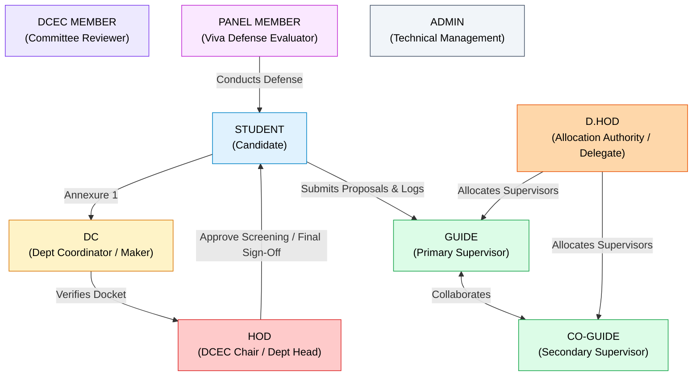

# NIET Dissertation Management System — Requirements Specification & Reconciliation

**Document ID:** `DOC-01-REQ`  
**File Path:** [`docs/01_REQUIREMENTS.md`](file:///c:/Users/user/Desktop/niet-dissertation-management-system/docs/01_REQUIREMENTS.md)  
**Document Status:** RECONCILED REQUIREMENTS BASELINE (PHASE 2A)  
**Last Revised:** 2026-08-15  
**Governing Baseline:** [`docs/00_PROJECT_MASTER.md`](file:///c:/Users/user/Desktop/niet-dissertation-management-system/docs/00_PROJECT_MASTER.md)  
**Institution:** Noida Institute of Engineering & Technology (NIET), Greater Noida  
**Target Program:** M.Tech / M.Tech Integrated Dissertation Lifecycle  

---

## 1. Document Purpose

This document serves as the authoritative, reconciled requirements specification for the **NIET Dissertation Management System (DMS)**. It captures, classifies, reconciles, and traces all functional, non-functional, security, and governance requirements governing the M.Tech and M.Tech Integrated dissertation lifecycle at NIET.

This specification enforces strict requirements reconciliation against the canonical project master [`docs/00_PROJECT_MASTER.md`](file:///c:/Users/user/Desktop/niet-dissertation-management-system/docs/00_PROJECT_MASTER.md). It eliminates undocumented assumptions, resolves historical workflow contradictions, marks institutionally unconfirmed policies as explicit open decisions, and forms the sole requirements baseline for subsequent architectural freezes, database schemas, RBAC matrices, and API contracts.

---

## 2. Source Documents Reviewed

The following documents and project artifacts were reviewed during this requirements reconciliation:

| Source Identifier | Document Name / Path | Version / Date | Authority Status |
| :--- | :--- | :--- | :--- |
| `SRC-00` | [`docs/00_PROJECT_MASTER.md`](file:///c:/Users/user/Desktop/niet-dissertation-management-system/docs/00_PROJECT_MASTER.md) | 2026-08-15 | **Canonical Source of Truth (Tier 1)** |
| `SRC-01` | [`README.md`](file:///c:/Users/user/Desktop/niet-dissertation-management-system/README.md) | 2026-08-15 | Project Index Baseline |
| `SRC-15` | [`docs/15_OPEN_DECISIONS.md`](file:///c:/Users/user/Desktop/niet-dissertation-management-system/docs/15_OPEN_DECISIONS.md) | 2026-08-15 | Decision Tracking Baseline |
| `SRC-SPEC` | NIET M.Tech Academic Guidelines & Institutional Dissertation Annexures (1–6) | Faculty / Institutional Baseline | Institutional Academic Standard |
| `SRC-LEGACY` | Historical Pre-Freeze Workflow Discussions & Proposals | Superseded | Informational / Superseded where in conflict |

---

## 3. Documentation Authority Hierarchy

All functional specifications, architectural choices, and implementation details must adhere to the 7-tier priority hierarchy defined in [`docs/00_PROJECT_MASTER.md`](file:///c:/Users/user/Desktop/niet-dissertation-management-system/docs/00_PROJECT_MASTER.md):

```
Priority 1: LOCKED ACADEMIC DECISIONS (Highest Authority — Institutional & Faculty Confirmed)
   │
   ▼
Priority 2: ARCHITECTURE FREEZE (docs/02_ARCHITECTURE.md)
   │
   ▼
Priority 3: DATABASE SCHEMA (docs/06_DATABASE_SCHEMA.md)
   │
   ▼
Priority 4: RBAC / SECURITY RULES (docs/04_RBAC_MATRIX.md & docs/13_SECURITY.md)
   │
   ▼
Priority 5: UI/UX SPECIFICATIONS (docs/11_UI_DESIGN_SYSTEM.md)
   │
   ▼
Priority 6: IMPLEMENTATION DECISIONS (Source Code, Libraries, Helpers)
   │
   ▼
Priority 7: AI-GENERATED ASSUMPTIONS (Lowest Authority — Must NEVER override higher tiers)
```

---

## 4. Requirement Classification Rules

Every requirement in this specification is categorized under exactly one of the five canonical classifications:

1. **`LOCKED`**: Formally approved, institutionally confirmed, and must be implemented exactly as specified without deviation.
2. **`CONFIGURABLE`**: Confirmed institutional requirement whose specific operating value, threshold, or parameter must be driven by runtime database configuration rather than hard-coded logic.
3. **`OPEN`**: Academic or institutional policy decision that has not yet been formally supplied by NIET stakeholders. Documented with `OPEN DECISION — INFORMATION NOT PROVIDED`. No engineer or AI agent may invent a value.
4. **`FUTURE`**: Formally acknowledged capability that is explicitly excluded from V1 but preserved in the architectural roadmap.
5. **`NON-GOAL`**: Explicitly excluded from the scope of this system and version. Must not be implemented.

---

## 5. Complete Functional Requirements

```
                               FUNCTIONAL DOMAIN OVERVIEW
┌────────────────────────────────────────────────────────────────────────────────────────┐
│ 1. Identity & Multi-Dept Org Structure (Institution -> School -> Dept -> Section)      │
│ 2. Annexure 1 Submission & Ranked Guide Preferences (1 to 4)                           │
│ 3. DCEC Screening Queue (DC Maker/Secretary -> HOD / Delegated D.HOD Checker)          │
│ 4. Guide & Co-Guide Allocation (Sole Authority: D.HOD; Hard Capacity Load <= 3)       │
│ 5. Student-Supervisor Collaborative Space & Problem Formulation                        │
│ 6. Annexure 2 Formal Title Approval & DCEC Review                                      │
│ 7. Digital Logbook & Interaction Tracker (Annexure 4 — Online/Offline)                 │
│ 8. Weekly & Monthly Progress Submissions                                               │
│ 9. Milestone Evaluations: P1 (/100), P2 (/100), P3 (/100 — Contributes to Final Grade)  │
│ 10. Dynamic 4-Column Rubrics with Immutable Version Pinning                            │
│ 11. Annexure 5 (Final Dissertation Submission) & Similarity Report Audit Attachment    │
│ 12. Annexure 6 (Confidential Supervisor Evaluation — Student View Strictly Blocked)    │
│ 13. 2-Member Expert Panel Formation & Final Viva Defense Evaluation                    │
│ 14. Viva Failure Handling (New Revision Cycle, Immutable Historical Record, Same ID)   │
│ 15. DCEC/HOD Final Review, Result Finalization & Institutional Archiving               │
└────────────────────────────────────────────────────────────────────────────────────────┘
```

### 5.1 Organizational Structure & Academic Hierarchy

* **`REQ-ORG-001`**: The system must model the multi-department organizational hierarchy: $\text{Institution} \rightarrow \text{School} \rightarrow \text{Department} \rightarrow \text{Program} \rightarrow \text{Academic Session} \rightarrow \text{Batch} \rightarrow \text{Semester} \rightarrow \text{Section} \rightarrow \text{Student / Faculty}$.  
  *Classification:* `LOCKED`  
  *Source:* [`docs/00_PROJECT_MASTER.md#section-10`](file:///c:/Users/user/Desktop/niet-dissertation-management-system/docs/00_PROJECT_MASTER.md#L304-L317)  
  *Notes:* The system must not be hard-coded exclusively for CSE.

* **`REQ-ORG-002`**: Cross-department access must be supported for interdisciplinary Guides, Co-Guides, and inter-departmental panel evaluators under explicit, scoped authorization.  
  *Classification:* `LOCKED`  
  *Source:* [`docs/00_PROJECT_MASTER.md#section-10`](file:///c:/Users/user/Desktop/niet-dissertation-management-system/docs/00_PROJECT_MASTER.md#L310-L316)  

### 5.2 Student Onboarding & Annexure 1 Proposal

* **`REQ-ANN1-001`**: An enrolled student must submit Annexure 1 containing: Proposed Thesis Title, Broad Research Domain, Problem Statement / Brief Abstract, Expected Outcomes, and four (4) distinct, ranked faculty Guide preferences (Preference 1, 2, 3, 4).  
  *Classification:* `LOCKED`  
  *Source:* [`docs/00_PROJECT_MASTER.md#section-7`](file:///c:/Users/user/Desktop/niet-dissertation-management-system/docs/00_PROJECT_MASTER.md#L189-L222), Faculty Requirements  
  *Notes:* The four preferences must be distinct pre-seeded faculty members within the eligible department/school.

* **`REQ-ANN1-002`**: The system must enforce case-insensitive uniqueness of thesis titles across the active cohort to prevent exact duplicate submissions during the prototype stage.  
  *Classification:* `LOCKED` (Prototype Rule) / `OPEN` (Production Cross-Cohort Scope)  
  *Source:* [`docs/00_PROJECT_MASTER.md#section-8`](file:///c:/Users/user/Desktop/niet-dissertation-management-system/docs/00_PROJECT_MASTER.md#L231-L275), Known Open Decisions  
  *Notes:* Production uniqueness scope (department vs institution vs historical catalog) is documented under `REQ-OD-005`.

* **`REQ-ANN1-003`**: Annexure 1 submission must transition the thesis record to state `ANNEXURE_1_SUBMITTED` and place it in the Department Coordinator (DC) screening queue.  
  *Classification:* `LOCKED`  
  *Source:* [`docs/00_PROJECT_MASTER.md#section-7`](file:///c:/Users/user/Desktop/niet-dissertation-management-system/docs/00_PROJECT_MASTER.md#L189-L222)

### 5.3 DCEC Screening (Annexure 1 Stage)

* **`REQ-DCEC-001`**: DCEC review must implement a Maker-Checker workflow where the Department Coordinator (DC) acts as Maker/Secretary (verifying compliance, checking documentation, compiling the screening docket) and the DCEC Chair acts as Checker (formal decision authority).  
  *Classification:* `LOCKED`  
  *Source:* [`docs/00_PROJECT_MASTER.md#section-8.1`](file:///c:/Users/user/Desktop/niet-dissertation-management-system/docs/00_PROJECT_MASTER.md#L235-L239)

* **`REQ-DCEC-002`**: The default DCEC Chair is the Head of Department (HOD).  
  *Classification:* `LOCKED`  
  *Source:* [`docs/00_PROJECT_MASTER.md#section-8.1`](file:///c:/Users/user/Desktop/niet-dissertation-management-system/docs/00_PROJECT_MASTER.md#L235-L239)

* **`REQ-DCEC-003`**: An authorized Deputy Head of Department (D.HOD) may receive delegated DCEC Chair approval authority when formal institutional delegation is active.  
  *Classification:* `LOCKED`  
  *Source:* [`docs/00_PROJECT_MASTER.md#section-8.1`](file:///c:/Users/user/Desktop/niet-dissertation-management-system/docs/00_PROJECT_MASTER.md#L235-L239)

* **`REQ-DCEC-004`**: System `ADMIN` technical privileges must **NOT** automatically grant academic approval authority in the DCEC workflow. Academic approval requires explicit `DCEC_CHAIR_APPROVE` authority.  
  *Classification:* `LOCKED`  
  *Source:* [`docs/00_PROJECT_MASTER.md#section-8.1`](file:///c:/Users/user/Desktop/niet-dissertation-management-system/docs/00_PROJECT_MASTER.md#L235-L239)

* **`REQ-DCEC-005`**: The DCEC screening outcome must be one of: `APPROVED` (moves to Guide Allocation), `REVISION_REQUIRED` (returns to student with comments for resubmission), or `REJECTED` (terminal failure requiring new topic proposal).  
  *Classification:* `LOCKED`  
  *Source:* [`docs/00_PROJECT_MASTER.md#section-7`](file:///c:/Users/user/Desktop/niet-dissertation-management-system/docs/00_PROJECT_MASTER.md#L189-L222)

* **`REQ-DCEC-006`**: DCEC quorum minimum member threshold and collective voting mechanics: `OPEN DECISION — INFORMATION NOT PROVIDED`.  
  *Classification:* `OPEN`  
  *Source:* [`docs/00_PROJECT_MASTER.md#section-5`](file:///c:/Users/user/Desktop/niet-dissertation-management-system/docs/00_PROJECT_MASTER.md#L155-L171) (`OD-001`)  
  *Notes:* Until resolved, the system defaults to DC verification + DCEC Chair single sign-off.

### 5.4 Guide & Co-Guide Allocation

* **`REQ-ALLOC-001`**: Guide and Co-Guide allocation occurs **AFTER** Annexure 1 DCEC screening approval and **BEFORE** Annexure 2 title approval.  
  *Classification:* `LOCKED`  
  *Source:* [`docs/00_PROJECT_MASTER.md#section-7`](file:///c:/Users/user/Desktop/niet-dissertation-management-system/docs/00_PROJECT_MASTER.md#L224-L228)

* **`REQ-ALLOC-002`**: D.HOD is the sole administrative authority for manual Guide and Co-Guide allocation in V1.  
  *Classification:* `LOCKED`  
  *Source:* [`docs/00_PROJECT_MASTER.md#section-8.2`](file:///c:/Users/user/Desktop/niet-dissertation-management-system/docs/00_PROJECT_MASTER.md#L240-L249)

* **`REQ-ALLOC-003`**: The system must assign exactly one (1) primary Guide and exactly one (1) Co-Guide per dissertation.  
  *Classification:* `LOCKED`  
  *Source:* [`docs/00_PROJECT_MASTER.md#section-8.2`](file:///c:/Users/user/Desktop/niet-dissertation-management-system/docs/00_PROJECT_MASTER.md#L240-L249), Locked Rules

* **`REQ-ALLOC-004`**: The system must enforce the hard institutional capacity constraint: $\text{Active Guide Load} \le 3$ per faculty member across the active academic session.  
  *Classification:* `LOCKED`  
  *Source:* [`docs/00_PROJECT_MASTER.md#section-8.2`](file:///c:/Users/user/Desktop/niet-dissertation-management-system/docs/00_PROJECT_MASTER.md#L240-L249)

* **`REQ-ALLOC-005`**: The system must enforce the hard institutional capacity constraint: $\text{Active Co-Guide Load} \le 3$ per faculty member across the active academic session.  
  *Classification:* `LOCKED`  
  *Source:* [`docs/00_PROJECT_MASTER.md#section-8.2`](file:///c:/Users/user/Desktop/niet-dissertation-management-system/docs/00_PROJECT_MASTER.md#L240-L249)

* **`REQ-ALLOC-006`**: The Guide and Co-Guide for a single dissertation **CANNOT** be the same faculty member ($\text{Guide} \neq \text{Co-Guide}$).  
  *Classification:* `LOCKED`  
  *Source:* [`docs/00_PROJECT_MASTER.md#section-8.2`](file:///c:/Users/user/Desktop/niet-dissertation-management-system/docs/00_PROJECT_MASTER.md#L240-L249)

* **`REQ-ALLOC-007`**: Guide and Co-Guide assignments made by D.HOD are authoritative immediately upon assignment. There is **NO** faculty acceptance/decline workflow.  
  *Classification:* `LOCKED`  
  *Source:* [`docs/00_PROJECT_MASTER.md#section-7`](file:///c:/Users/user/Desktop/niet-dissertation-management-system/docs/00_PROJECT_MASTER.md#L227-L228)

* **`REQ-ALLOC-008`**: The allocation interface must present the student's 4 ranked preferences alongside each faculty member's current active Guide/Co-Guide load to assist D.HOD in decision-making.  
  *Classification:* `LOCKED`  
  *Source:* [`docs/00_PROJECT_MASTER.md#section-8.2`](file:///c:/Users/user/Desktop/niet-dissertation-management-system/docs/00_PROJECT_MASTER.md#L240-L249)

* **`REQ-ALLOC-009`**: Every allocation, reallocation, and load change must generate an immutable audit log entry recording actor, timestamp, previous supervisors, and reason.  
  *Classification:* `LOCKED`  
  *Source:* [`docs/00_PROJECT_MASTER.md#section-8.2`](file:///c:/Users/user/Desktop/niet-dissertation-management-system/docs/00_PROJECT_MASTER.md#L247-L248)

* **`REQ-ALLOC-010`**: Automated algorithmic Guide allocation and AI-based matching are strictly excluded from V1.  
  *Classification:* `NON-GOAL` (V1) / `FUTURE`  
  *Source:* [`docs/00_PROJECT_MASTER.md#section-14`](file:///c:/Users/user/Desktop/niet-dissertation-management-system/docs/00_PROJECT_MASTER.md#L384-L398)

### 5.5 Collaborative Problem Formulation & Annexure 2 Title Approval

* **`REQ-ANN2-001`**: Following supervisor allocation, the system must provide a collaborative workspace for the Student, Guide, and Co-Guide to refine the research domain, problem statement, methodology, and finalized thesis title.  
  *Classification:* `LOCKED`  
  *Source:* [`docs/00_PROJECT_MASTER.md#section-7`](file:///c:/Users/user/Desktop/niet-dissertation-management-system/docs/00_PROJECT_MASTER.md#L189-L222)

* **`REQ-ANN2-002`**: The student submits Annexure 2 (Formal Thesis Title Approval Request), requiring electronic endorsement by the primary Guide and Co-Guide before advancing to DCEC review.  
  *Classification:* `LOCKED`  
  *Source:* [`docs/00_PROJECT_MASTER.md#section-7`](file:///c:/Users/user/Desktop/niet-dissertation-management-system/docs/00_PROJECT_MASTER.md#L189-L222)

* **`REQ-ANN2-003`**: DCEC reviews Annexure 2 via the DC Maker $\rightarrow$ DCEC Chair Checker workflow. Approval formally baselines the dissertation topic and enables the digital logbook and milestone evaluation phases.  
  *Classification:* `LOCKED`  
  *Source:* [`docs/00_PROJECT_MASTER.md#section-7`](file:///c:/Users/user/Desktop/niet-dissertation-management-system/docs/00_PROJECT_MASTER.md#L189-L222)

### 5.6 Digital Logbook & Meetings (Annexure 4)

* **`REQ-ANN4-001`**: The system must provide a Digital Logbook (Annexure 4) supporting the logging of supervisory interactions in both **Online** and **Offline** modes.  
  *Classification:* `LOCKED`  
  *Source:* [`docs/00_PROJECT_MASTER.md#section-8.4`](file:///c:/Users/user/Desktop/niet-dissertation-management-system/docs/00_PROJECT_MASTER.md#L258-L264)

* **`REQ-ANN4-002`**: For Online meetings, the system must capture: Meeting URL/Link, Platform name, Date/Time, Discussion Agenda, Progress Discussed, Action Items, and Next Target Date.  
  *Classification:* `LOCKED`  
  *Source:* [`docs/00_PROJECT_MASTER.md#section-8.4`](file:///c:/Users/user/Desktop/niet-dissertation-management-system/docs/00_PROJECT_MASTER.md#L258-L264)

* **`REQ-ANN4-003`**: For Offline meetings, the system must capture: Physical Meeting Location / Room Number, Date/Time, Discussion Agenda, Progress Discussed, Action Items, and Next Target Date.  
  *Classification:* `LOCKED`  
  *Source:* [`docs/00_PROJECT_MASTER.md#section-8.4`](file:///c:/Users/user/Desktop/niet-dissertation-management-system/docs/00_PROJECT_MASTER.md#L258-L264)

* **`REQ-ANN4-004`**: The DMS must **NOT** build or host an internal WebRTC/video streaming server. It stores meeting links and metadata only.  
  *Classification:* `NON-GOAL`  
  *Source:* [`docs/00_PROJECT_MASTER.md#section-8.4`](file:///c:/Users/user/Desktop/niet-dissertation-management-system/docs/00_PROJECT_MASTER.md#L262)

* **`REQ-ANN4-005`**: Logbook entries must follow the verification cycle: Student creates entry $\rightarrow$ Guide/Co-Guide reviews, verifies, or returns for revision with feedback $\rightarrow$ Verified entries become immutable.  
  *Classification:* `LOCKED`  
  *Source:* [`docs/00_PROJECT_MASTER.md#section-8.4`](file:///c:/Users/user/Desktop/niet-dissertation-management-system/docs/00_PROJECT_MASTER.md#L263-L264)

### 5.7 Progress Tracking (Weekly / Monthly)

* **`REQ-PROG-001`**: The system must allow students to submit periodic weekly and monthly progress updates with work summaries, milestone accomplishments, and file attachments.  
  *Classification:* `LOCKED`  
  *Source:* [`docs/00_PROJECT_MASTER.md#section-7`](file:///c:/Users/user/Desktop/niet-dissertation-management-system/docs/00_PROJECT_MASTER.md#L199-L200)

* **`REQ-PROG-002`**: Guides and Co-Guides must be able to review, comment upon, and acknowledge progress updates.  
  *Classification:* `LOCKED`  
  *Source:* [`docs/00_PROJECT_MASTER.md#section-7`](file:///c:/Users/user/Desktop/niet-dissertation-management-system/docs/00_PROJECT_MASTER.md#L199-L200)

### 5.8 Milestone Evaluations (P1, P2, P3) & Dynamic Rubrics

* **`REQ-EVAL-001`**: The system must support three formal milestone evaluation presentations: Progress Presentation 1 (P1), Progress Presentation 2 (P2), and Progress Presentation 3 (P3).  
  *Classification:* `LOCKED`  
  *Source:* [`docs/00_PROJECT_MASTER.md#section-8.3`](file:///c:/Users/user/Desktop/niet-dissertation-management-system/docs/00_PROJECT_MASTER.md#L250-L257)

* **`REQ-EVAL-002`**: P1 must be scored on a scale of 0 to 100 ($/100$).  
  *Classification:* `LOCKED`  
  *Source:* [`docs/00_PROJECT_MASTER.md#section-8.3`](file:///c:/Users/user/Desktop/niet-dissertation-management-system/docs/00_PROJECT_MASTER.md#L252)

* **`REQ-EVAL-003`**: P2 must be scored on a scale of 0 to 100 ($/100$).  
  *Classification:* `LOCKED`  
  *Source:* [`docs/00_PROJECT_MASTER.md#section-8.3`](file:///c:/Users/user/Desktop/niet-dissertation-management-system/docs/00_PROJECT_MASTER.md#L253)

* **`REQ-EVAL-004`**: P3 must be scored on a scale of 0 to 100 ($/100$).  
  *Classification:* `LOCKED`  
  *Source:* [`docs/00_PROJECT_MASTER.md#section-8.3`](file:///c:/Users/user/Desktop/niet-dissertation-management-system/docs/00_PROJECT_MASTER.md#L254)

* **`REQ-EVAL-005`**: Among the three milestone presentations, **ONLY P3** contributes directly to the final dissertation grade calculation. P1 and P2 serve as diagnostic and formative progress checkpoints.  
  *Classification:* `LOCKED`  
  *Source:* [`docs/00_PROJECT_MASTER.md#section-8.3`](file:///c:/Users/user/Desktop/niet-dissertation-management-system/docs/00_PROJECT_MASTER.md#L255)

* **`REQ-EVAL-006`**: Evaluations must be structured using a dynamic 4-column rubric (Criteria, Performance Descriptors across 4 achievement levels, Max Marks, Awarded Score).  
  *Classification:* `LOCKED`  
  *Source:* Locked Rules, Institutional Evaluation Standard  

* **`REQ-EVAL-007`**: Rubrics must support institutional versioning. When a rubric is updated, historical evaluation records must remain permanently attached to the exact rubric version active at the time of evaluation.  
  *Classification:* `LOCKED`  
  *Source:* Locked Rules, [`docs/00_PROJECT_MASTER.md#section-8.5`](file:///c:/Users/user/Desktop/niet-dissertation-management-system/docs/00_PROJECT_MASTER.md#L265-L268)

* **`REQ-EVAL-008`**: Final Result calculation formula beyond P3 (combining P3, Annexure 6 Supervisor score, and Viva Panel score): `OPEN DECISION — INFORMATION NOT PROVIDED`.  
  *Classification:* `OPEN`  
  *Source:* [`docs/00_PROJECT_MASTER.md#section-15`](file:///c:/Users/user/Desktop/niet-dissertation-management-system/docs/00_PROJECT_MASTER.md#L400-L417) (`OD-002`)  
  *Notes:* No agent may invent an unconfirmed weighted formula. Configurable formula engine must be supplied in architecture.

### 5.9 Final Dissertation Submission (Annexure 5) & Plagiarism Compliance

* **`REQ-ANN5-001`**: Following successful P3 completion, the student submits Annexure 5 (Final Dissertation Submission) containing the complete dissertation document (PDF), synopsis, source code/artifact repository link, and official plagiarism similarity certificate.  
  *Classification:* `LOCKED`  
  *Source:* [`docs/00_PROJECT_MASTER.md#section-7`](file:///c:/Users/user/Desktop/niet-dissertation-management-system/docs/00_PROJECT_MASTER.md#L203-L206)

* **`REQ-ANN5-002`**: The institutional compliance benchmarks are: Plagiarism Similarity $< 10\%$, AI-Generated Content Similarity $= 0\%$.  
  *Classification:* `LOCKED`  
  *Source:* [`docs/00_PROJECT_MASTER.md#section-8.6`](file:///c:/Users/user/Desktop/niet-dissertation-management-system/docs/00_PROJECT_MASTER.md#L269-L275)

* **`REQ-ANN5-003`**: The DMS does **NOT** contain a built-in proprietary plagiarism or AI-detection scanner. Uploaded similarity reports from verified external tools (e.g., Turnitin, DrillBit) are stored as verifiable audit attachments.  
  *Classification:* `LOCKED` / `NON-GOAL` (Internal Engine)  
  *Source:* [`docs/00_PROJECT_MASTER.md#section-8.6`](file:///c:/Users/user/Desktop/niet-dissertation-management-system/docs/00_PROJECT_MASTER.md#L273-L275)

* **`REQ-ANN5-004`**: Guide and Co-Guide must perform formal review of Annexure 5 and provide electronic endorsement before the thesis can proceed to defense panel formation.  
  *Classification:* `LOCKED`  
  *Source:* [`docs/00_PROJECT_MASTER.md#section-7`](file:///c:/Users/user/Desktop/niet-dissertation-management-system/docs/00_PROJECT_MASTER.md#L205)

### 5.10 Confidential Supervisor Evaluation (Annexure 6)

* **`REQ-ANN6-001`**: The primary Guide (and Co-Guide where institutionally mandated) must submit Annexure 6 (Confidential Supervisor Evaluation) containing confidential scoring, supervisor feedback, and defense recommendation.  
  *Classification:* `LOCKED`  
  *Source:* [`docs/00_PROJECT_MASTER.md#section-7`](file:///c:/Users/user/Desktop/niet-dissertation-management-system/docs/00_PROJECT_MASTER.md#L206-L207)

* **`REQ-ANN6-002`**: **STUDENT ACCESS RESTRICTION:** The student must **NEVER** have direct or indirect read access to Annexure 6 evaluations or scores at any point during the active workflow.  
  *Classification:* `LOCKED`  
  *Source:* [`docs/00_PROJECT_MASTER.md#section-11`](file:///c:/Users/user/Desktop/niet-dissertation-management-system/docs/00_PROJECT_MASTER.md#L324-L326), Locked Rules

* **`REQ-ANN6-003`**: Co-Guide Access to Annexure 6: `OPEN DECISION — INFORMATION NOT PROVIDED`.  
  *Classification:* `OPEN`  
  *Source:* Known Open Decisions  
  *Notes:* Whether Co-Guide submits a separate Annexure 6, co-signs the Guide's Annexure 6, or has read-only access is tracked under `REQ-OD-004`.

* **`REQ-ANN6-004`**: Post-defense disclosure policy for Annexure 6 (whether scores become visible after final graduation): `OPEN DECISION — INFORMATION NOT PROVIDED`.  
  *Classification:* `OPEN`  
  *Source:* [`docs/00_PROJECT_MASTER.md#section-15`](file:///c:/Users/user/Desktop/niet-dissertation-management-system/docs/00_PROJECT_MASTER.md#L408)

### 5.11 Expert Panel Formation & Viva Defense

* **`REQ-PANEL-001`**: Following Annexure 5 & 6 submission, a two-member (2-member) expert evaluation panel must be constituted for the final viva defense.  
  *Classification:* `LOCKED`  
  *Source:* [`docs/00_PROJECT_MASTER.md#section-7`](file:///c:/Users/user/Desktop/niet-dissertation-management-system/docs/00_PROJECT_MASTER.md#L207-L208)

* **`REQ-PANEL-002`**: Panel Member Selection Criteria & Conflict-of-Interest Governance: `OPEN DECISION — INFORMATION NOT PROVIDED`.  
  *Classification:* `OPEN`  
  *Source:* [`docs/00_PROJECT_MASTER.md#section-15`](file:///c:/Users/user/Desktop/niet-dissertation-management-system/docs/00_PROJECT_MASTER.md#L409) (`OD-007`)  
  *Notes:* Rules preventing Guide from serving as defense panel chair/evaluator on own student must be parameterized.

* **`REQ-VIVA-001`**: The 2-member panel evaluates the student's oral defense and dissertation quality, recording individual and composite panel scores using the designated final viva rubric.  
  *Classification:* `LOCKED`  
  *Source:* [`docs/00_PROJECT_MASTER.md#section-7`](file:///c:/Users/user/Desktop/niet-dissertation-management-system/docs/00_PROJECT_MASTER.md#L208-L210)

* **`REQ-VIVA-002`**: The defense outcome must be formally recorded as one of: `PASSED`, `PASSED_WITH_MINOR_REVISIONS`, `MAJOR_REVISIONS_REQUIRED`, or `FAILED`.  
  *Classification:* `LOCKED`  
  *Source:* Institutional Defense Protocol

* **`REQ-VIVA-003`**: **VIVA FAILURE RE-EVALUATION CYCLE:** If a student fails the viva defense (`FAILED` or `MAJOR_REVISIONS_REQUIRED`), the system must create a new revision/evaluation cycle.  
  *Classification:* `LOCKED`  
  *Source:* Locked Rules, [`docs/00_PROJECT_MASTER.md#section-8.5`](file:///c:/Users/user/Desktop/niet-dissertation-management-system/docs/00_PROJECT_MASTER.md#L265-L268)

* **`REQ-VIVA-004`**: **THESIS ID IMMUTABILITY:** In the event of viva failure and re-defense, the original `Thesis ID` (UUID / Institutional ID) must remain unchanged. A new sub-version / cycle index is created without destroying or re-issuing the primary identifier.  
  *Classification:* `LOCKED`  
  *Source:* Locked Rules

* **`REQ-VIVA-005`**: Formal Institutional Failure, Extension Timeline, and Re-Viva Fee/Penalty Policy: `OPEN DECISION — INFORMATION NOT PROVIDED`.  
  *Classification:* `OPEN`  
  *Source:* [`docs/00_PROJECT_MASTER.md#section-15`](file:///c:/Users/user/Desktop/niet-dissertation-management-system/docs/00_PROJECT_MASTER.md#L405) (`OD-003`)

### 5.12 Final Sign-Off & Institutional Archiving

* **`REQ-ARCH-001`**: Following defense approval and submission of certified final corrections, the HOD / DCEC Chair performs final administrative sign-off.  
  *Classification:* `LOCKED`  
  *Source:* [`docs/00_PROJECT_MASTER.md#section-7`](file:///c:/Users/user/Desktop/niet-dissertation-management-system/docs/00_PROJECT_MASTER.md#L209-L211)

* **`REQ-ARCH-002`**: Final result calculation compiles the approved scores into the final academic transcript record.  
  *Classification:* `LOCKED`  
  *Source:* [`docs/00_PROJECT_MASTER.md#section-7`](file:///c:/Users/user/Desktop/niet-dissertation-management-system/docs/00_PROJECT_MASTER.md#L210-L211)

* **`REQ-ARCH-003`**: Upon completion, the entire dissertation package (final manuscript, similarity report, approval dockets, evaluation sheets, logbook records, audit logs) transitions to state `ARCHIVED` and is locked against further edits.  
  *Classification:* `LOCKED`  
  *Source:* [`docs/00_PROJECT_MASTER.md#section-7`](file:///c:/Users/user/Desktop/niet-dissertation-management-system/docs/00_PROJECT_MASTER.md#L211)

---

## 6. Complete Non-Functional Requirements (NFRs)

```
                            NON-FUNCTIONAL REQUIREMENTS
┌────────────────────────────────────────────────────────────────────────────────────────┐
│ NFR-SEC  : Enterprise RBAC, Zero-Trust Access, File Security & OWASP Top 10 Hardening  │
│ NFR-PERF : Fast Page Load (<1.5s), API Response (<300ms p95), High Throughput Cohort   │
│ NFR-REL  : 99.9% Uptime, Automated Daily Backups, Point-in-Time Recovery               │
│ NFR-AUD  : Comprehensive Immutable Audit Logging with Zero Tampering Capability        │
│ NFR-A11Y : WCAG 2.1 Level AA Compliance, Modern Responsive Typography & Dark/Light UI  │
│ NFR-STOR : Secure Object Storage, Server-Side MIME Validation, ClamAV-Ready Hooks      │
└────────────────────────────────────────────────────────────────────────────────────────┘
```

### 6.1 Security & Compliance (NFR-SEC)

* **`REQ-NFR-SEC-001`**: **Least Privilege RBAC:** Every API endpoint and data access path must enforce granular, multi-factor authorization verifying user role, department ID, and thesis assignment relationship.  
  *Classification:* `LOCKED`  
  *Source:* [`docs/00_PROJECT_MASTER.md#section-11`](file:///c:/Users/user/Desktop/niet-dissertation-management-system/docs/00_PROJECT_MASTER.md#L320-L334)

* **`REQ-NFR-SEC-002`**: **Confidential Data Isolation:** Supervisor evaluations (Annexure 6) and internal panel deliberations must be isolated at the database level via Row Level Security (RLS) policies.  
  *Classification:* `LOCKED`  
  *Source:* [`docs/00_PROJECT_MASTER.md#section-11`](file:///c:/Users/user/Desktop/niet-dissertation-management-system/docs/00_PROJECT_MASTER.md#L324-L326)

* **`REQ-NFR-SEC-003`**: **OWASP Top 10 Hardening:** The system must implement robust protections against SQL Injection, Cross-Site Scripting (XSS), Cross-Site Request Forgery (CSRF), Insecure Direct Object References (IDOR), and Broken Object Level Authorization (BOLA).  
  *Classification:* `LOCKED`  
  *Source:* [`docs/00_PROJECT_MASTER.md#section-11`](file:///c:/Users/user/Desktop/niet-dissertation-management-system/docs/00_PROJECT_MASTER.md#L330)

* **`REQ-NFR-SEC-004`**: **Secrets Protection:** No API keys, database credentials, or private cryptographic keys may be stored in client code, source control, or unencrypted assets.  
  *Classification:* `LOCKED`  
  *Source:* [`docs/00_PROJECT_MASTER.md#section-11`](file:///c:/Users/user/Desktop/niet-dissertation-management-system/docs/00_PROJECT_MASTER.md#L329)

### 6.2 Performance & Scalability (NFR-PERF)

* **`REQ-NFR-PERF-001`**: Core dashboard and submission pages must achieve a First Contentful Paint (FCP) $\le 1.5$ seconds under standard 4G/broadband conditions.  
  *Classification:* `CONFIGURABLE`  
  *Source:* Architecture Performance Guidelines

* **`REQ-NFR-PERF-002`**: Standard transactional API endpoints must respond with $p95$ latency $\le 300\text{ ms}$ under normal concurrent department load.  
  *Classification:* `CONFIGURABLE`  
  *Source:* Architecture Performance Guidelines

* **`REQ-NFR-PERF-003`**: The system must support concurrent evaluation workflows during peak milestone presentation windows (500+ active concurrent sessions).  
  *Classification:* `CONFIGURABLE`  
  *Source:* Institutional Target Sizing

### 6.3 Reliability, Backup & Retention (NFR-REL)

* **`REQ-NFR-REL-001`**: Prototype document retention period must be configured for a 1-year rolling window.  
  *Classification:* `LOCKED` (Prototype)  
  *Source:* [`docs/00_PROJECT_MASTER.md#section-8`](file:///c:/Users/user/Desktop/niet-dissertation-management-system/docs/00_PROJECT_MASTER.md#L231-L275)

* **`REQ-NFR-REL-002`**: Production long-term data retention and document archiving policy: `OPEN DECISION — INFORMATION NOT PROVIDED`.  
  *Classification:* `OPEN`  
  *Source:* [`docs/00_PROJECT_MASTER.md#section-15`](file:///c:/Users/user/Desktop/niet-dissertation-management-system/docs/00_PROJECT_MASTER.md#L406) (`OD-004`)

* **`REQ-NFR-REL-003`**: Production target Recovery Point Objective (RPO) and Recovery Time Objective (RTO): `OPEN DECISION — INFORMATION NOT PROVIDED`.  
  *Classification:* `OPEN`  
  *Source:* [`docs/00_PROJECT_MASTER.md#section-15`](file:///c:/Users/user/Desktop/niet-dissertation-management-system/docs/00_PROJECT_MASTER.md#L414) (`OD-012`)

### 6.4 Usability & Accessibility (NFR-A11Y)

* **`REQ-NFR-A11Y-001`**: The user interface must comply with WCAG 2.1 Level AA standards, ensuring keyboard navigation, high contrast ratios, screen reader accessibility, and semantic HTML5 structuring.  
  *Classification:* `LOCKED`  
  *Source:* [`docs/12_ACCESSIBILITY.md`](file:///c:/Users/user/Desktop/niet-dissertation-management-system/docs/12_ACCESSIBILITY.md)

* **`REQ-NFR-A11Y-002`**: The UI must implement responsive layouts supporting desktop, laptop, and tablet viewports without loss of functionality.  
  *Classification:* `LOCKED`  
  *Source:* UI Design Guidelines

---

## 7. User Roles & Actor Model

The system defines ten (10) distinct academic, administrative, and evaluative roles:



| Role Identifier | Role Name | System Function & Scope | Authority Classification |
| :--- | :--- | :--- | :--- |
| `ROLE-STUDENT` | **Student** | Candidate enrolled in M.Tech dissertation. Submits Annexures 1, 2, 4, 5, progress updates, and defends thesis. | `LOCKED` |
| `ROLE-GUIDE` | **Guide (Supervisor)** | Primary faculty supervisor. Guides research, verifies Annexure 4 logs, endorses Annexures 2 & 5, submits confidential Annexure 6. | `LOCKED` |
| `ROLE-CO-GUIDE` | **Co-Guide (Co-Supervisor)** | Secondary/collaborating faculty supervisor. Guides research, co-reviews progress and endorsements. | `LOCKED` |
| `ROLE-DC` | **Department Coordinator (DC)** | Maker / Secretary for DCEC workflows. Conducts preliminary document checks, prepares screening dockets, manages scheduling. | `LOCKED` |
| `ROLE-D.HOD` | **Deputy Head of Department (D.HOD)** | Sole authority for manual Guide & Co-Guide allocation in V1; authorized delegate for DCEC Chair when assigned. | `LOCKED` |
| `ROLE-HOD` | **Head of Department (HOD)** | Academic head of department. Default DCEC Chair (Checker), final department reviewer, final sign-off authority. | `LOCKED` |
| `ROLE-DCEC-MEMBER` | **DCEC Committee Member** | Evaluator on departmental continuation and evaluation committee for screening and milestone reviews. | `LOCKED` |
| `ROLE-PANEL-MEMBER` | **Expert Panel Member** | Member of the 2-person expert defense panel appointed to evaluate oral defense and dissertation quality. | `LOCKED` |
| `ROLE-DCEC-CHAIR` | **DCEC Chair Authority** | Formal committee approval authority. Default held by HOD; delegable to authorized D.HOD. | `LOCKED` |
| `ROLE-ADMIN` | **System Administrator** | Technical user and role provisioning, system configuration, infrastructure maintenance. **Has NO academic approval power.** | `LOCKED` |

* **`REQ-ROLES-001`**: A single faculty member may hold multiple simultaneous context-specific roles (e.g., Guide for Student A, Co-Guide for Student B, DCEC Member for CSE Dept).  
  *Classification:* `LOCKED`  
  *Source:* [`docs/00_PROJECT_MASTER.md#section-9`](file:///c:/Users/user/Desktop/niet-dissertation-management-system/docs/00_PROJECT_MASTER.md#L293-L302)

* **`REQ-ROLES-002`**: Role permissions must resolve contextually at runtime based on active role context, departmental scope, and thesis association.  
  *Classification:* `LOCKED`  
  *Source:* [`docs/00_PROJECT_MASTER.md#section-9`](file:///c:/Users/user/Desktop/niet-dissertation-management-system/docs/00_PROJECT_MASTER.md#L294-L301)

---

## 8. Academic Workflow Requirements

* **`REQ-WF-001`**: The complete dissertation lifecycle must strictly execute in the following 14 sequential phases:
  1. `PHASE-01`: Student Authentication & Profile Provisioning
  2. `PHASE-02`: Annexure 1 Submission (4 Ranked Preferences)
  3. `PHASE-03`: DCEC Screening (DC Maker $\rightarrow$ HOD/DCEC Chair Checker)
  4. `PHASE-04`: Guide & Co-Guide Allocation (Sole Authority: D.HOD, Load $\le 3$)
  5. `PHASE-05`: Student-Supervisor Collaborative Space & Problem Formulation
  6. `PHASE-06`: Annexure 2 Formal Title Approval & DCEC Review
  7. `PHASE-07`: Research Execution & Digital Logbook (Annexure 4 — Online/Offline)
  8. `PHASE-08`: Weekly & Monthly Progress Submissions
  9. `PHASE-09`: Progress Milestone Presentations (P1 /100, P2 /100, P3 /100)
  10. `PHASE-10`: Final Dissertation Submission (Annexure 5) & Similarity Audit
  11. `PHASE-11`: Confidential Supervisor Evaluation (Annexure 6)
  12. `PHASE-12`: 2-Member Expert Panel Formation & Final Viva Defense
  13. `PHASE-13`: DCEC / HOD Final Review & Result Finalization
  14. `PHASE-14`: Institutional Archiving & Transcript Locking  
  *Classification:* `LOCKED`  
  *Source:* [`docs/00_PROJECT_MASTER.md#section-7`](file:///c:/Users/user/Desktop/niet-dissertation-management-system/docs/00_PROJECT_MASTER.md#L184-L229)

* **`REQ-WF-002`**: State transitions must be strictly linear and validated by programmatic state guards. Skipping phases or executing out-of-sequence approvals is forbidden.  
  *Classification:* `LOCKED`  
  *Source:* [`docs/00_PROJECT_MASTER.md#section-7`](file:///c:/Users/user/Desktop/niet-dissertation-management-system/docs/00_PROJECT_MASTER.md#L184-L229)

---

## 9. DCEC Requirements

* **`REQ-DCEC-MGT-001`**: The DCEC review module must provide a centralized queue where pending submissions are accessible to Department Coordinators (DC), DCEC Members, and the DCEC Chair.  
  *Classification:* `LOCKED`  
  *Source:* [`docs/00_PROJECT_MASTER.md#section-8.1`](file:///c:/Users/user/Desktop/niet-dissertation-management-system/docs/00_PROJECT_MASTER.md#L235-L239)

* **`REQ-DCEC-MGT-002`**: The DC performs docket verification, logging compliance checks (e.g., student eligibility, document completeness, prerequisite completion) before submitting to the DCEC Chair.  
  *Classification:* `LOCKED`  
  *Source:* [`docs/00_PROJECT_MASTER.md#section-8.1`](file:///c:/Users/user/Desktop/niet-dissertation-management-system/docs/00_PROJECT_MASTER.md#L235-L239)

* **`REQ-DCEC-MGT-003`**: Only the active DCEC Chair (HOD or formally delegated D.HOD) possesses execution authority for `APPROVE_SCREENING`, `REQUEST_REVISION`, or `REJECT_PROPOSAL`.  
  *Classification:* `LOCKED`  
  *Source:* [`docs/00_PROJECT_MASTER.md#section-8.1`](file:///c:/Users/user/Desktop/niet-dissertation-management-system/docs/00_PROJECT_MASTER.md#L235-L239)

* **`REQ-DCEC-MGT-004`**: Formal Delegation Mechanics: The exact policy for delegation duration, emergency transfer, and revocation governance: `OPEN DECISION — INFORMATION NOT PROVIDED`.  
  *Classification:* `OPEN`  
  *Source:* Known Open Decisions  
  *Notes:* Tracked under `REQ-OD-003`.

---

## 10. Guide / Co-Guide Allocation Requirements

* **`REQ-ALLOC-SPEC-001`**: D.HOD must have access to a dedicated Allocation Workbench displaying:
  1. All students who have cleared Annexure 1 DCEC screening.
  2. The 4 ranked faculty preferences submitted by each student.
  3. Real-time faculty capacity indicators showing current Guide Load ($X/3$) and Co-Guide Load ($Y/3$).
  4. Faculty research specialization, domain tags, and department affiliation.  
  *Classification:* `LOCKED`  
  *Source:* [`docs/00_PROJECT_MASTER.md#section-8.2`](file:///c:/Users/user/Desktop/niet-dissertation-management-system/docs/00_PROJECT_MASTER.md#L240-L249)

* **`REQ-ALLOC-SPEC-002`**: The system must programmatically block any allocation attempt that would cause a faculty member's Guide Load to exceed 3 or Co-Guide Load to exceed 3.  
  *Classification:* `LOCKED`  
  *Source:* [`docs/00_PROJECT_MASTER.md#section-8.2`](file:///c:/Users/user/Desktop/niet-dissertation-management-system/docs/00_PROJECT_MASTER.md#L243-L245)

* **`REQ-ALLOC-SPEC-003`**: The system must programmatically block any allocation attempt where the selected Guide and Co-Guide are the same person.  
  *Classification:* `LOCKED`  
  *Source:* [`docs/00_PROJECT_MASTER.md#section-8.2`](file:///c:/Users/user/Desktop/niet-dissertation-management-system/docs/00_PROJECT_MASTER.md#L246)

* **`REQ-ALLOC-SPEC-004`**: If an exceptional institutional reassignment is required, D.HOD may execute a supervisor reallocation, provided an explicit justification is recorded and signed. Reallocation immediately recalculates faculty loads and notifies all affected parties.  
  *Classification:* `LOCKED`  
  *Source:* [`docs/00_PROJECT_MASTER.md#section-8.2`](file:///c:/Users/user/Desktop/niet-dissertation-management-system/docs/00_PROJECT_MASTER.md#L247-L248)

---

## 11. Institutional Annexure Requirements

```
                               ANNEXURE SPECIFICATIONS
┌───────────────┬──────────────────────────────────────────┬────────────────────────────┐
│ Annexure      │ Description                              │ Primary Actors             │
├───────────────┼──────────────────────────────────────────┼────────────────────────────┤
│ Annexure 1    │ Thesis Title & Guide Preference Proposal │ Student, DC, DCEC Chair    │
│ Annexure 2    │ Formal Thesis Title & Problem Approval   │ Student, Guide, Co-Guide,  │
│               │                                          │ DC, DCEC Chair             │
│ Annexure 3    │ [Institutional Reference / Template]     │ N/A (Standardized form)    │
│ Annexure 4    │ Digital Logbook & Meeting Tracker        │ Student, Guide, Co-Guide   │
│ Annexure 5    │ Final Dissertation Submission Docket     │ Student, Guide, Co-Guide   │
│ Annexure 6    │ Confidential Supervisor Evaluation       │ Guide, (Co-Guide: Open),   │
│               │ (STUDENT VIEW STRICTLY BLOCKED)          │ DCEC Chair / Panel         │
└───────────────┴──────────────────────────────────────────┴────────────────────────────┘
```

* **`REQ-ANN-SPEC-001`**: **Annexure 1 (Proposal):** Collects student details, 4 ranked guide preferences, working title, problem outline. Submitted by Student $\rightarrow$ Verified by DC $\rightarrow$ Screened by DCEC Chair.  
  *Classification:* `LOCKED`  
  *Source:* [`docs/00_PROJECT_MASTER.md#section-7`](file:///c:/Users/user/Desktop/niet-dissertation-management-system/docs/00_PROJECT_MASTER.md#L189-L222)

* **`REQ-ANN-SPEC-002`**: **Annexure 2 (Title Approval):** Collects finalized dissertation title, refined problem statement, methodology, milestones. Submitted by Student $\rightarrow$ Endorsed by Guide & Co-Guide $\rightarrow$ Approved by DCEC Chair.  
  *Classification:* `LOCKED`  
  *Source:* [`docs/00_PROJECT_MASTER.md#section-7`](file:///c:/Users/user/Desktop/niet-dissertation-management-system/docs/00_PROJECT_MASTER.md#L189-L222)

* **`REQ-ANN-SPEC-003`**: **Annexure 4 (Logbook):** Records supervisory interaction logs (online/offline) throughout research execution. Submitted by Student $\rightarrow$ Verified by Guide / Co-Guide.  
  *Classification:* `LOCKED`  
  *Source:* [`docs/00_PROJECT_MASTER.md#section-8.4`](file:///c:/Users/user/Desktop/niet-dissertation-management-system/docs/00_PROJECT_MASTER.md#L258-L264)

* **`REQ-ANN-SPEC-004`**: **Annexure 5 (Final Submission):** Final thesis manuscript submission with Turnitin/DrillBit similarity certificate. Submitted by Student $\rightarrow$ Endorsed by Guide & Co-Guide.  
  *Classification:* `LOCKED`  
  *Source:* [`docs/00_PROJECT_MASTER.md#section-7`](file:///c:/Users/user/Desktop/niet-dissertation-management-system/docs/00_PROJECT_MASTER.md#L203-L206)

* **`REQ-ANN-SPEC-005`**: **Annexure 6 (Confidential Supervisor Evaluation):** Supervisor evaluation sheet with candidate performance appraisal, marks, and viva readiness recommendation. Submitted by Guide $\rightarrow$ Visible to DCEC Chair & Panel $\rightarrow$ **STRICTLY BLOCKED FROM STUDENT VIEW**.  
  *Classification:* `LOCKED`  
  *Source:* [`docs/00_PROJECT_MASTER.md#section-8.5`](file:///c:/Users/user/Desktop/niet-dissertation-management-system/docs/00_PROJECT_MASTER.md#L265-L268), [`docs/00_PROJECT_MASTER.md#section-11`](file:///c:/Users/user/Desktop/niet-dissertation-management-system/docs/00_PROJECT_MASTER.md#L324-L326)

---

## 12. Progress Tracking & Milestone Presentation Requirements (P1, P2, P3)

* **`REQ-EVAL-P1-001`**: Progress Presentation 1 (P1) is conducted at the designated semester checkpoint. Evaluation is recorded on a 0–100 scale using the P1 rubric.  
  *Classification:* `LOCKED`  
  *Source:* [`docs/00_PROJECT_MASTER.md#section-8.3`](file:///c:/Users/user/Desktop/niet-dissertation-management-system/docs/00_PROJECT_MASTER.md#L250-L257)

* **`REQ-EVAL-P2-001`**: Progress Presentation 2 (P2) is conducted at the mid-stage checkpoint. Evaluation is recorded on a 0–100 scale using the P2 rubric.  
  *Classification:* `LOCKED`  
  *Source:* [`docs/00_PROJECT_MASTER.md#section-8.3`](file:///c:/Users/user/Desktop/niet-dissertation-management-system/docs/00_PROJECT_MASTER.md#L250-L257)

* **`REQ-EVAL-P3-001`**: Progress Presentation 3 (P3) is the pre-submission milestone presentation. Evaluation is recorded on a 0–100 scale using the P3 rubric.  
  *Classification:* `LOCKED`  
  *Source:* [`docs/00_PROJECT_MASTER.md#section-8.3`](file:///c:/Users/user/Desktop/niet-dissertation-management-system/docs/00_PROJECT_MASTER.md#L250-L257)

* **`REQ-EVAL-P3-002`**: The system must enforce that among the three milestone presentations, **ONLY P3** is incorporated into the final dissertation grade calculation. P1 and P2 scores are preserved as formative progress metrics.  
  *Classification:* `LOCKED`  
  *Source:* [`docs/00_PROJECT_MASTER.md#section-8.3`](file:///c:/Users/user/Desktop/niet-dissertation-management-system/docs/00_PROJECT_MASTER.md#L255)

---

## 13. Dynamic Rubric Requirements

* **`REQ-RUB-001`**: Evaluation rubrics must be structured as dynamic 4-column tables with:
  1. Evaluation Criteria / Dimension
  2. Performance Level Descriptors across 4 tiers (e.g., Exemplary, Proficient, Developing, Unsatisfactory)
  3. Maximum Assignable Marks per criterion
  4. Awarded Score and Evaluator Comments  
  *Classification:* `LOCKED`  
  *Source:* Locked Rules, Institutional Rubric Model

* **`REQ-RUB-002`**: Rubric configurations must be department-scoped and versioned. Changes to rubric criteria create a new version without mutating historical versions.  
  *Classification:* `LOCKED`  
  *Source:* [`docs/00_PROJECT_MASTER.md#section-8.5`](file:///c:/Users/user/Desktop/niet-dissertation-management-system/docs/00_PROJECT_MASTER.md#L265-L268)

* **`REQ-RUB-003`**: An evaluation instance must store a permanent foreign key reference and snapshot of the exact `RubricVersionID` used during the assessment session.  
  *Classification:* `LOCKED`  
  *Source:* Locked Rules, [`docs/00_PROJECT_MASTER.md#section-8.5`](file:///c:/Users/user/Desktop/niet-dissertation-management-system/docs/00_PROJECT_MASTER.md#L265-L268)

---

## 14. Viva and Re-Viva Requirements

* **`REQ-VIVA-DEF-001`**: Final viva defense requires a 2-member expert panel. Both panel members must independently submit their scored rubrics and qualitative feedback before composite marks are generated.  
  *Classification:* `LOCKED`  
  *Source:* [`docs/00_PROJECT_MASTER.md#section-7`](file:///c:/Users/user/Desktop/niet-dissertation-management-system/docs/00_PROJECT_MASTER.md#L207-L209)

* **`REQ-VIVA-DEF-002`**: If a student is evaluated as `FAILED` or `MAJOR_REVISIONS_REQUIRED`, the system initiates a structured Re-Viva Cycle:
  1. The thesis record transitions to state `RE_VIVA_CYCLE_INITIATED`.
  2. The student is required to submit a revised dissertation (Annexure 5 resubmission) within the prescribed revision window.
  3. The Guide/Co-Guide re-reviews the revision.
  4. A re-defense viva panel is scheduled.  
  *Classification:* `LOCKED`  
  *Source:* Locked Rules, [`docs/00_PROJECT_MASTER.md#section-7`](file:///c:/Users/user/Desktop/niet-dissertation-management-system/docs/00_PROJECT_MASTER.md#L189-L222)

* **`REQ-VIVA-DEF-003`**: During a Re-Viva Cycle, the primary `Thesis ID` remains unchanged. The system creates a sequential `EvaluationCycleIndex` (e.g., Cycle 1, Cycle 2) preserving all previous evaluation scores and examiner comments in the immutable audit history.  
  *Classification:* `LOCKED`  
  *Source:* Locked Rules

* **`REQ-VIVA-DEF-004`**: Institutional Re-Viva timeline, maximum allowable attempts, and penalty rules: `OPEN DECISION — INFORMATION NOT PROVIDED`.  
  *Classification:* `OPEN`  
  *Source:* [`docs/00_PROJECT_MASTER.md#section-15`](file:///c:/Users/user/Desktop/niet-dissertation-management-system/docs/00_PROJECT_MASTER.md#L405) (`OD-003`)

---

## 15. Document & File Requirements

* **`REQ-FILE-001`**: Uploaded documents (synopsis, progress reports, similarity certificates, thesis manuscripts) must be stored with non-predictable UUID keys in secure object storage.  
  *Classification:* `LOCKED`  
  *Source:* [`docs/00_PROJECT_MASTER.md#section-11`](file:///c:/Users/user/Desktop/niet-dissertation-management-system/docs/00_PROJECT_MASTER.md#L328)

* **`REQ-FILE-002`**: The system must enforce server-side MIME type verification and magic-byte inspection (disallowing `.exe`, `.bat`, `.sh`, `.php`, `.js` disguised as PDFs).  
  *Classification:* `LOCKED`  
  *Source:* [`docs/00_PROJECT_MASTER.md#section-11`](file:///c:/Users/user/Desktop/niet-dissertation-management-system/docs/00_PROJECT_MASTER.md#L328)

* **`REQ-FILE-003`**: **PROTOTYPE UPLOAD LIMIT:** In the prototype implementation, individual file uploads must not exceed 5 MB per file.  
  *Classification:* `LOCKED` (Prototype)  
  *Source:* Locked Rules, Prototype Constraints

* **`REQ-FILE-004`**: Production file upload limit and overall storage quotas: `OPEN DECISION — INFORMATION NOT PROVIDED`.  
  *Classification:* `OPEN`  
  *Source:* [`docs/00_PROJECT_MASTER.md#section-15`](file:///c:/Users/user/Desktop/niet-dissertation-management-system/docs/00_PROJECT_MASTER.md#L407) (`OD-005`)

* **`REQ-FILE-005`**: Document revisions must generate sequential, immutable version records (`v1`, `v2`, `v3`). Historical files must never be overwritten or deleted.  
  *Classification:* `LOCKED`  
  *Source:* [`docs/00_PROJECT_MASTER.md#section-8.5`](file:///c:/Users/user/Desktop/niet-dissertation-management-system/docs/00_PROJECT_MASTER.md#L265-L268)

---

## 16. Authentication Requirements

* **`REQ-AUTH-001`**: Student authentication for the prototype is restricted to institutional Single Sign-On (SSO) or simulated institutional SSO credentials matching institutional student IDs.  
  *Classification:* `LOCKED` (Prototype)  
  *Source:* Locked Rules, [`docs/00_PROJECT_MASTER.md#section-13`](file:///c:/Users/user/Desktop/niet-dissertation-management-system/docs/00_PROJECT_MASTER.md#L358-L377)

* **`REQ-AUTH-002`**: Public student self-registration without verified institutional admission identity is strictly prohibited.  
  *Classification:* `LOCKED`  
  *Source:* Locked Rules, Security Principles

* **`REQ-AUTH-003`**: **PRE-SEEDED FACULTY ACCOUNTS:** Faculty accounts (Guides, Co-Guides, DC, D.HOD, HOD, Admins) must be pre-seeded from institutional directory records. There is **NO** public self-registration for faculty.  
  *Classification:* `LOCKED`  
  *Source:* Locked Rules, [`docs/00_PROJECT_MASTER.md#section-9`](file:///c:/Users/user/Desktop/niet-dissertation-management-system/docs/00_PROJECT_MASTER.md#L277-L302)

* **`REQ-AUTH-004`**: Production Institutional SSO Integration Protocol (SAML 2.0 / OAuth2 / OIDC / CAS): `OPEN DECISION — INFORMATION NOT PROVIDED`.  
  *Classification:* `OPEN`  
  *Source:* [`docs/00_PROJECT_MASTER.md#section-15`](file:///c:/Users/user/Desktop/niet-dissertation-management-system/docs/00_PROJECT_MASTER.md#L411) (`OD-009`)

---

## 17. Authorization Requirements

* **`REQ-AUTHZ-001`**: System permissions must adhere to a strict multi-factor matrix:
  $$\text{Permission} = f(\text{PrimaryRole}, \text{DepartmentScope}, \text{ThesisRelationship}, \text{ActiveDelegation})$$  
  *Classification:* `LOCKED`  
  *Source:* [`docs/00_PROJECT_MASTER.md#section-9`](file:///c:/Users/user/Desktop/niet-dissertation-management-system/docs/00_PROJECT_MASTER.md#L294-L302)

* **`REQ-AUTHZ-002`**: System `ADMIN` role is strictly segregated from academic approval roles. An administrator can manage user accounts and system configuration but cannot approve annexures, assign grades, or override DCEC decisions.  
  *Classification:* `LOCKED`  
  *Source:* [`docs/00_PROJECT_MASTER.md#section-8.1`](file:///c:/Users/user/Desktop/niet-dissertation-management-system/docs/00_PROJECT_MASTER.md#L238-L239), [`docs/00_PROJECT_MASTER.md#section-9`](file:///c:/Users/user/Desktop/niet-dissertation-management-system/docs/00_PROJECT_MASTER.md#L289)

* **`REQ-AUTHZ-003`**: Row Level Security (RLS) policies must guarantee departmental tenant isolation: faculty in Department A cannot view or modify student dissertations in Department B unless explicitly assigned as an interdisciplinary Co-Guide or external panelist.  
  *Classification:* `LOCKED`  
  *Source:* [`docs/00_PROJECT_MASTER.md#section-10`](file:///c:/Users/user/Desktop/niet-dissertation-management-system/docs/00_PROJECT_MASTER.md#L304-L316), [`docs/00_PROJECT_MASTER.md#section-11`](file:///c:/Users/user/Desktop/niet-dissertation-management-system/docs/00_PROJECT_MASTER.md#L323)

---

## 18. Audit Requirements

* **`REQ-AUD-001`**: Every state transition, supervisory assignment, evaluation submission, rubric modification, and file upload must generate an immutable audit log record.  
  *Classification:* `LOCKED`  
  *Source:* [`docs/00_PROJECT_MASTER.md#section-12`](file:///c:/Users/user/Desktop/niet-dissertation-management-system/docs/00_PROJECT_MASTER.md#L335-L353)

* **`REQ-AUD-002`**: Each audit log entry must record: Actor User ID, Active Role, Client IP Address, User Agent, Action Type, Target Entity Type, Target Entity UUID, Previous State, New State, Justification / Comments, Request Correlation ID, and ISO-8601 UTC Timestamp with millisecond precision.  
  *Classification:* `LOCKED`  
  *Source:* [`docs/00_PROJECT_MASTER.md#section-12`](file:///c:/Users/user/Desktop/niet-dissertation-management-system/docs/00_PROJECT_MASTER.md#L339-L349)

* **`REQ-AUD-003`**: Audit records must be write-once, append-only. No user, faculty, or system administrator may update, delete, or truncate audit records.  
  *Classification:* `LOCKED`  
  *Source:* [`docs/00_PROJECT_MASTER.md#section-12`](file:///c:/Users/user/Desktop/niet-dissertation-management-system/docs/00_PROJECT_MASTER.md#L350-L352)

---

## 19. Notification Requirements

* **`REQ-NOTIF-001`**: The system must provide in-app notification alerts triggered by critical workflow events (e.g., Annexure 1 screened, Guide allocated, meeting log returned for revision, milestone presentation scheduled, defense marks published).  
  *Classification:* `LOCKED`  
  *Source:* [`docs/00_PROJECT_MASTER.md#section-13`](file:///c:/Users/user/Desktop/niet-dissertation-management-system/docs/00_PROJECT_MASTER.md#L374)

* **`REQ-NOTIF-002`**: The notification subsystem must support extensible dispatch adapters for transactional email notifications.  
  *Classification:* `LOCKED`  
  *Source:* [`docs/10_NOTIFICATION_MODEL.md`](file:///c:/Users/user/Desktop/niet-dissertation-management-system/docs/10_NOTIFICATION_MODEL.md)

* **`REQ-NOTIF-003`**: Official Institutional SMTP Gateway & SMS Provider Credentials: `OPEN DECISION — INFORMATION NOT PROVIDED`.  
  *Classification:* `OPEN`  
  *Source:* [`docs/00_PROJECT_MASTER.md#section-15`](file:///c:/Users/user/Desktop/niet-dissertation-management-system/docs/00_PROJECT_MASTER.md#L415) (`OD-013`)

---

## 20. Reporting & Dashboard Requirements

* **`REQ-REP-001`**: The system must provide role-tailored dashboards:
  - **Student Dashboard:** Real-time lifecycle timeline, pending submissions, supervisor details, logbook status, scheduled milestones.
  - **Faculty Supervisor Dashboard:** Assigned candidates (Guides/Co-Guides), active load counter ($X/3$), pending logbook verifications, upcoming evaluations.
  - **DCEC / DC Dashboard:** Pending screening dockets, milestone queues, panel assignments.
  - **HOD Dashboard:** Department-wide compliance overview, Guide load distribution, thesis progress heatmaps, completion statistics.  
  *Classification:* `LOCKED`  
  *Source:* [`docs/00_PROJECT_MASTER.md#section-13`](file:///c:/Users/user/Desktop/niet-dissertation-management-system/docs/00_PROJECT_MASTER.md#L375)

* **`REQ-REP-002`**: The system must generate exportable departmental compliance reports (PDF / CSV) for academic accreditation and audit committees.  
  *Classification:* `LOCKED`  
  *Source:* [`docs/00_PROJECT_MASTER.md#section-13`](file:///c:/Users/user/Desktop/niet-dissertation-management-system/docs/00_PROJECT_MASTER.md#L375)

---

## 21. Security Requirements

* **`REQ-SEC-001`**: All communication between client, backend, and database must be encrypted in transit using TLS 1.3.  
  *Classification:* `LOCKED`  
  *Source:* [`docs/13_SECURITY.md`](file:///c:/Users/user/Desktop/niet-dissertation-management-system/docs/13_SECURITY.md)

* **`REQ-SEC-002`**: Sensitive data at rest (passwords, tokens, identity fields, evaluation records) must be encrypted using AES-256 / PBKDF2 / Argon2id standards.  
  *Classification:* `LOCKED`  
  *Source:* [`docs/13_SECURITY.md`](file:///c:/Users/user/Desktop/niet-dissertation-management-system/docs/13_SECURITY.md)

* **`REQ-SEC-003`**: File upload endpoints must utilize pre-signed secure upload URLs with short-lived expiration windows (e.g., 15 minutes) and strict content-length validation.  
  *Classification:* `LOCKED`  
  *Source:* [`docs/09_FILE_STORAGE.md`](file:///c:/Users/user/Desktop/niet-dissertation-management-system/docs/09_FILE_STORAGE.md)

---

## 22. Prototype Constraints

The prototype system operates under the following explicit constraints:

* **`REQ-PROTO-001`**: Maximum file upload size is strictly capped at **5 MB per file**.  
  *Classification:* `LOCKED` (Prototype)  
  *Source:* Locked Rules, Prototype Guidelines

* **`REQ-PROTO-002`**: Data retention for prototype storage is configured for a **1-year rolling window**.  
  *Classification:* `LOCKED` (Prototype)  
  *Source:* Locked Rules, Prototype Guidelines

* **`REQ-PROTO-003`**: Student authentication in prototype is institutional SSO or pre-configured student accounts.  
  *Classification:* `LOCKED` (Prototype)  
  *Source:* Locked Rules, Prototype Guidelines

* **`REQ-PROTO-004`**: Faculty accounts are strictly pre-seeded from provided directory seeds. No public sign-up is permitted.  
  *Classification:* `LOCKED` (Prototype)  
  *Source:* Locked Rules, Prototype Guidelines

* **`REQ-PROTO-005`**: Thesis title uniqueness check enforces case-insensitive exact string match across the active prototype cohort.  
  *Classification:* `LOCKED` (Prototype)  
  *Source:* Locked Rules, Prototype Guidelines

---

## 23. Future Features (Excluded from V1)

The following items are recognized architectural capabilities slated for future versions:

* **`REQ-FUT-001`**: **AI-Assisted Guide Matching:** Intelligent recommendation engine matching student thesis topics to faculty publications and research interests.  
  *Classification:* `FUTURE`  
  *Source:* [`docs/00_PROJECT_MASTER.md#section-14`](file:///c:/Users/user/Desktop/niet-dissertation-management-system/docs/00_PROJECT_MASTER.md#L387)

* **`REQ-FUT-002`**: **Direct Turnitin / DrillBit API Integration:** Automated programmatic dispatch and retrieval of similarity reports via vendor APIs.  
  *Classification:* `FUTURE`  
  *Source:* [`docs/00_PROJECT_MASTER.md#section-8.6`](file:///c:/Users/user/Desktop/niet-dissertation-management-system/docs/00_PROJECT_MASTER.md#L273-L275)

* **`REQ-FUT-003`**: **Automated Algorithmic Guide Allocation:** Optimization solver for automated multi-variable Guide assignment based on preferences and load balancing.  
  *Classification:* `FUTURE`  
  *Source:* [`docs/00_PROJECT_MASTER.md#section-14`](file:///c:/Users/user/Desktop/niet-dissertation-management-system/docs/00_PROJECT_MASTER.md#L387)

* **`REQ-FUT-004`**: **Automated Thesis Formatting & LaTeX Validator:** In-browser compilation and template compliance validation for IEEE/NIET dissertation guidelines.  
  *Classification:* `FUTURE`  
  *Source:* Architectural Roadmap

* **`REQ-FUT-005`**: **Direct College ERP Bi-Directional Synchronization:** Automated real-time synchronization with NIET institutional ERP student database.  
  *Classification:* `FUTURE`  
  *Source:* [`docs/00_PROJECT_MASTER.md#section-14`](file:///c:/Users/user/Desktop/niet-dissertation-management-system/docs/00_PROJECT_MASTER.md#L395)

---

## 24. Explicit Non-Goals (Out of Scope for V1)

The following capabilities are **EXPLICIT NON-GOALS** for Version 1 and must not be implemented:

* **`REQ-NONGOAL-001`**: **No Built-in Plagiarism Detection Engine:** The DMS will not implement a proprietary text similarity or plagiarism engine. (External certificates are uploaded).  
  *Classification:* `NON-GOAL`  
  *Source:* [`docs/00_PROJECT_MASTER.md#section-14`](file:///c:/Users/user/Desktop/niet-dissertation-management-system/docs/00_PROJECT_MASTER.md#L389)

* **`REQ-NONGOAL-002`**: **No Built-in AI-Content Detection Engine:** The DMS will not implement a proprietary LLM-text detector.  
  *Classification:* `NON-GOAL`  
  *Source:* [`docs/00_PROJECT_MASTER.md#section-14`](file:///c:/Users/user/Desktop/niet-dissertation-management-system/docs/00_PROJECT_MASTER.md#L390)

* **`REQ-NONGOAL-003`**: **No Built-in Video Conferencing / WebRTC Server:** The DMS will not host or stream live video meetings. (External URLs are stored).  
  *Classification:* `NON-GOAL`  
  *Source:* [`docs/00_PROJECT_MASTER.md#section-14`](file:///c:/Users/user/Desktop/niet-dissertation-management-system/docs/00_PROJECT_MASTER.md#L391)

* **`REQ-NONGOAL-004`**: **No Automated AI Thesis Grading:** The system will never automatically assign marks or evaluate academic submissions using AI models.  
  *Classification:* `NON-GOAL`  
  *Source:* [`docs/00_PROJECT_MASTER.md#section-14`](file:///c:/Users/user/Desktop/niet-dissertation-management-system/docs/00_PROJECT_MASTER.md#L388)

* **`REQ-NONGOAL-005`**: **No Administrator Academic Overrides:** System Administrators must not be provided with backdoor academic approval mechanisms.  
  *Classification:* `NON-GOAL`  
  *Source:* [`docs/00_PROJECT_MASTER.md#section-14`](file:///c:/Users/user/Desktop/niet-dissertation-management-system/docs/00_PROJECT_MASTER.md#L392)

* **`REQ-NONGOAL-006`**: **No Unconfirmed External Examiner Portals:** External examiner workflows not explicitly defined in the NIET master specification are excluded.  
  *Classification:* `NON-GOAL`  
  *Source:* [`docs/00_PROJECT_MASTER.md#section-14`](file:///c:/Users/user/Desktop/niet-dissertation-management-system/docs/00_PROJECT_MASTER.md#L393)

---

## 25. Open Decisions (Pending Institutional Clarification)

The following items are formal institutional and academic decisions that have not yet been provided by NIET authorities. In accordance with the Anti-Hallucination Rule, no agent may invent policies for these items:

| Open Decision ID | Title & Summary | Conflicting / Missing Sources | Impacted Modules | Status |
| :--- | :--- | :--- | :--- | :--- |
| `REQ-OD-001` | **DCEC Quorum & Voting Mechanics:** Minimum voting member threshold and unanimous vs. majority voting rules. | Academic Manual vs Digital Workflow | DCEC Screening, Annexure 2, Final Review | `OPEN` |
| `REQ-OD-002` | **Final Result Grade Formula:** Exact mathematical weighting formula combining P3, Annexure 6 Supervisor Score, and Final Viva Panel Score. | Faculty Grading Guidelines Pending | Result Calculation, Archiving, Transcripts | `OPEN` |
| `REQ-OD-003` | **Formal Re-Viva Policy & Deadlines:** Maximum allowable re-viva attempts, official semester extension timeline, and penalty rules. | Department Policy Pending | Viva Evaluation, Re-Viva State Machine | `OPEN` |
| `REQ-OD-004` | **Co-Guide Annexure 6 Rights:** Whether Co-Guide submits separate Annexure 6, co-signs Guide evaluation, or has view-only/no access. | Supervisor Role Guidelines | Annexure 6, Supervisor Scoring | `OPEN` |
| `REQ-OD-005` | **Production Title Uniqueness Scope:** Scope of uniqueness validation (Department vs School vs Institution vs Historical Archives across $N$ years). | Academic Integrity Policy | Proposal Submission, Validation Engine | `OPEN` |
| `REQ-OD-006` | **Production Data Retention Policy:** Official institutional retention period for dissertations, source code, and similarity reports post-graduation. | Institutional Record Policy | File Storage, Database Retention | `OPEN` |
| `REQ-OD-007` | **Production Upload Limits & Quotas:** Production document size caps and per-department storage quotas. | IT Infrastructure Policy | File Storage, Object Store Config | `OPEN` |
| `REQ-OD-008` | **Panel Member Selection Governance:** Conflict-of-interest rules and automated panel eligibility constraints. | Faculty Committee Rules | Defense Panel Formation | `OPEN` |
| `REQ-OD-009` | **Institutional SSO Specifications:** Protocol standards (SAML 2.0 / OAuth2 / CAS) and metadata endpoints for NIET authentication servers. | Campus IT Network Specs | Authentication, Identity Layer | `OPEN` |
| `REQ-OD-010` | **Campus ERP Integration Schema:** Data sync protocols, database connectors, or REST webhooks with NIET central ERP. | ERP Vendor Documentation | User Provisioning, Student Sync | `OPEN` |
| `REQ-OD-011` | **Production Hosting & Compliance:** On-premise private server vs AWS/GCP/Azure compliance boundaries. | Institutional IT Policy | Deployment Topology, CI/CD | `OPEN` |
| `REQ-OD-012` | **Target RPO & RTO SLA:** Formal business continuity benchmarks for backup restoration. | IT Disaster Recovery SLA | Backup Strategy, Database Config | `OPEN` |
| `REQ-OD-013` | **Institutional SMTP Gateway:** Host, port, credentials, and SMS gateway endpoints. | Campus IT Services | Notification Dispatcher | `OPEN` |

---

## 26. Conflicts Found & Reconciled

During requirements reconciliation across historical notes, pre-freeze proposals, and the canonical project master, the following contradictions were identified and resolved according to the Documentation Authority Hierarchy:

```
                                  RECONCILIATION SUMMARY
┌────────────────────────────┬────────────────────────────┬────────────────────────────────┐
│ Topic                      │ Legacy / Conflicting Text  │ Authoritative Reconciled Rule  │
├────────────────────────────┼────────────────────────────┼────────────────────────────────┤
│ Allocation Sequence        │ Allocation after Ann 2     │ Allocation occurs AFTER Ann 1  │
│                            │                            │ screening & BEFORE Ann 2       │
│ Supervisor Acceptance      │ Guide can accept/decline   │ Direct authoritative D.HOD     │
│                            │ assignments                │ allocation; NO accept/decline  │
│ Admin Approval Powers      │ Admin can approve academic │ Admin has ZERO academic        │
│                            │ submissions                │ approval authority (RBAC split)│
│ P1/P2/P3 Contribution      │ P1+P2+P3 weighted sum      │ ONLY P3 contributes to final   │
│                            │                            │ result calculation             │
│ Supervisor Allocation Role │ HOD assigns guides         │ D.HOD is the sole allocation   │
│                            │                            │ authority in V1                │
│ Thesis ID on Viva Failure  │ Issue new Thesis ID        │ Thesis ID is IMMUTABLE; new    │
│                            │                            │ evaluation cycle index created │
└────────────────────────────┴────────────────────────────┴────────────────────────────────┘
```

### Conflict 1: Timing of Guide & Co-Guide Allocation
* **Conflicting Statements:** Early legacy documents indicated Guide allocation occurring after Annexure 2 title approval.
* **Higher Authority:** [`docs/00_PROJECT_MASTER.md#section-7`](file:///c:/Users/user/Desktop/niet-dissertation-management-system/docs/00_PROJECT_MASTER.md#L224-L228) (Tier 1 Authority).
* **Reconciliation Resolution:** Formally superseded. Guide and Co-Guide allocation occurs **AFTER** Annexure 1 DCEC screening and **BEFORE** Annexure 2. Collaboration between Student, Guide, and Co-Guide is required to formulate and endorse Annexure 2.

### Conflict 2: Guide Acceptance / Decline Workflow
* **Conflicting Statements:** Some early drafts included a faculty "Accept / Decline" invitation step after allocation.
* **Higher Authority:** [`docs/00_PROJECT_MASTER.md#section-7`](file:///c:/Users/user/Desktop/niet-dissertation-management-system/docs/00_PROJECT_MASTER.md#L227-L228) (Tier 1 Authority).
* **Reconciliation Resolution:** Formally superseded. Guide/Co-Guide allocation by D.HOD is administrative and authoritative immediately upon assignment. No accept/decline workflow exists.

### Conflict 3: System Administrator Academic Authority
* **Conflicting Statements:** Generic system designs suggested `ADMIN` could override any workflow step.
* **Higher Authority:** [`docs/00_PROJECT_MASTER.md#section-8.1`](file:///c:/Users/user/Desktop/niet-dissertation-management-system/docs/00_PROJECT_MASTER.md#L238-L239) & [`section-9`](file:///c:/Users/user/Desktop/niet-dissertation-management-system/docs/00_PROJECT_MASTER.md#L289).
* **Reconciliation Resolution:** System `ADMIN` technical privileges are strictly separated from academic authority. `ADMIN` cannot approve annexures, grade presentations, or override DCEC/HOD decisions.

### Conflict 4: Progress Milestone Grading Contributions
* **Conflicting Statements:** Informal discussions proposed averaging P1, P2, and P3 marks into the final grade.
* **Higher Authority:** [`docs/00_PROJECT_MASTER.md#section-8.3`](file:///c:/Users/user/Desktop/niet-dissertation-management-system/docs/00_PROJECT_MASTER.md#L250-L257) (Tier 1 Authority).
* **Reconciliation Resolution:** Formally locked. P1, P2, and P3 are each scored out of 100 ($/100$), but **ONLY P3** contributes directly to the final dissertation grade calculation.

### Conflict 5: Guide Allocation Administrative Authority
* **Conflicting Statements:** Some specifications referenced HOD as the guide allocator.
* **Higher Authority:** [`docs/00_PROJECT_MASTER.md#section-8.2`](file:///c:/Users/user/Desktop/niet-dissertation-management-system/docs/00_PROJECT_MASTER.md#L240-L249) (Tier 1 Authority).
* **Reconciliation Resolution:** Formally locked. D.HOD is the sole administrative authority for manual Guide and Co-Guide allocation in V1.

### Conflict 6: Viva Failure Identity Handling
* **Conflicting Statements:** Proposals considered creating a new dissertation record upon viva failure.
* **Higher Authority:** Locked Rules, [`docs/00_PROJECT_MASTER.md#section-8.5`](file:///c:/Users/user/Desktop/niet-dissertation-management-system/docs/00_PROJECT_MASTER.md#L265-L268).
* **Reconciliation Resolution:** Formally locked. The primary `Thesis ID` remains unchanged. A new sequential evaluation cycle is created under the existing thesis record.

---

## 27. Approved Baseline Assumptions

In strict compliance with the Project Master governance rules, **ONLY** the following assumptions explicitly permitted by [`docs/00_PROJECT_MASTER.md`](file:///c:/Users/user/Desktop/niet-dissertation-management-system/docs/00_PROJECT_MASTER.md) are permitted in this baseline:

1. **`ASM-001` (DCEC Chair Default):** The Head of Department (HOD) serves as the default DCEC Chair, with administrative delegation supported for an authorized D.HOD.
2. **`ASM-002` (Prototype User Identity):** Prototype verification operates with pre-seeded faculty credentials and institutional SSO/mocked SSO for student authentication.
3. **`ASM-003` (Plagiarism Audit Model):** Similarity reports generated by institutional tools (Turnitin / DrillBit) are uploaded as verified audit attachments, rather than invoking live third-party APIs in V1.
4. **`ASM-004` (Digital Meetings Scope):** Supervisory meetings capture external video conference links and physical room numbers without embedding internal video servers.
5. **`ASM-005` (Prototype Storage & Retention):** Prototype operates with 5 MB per file upload cap and 1-year rolling retention window pending final institutional infrastructure policy.

---

## 28. Traceability Matrix

The following matrix maps every reconciled requirement to its source reference and governance classification:

| Requirement ID | Domain Area | Governance Classification | Source Document & Section | Cross-Reference / Notes |
| :--- | :--- | :--- | :--- | :--- |
| `REQ-ORG-001` | Org Structure | `LOCKED` | `00_PROJECT_MASTER.md §10` | Multi-department hierarchy |
| `REQ-ORG-002` | Org Structure | `LOCKED` | `00_PROJECT_MASTER.md §10` | Cross-department access |
| `REQ-ANN1-001` | Annexure 1 | `LOCKED` | `00_PROJECT_MASTER.md §7` | 4 ranked guide preferences |
| `REQ-ANN1-002` | Annexure 1 | `LOCKED` / `OPEN` | `00_PROJECT_MASTER.md §8` | Case-insensitive title uniqueness |
| `REQ-ANN1-003` | Annexure 1 | `LOCKED` | `00_PROJECT_MASTER.md §7` | DC screening queue transition |
| `REQ-DCEC-001` | DCEC Review | `LOCKED` | `00_PROJECT_MASTER.md §8.1` | DC Maker $\rightarrow$ Chair Checker |
| `REQ-DCEC-002` | DCEC Review | `LOCKED` | `00_PROJECT_MASTER.md §8.1` | HOD is default DCEC Chair |
| `REQ-DCEC-003` | DCEC Review | `LOCKED` | `00_PROJECT_MASTER.md §8.1` | D.HOD delegable DCEC Chair |
| `REQ-DCEC-004` | DCEC Review | `LOCKED` | `00_PROJECT_MASTER.md §8.1` | Admin cannot approve academic steps |
| `REQ-DCEC-005` | DCEC Review | `LOCKED` | `00_PROJECT_MASTER.md §7` | Approved / Revision / Rejected states |
| `REQ-DCEC-006` | DCEC Review | `OPEN` | `00_PROJECT_MASTER.md §5` (`OD-001`) | Quorum / voting mechanics |
| `REQ-ALLOC-001` | Allocation | `LOCKED` | `00_PROJECT_MASTER.md §7` | Allocation timing (After Ann 1) |
| `REQ-ALLOC-002` | Allocation | `LOCKED` | `00_PROJECT_MASTER.md §8.2` | D.HOD sole allocation authority |
| `REQ-ALLOC-003` | Allocation | `LOCKED` | `00_PROJECT_MASTER.md §8.2` | Exactly 1 Guide, exactly 1 Co-Guide |
| `REQ-ALLOC-004` | Allocation | `LOCKED` | `00_PROJECT_MASTER.md §8.2` | Guide Load $\le 3$ constraint |
| `REQ-ALLOC-005` | Allocation | `LOCKED` | `00_PROJECT_MASTER.md §8.2` | Co-Guide Load $\le 3$ constraint |
| `REQ-ALLOC-006` | Allocation | `LOCKED` | `00_PROJECT_MASTER.md §8.2` | Guide $\neq$ Co-Guide constraint |
| `REQ-ALLOC-007` | Allocation | `LOCKED` | `00_PROJECT_MASTER.md §7` | Direct assignment, no decline |
| `REQ-ALLOC-008` | Allocation | `LOCKED` | `00_PROJECT_MASTER.md §8.2` | Preference & load visibility |
| `REQ-ALLOC-009` | Allocation | `LOCKED` | `00_PROJECT_MASTER.md §8.2` | Immutable allocation audit log |
| `REQ-ALLOC-010` | Allocation | `NON-GOAL` / `FUTURE` | `00_PROJECT_MASTER.md §14` | Algorithmic/AI allocation |
| `REQ-ANN2-001` | Annexure 2 | `LOCKED` | `00_PROJECT_MASTER.md §7` | Collaborative workspace |
| `REQ-ANN2-002` | Annexure 2 | `LOCKED` | `00_PROJECT_MASTER.md §7` | Guide & Co-Guide endorsement |
| `REQ-ANN2-003` | Annexure 2 | `LOCKED` | `00_PROJECT_MASTER.md §7` | DCEC review of title |
| `REQ-ANN4-001` | Logbook | `LOCKED` | `00_PROJECT_MASTER.md §8.4` | Online/Offline meeting support |
| `REQ-ANN4-002` | Logbook | `LOCKED` | `00_PROJECT_MASTER.md §8.4` | Online metadata capture |
| `REQ-ANN4-003` | Logbook | `LOCKED` | `00_PROJECT_MASTER.md §8.4` | Offline metadata capture |
| `REQ-ANN4-004` | Logbook | `NON-GOAL` | `00_PROJECT_MASTER.md §8.4` | No internal WebRTC server |
| `REQ-ANN4-005` | Logbook | `LOCKED` | `00_PROJECT_MASTER.md §8.4` | Verification & return loop |
| `REQ-PROG-001` | Progress | `LOCKED` | `00_PROJECT_MASTER.md §7` | Weekly / monthly submissions |
| `REQ-PROG-002` | Progress | `LOCKED` | `00_PROJECT_MASTER.md §7` | Supervisor review of progress |
| `REQ-EVAL-001` | Evaluation | `LOCKED` | `00_PROJECT_MASTER.md §8.3` | P1, P2, P3 milestone presentations |
| `REQ-EVAL-002` | Evaluation | `LOCKED` | `00_PROJECT_MASTER.md §8.3` | P1 scored out of 100 |
| `REQ-EVAL-003` | Evaluation | `LOCKED` | `00_PROJECT_MASTER.md §8.3` | P2 scored out of 100 |
| `REQ-EVAL-004` | Evaluation | `LOCKED` | `00_PROJECT_MASTER.md §8.3` | P3 scored out of 100 |
| `REQ-EVAL-005` | Evaluation | `LOCKED` | `00_PROJECT_MASTER.md §8.3` | Only P3 contributes to final grade |
| `REQ-EVAL-006` | Evaluation | `LOCKED` | Locked Rules | Dynamic 4-column rubric |
| `REQ-EVAL-007` | Evaluation | `LOCKED` | `00_PROJECT_MASTER.md §8.5` | Rubric version pinning |
| `REQ-EVAL-008` | Evaluation | `OPEN` | `00_PROJECT_MASTER.md §15` (`OD-002`) | Final grade calculation formula |
| `REQ-ANN5-001` | Annexure 5 | `LOCKED` | `00_PROJECT_MASTER.md §7` | Final thesis & similarity upload |
| `REQ-ANN5-002` | Annexure 5 | `LOCKED` | `00_PROJECT_MASTER.md §8.6` | $<10\%$ Plag, $0\%$ AI benchmarks |
| `REQ-ANN5-003` | Annexure 5 | `LOCKED` / `NON-GOAL` | `00_PROJECT_MASTER.md §8.6` | No internal plagiarism engine |
| `REQ-ANN5-004` | Annexure 5 | `LOCKED` | `00_PROJECT_MASTER.md §7` | Guide & Co-Guide endorsement |
| `REQ-ANN6-001` | Annexure 6 | `LOCKED` | `00_PROJECT_MASTER.md §7` | Confidential supervisor evaluation |
| `REQ-ANN6-002` | Annexure 6 | `LOCKED` | `00_PROJECT_MASTER.md §11` | Student view strictly blocked |
| `REQ-ANN6-003` | Annexure 6 | `OPEN` | Known Open Decisions | Co-Guide Annexure 6 rights |
| `REQ-ANN6-004` | Annexure 6 | `OPEN` | `00_PROJECT_MASTER.md §15` | Post-defense disclosure policy |
| `REQ-PANEL-001` | Panel / Viva | `LOCKED` | `00_PROJECT_MASTER.md §7` | 2-member expert panel |
| `REQ-PANEL-002` | Panel / Viva | `OPEN` | `00_PROJECT_MASTER.md §15` (`OD-007`) | Panel selection criteria & COI |
| `REQ-VIVA-001` | Viva Defense | `LOCKED` | `00_PROJECT_MASTER.md §7` | Panel evaluation using rubric |
| `REQ-VIVA-002` | Viva Defense | `LOCKED` | Institutional Standard | Defense outcomes (Passed/Failed/Rev) |
| `REQ-VIVA-003` | Viva Defense | `LOCKED` | Locked Rules | Re-viva creates new evaluation cycle |
| `REQ-VIVA-004` | Viva Defense | `LOCKED` | Locked Rules | Thesis ID remains unchanged |
| `REQ-VIVA-005` | Viva Defense | `OPEN` | `00_PROJECT_MASTER.md §15` (`OD-003`) | Formal re-viva policy & timelines |
| `REQ-ARCH-001` | Archiving | `LOCKED` | `00_PROJECT_MASTER.md §7` | HOD final administrative sign-off |
| `REQ-ARCH-002` | Archiving | `LOCKED` | `00_PROJECT_MASTER.md §7` | Final result compilation |
| `REQ-ARCH-003` | Archiving | `LOCKED` | `00_PROJECT_MASTER.md §7` | Immutable archival lock |
| `REQ-FILE-001` | File Storage | `LOCKED` | `00_PROJECT_MASTER.md §11` | UUID storage keys |
| `REQ-FILE-002` | File Storage | `LOCKED` | `00_PROJECT_MASTER.md §11` | MIME validation & magic bytes |
| `REQ-FILE-003` | File Storage | `LOCKED` | Prototype Constraints | 5 MB upload limit for prototype |
| `REQ-FILE-004` | File Storage | `OPEN` | `00_PROJECT_MASTER.md §15` (`OD-005`) | Production storage limits & quotas |
| `REQ-FILE-005` | File Storage | `LOCKED` | `00_PROJECT_MASTER.md §8.5` | Document versioning (v1, v2, v3) |
| `REQ-AUTH-001` | Auth | `LOCKED` | `00_PROJECT_MASTER.md §13` | Student institutional SSO-only |
| `REQ-AUTH-002` | Auth | `LOCKED` | Security Baseline | No public student self-registration |
| `REQ-AUTH-003` | Auth | `LOCKED` | `00_PROJECT_MASTER.md §9` | Pre-seeded faculty accounts |
| `REQ-AUTH-004` | Auth | `OPEN` | `00_PROJECT_MASTER.md §15` (`OD-009`) | Production SSO protocol specs |
| `REQ-AUTHZ-001` | AuthZ | `LOCKED` | `00_PROJECT_MASTER.md §9` | Multi-factor permission function |
| `REQ-AUTHZ-002` | AuthZ | `LOCKED` | `00_PROJECT_MASTER.md §8.1` | Admin separated from academic approval |
| `REQ-AUTHZ-003` | AuthZ | `LOCKED` | `00_PROJECT_MASTER.md §10` | Departmental RLS tenant isolation |
| `REQ-AUD-001` | Audit | `LOCKED` | `00_PROJECT_MASTER.md §12` | Immutable state transition logging |
| `REQ-AUD-002` | Audit | `LOCKED` | `00_PROJECT_MASTER.md §12` | Required audit log schema attributes |
| `REQ-AUD-003` | Audit | `LOCKED` | `00_PROJECT_MASTER.md §12` | Write-once append-only enforcement |
| `REQ-NOTIF-001` | Notifications | `LOCKED` | `00_PROJECT_MASTER.md §13` | In-app notification triggers |
| `REQ-NOTIF-002` | Notifications | `LOCKED` | `10_NOTIFICATION_MODEL.md` | Transactional email adapters |
| `REQ-NOTIF-003` | Notifications | `OPEN` | `00_PROJECT_MASTER.md §15` (`OD-013`) | Institutional SMTP credentials |
| `REQ-REP-001` | Dashboards | `LOCKED` | `00_PROJECT_MASTER.md §13` | Role-tailored dashboards |
| `REQ-REP-002` | Dashboards | `LOCKED` | `00_PROJECT_MASTER.md §13` | Department compliance export |
| `REQ-SEC-001` | Security | `LOCKED` | `13_SECURITY.md` | TLS 1.3 encryption in transit |
| `REQ-SEC-002` | Security | `LOCKED` | `13_SECURITY.md` | AES-256 / Argon2id encryption at rest |
| `REQ-SEC-003` | Security | `LOCKED` | `09_FILE_STORAGE.md` | Pre-signed upload URLs |
| `REQ-PROTO-001` | Prototype | `LOCKED` | Prototype Constraints | 5 MB upload limit |
| `REQ-PROTO-002` | Prototype | `LOCKED` | Prototype Constraints | 1-year rolling retention |
| `REQ-PROTO-003` | Prototype | `LOCKED` | Prototype Constraints | Student institutional SSO-only |
| `REQ-PROTO-004` | Prototype | `LOCKED` | Prototype Constraints | Pre-seeded faculty accounts |
| `REQ-PROTO-005` | Prototype | `LOCKED` | Prototype Constraints | Case-insensitive title uniqueness |
| `REQ-FUT-001` | Roadmap | `FUTURE` | `00_PROJECT_MASTER.md §14` | AI-assisted Guide matching |
| `REQ-FUT-002` | Roadmap | `FUTURE` | `00_PROJECT_MASTER.md §8.6` | Turnitin/DrillBit live API |
| `REQ-FUT-003` | Roadmap | `FUTURE` | `00_PROJECT_MASTER.md §14` | Automated algorithmic allocation |
| `REQ-FUT-004` | Roadmap | `FUTURE` | Architectural Roadmap | Automated LaTeX validator |
| `REQ-FUT-005` | Roadmap | `FUTURE` | `00_PROJECT_MASTER.md §14` | ERP bi-directional sync |
| `REQ-NONGOAL-001` | Scope Limit | `NON-GOAL` | `00_PROJECT_MASTER.md §14` | No internal plagiarism engine |
| `REQ-NONGOAL-002` | Scope Limit | `NON-GOAL` | `00_PROJECT_MASTER.md §14` | No internal AI detector |
| `REQ-NONGOAL-003` | Scope Limit | `NON-GOAL` | `00_PROJECT_MASTER.md §14` | No internal WebRTC server |
| `REQ-NONGOAL-004` | Scope Limit | `NON-GOAL` | `00_PROJECT_MASTER.md §14` | No automated AI grading |
| `REQ-NONGOAL-005` | Scope Limit | `NON-GOAL` | `00_PROJECT_MASTER.md §14` | No Admin academic overrides |
| `REQ-NONGOAL-006` | Scope Limit | `NON-GOAL` | `00_PROJECT_MASTER.md §14` | No unconfirmed external portals |
