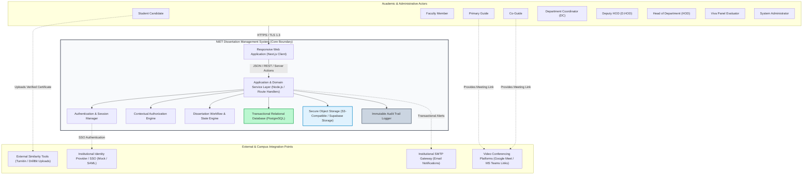
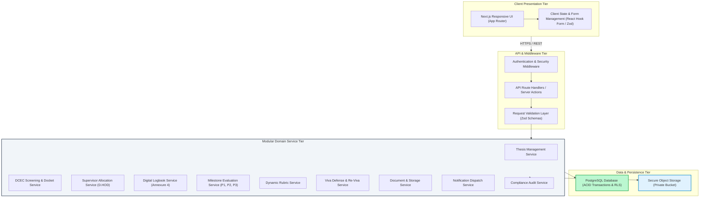
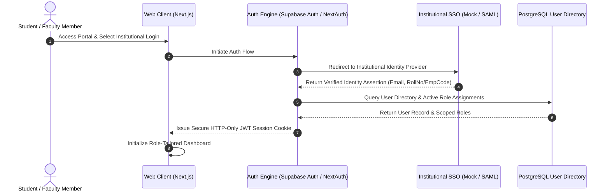
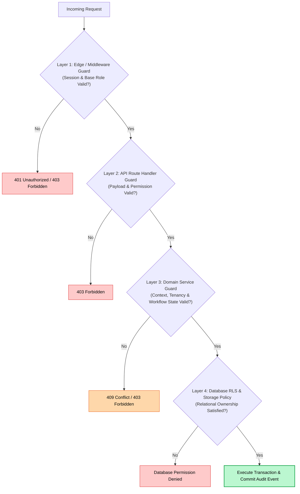
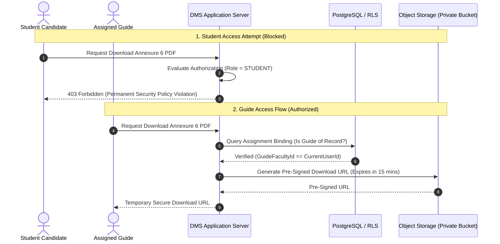
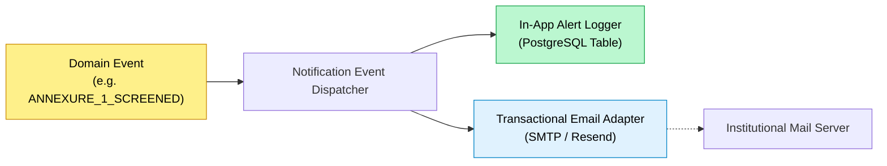
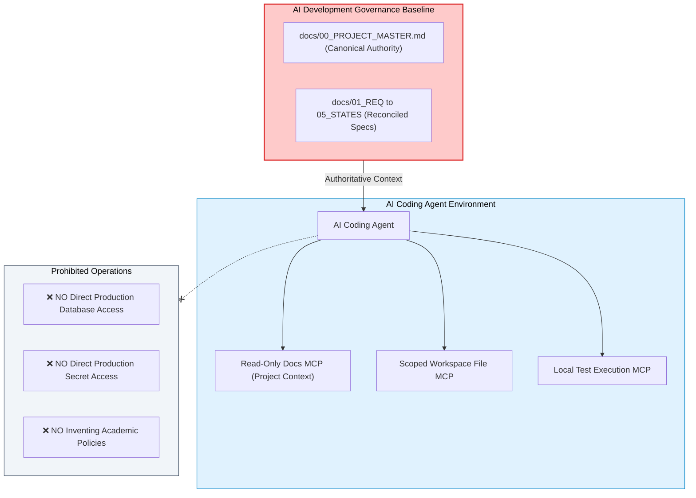
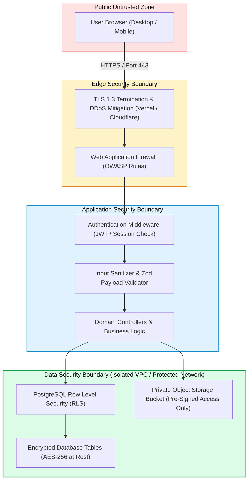

# NIET Dissertation Management System — System Architecture Specification

**Document ID:** `DOC-02-ARCH`  
**File Path:** [`docs/02_ARCHITECTURE.md`](file:///c:/Users/user/Desktop/niet-dissertation-management-system/docs/02_ARCHITECTURE.md)  
**Document Status:** ARCHITECTURE FREEZE BASELINE (PHASE 3A)  
**Last Revised:** 2026-08-15  
**Governing Baselines:** [`docs/00_PROJECT_MASTER.md`](file:///c:/Users/user/Desktop/niet-dissertation-management-system/docs/00_PROJECT_MASTER.md), [`docs/01_REQUIREMENTS.md`](file:///c:/Users/user/Desktop/niet-dissertation-management-system/docs/01_REQUIREMENTS.md), [`docs/03_DOMAIN_MODEL.md`](file:///c:/Users/user/Desktop/niet-dissertation-management-system/docs/03_DOMAIN_MODEL.md), [`docs/04_RBAC_MATRIX.md`](file:///c:/Users/user/Desktop/niet-dissertation-management-system/docs/04_RBAC_MATRIX.md), and [`docs/05_STATE_MACHINES.md`](file:///c:/Users/user/Desktop/niet-dissertation-management-system/docs/05_STATE_MACHINES.md)  
**Institution:** Noida Institute of Engineering & Technology (NIET), Greater Noida  
**Target Program:** M.Tech / M.Tech Integrated Dissertation Lifecycle  

---

## 1. Document Purpose & Architectural Objectives

This document establishes the authoritative **Technical System Architecture** for the NIET Dissertation Management System (DMS). It defines how the approved business requirements, domain models, RBAC matrices, and state machine specifications will be technically structured, deployed, secured, and operated.

### Primary Architectural Objectives

1. **Academic Workflow Correctness:** The architecture must guarantee strict execution of the approved 14-phase dissertation lifecycle without permitting out-of-order state transitions or unauthorized academic approvals.
2. **Zero-Budget Initial Feasibility (₹0 Initial Cost):** The system must be fully deployable, testable, and operable for initial prototype and departmental rollout using free-tier developer tools, free managed databases, and free hosting infrastructure without compromising security or architectural integrity.
3. **Defense-in-Depth Security & Confidentiality:** Academic records, evaluations, and particularly confidential supervisor evaluations (Annexure 6) must be enforced across multiple technical layers (UI routing, API middleware, domain services, and database Row Level Security).
4. **Strict Immutability & Auditability:** All academic decisions, supervisor allocations, evaluation scorecards, and document iterations must generate permanent, append-only audit records.
5. **Architectural Modularity & Future Portability:** The technical stack must avoid proprietary vendor lock-in, enabling seamless migration from free cloud tiers (e.g. Supabase, Vercel) to on-premise institutional data centers if mandated in production.

```
┌────────────────────────────────────────────────────────────────────────────────────────┐
│                              PROTOTYPE V1 VS. PRODUCTION SCALE                         │
├────────────────────────────────────────────────────────────────────────────────────────┤
│ • Prototype V1 Scope   : Zero-budget free-tier cloud deployment, 5 MB file upload cap, │
│                          1-year rolling retention, pre-seeded faculty, simulated SSO.  │
│ • Production Roadmap   : High-throughput institutional hosting, ERP bi-directional sync,│
│                          permanent multi-year archival, live plagiarism API dispatch.   │
└────────────────────────────────────────────────────────────────────────────────────────┘
```

---

## 2. Core Architectural Principles

1. **Mandatory Server-Side Authorization:** Client-side UI hiding is strictly a user-experience enhancement, **never an authorization mechanism**. Every API endpoint and database query must independently verify actor identity, role, department scope, and relational binding.
2. **Technical Admin ≠ Academic Approver:** The architecture enforces a hard boundary between technical maintenance (`ROLE_ADMIN`) and academic governance (`ROLE_DCEC_CHAIR`, `ROLE_HOD`, `ROLE_GUIDE`). Administrators cannot approve proposals, allocate supervisors, or submit grades.
3. **Database-Enforced Invariants:** Relational constraints, check constraints, and unique indexes must protect core academic rules at the data tier (e.g. $\text{Guide} \neq \text{Co-Guide}$, unique title constraints).
4. **Transactional State Machine Integrity:** State transitions spanning multiple entity modifications must execute within strict ACID database transactions. Partial or corrupt state updates are strictly prohibited.
5. **Private-by-Default Object Storage:** Physical files are stored with non-predictable UUID keys in private storage buckets. Public direct URLs are prohibited; downloads require short-lived, authenticated pre-signed URLs.
6. **Zero-Secret Codebase:** No database passwords, JWT secrets, service keys, or private certificates may ever be hard-coded or committed to version control. All runtime secrets are injected via ignored environment variables.

---

## 3. System Context

The following system context diagram illustrates the interaction between institutional actors, the DMS core boundary, and external integration points:



---

## 4. High-Level Component Architecture

The DMS adopts a **Modular Monolith Architecture** encapsulated within a single deployable unit. This pattern maximizes development velocity, eliminates distributed network latency, ensures transactional integrity across sub-domains, and satisfies the ₹0 initial infrastructure requirement.



### Component Breakdown & Implementation Tiers

| Logical Component | Subsystem Responsibility | V1 Implementation Status | Future Roadmap (Post-V1) |
| :--- | :--- | :--- | :--- |
| **Web Client Tier** | Responsive UI, role-tailored dashboards, form validation, dynamic rubrics. | **Required for V1** | Native Mobile App wrapper. |
| **API & Gateway Tier** | Edge middleware, session validation, route handlers, payload validation. | **Required for V1** | Dedicated API Rate Limiting gateway. |
| **Domain Services** | 10 modular domain services executing business logic and state transitions. | **Required for V1** | Microservice extraction (if needed). |
| **Database Tier** | Relational data persistence, foreign keys, unique indexes, Row Level Security. | **Required for V1 (PostgreSQL)** | Read-replicas, multi-region clustering. |
| **Object Storage** | Encrypted private file storage, server-side MIME verification, pre-signed URLs. | **Required for V1 (5 MB cap)** | Antivirus ClamAV background daemon. |
| **Audit Service** | Append-only, tamper-proof academic compliance logging with state deltas. | **Required for V1** | WORM (Write-Once-Read-Many) storage. |
| **Notification Service**| In-app notification alerts + extensible transactional email dispatch adapter. | **Required for V1** | SMS gateway, WhatsApp alerts. |
| **Asynchronous Engine** | Lightweight in-process or serverless job execution for emails and logs. | **Required for V1** | Dedicated Redis / BullMQ queue cluster. |

---

## 5. Frontend Architecture

The frontend is architected using **Next.js (App Router)** with **TypeScript** and **Tailwind CSS**, providing server-side rendering (SSR), optimized static asset caching, and fine-grained client component boundaries.

```
                               FRONTEND ARCHITECTURE
┌────────────────────────────────────────────────────────────────────────────────────────┐
│ 1. Routing & Layouts     : Next.js App Router (/app/(auth), /app/(dashboard)/[role])   │
│ 2. Role-Aware Navigation : Navigation bars dynamic to active role & department scope   │
│ 3. Form Handling         : React Hook Form + Zod for strict client-side validation     │
│ 4. Dynamic UI Rubrics    : Interactive 4-column rubric scoring grid with live totals   │
│ 5. Security Enclosure    : Protected layout wrappers validating authenticated session │
│ 6. Accessibility & A11y  : Semantic HTML5, WCAG 2.1 AA compliance, ARIA attributes    │
│ 7. Loading & Error States: React Suspense boundaries, skeleton loaders, error boundaries│
└────────────────────────────────────────────────────────────────────────────────────────┘
```

### Key Frontend Structural Conventions

- **Route Grouping by Domain & Role:**
  - `app/(auth)/login`: Institutional Single Sign-On entry.
  - `app/(dashboard)/student/*`: Proposal submission, collaborative workspace, logbook, manuscript upload.
  - `app/(dashboard)/faculty/*`: Supervision dashboard, logbook verification, Annexure 6 scoring.
  - `app/(dashboard)/dhod/*`: Supervisor allocation workbench, capacity indicators.
  - `app/(dashboard)/hod/*`: Department compliance overview, DCEC chair reviews, final sign-off.
  - `app/(dashboard)/panel/*`: Oral defense evaluation scorecards.
  - `app/(dashboard)/admin/*`: User provisioning, department masters, rubric builder.
- **Client/Server Boundary Separation:** Data fetching and authorization checks execute on Server Components; interactive state (e.g. dynamic rubric scoring, multi-preference drag-and-drop) executes in Client Components (`'use client'`).

---

## 6. Backend & Service Architecture (Modular Monolith)

The backend is organized into cleanly isolated **Domain Modules** sharing a common database connection and transaction context. This avoids microservice operational overhead while guaranteeing strict code decoupling.

```
src/
├── app/api/                 # HTTP Route Handlers / Endpoints
├── modules/
│   ├── auth/                # Identity, Session & Token Management
│   ├── thesis/              # Thesis Lifecycle & State Machine Handlers
│   ├── dcec/                # Docket Compilation, Screening & Decisions
│   ├── allocation/          # Supervisor Allocation & Load Tracking
│   ├── logbook/             # Annexure 4 Digital Logbook & Verifications
│   ├── evaluation/          # Milestone Evaluations (P1, P2, P3) & Rubrics
│   ├── viva/                # Expert Panel Formation & Viva Defense
│   ├── documents/           # Object Storage Keys & Pre-signed Uploads
│   ├── notifications/       # Alert Generation & Email Adapters
│   └── audit/               # Compliance Logging & State Delta Capture
└── shared/                  # Common Types, Errors, Database Client, Security Guards
```

### Architectural Evaluation: Modular Monolith vs. Microservices

| Criteria | Modular Monolith (Selected for V1) | Microservices Architecture | Architectural Justification |
| :--- | :--- | :--- | :--- |
| **Development Cost** | **₹0 (Single free deployment instance)** | High (Multiple containers/instances required) | Directly satisfies zero-cost initial requirement. |
| **Transactional Integrity** | **Native ACID transactions across modules** | Complex 2-Phase Commit / Saga patterns | Prevents partial failure in multi-step academic workflows. |
| **Operational Complexity** | Low (Single repository, single CI/CD pipeline)| High (Service discovery, mesh, distributed logs)| Eliminates infrastructure overhead for prototype cohort. |
| **Refactoring Agility** | High (Compile-time type sharing via TypeScript) | Low (Breaking network contracts between repos) | Accelerates rapid architectural iteration. |

---

## 7. Database Architecture

The data tier is powered by **PostgreSQL**, leveraging its enterprise-grade relational integrity, transactional guarantees, JSONB support for flexible rubric configurations, and native Row Level Security (RLS).

```
                               DATABASE ARCHITECTURE
┌────────────────────────────────────────────────────────────────────────────────────────┐
│ 1. Engine & Runtime      : PostgreSQL 15+ (Hosted via Supabase Free Tier or Neon)       │
│ 2. Relational Integrity  : Foreign Keys with RESTRICT/CASCADE, Composite Unique Indexes│
│ 3. Check Constraints     : Guide != Co-Guide, Valid Marks Ranges (0..100), Valid Enums │
│ 4. Row Level Security    : Native database-level tenant and relational access control  │
│ 5. Migration Strategy    : SQL-based version-controlled migrations (database/migrations)│
│ 6. Backup Strategy       : Daily automated logical dumps + Point-in-Time Recovery      │
└────────────────────────────────────────────────────────────────────────────────────────┘
```

### Transaction Boundaries & Isolation

All state-changing workflows execute under **Read Committed** or **Serializable** transaction isolation levels to prevent race conditions during concurrent operations (e.g. simultaneous supervisor allocations, rapid-fire evaluation submissions).

---

## 8. Authentication Architecture

Authentication establishes the verified identity of a participant before platform entry.



### Authentication Invariants

1. **Student Authentication:** Restricted to institutional Single Sign-On (SSO) credentials matching official institutional student IDs (`@niet.co.in`).
2. **Faculty Authentication:** Pre-seeded faculty accounts only. **Public self-registration is strictly disabled.**
3. **Session Security:** Session tokens are delivered via `HttpOnly`, `Secure`, `SameSite=Strict` cookies to prevent XSS exfiltration.

---

## 9. Authorization Architecture & Multi-Layer Enforcement

Authorization evaluates whether an authenticated user is permitted to execute an action on a specific resource.



---

## 10. Database + Authorization Relationship (Row Level Security Mapping)

Row Level Security (RLS) policies at the PostgreSQL tier mirror the domain authorization rules, providing database-level defense-in-depth:

| Domain Entity | RLS Policy Rule (Conceptual SQL Predicate) | Governed Roles |
| :--- | :--- | :--- |
| `theses` | `auth.uid() == student_id OR auth.uid() IN (guide_id, co_guide_id) OR (auth.jwt()->>'dept_id' == department_id AND auth.has_role('HOD','DC','DHOD'))` | Student, Supervisors, Department Officers |
| `annexure_6_evaluations` | `auth.uid() == guide_id OR (auth.jwt()->>'dept_id' == department_id AND auth.has_role('HOD','DCEC_CHAIR')) OR auth.is_assigned_panel_member(thesis_id)` <br> **`AND auth.has_role('STUDENT') == FALSE`** | Guide, DCEC Chair, Panel Members <br> **(Student Strictly Excluded)** |
| `digital_logbook_entries`| `thesis.student_id == auth.uid() OR auth.uid() IN (thesis.guide_id, thesis.co_guide_id)` | Student, Guide, Co-Guide |
| `viva_evaluations` | `auth.uid() == evaluator_faculty_id OR auth.has_role('HOD')` | Assigned Panel Members, HOD |
| `audit_events` | `auth.has_role('ADMIN', 'HOD')` (Read-only) <br> **Zero update/delete policies exist (Append-Only)** | Admin, HOD |

---

## 11. File Storage Architecture

Physical files (manuscripts, similarity reports, meeting attachments) are stored in an S3-compatible private object store (e.g. Supabase Storage / Cloudflare R2 / AWS S3).

```
                               STORAGE ARCHITECTURE
┌────────────────────────────────────────────────────────────────────────────────────────┐
│ 1. Bucket Isolation      : Single private bucket 'niet-dissertations-private'          │
│ 2. Storage Key Pattern   : {department_code}/{academic_session}/{thesis_uuid}/{doc_uuid}│
│ 3. Upload Verification   : Pre-signed upload URLs with strict Content-Length <= 5 MB   │
│ 4. MIME & Magic Bytes    : Server-side validation rejecting disguised executables      │
│ 5. Download Security     : Short-lived pre-signed download URLs (Expiration: 15 mins)  │
│ 6. Version Preservation  : Replaced files generate sequential records (v1, v2, v3)    │
└────────────────────────────────────────────────────────────────────────────────────────┘
```

---

## 12. Sensitive Document Access Architecture (Annexure 6 Isolation)

The confidential supervisor evaluation (Annexure 6) requires strict access segregation:



---

## 13. API Architecture

The API layer is structured following **RESTful conventions** integrated with Next.js Route Handlers. All payloads are validated using **Zod schemas** before reaching domain services.

### Standardized Response Envelopes

```typescript
// Successful API Response Envelope
interface ApiResponse<T> {
  success: true;
  data: T;
  meta?: {
    timestamp: string;
    correlationId: string;
  };
}

// Error API Response Envelope
interface ApiErrorResponse {
  success: false;
  error: {
    code: string;        // e.g. "OVER_CAPACITY_LIMIT", "INVALID_WORKFLOW_STATE"
    message: string;     // Human-readable error message
    details?: unknown;   // Zod validation issues or context
  };
  meta: {
    timestamp: string;
    correlationId: string;
  };
}
```

---

## 14. Transaction Architecture (ACID Workflow Boundaries)

Multi-entity operations execute within atomic database transactions. If any step fails, the entire transaction is rolled back:

1. **Supervisor Allocation Transaction:**
   $$\text{BEGIN} \rightarrow \text{Lock Faculty Records} \rightarrow \text{Verify Loads} \le 3 \rightarrow \text{Update Thesis} \rightarrow \text{Increment Load Counters} \rightarrow \text{Write Allocation History} \rightarrow \text{Log Audit Event} \rightarrow \text{COMMIT}$$
2. **Viva Failure Transition Transaction:**
   $$\text{BEGIN} \rightarrow \text{Record Panel Marks} \rightarrow \text{Compile Composite Result} \rightarrow \text{Instantiate ReVivaCycle} \rightarrow \text{Transition Thesis State} \rightarrow \text{Log Audit Event} \rightarrow \text{COMMIT}$$

---

## 15. Concurrency & Race-Condition Architecture

To prevent race conditions during concurrent operations (e.g. two D.HODs or simultaneous scripts assigning candidates to the same faculty member nearing capacity):

```mermaid
sequenceDiagram
    autonumber
    actor DHOD1 as Allocator Session 1
    actor DHOD2 as Allocator Session 2
    participant DB as PostgreSQL (Transaction Engine)

    DHOD1->>DB: BEGIN Transaction 1 (Assign Student A to Faculty X)
    DB->>DB: SELECT * FROM faculty WHERE id = 'X' FOR UPDATE (Lock Acquired)
    Note over DB: Faculty X has current load = 2

    DHOD2->>DB: BEGIN Transaction 2 (Assign Student B to Faculty X)
    DHOD2->>DB: SELECT * FROM faculty WHERE id = 'X' FOR UPDATE (Blocks waiting for Lock)

    DHOD1->>DB: Check Load (2 < 3 = OK) -> Set Load = 3 -> COMMIT Transaction 1
    Note over DB: Lock released; Transaction 2 resumes

    DB->>DHOD2: Returns updated Faculty X (Current Load = 3)
    DHOD2->>DHOD2: Check Load (3 < 3 = FALSE -> Capacity Exceeded!)
    DHOD2->>DB: ROLLBACK Transaction 2
    DB-->>DHOD2: 409 Conflict ("Faculty X has reached maximum capacity load of 3")
```

---

## 16. Data Integrity Architecture: Three-Tier Verification

```
┌────────────────────────────────────────────────────────────────────────────────────────┐
│                              THREE-TIER INTEGRITY MATRIX                               │
├────────────────────────────────────────────────────────────────────────────────────────┤
│ 1. Database Tier Constraints : • Foreign Keys (RESTRICT deletion of active theses)     │
│                                • CHECK (guide_id != co_guide_id)                       │
│                                • CHECK (p1_score BETWEEN 0 AND 100)                    │
│                                • UNIQUE (department_id, lower(final_thesis_title))     │
├────────────────────────────────────────────────────────────────────────────────────────┤
│ 2. Application Domain Logic  : • Dynamic 4-column rubric calculation                   │
│                                • State machine pre-condition validation                │
│                                • Milestone grading contribution (Only P3 counts)       │
├────────────────────────────────────────────────────────────────────────────────────────┤
│ 3. Authorization Layer       : • Multi-factor context verification (Role + Tenancy)    │
│                                • DCEC Chair Maker-Checker separation                   │
│                                • Permanent student lockout on Annexure 6               │
└────────────────────────────────────────────────────────────────────────────────────────┘
```

---

## 17. Compliance Audit Architecture

Every critical action generates an immutable `AuditEvent` written to an append-only audit table:

```typescript
interface AuditRecord {
  id: string;                    // UUID primary key
  actorUserId: string;          // User executing the action
  activeRoleId: string;          // Role context used
  clientIp: string;              // Client IP address
  userAgent: string;             // Browser user agent
  actionCode: string;            // Standardized action identifier
  targetEntityType: string;      // e.g. "Thesis", "MilestoneEvaluation"
  targetEntityId: string;        // UUID of affected resource
  previousState?: object;        // JSON snapshot before modification
  newState?: object;             // JSON snapshot after modification
  justification?: string;        // Mandatory justification text
  correlationId: string;         // Request tracing identifier
  timestampUtc: string;          // ISO-8601 UTC timestamp with ms precision
}
```

---

## 18. Notification Architecture

The notification subsystem decouples domain events from notification formatting and delivery channels:



---

## 19. Asynchronous Processing Architecture (Zero-Budget Simplicity)

For Version 1, asynchronous processing is handled via **serverless background execution** (e.g. Next.js `after()` API or asynchronous event listeners) rather than deploying heavy dedicated Redis/BullMQ brokers. This preserves the ₹0 operating budget while ensuring prompt HTTP responses.

---

## 20. Configuration & Secrets Architecture

1. **Secrets Isolation:** Database connection strings, JWT signing keys, and storage service credentials exist **only** as server-side environment variables.
2. **Version Control Protection:** `.env`, `.env.local`, and `.env.production` files are strictly excluded via `.gitignore`. A sanitized template ([`.env.example`](file:///c:/Users/user/Desktop/niet-dissertation-management-system/.env.example)) documents required keys.
3. **Runtime Configuration Separation:** Static non-secret configuration (e.g. prototype upload limits, pagination sizes) is separated from dynamic academic policy parameters stored in the database.

---

## 21. Environment Architecture

```mermaid
graph LR
    subgraph LocalDev["1. Local Development"]
        L_NODE["Node.js Runtime"]
        L_PG["Local / Free Cloud PostgreSQL"]
        L_ENV[".env.local (Git Ignored)"]
    end

    subgraph TestingEnv["2. Automated Testing / CI"]
        CI_GIT["GitHub Actions Workflow"]
        CI_TEST["Unit & State Machine Tests"]
        CI_LINT["ESLint & TypeScript Verification"]
    end

    subgraph CloudV1["3. Zero-Budget V1 Deployment"]
        VERCEL["Vercel Free Tier (Hosting & SSR)"]
        SUPA["Supabase Free Tier (Postgres & Storage)"]
    end

    LocalDev -->|Git Push| TestingEnv
    TestingEnv -->|Passed Checks| CloudV1

    style LocalDev fill:#f8fafc,stroke:#475569,color:#000
    style TestingEnv fill:#fef08a,stroke:#ca8a04,color:#000
    style CloudV1 fill:#bbf7d0,stroke:#16a34a,stroke-width:2px,color:#000
```



---

## 22. Deployment Architecture & Zero-Cost Infrastructure Strategy

The system is architected to operate entirely within verified free tiers during development and initial departmental evaluation:

```
                               ZERO-COST INFRASTRUCTURE
┌──────────────────────┬────────────────────────┬────────────────────────────────────────┐
│ Infrastructure Layer │ Selected Free Provider │ Free Tier Allowances & Constraints     │
├──────────────────────┼────────────────────────┼────────────────────────────────────────┤
│ Web & API Hosting    │ Vercel Free Tier       │ 100 GB bandwidth, unlimited serverless │
│ Managed Database     │ Supabase / Neon Free   │ 500 MB PostgreSQL, 2 active projects   │
│ Object File Storage  │ Supabase Storage Free  │ 1 GB storage, 50 MB upload bandwidth   │
│ Authentication       │ Supabase Auth Free     │ 50,000 Monthly Active Users (MAU)      │
│ CI/CD Pipeline       │ GitHub Actions Free    │ 2,000 build minutes/month for public/org│
│ Domain & SSL         │ Vercel Subdomain + SSL │ Free *.vercel.app + automated Let's Encrypt│
└──────────────────────┴────────────────────────┴────────────────────────────────────────┘
```

> [!WARNING]
> **FREE TIER RISK MITIGATION:**  
> Free tiers may pause idle databases after inactivity (e.g. Supabase 7-day pause). The architecture ensures complete database portability by using standard SQL migrations and generic PostgreSQL connections, enabling instant migration to local Docker or institutional servers if required.

---

## 23. Technology Selection & Trade-Off Analysis

| Technology Domain | Selected Solution | Evaluated Alternatives | Rationale & Selection Criteria |
| :--- | :--- | :--- | :--- |
| **Frontend Framework** | **Next.js 14+ (App Router)** | Single Page App (Vite/React), Remix | Native SSR, unified API routes, zero-configuration hosting on Vercel, excellent SEO and accessibility. |
| **Programming Language**| **TypeScript** | JavaScript, Python | Full-stack end-to-end type safety, shared domain interfaces between client and server. |
| **Database Engine** | **PostgreSQL 15+** | MySQL, MongoDB | Enterprise ACID transactions, native Row Level Security, complex relational joins, JSONB rubric flexibility. |
| **ORM / Data Access** | **Prisma / Kysely / Drizzle** | Raw SQL, TypeORM | Type-safe query building, deterministic migration tracking, low runtime overhead. |
| **Object Storage** | **S3-Compatible Object Store**| Local Disk, GridFS | Cloud-native private bucket isolation, pre-signed URL security, zero-cost free tier. |
| **Styling & Design** | **Tailwind CSS / Vanilla CSS**| Material UI, Chakra UI | Zero runtime CSS overhead, maximum customizability for NIET institutional design tokens. |

---

## 24. AI-Assisted Development & MCP Tooling Architecture

The DMS codebase will be developed and maintained using advanced AI coding agents. To guarantee institutional safety and prevent code corruption:



### AI Implementation Guardrails

1. **Strict Context Ingestion:** AI agents must read authoritative project specifications before modifying code.
2. **Phase-Isolated Commits:** Code changes must be small, single-purpose, and verified against automated unit tests.
3. **No Secret Ingestion:** Agents must never request, output, or store production credentials or private keys.

---

## 25. Observability & Technical Monitoring

1. **Structured Application Logging:** Technical logs are formatted in structured JSON capturing timestamp, severity, service module, correlation ID, and error stack traces.
2. **Technical Logs vs. Academic Audit Logs Separation:** Technical application logs (transient debug info) are stored in standard logging streams; academic `AuditEvent` records are stored in dedicated, immutable database tables.
3. **Health Check Endpoints:** `/api/health` reports runtime status, database connectivity, and storage reachability.

---

## 26. Backup & Disaster Recovery Architecture

- **Database Backup:** Daily automated logical dumps (`pg_dump`) retained for 30 rolling days.
- **Document Redundancy:** Object storage buckets configured with cross-region replication or versioned snapshots.
- **Recovery Point Objective (RPO):** V1 Prototype: $\le 24\text{ hours}$ (Production target: `REQ-OD-012`).
- **Recovery Time Objective (RTO):** V1 Prototype: $\le 4\text{ hours}$ (Production target: `REQ-OD-012`).

---

## 27. Security Boundaries & Threat Modeling



---

## 28. Failure Modes & System Resilience

| Failure Scenario | Immediate System Behavior | Recovery / Mitigation Strategy |
| :--- | :--- | :--- |
| **Database Outage** | API returns `503 Service Unavailable`; UI displays friendly error state. | Connection pool reconnects automatically with exponential backoff. |
| **Object Storage Unavailable**| File uploads pause; database records remain uncommitted (ACID rollback). | Client displays retry prompt; uploads retry via pre-signed URL. |
| **SSO Identity Provider Down** | Direct logins pause; active authenticated sessions remain valid. | Token cache maintains active sessions until TTL expiration. |
| **Concurrent Load Conflict** | Transaction fails with `409 Conflict` on capacity breach ($\text{Load} > 3$). | Allocator workbench refreshes real-time faculty capacity indicators. |
| **Invalid State Transition** | State machine guard blocks request with `409 Invalid Transition`. | Client UI resynchronizes to latest server state. |

---

## 29. Architectural Decision Records (ADR Summary)

```
                                  ARCHITECTURAL DECISIONS
┌─────────┬───────────────────────────────┬────────────┬─────────────────────────────────┐
│ ADR ID  │ Title                         │ Status     │ Selected Approach               │
├─────────┼───────────────────────────────┼────────────┼─────────────────────────────────┤
│ ADR-001 │ Core Architecture Pattern     │ `ACCEPTED` │ Modular Monolith (Next.js)      │
│ ADR-002 │ Primary Database Engine       │ `ACCEPTED` │ PostgreSQL 15+ with RLS         │
│ ADR-003 │ Authentication Architecture   │ `ACCEPTED` │ Institutional SSO + Mocked Dev  │
│ ADR-004 │ Object File Storage           │ `ACCEPTED` │ S3-Compatible Private Storage   │
│ ADR-005 │ API Communication Style       │ `ACCEPTED` │ RESTful Route Handlers + Zod    │
│ ADR-006 │ Concurrency Control Strategy  │ `ACCEPTED` │ Pessimistic Row Locking         │
│ ADR-007 │ Zero-Budget Infrastructure    │ `ACCEPTED` │ Vercel + Supabase Free Tiers    │
│ ADR-008 │ Compliance Audit Architecture │ `ACCEPTED` │ Append-Only Relational Logs     │
│ ADR-009 │ AI Coding Governance          │ `ACCEPTED` │ Least-Privilege Scoped MCP      │
│ ADR-010 │ Dynamic Rubric Versioning     │ `ACCEPTED` │ Immutable Version Pinning (FK)  │
└─────────┴───────────────────────────────┴────────────┴─────────────────────────────────┘
```

---

## 30. Open Architecture Questions

In strict accordance with the Anti-Hallucination Rule, the following technical items remain open pending institutional confirmation:

| Open Decision ID | Architecture Area | Unresolved Technical Question | Temporary Architectural Stance |
| :--- | :--- | :--- | :--- |
| `REQ-OD-006` | Storage Arch | Production long-term document retention period post-graduation. | Default to 1-year rolling prototype retention. |
| `REQ-OD-007` | Storage Arch | Production file size upload limit and departmental storage quotas. | Default to 5 MB per file upload cap. |
| `REQ-OD-009` | Auth Arch | Production institutional SSO protocol standard (SAML 2.0 vs OAuth2 / OIDC). | Modular SSO adapter with simulated OAuth2 in dev. |
| `REQ-OD-010` | Integration | Production campus ERP synchronization protocol and database connector. | Manual seed import / export for V1. |
| `REQ-OD-011` | Infrastructure | Production cloud hosting boundaries (AWS/GCP vs NIET on-premise datacenter). | Dockerized container-ready deployment topology. |
| `REQ-OD-012` | Disaster Recovery | Production target Recovery Point Objective (RPO) and Recovery Time Objective (RTO). | Standard daily database snapshot backups. |
| `REQ-OD-013` | Notifications | Official institutional SMTP gateway endpoints and credentials. | In-app notifications + local console mail adapter. |

---

## 31. Future Architectural Roadmap (Post-V1)

1. **`FUT-ARCH-AI-ENGINE`:** Dedicated Python/FastAPI microservice running vector embeddings for AI supervisor matching.
2. **`FUT-ARCH-SOLVER`:** Linear programming optimization container for automated multi-candidate allocation.
3. **`FUT-ARCH-QUEUE`:** Redis-backed BullMQ cluster for high-volume background PDF watermarking and batch emails.
4. **`FUT-ARCH-MULTI-TENANT`:** Multi-institution partitioning enabling multi-campus deployment across NIET sister institutions.

---

## 32. Requirement-to-Architecture Traceability Matrix

| Architectural Subsystem | Governing Requirement IDs | Source Document & Section | Rationale / Traceability Note |
| :--- | :--- | :--- | :--- |
| **Modular Monolith** | `REQ-WF-001`, `REQ-WF-002` | `01_REQUIREMENTS.md §8` | Unified state engine across all 14 lifecycle phases |
| **PostgreSQL & RLS** | `REQ-NFR-SEC-001`, `REQ-AUTHZ-003`| `01_REQUIREMENTS.md §6.1, §17` | Relational integrity and departmental tenant isolation |
| **SSO Authentication**| `REQ-AUTH-001`, `REQ-AUTH-003` | `01_REQUIREMENTS.md §16` | Institutional SSO-only for students; pre-seeded faculty |
| **Supervisor Allocation**| `REQ-ALLOC-001`..`007` | `01_REQUIREMENTS.md §5.4` | D.HOD sole allocation authority; loads $\le 3$; $\text{Guide} \neq \text{Co-Guide}$ |
| **Dynamic Rubrics** | `REQ-RUB-001`..`003`, `REQ-EVAL-007`| `01_REQUIREMENTS.md §13` | 4-column dynamic schema with immutable version pinning |
| **Sensitive Doc Access**| `REQ-ANN6-002`, `REQ-NFR-SEC-002`| `01_REQUIREMENTS.md §5.10, §6.1`| Pre-signed URLs with permanent student lockout on Ann 6 |
| **Zero-Cost Infra** | `REQ-PROTO-001`, `REQ-PROTO-002`| `01_REQUIREMENTS.md §22` | Vercel + Supabase free tiers; 5 MB upload cap; 1-yr retention |
| **Append-Only Audit** | `REQ-AUD-001`..`003` | `01_REQUIREMENTS.md §18` | Tamper-proof compliance logging with state snapshots |
| **AI Governance** | `REQ-NONGOAL-004`, `REQ-FUT-001`| `01_REQUIREMENTS.md §23, §24`| Scoped MCP development; no AI grading in V1 |

---

## 33. Anti-Hallucination & Governance Verification

This system architecture specification has been strictly validated against all canonical project rules:

- [x] **No Application Code Written:** Confirmed zero source code files created.
- [x] **No Database Schema / SQL / Supabase Tables Created:** Confirmed specifications are architectural designs; no SQL migrations or DDL scripts were created.
- [x] **No Cloud Resources or API Keys Created:** Confirmed zero external services, API keys, or cloud resources were instantiated.
- [x] **No MCP Servers Connected:** Confirmed zero MCP servers or production credentials connected.
- [x] **All Locked Academic Rules Preserved:** D.HOD sole allocation, Guide loads $\le 3$, P3 contribution exclusivity, Maker-Checker separation, and student Annexure 6 lockout remain fully intact.
- [x] **Single File Scope Respected:** ONLY [`docs/02_ARCHITECTURE.md`](file:///c:/Users/user/Desktop/niet-dissertation-management-system/docs/02_ARCHITECTURE.md) was modified.
