# NIET Dissertation Management System — Domain Model Specification

**Document ID:** `DOC-03-DOMAIN`  
**File Path:** [`docs/03_DOMAIN_MODEL.md`](file:///c:/Users/user/Desktop/niet-dissertation-management-system/docs/03_DOMAIN_MODEL.md)  
**Document Status:** ARCHITECTURE FREEZE BASELINE (PHASE 2B)  
**Last Revised:** 2026-08-15  
**Governing Baseline:** [`docs/00_PROJECT_MASTER.md`](file:///c:/Users/user/Desktop/niet-dissertation-management-system/docs/00_PROJECT_MASTER.md) & [`docs/01_REQUIREMENTS.md`](file:///c:/Users/user/Desktop/niet-dissertation-management-system/docs/01_REQUIREMENTS.md)  
**Institution:** Noida Institute of Engineering & Technology (NIET), Greater Noida  
**Target Program:** M.Tech / M.Tech Integrated Dissertation Lifecycle  

---

## 1. Document Purpose

This document formally defines the **conceptual business and domain model** for the NIET Dissertation Management System (DMS). It establishes the definitive inventory of domain entities, value objects, domain aggregates, conceptual relationships, ownership boundaries, lifecycles, and historical preservation rules governing academic dissertations at NIET.

### Critical Distinction: Domain Model vs. Database Schema vs. Implementation

```
┌──────────────────────────────────────────────────────────────────────────────────────────┐
│                                   THREE-TIER ABSTRACTION MODEL                           │
├──────────────────────────────────────────────────────────────────────────────────────────┤
│ 1. DOMAIN MODEL (This Document - docs/03_DOMAIN_MODEL.md)                                 │
│    • Conceptual entities, business invariants, aggregate roots, ownership boundaries,     │
│      lifecycle states, and academic rules.                                               │
│    • Independent of physical database engines, SQL syntax, or ORM frameworks.            │
│    • Focus: "What business concepts exist and what rules govern them?"                    │
├──────────────────────────────────────────────────────────────────────────────────────────┤
│ 2. PHYSICAL DATABASE SCHEMA (docs/06_DATABASE_SCHEMA.md)                                 │
│    • Relational tables, columns, data types, primary keys, foreign keys, SQL constraints, │
│      indexes, and Row Level Security (RLS) policies.                                     │
│    • Technical data representation of the approved domain model.                         │
│    • Focus: "How is domain data stored, indexed, and constrained in PostgreSQL/Supabase?"│
├──────────────────────────────────────────────────────────────────────────────────────────┤
│ 3. APPLICATION IMPLEMENTATION (src/)                                                     │
│    • Runtime source code, API routes, service classes, UI components, and state handlers.│
│    • Executes business logic in accordance with domain rules and database contracts.     │
│    • Focus: "How do software components process requests and present user interfaces?"    │
└──────────────────────────────────────────────────────────────────────────────────────────┘
```

> [!IMPORTANT]
> This document defines **domain concepts and invariants only**. It does **NOT** define SQL column types, physical database table definitions, or API implementations.

---

## 2. Domain Modeling Principles

The domain model is governed by seven fundamental architectural and academic principles derived directly from [`docs/00_PROJECT_MASTER.md`](file:///c:/Users/user/Desktop/niet-dissertation-management-system/docs/00_PROJECT_MASTER.md):

1. **Academic Immutability & Auditability:** Academic evaluations, supervisor endorsements, viva defense results, and institutional sign-offs are legal academic records. Once submitted, they must never be silently mutated, overwritten, or destroyed.
2. **Historical Version Preservation:** Revisions to academic submissions (e.g. Annexure 2 resubmissions, dissertation manuscript updates) generate sequential versioned entities (`v1`, `v2`, `v3`) while preserving all historical artifacts and evaluator comments.
3. **Explicit Separation of Academic & Technical Authority:** System Administration (`ADMIN`) privileges are strictly technical and must never confer academic approval, grading, or committee override authority. Academic authority (`DCEC_CHAIR_APPROVE`) requires an explicit academic role.
4. **Context-Aware, Multi-Factor Authorization:** A user's operational authority is determined dynamically by combining: (1) Primary Role, (2) Department Scope, (3) Thesis Assignment Relationship (e.g., Guide of record), and (4) Active Institutional Delegation.
5. **Evaluation-to-Rubric Version Pinning:** When an evaluation is performed, it remains permanently attached to the exact `RubricVersion` active at that time. Future modifications to institutional rubrics must never retroactively alter historical evaluations.
6. **Thesis Identity Persistence Across Re-Viva Cycles:** If a candidate fails a viva defense, the primary `Thesis ID` remains unchanged. A new sequential `ReVivaCycle` is instantiated without re-issuing a new thesis identifier.
7. **Strict Confidential Record Isolation:** Confidential supervisor evaluations (Annexure 6) are isolated entities where student access is permanently prohibited across all lifecycle phases.

---

## 3. User & Identity Domain

The User and Identity Domain models participants, institutional affiliations, roles, and departmental hierarchies.

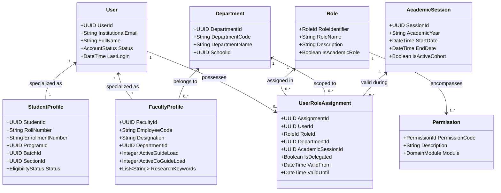

### Entity Specifications

#### 3.1 `User`
- **Purpose:** Represents an authenticated individual within the institutional identity namespace.
- **Key Concepts:** Unique institutional identifier, official email (`@niet.co.in`), full name, phone number, account state (`ACTIVE`, `SUSPENDED`, `INACTIVE`), security metadata.
- **Relationships:** Possesses one specialized profile (`StudentProfile` or `FacultyProfile`), possesses multiple `UserRoleAssignment` records.
- **Lifecycle:** Created via institutional pre-seeding/SSO sync; mutable account status; never hard-deleted.
- **Audit & Versioning:** Account modifications and login events generate immutable audit records.

#### 3.2 `Role`
- **Purpose:** Represents a recognized institutional function or operational capacity.
- **Key Concepts:** `STUDENT`, `GUIDE`, `CO-GUIDE`, `DC`, `D.HOD`, `HOD`, `DCEC_MEMBER`, `PANEL_MEMBER`, `DCEC_CHAIR`, `ADMIN`.
- **Relationships:** Contains a set of atomic `Permission` capabilities; referenced by `UserRoleAssignment`.
- **Lifecycle:** Static system reference data; immutable during normal runtime.

#### 3.3 `Permission`
- **Purpose:** Represents an atomic operational entitlement (e.g. `DCEC_CHAIR_APPROVE`, `ALLOCATE_SUPERVISOR`, `SUBMIT_ANNEXURE_1`, `EVALUATE_MILESTONE`, `VIEW_CONFIDENTIAL_ANNEXURE_6`).
- **Key Concepts:** Unique permission code, target domain module, risk level.
- **Relationships:** Grouped into `Role` definitions.

#### 3.4 `UserRoleAssignment`
- **Purpose:** Maps a user to a specific operational role within a defined departmental and temporal context.
- **Key Concepts:** User reference, Role reference, Department scope, Academic Session scope, Delegation indicator (`IsDelegated`), validity timeframe (`ValidFrom`, `ValidUntil`).
- **Relationships:** Links `User`, `Role`, `Department`, and `AcademicSession`.
- **Lifecycle:** Created/revoked by administrators or through formal delegation; historical assignments are preserved.

#### 3.5 `StudentProfile`
- **Purpose:** Captures academic registration details of an M.Tech candidate.
- **Key Concepts:** Roll number, enrollment number, program reference, batch reference, semester, section, academic eligibility status (`ELIGIBLE`, `ON_HOLD`, `GRADUATED`).
- **Relationships:** 1:1 with `User`; 1:1 with `Thesis` (one active thesis per student per program).
- **Ownership:** Owned by the student; academic details managed by Department Coordinator / Admin.

#### 3.6 `FacultyProfile`
- **Purpose:** Captures professional and capacity metadata for teaching/research faculty.
- **Key Concepts:** Employee code, academic designation (Professor, Associate Prof, Assistant Prof), department affiliation, research domains/specializations, real-time load counters (`ActiveGuideLoad`, `ActiveCoGuideLoad`).
- **Relationships:** 1:1 with `User`; referenced in `GuideAllocation`, `DCECReview`, and `DefensePanel`.
- **Invariants:** $\text{ActiveGuideLoad} \le 3$, $\text{ActiveCoGuideLoad} \le 3$.

#### 3.7 `Department` & Organizational Hierarchy
- **Purpose:** Represents organizational academic boundaries supporting multi-department hierarchy: $\text{Institution} \rightarrow \text{School} \rightarrow \text{Department} \rightarrow \text{Program} \rightarrow \text{Session} \rightarrow \text{Batch} \rightarrow \text{Semester} \rightarrow \text{Section}$.
- **Key Concepts:** Department code (e.g. `CSE`, `ECE`, `IT`, `ME`), Department Name, School affiliation.
- **Ownership:** Master administrative entity; enforces Row Level Security (RLS) tenant isolation.

---

## 4. Student / Thesis Domain

The Student / Thesis Domain models the core dissertation aggregate, lifecycle state machine, and research metadata.

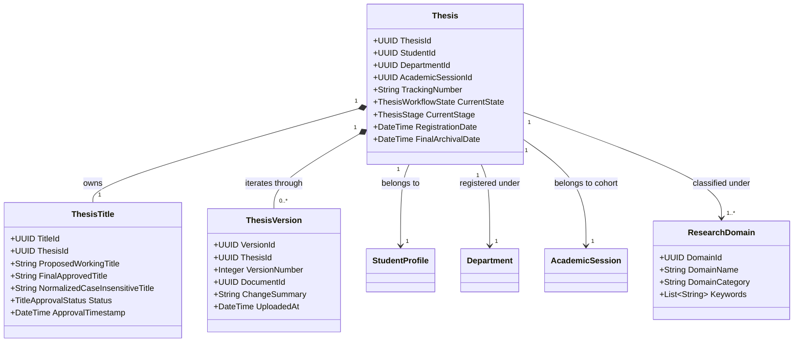

### Entity Specifications

#### 4.1 `Thesis` (Aggregate Root)
- **Purpose:** The central aggregate root representing a candidate's complete dissertation lifecycle journey.
- **Key Concepts:** Immutable `ThesisId` (UUID), human-readable tracking number (e.g., `NIET/MTECH/CSE/2026/042`), active `ThesisWorkflowState`, high-level `ThesisStage`, student ownership, department context, academic session.
- **Cardinality Invariant:** Exactly **one (1) active Thesis record per Student** in an enrolled M.Tech program.
- **Identity Invariant:** The `ThesisId` remains **strictly immutable** throughout the candidate's enrollment, persisting unchanged across all revisions, milestone presentations, and re-viva failure cycles.
- **Lifecycle:** Transitions linearly through the 14 approved phases: `ANNEXURE_1_DRAFT` $\rightarrow \dots \rightarrow$ `ARCHIVED`.

#### 4.2 `ThesisTitle`
- **Purpose:** Manages the working proposal title and the formal approved dissertation title.
- **Key Concepts:** `ProposedWorkingTitle` (submitted in Annexure 1), `FinalApprovedTitle` (endorsed in Annexure 2), `NormalizedCaseInsensitiveTitle` (used for uniqueness collision detection), approval status.
- **Uniqueness Invariant (Prototype):** Exact case-insensitive string match collisions are prohibited within the active cohort.
- **Uniqueness Invariant (Production):** Cross-cohort and multi-department historical uniqueness scope is governed by `REQ-OD-005`.

#### 4.3 `ResearchDomain`
- **Purpose:** Taxonomical classification grouping theses and faculty specializations into research areas (e.g. Artificial Intelligence, Cloud Computing, Cyber Security, VLSI Design).
- **Key Concepts:** Domain name, category, research keyword taxonomy.
- **Relationships:** Referenced by `ThesisTitle`, `Annexure1Submission`, and `FacultyProfile`.

#### 4.4 `ThesisVersion`
- **Purpose:** Represents an immutable snapshot of the dissertation manuscript at a specific milestone or revision iteration.
- **Key Concepts:** Sequential version number ($v1, v2, v3$), reference to underlying storage document, submission change notes, upload timestamp.
- **Lifecycle:** Append-only; historical versions are never overwritten or removed.

---

## 5. Annexure Domain

The Annexure Domain models the formal institutional dockets and evaluation forms required across the dissertation lifecycle.

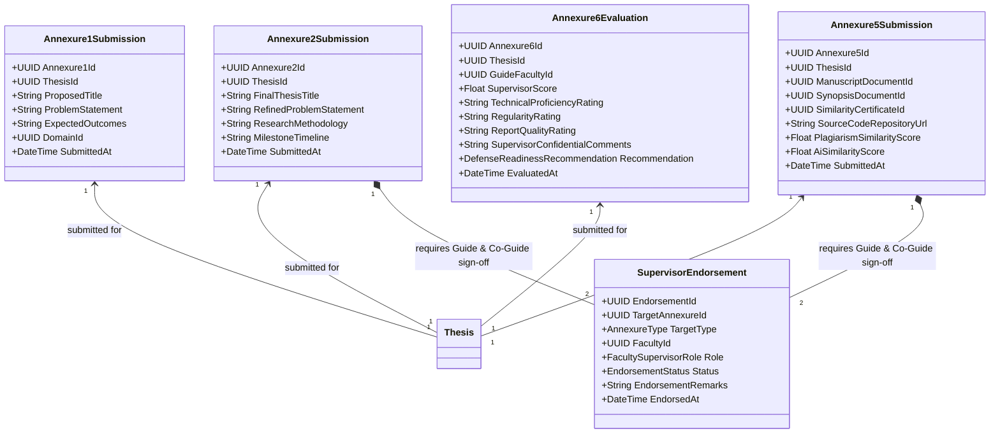

### Entity Specifications

#### 5.1 `Annexure1Submission` (Title & Guide Preference Proposal)
- **Purpose:** Represents the student's initial dissertation proposal.
- **Key Concepts:** Proposed working title, research domain, problem statement abstract, expected outcomes, submission timestamp.
- **Relationships:** Associated with `Thesis`; owns four (4) child `GuidePreference` records.
- **Lifecycle:** Draft $\rightarrow$ Submitted $\rightarrow$ Under DC Verification $\rightarrow$ Under DCEC Screening $\rightarrow$ Approved / Revision Required / Rejected.

#### 5.2 `Annexure2Submission` (Formal Title & Problem Approval)
- **Purpose:** Represents the formal dissertation topic approval document formulated jointly by Student, Guide, and Co-Guide.
- **Key Concepts:** Finalized dissertation title, detailed problem statement, research methodology, milestone delivery timeline.
- **Relationships:** Associated with `Thesis`; requires two `SupervisorEndorsement` records (one from primary Guide, one from Co-Guide) prior to DCEC review.
- **Lifecycle:** Formulated $\rightarrow$ Guide Endorsed $\rightarrow$ Co-Guide Endorsed $\rightarrow$ Submitted to DCEC $\rightarrow$ Approved / Revision Required.

#### 5.3 `Annexure5Submission` (Final Dissertation Submission)
- **Purpose:** Represents the final submission package submitted after successful P3 completion.
- **Key Concepts:** Final dissertation manuscript document reference (PDF), synopsis document reference, similarity report certificate reference, source code repository link, reported plagiarism similarity percentage ($< 10\%$), reported AI similarity percentage ($= 0\%$).
- **Relationships:** Associated with `Thesis`; requires Guide and Co-Guide endorsements.

#### 5.4 `Annexure6Evaluation` (Confidential Supervisor Evaluation)
- **Purpose:** Represents the confidential supervisor evaluation, marks, and viva defense recommendation.
- **Key Concepts:** Primary Guide evaluator reference, supervisor score (/100 or designated component), dimensional ratings (regularity, technical competence, research rigor, report quality), confidential comments, defense readiness recommendation (`RECOMMENDED_FOR_DEFENSE`, `REVISIONS_NEEDED_BEFORE_DEFENSE`, `NOT_RECOMMENDED`).
- **CRITICAL ACCESS INVARIANT:** **Student access is PERMANENTLY DENIED.** No student may view, query, or receive Annexure 6 scores or comments during the active dissertation lifecycle.
- **Co-Guide Access Rule:** Marked as `OPEN DECISION — INFORMATION NOT PROVIDED` (`REQ-OD-004`).

#### 5.5 `SupervisorEndorsement`
- **Purpose:** Captures electronic sign-off and concurrence from Guide or Co-Guide on Annexure 2 and Annexure 5.
- **Key Concepts:** Target annexure reference, faculty actor reference, supervisor role (`GUIDE` vs `CO-GUIDE`), decision (`ENDORSED`, `REVISION_REQUESTED`), remarks, timestamp.

---

## 6. DCEC Domain

The DCEC (Departmental Continuation and Evaluation Committee) Domain models departmental screening dockets, maker-checker workflows, and administrative delegation.

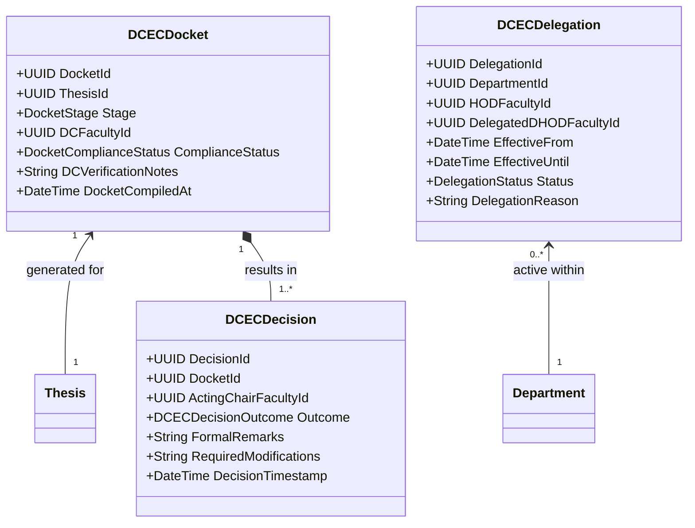

### Entity Specifications

#### 6.1 `DCECDocket` (Maker / DC Review)
- **Purpose:** Represents the compiled screening packet prepared by the Department Coordinator (DC) acting as Maker/Secretary.
- **Key Concepts:** Associated `Thesis`, target stage (`ANNEXURE_1_SCREENING` or `ANNEXURE_2_APPROVAL`), DC faculty reference, compliance checklist verification (student eligibility, document completeness, prerequisite clearing), DC recommendation notes.
- **Lifecycle:** Queued $\rightarrow$ In Verification $\rightarrow$ Docket Compiled $\rightarrow$ Forwarded to DCEC Chair.

#### 6.2 `DCECDecision` (Checker / Chair Approval)
- **Purpose:** Captures the formal, binding academic screening decision executed by the DCEC Chair.
- **Key Concepts:** Associated `DCECDocket`, acting DCEC Chair reference, decision outcome (`APPROVED`, `REVISION_REQUIRED`, `REJECTED`), formal remarks, revision instructions, timestamp.
- **Authority Invariant:** Must be signed by the default DCEC Chair (HOD) or an authorized delegate (D.HOD with active `DCECDelegation`). System Administrators cannot execute this decision.

#### 6.3 `DCECDelegation`
- **Purpose:** Formally models administrative delegation of DCEC Chair approval authority from HOD to an authorized Deputy HOD (D.HOD).
- **Key Concepts:** Department reference, delegating HOD reference, recipient D.HOD reference, validity window (`EffectiveFrom`, `EffectiveUntil`), delegation status (`ACTIVE`, `REVOKED`, `EXPIRED`), formal reason.
- **Audit Rule:** Delegation grant and revocation generate high-priority security audit events.

---

## 7. Guide / Co-Guide Domain

The Guide / Co-Guide Domain models student supervisor preferences, administrative allocations by D.HOD, faculty load constraints, and immutable allocation histories.

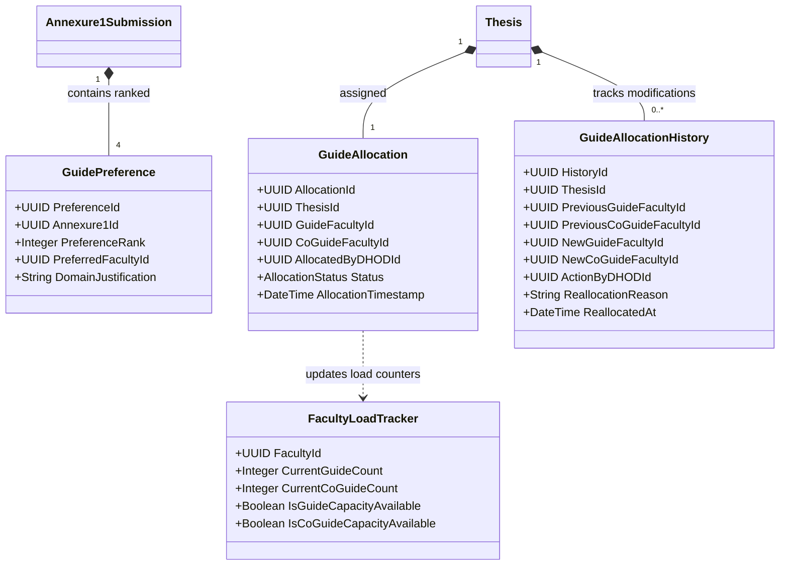

### Entity Specifications

#### 7.1 `GuidePreference`
- **Purpose:** Captures the student's four (4) ranked supervisor preferences in Annexure 1.
- **Key Concepts:** `PreferenceRank` (integers 1, 2, 3, 4), preferred faculty reference, domain alignment justification.
- **Invariants:** Exactly four (4) distinct faculty members from eligible department lists; duplicate faculty selections within a single submission are prohibited.

#### 7.2 `GuideAllocation`
- **Purpose:** Represents the authoritative assignment of primary Guide and Co-Guide to a dissertation.
- **Key Concepts:** Associated `Thesis`, assigned `GuideFacultyId`, assigned `CoGuideFacultyId`, allocating authority (`AllocatedByDHODId`), timestamp.
- **Locked Institutional Invariants:**
  1. **Sole Allocation Authority:** D.HOD is the sole allocating role in V1.
  2. **Exactly 1 Guide & Exactly 1 Co-Guide:** Both roles must be populated.
  3. **Distinct Supervisors:** $\text{GuideFacultyId} \neq \text{CoGuideFacultyId}$.
  4. **Hard Capacity Constraints:** $\text{ActiveGuideLoad(Guide)} \le 3$ and $\text{ActiveCoGuideLoad(CoGuide)} \le 3$.
  5. **Immediate Authority:** Allocation is authoritative upon D.HOD execution. There is **NO** faculty accept/decline workflow.

#### 7.3 `GuideAllocationHistory`
- **Purpose:** Maintains an immutable historical audit trail of all supervisor reallocations.
- **Key Concepts:** `ThesisId`, previous Guide/Co-Guide IDs, new Guide/Co-Guide IDs, acting D.HOD ID, mandatory justification text, timestamp.
- **Lifecycle:** Append-only; records are permanently retained for institutional compliance.

#### 7.4 `FacultyLoadTracker` (Derived Domain Aggregate)
- **Purpose:** Real-time computed capacity tracker enforcing supervisor load limits.
- **Key Concepts:** `CurrentGuideCount` ($0..3$), `CurrentCoGuideCount` ($0..3$), availability flags (`CurrentGuideCount < 3`, `CurrentCoGuideCount < 3`).

---

## 8. Meeting & Collaboration Domain (Annexure 4)

The Meeting and Collaboration Domain models supervisory interactions, digital logbooks, meeting minutes, and progress tracking.

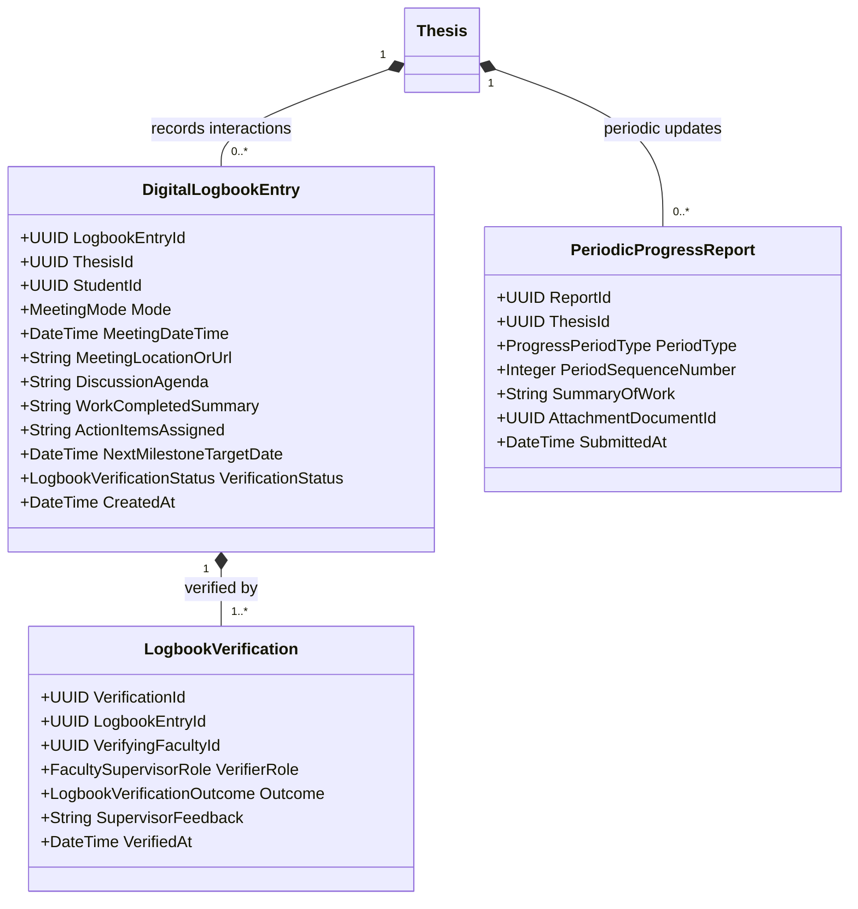

### Entity Specifications

#### 8.1 `DigitalLogbookEntry` (Annexure 4)
- **Purpose:** Represents a formal supervision interaction logged by the student.
- **Key Concepts:** Associated `Thesis`, `StudentId`, meeting interaction mode (`ONLINE` vs `OFFLINE`), meeting date/time, discussion agenda, work completed summary, supervisor action items, target completion date, verification status (`PENDING_VERIFICATION`, `VERIFIED`, `REVISION_REQUESTED`).
- **Mode Invariants:**
  - *Online Mode:* Captures external meeting link (e.g. Google Meet, MS Teams URL) and platform metadata.
  - *Offline Mode:* Captures physical room number / campus location details.
- **System Scope Limit:** The DMS stores meeting metadata and links only; it does **NOT** embed an internal video conferencing engine.

#### 8.2 `LogbookVerification`
- **Purpose:** Records supervisor review, sign-off, or return for revision of a logbook entry.
- **Key Concepts:** Associated `DigitalLogbookEntry`, verifying faculty reference (Guide or Co-Guide), outcome (`VERIFIED`, `RETURNED_FOR_CORRECTION`), supervisor feedback, timestamp.
- **Immutability Rule:** Once marked `VERIFIED`, the logbook entry becomes immutable.

#### 8.3 `PeriodicProgressReport`
- **Purpose:** Represents weekly and monthly candidate progress summaries submitted during research execution.
- **Key Concepts:** Associated `Thesis`, period type (`WEEKLY`, `MONTHLY`), period sequence index, progress summary, optional document attachment (slides, draft sections), submission timestamp.

---

## 9. Progress Review & Milestone Evaluation Domain (P1, P2, P3)

The Progress Review Domain models the milestone presentations (P1, P2, P3), evaluation scoring, and grade contribution rules.

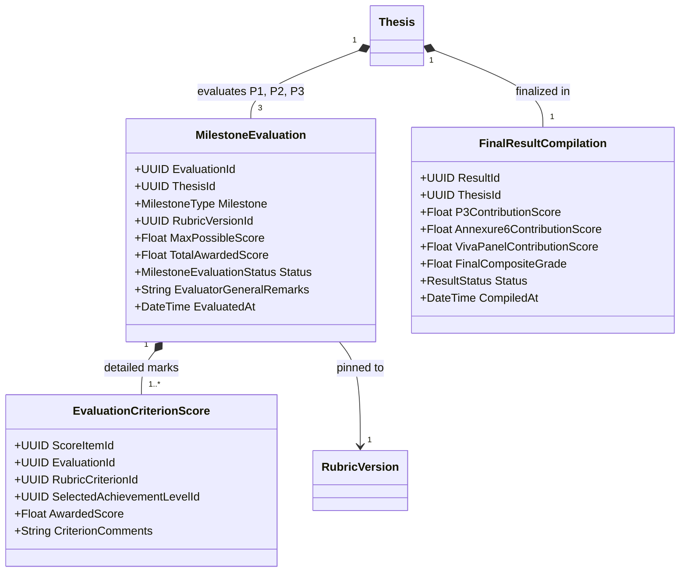

### Entity Specifications

#### 9.1 `MilestoneEvaluation`
- **Purpose:** Represents a formal milestone presentation assessment (P1, P2, or P3).
- **Key Concepts:** Associated `Thesis`, milestone type (`P1`, `P2`, `P3`), reference to active `RubricVersionId`, maximum score ($100$), total awarded score ($0..100$), evaluator feedback remarks, evaluation timestamp.
- **Locked Milestone Rules:**
  - $P1 = /100$ (Formative diagnostic review).
  - $P2 = /100$ (Formative mid-term review).
  - $P3 = /100$ (Pre-submission evaluative review).
  - **Contribution Invariant:** **ONLY P3 contributes directly to the final result calculation.** P1 and P2 scores are preserved as formative progress metrics.

#### 9.2 `EvaluationCriterionScore`
- **Purpose:** Captures individual criterion-level marks and selected performance tiers within an evaluation session.
- **Key Concepts:** Associated `MilestoneEvaluation`, `RubricCriterionId`, selected `RubricAchievementLevelId`, awarded score, evaluator remarks.

#### 9.3 `FinalResultCompilation`
- **Purpose:** Aggregates contributing milestone, supervisor, and viva scores into the final academic transcript record.
- **Key Concepts:** Associated `Thesis`, P3 contribution score, Annexure 6 supervisor score, final viva panel score, final composite score/grade, compilation timestamp.
- **Unresolved Policy Boundary:** Exact mathematical weighting formula combining P3, Annexure 6, and Viva panel scores is governed by `REQ-OD-002`.

---

## 10. Rubric Domain

The Rubric Domain models evaluation frameworks, dynamic 4-column criteria, and rubric versioning.

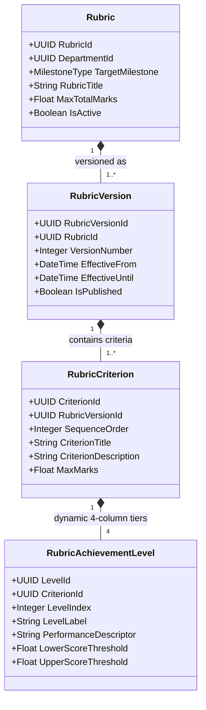

### Entity Specifications

#### 10.1 `Rubric`
- **Purpose:** Defines the evaluation structure for a specific presentation type (P1, P2, P3, Final Viva) within a department.
- **Key Concepts:** Associated `DepartmentId`, `TargetMilestone`, title, maximum total marks ($100$).

#### 10.2 `RubricVersion`
- **Purpose:** An immutable snapshot of a rubric active during a specific academic period.
- **Key Concepts:** Associated `Rubric`, sequential version number ($v1, v2, \dots$), validity timeframe (`EffectiveFrom`, `EffectiveUntil`), publication status.
- **Version Pinning Invariant:** Completed evaluations store a permanent foreign key reference to the exact `RubricVersionId` used. Creating a new rubric version does **NOT** modify or recalculate historical evaluations.

#### 10.3 `RubricCriterion` & `RubricAchievementLevel`
- **Purpose:** Models the dynamic 4-column evaluation matrix.
- **Key Concepts:**
  - *Criterion:* Row dimension with title, description, and maximum marks.
  - *Achievement Levels:* Exactly four (4) column tiers (e.g. Exemplary, Proficient, Developing, Unsatisfactory) with performance descriptors and score ranges.

---

## 11. Viva & Re-Viva Domain

The Viva Domain models the final oral defense, 2-member expert panel, defense outcomes, and failure re-evaluation cycles.

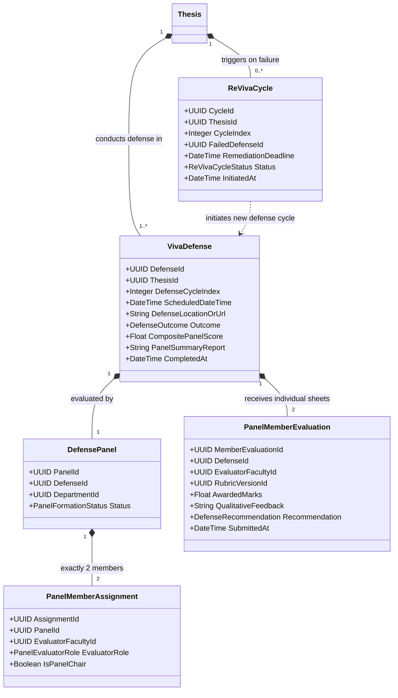

### Entity Specifications

#### 11.1 `VivaDefense`
- **Purpose:** Represents the final oral defense event.
- **Key Concepts:** Associated `Thesis`, `DefenseCycleIndex` (1 for initial defense, 2 for first re-viva), scheduled date/time, venue/meeting link, defense outcome (`PASSED`, `PASSED_WITH_MINOR_REVISIONS`, `MAJOR_REVISIONS_REQUIRED`, `FAILED`), composite score, summary report.

#### 11.2 `DefensePanel` & `PanelMemberAssignment`
- **Purpose:** Models the two-member (2-member) expert evaluation committee.
- **Key Concepts:** Panel reference, two assigned evaluators (`Internal Expert`, `External Expert`, `Inter-Department Expert`), panel chair designation.
- **Invariants:** Exactly two (2) members appointed per panel. Conflict-of-interest rules are governed by `REQ-OD-008`.

#### 11.3 `PanelMemberEvaluation`
- **Purpose:** Individual scoring sheet submitted independently by each panel member.
- **Key Concepts:** Evaluator faculty reference, active `RubricVersionId`, awarded marks, individual recommendations.

#### 11.4 `ReVivaCycle` (Viva Failure Remediation Architecture)
- **Purpose:** Structured remediation cycle instantiated when a student fails the defense (`FAILED` or `MAJOR_REVISIONS_REQUIRED`).
- **Locked Retry Architecture:**
  $$\text{Viva Attempt 1} \xrightarrow{\text{FAIL}} \text{New Revision Cycle} \xrightarrow{} \text{Revised Annexure 5} \xrightarrow{} \text{Supervisor Re-Review} \xrightarrow{} \text{Viva Attempt 2}$$
- **Identity Invariant:** The primary `ThesisId` **remains unchanged**.
- **Historical Preservation:** All scores, rubric sheets, and examiner remarks from Attempt 1 are preserved in the immutable audit record under `DefenseCycleIndex = 1`.

---

## 12. Document Domain

The Document Domain models file metadata, storage references, MIME verification, versioning, and document access policies.

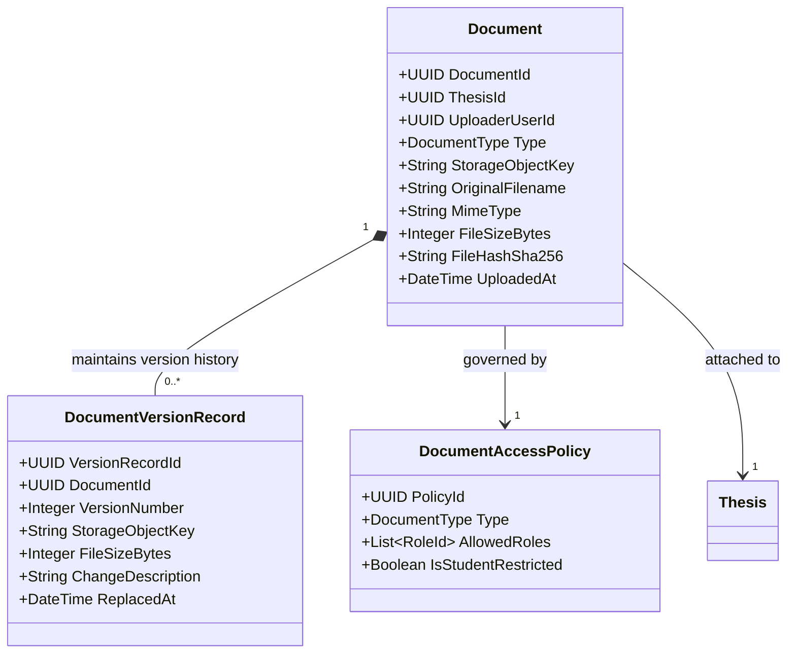

### Entity Specifications

#### 12.1 `Document`
- **Purpose:** Central metadata entity representing an uploaded physical file in object storage.
- **Key Concepts:** Unique UUID storage key, original filename, verified MIME type, file size in bytes, SHA-256 integrity hash, associated `ThesisId`, `DocumentType` (`PROPOSAL_ANNEXURE_1`, `TITLE_ANNEXURE_2`, `LOGBOOK_ATTACHMENT`, `PROGRESS_SLIDES`, `SIMILARITY_CERTIFICATE`, `FINAL_MANUSCRIPT_ANNEXURE_5`, `SUPERVISOR_EVALUATION_ANNEXURE_6`, `VIVA_PRESENTATION`).
- **Prototype Constraint:** `FileSizeBytes` $\le 5\text{ MB}$ ($5,242,880\text{ bytes}$).
- **Security Rule:** Stored under randomized UUID keys; server-side MIME verification and magic-byte inspection are mandatory.

#### 12.2 `DocumentVersionRecord`
- **Purpose:** Tracks sequential iterations of revised documents ($v1, v2, v3$).
- **Lifecycle:** Append-only; previous document files are never overwritten in object storage.

#### 12.3 `DocumentAccessPolicy`
- **Purpose:** Declares role-based visibility and access restrictions per document type.
- **Critical Policy:** Documents of type `SUPERVISOR_EVALUATION_ANNEXURE_6` have `IsStudentRestricted = true`.

---

## 13. Notification Domain

The Notification Domain models internal communication, alerts, and dispatch tracking triggered by academic workflow events.

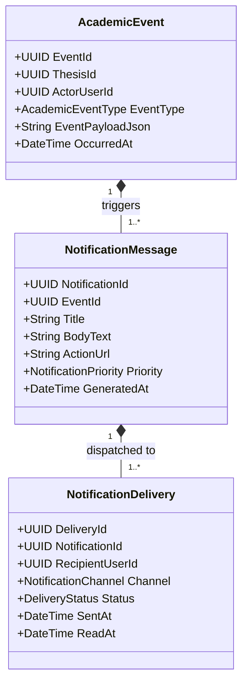

### Entity Specifications

#### 13.1 `AcademicEvent`
- **Purpose:** Represents an event occurring in the dissertation lifecycle (e.g., `ANNEXURE_1_SUBMITTED`, `DCEC_SCREENING_APPROVED`, `SUPERVISORS_ALLOCATED`, `LOGBOOK_RETURNED_FOR_REVISION`, `P1_SCHEDULED`, `VIVA_FAILED`).
- **Key Concepts:** Event type, triggering actor, affected `ThesisId`, event payload context, timestamp.

#### 13.2 `NotificationMessage` & `NotificationDelivery`
- **Purpose:** Represents rendered alerts and per-recipient delivery states.
- **Key Concepts:** Recipient user reference, delivery channel (`IN_APP`, `EMAIL`), delivery status (`PENDING`, `SENT`, `READ`, `FAILED`), read timestamp.
- **Scope Limit:** External email/SMS gateways represent delivery adapters; provider selection is uncoupled from the domain core.

---

## 14. Audit Domain

The Audit Domain models comprehensive, immutable, write-once compliance logging across all critical academic and administrative actions.

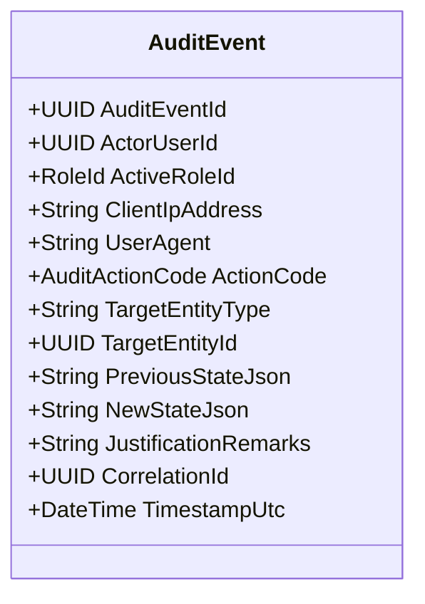

### Entity Specifications

#### 14.1 `AuditEvent`
- **Purpose:** Immutable compliance event recording all state changes, evaluations, supervisor allocations, delegations, and access attempts.
- **Key Concepts:**
  - `ActorUserId` & `ActiveRoleId`: Who executed the action and under what role context.
  - `ClientIpAddress` & `UserAgent`: Network and client provenance.
  - `ActionCode`: Explicit operational code (e.g. `ANNEXURE_1_SCREENING_APPROVE`, `GUIDE_ALLOCATED`, `P3_EVALUATION_SUBMITTED`, `VIVA_FAILED`).
  - `TargetEntityType` & `TargetEntityId`: The affected business entity.
  - `PreviousStateJson` & `NewStateJson`: State change delta.
  - `JustificationRemarks`: Mandatory or optional explanation text.
  - `CorrelationId`: Request tracing ID linking multi-step operations.
  - `TimestampUtc`: ISO-8601 UTC timestamp with millisecond precision.
- **Immutability Invariant:** **Write-once, append-only.** No user, faculty, or system administrator possesses privileges to edit, delete, or truncate audit records.

---

## 15. System Configuration Domain

The System Configuration Domain models controlled runtime parameters and policy thresholds.

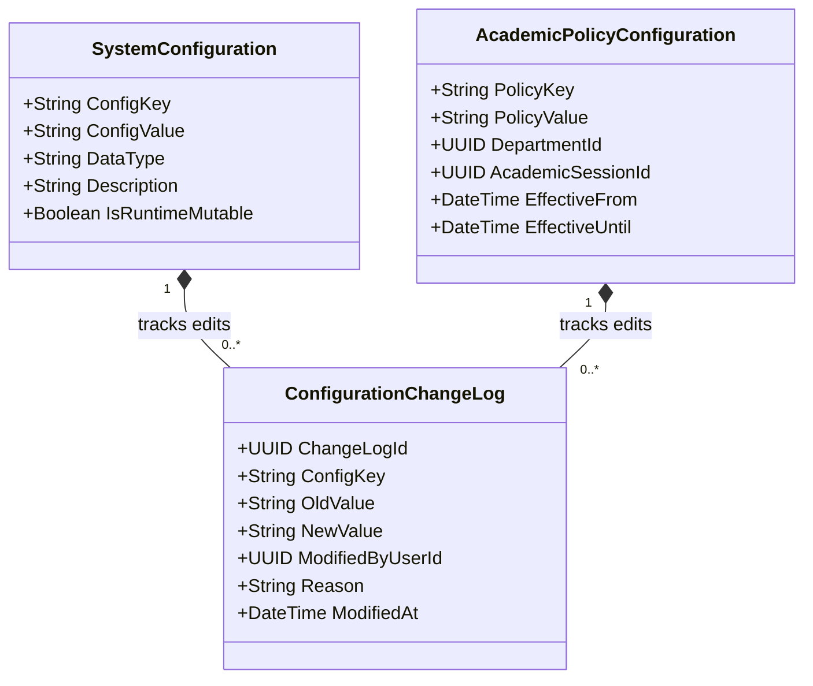

### Key Configuration Parameters

| Configuration Parameter | Purpose | Domain Default | Authority Classification |
| :--- | :--- | :--- | :--- |
| `MAX_GUIDE_LOAD` | Maximum concurrent dissertations as primary Guide | `3` | `LOCKED` |
| `MAX_CO_GUIDE_LOAD` | Maximum concurrent dissertations as Co-Guide | `3` | `LOCKED` |
| `P3_CONTRIBUTION_ONLY` | Enforces that only P3 contributes to final milestone grade | `true` | `LOCKED` |
| `PLAGIARISM_BENCHMARK_PERCENT` | Maximum permissible plagiarism similarity | `10.0%` | `LOCKED` |
| `AI_CONTENT_BENCHMARK_PERCENT` | Maximum permissible AI-generated content similarity | `0.0%` | `LOCKED` |
| `PROTOTYPE_MAX_FILE_SIZE_BYTES` | Maximum upload file size for prototype | `5242880` (5 MB) | `LOCKED` (Prototype) |
| `PROTOTYPE_RETENTION_DAYS` | Rolling data retention window for prototype | `365` (1 Year) | `LOCKED` (Prototype) |
| `ALLOW_GUIDE_ON_DEFENSE_PANEL` | Permits primary Guide to serve on defense panel | `false` | `OPEN` (`REQ-OD-008`) |
| `FINAL_RESULT_CALCULATION_FORMULA`| Formula combining P3, Annexure 6, and Viva | `[UNRESOLVED]` | `OPEN` (`REQ-OD-002`) |

---

## 16. Comprehensive Relationship Catalog

| Source Entity | Relationship | Target Entity | Cardinality | Ownership & Lifecycle Invariant | Historical Preservation |
| :--- | :--- | :--- | :---: | :--- | :---: |
| `User` | specializes as | `StudentProfile` | $1 \rightarrow 0..1$ | User owns profile; deleted only on user purge | Yes (Audit) |
| `User` | specializes as | `FacultyProfile` | $1 \rightarrow 0..1$ | User owns profile; pre-seeded master data | Yes (Audit) |
| `User` | possesses | `UserRoleAssignment` | $1 \rightarrow 1..*$ | User owns assignments; revocable | Yes (Audit Log) |
| `StudentProfile` | registers | `Thesis` | $1 \rightarrow 1$ | Exactly 1 active Thesis per enrolled student | Yes (Permanent) |
| `Thesis` | owns | `ThesisTitle` | $1 \rightarrow 1$ | Owned by Thesis aggregate; approved via DCEC | Yes (Permanent) |
| `Thesis` | iterates | `ThesisVersion` | $1 \rightarrow 0..*$ | Append-only document iterations | Yes (Immutable) |
| `Thesis` | submits | `Annexure1Submission`| $1 \rightarrow 1$ | Proposal submission; editable only before DC verification | Yes (Permanent) |
| `Annexure1Submission` | contains ranked | `GuidePreference` | $1 \rightarrow 4$ | Exactly 4 distinct preferences; locked on submission | Yes (Permanent) |
| `Thesis` | assigned | `GuideAllocation` | $1 \rightarrow 1$ | Allocated by D.HOD; 1 Guide + 1 Co-Guide | Yes (Allocation History) |
| `Thesis` | tracks reallocations | `GuideAllocationHistory`| $1 \rightarrow 0..*$ | Append-only reallocation history | Yes (Permanent) |
| `Thesis` | submits | `Annexure2Submission`| $1 \rightarrow 1$ | Formal title approval; endorsed by supervisors | Yes (Permanent) |
| `Annexure2Submission` | signed by | `SupervisorEndorsement`| $1 \rightarrow 2$ | Exactly 2 endorsements (Guide & Co-Guide) | Yes (Permanent) |
| `Thesis` | records | `DigitalLogbookEntry` | $1 \rightarrow 0..*$ | Annexure 4 logs; verified by supervisor | Yes (Permanent) |
| `DigitalLogbookEntry` | verified by | `LogbookVerification`| $1 \rightarrow 1..*$ | Supervisor review records | Yes (Permanent) |
| `Thesis` | presents | `MilestoneEvaluation`| $1 \rightarrow 3$ | Exactly 3 milestone presentations (P1, P2, P3) | Yes (Permanent) |
| `MilestoneEvaluation` | pinned to | `RubricVersion` | $0..* \rightarrow 1$ | Foreign key link to active rubric version | Yes (Immutable) |
| `MilestoneEvaluation` | broken down into | `EvaluationCriterionScore`| $1 \rightarrow 1..*$ | Detailed marks per criterion | Yes (Permanent) |
| `Thesis` | submits | `Annexure5Submission`| $1 \rightarrow 1$ | Final manuscript package; endorsed by supervisors | Yes (Permanent) |
| `Annexure5Submission` | signed by | `SupervisorEndorsement`| $1 \rightarrow 2$ | Exactly 2 endorsements (Guide & Co-Guide) | Yes (Permanent) |
| `Thesis` | evaluated confidentially | `Annexure6Evaluation`| $1 \rightarrow 1$ | Primary Guide evaluation; **Student view blocked** | Yes (Permanent) |
| `Thesis` | conducts | `VivaDefense` | $1 \rightarrow 1..*$ | 1 per defense attempt (Cycle 1, Cycle 2) | Yes (Permanent) |
| `VivaDefense` | evaluated by | `DefensePanel` | $1 \rightarrow 1$ | 2-member expert committee | Yes (Permanent) |
| `DefensePanel` | composed of | `PanelMemberAssignment`| $1 \rightarrow 2$ | Exactly 2 expert evaluators | Yes (Permanent) |
| `VivaDefense` | receives | `PanelMemberEvaluation`| $1 \rightarrow 2$ | Independent score sheets from panel members | Yes (Permanent) |
| `Thesis` | triggers on failure | `ReVivaCycle` | $1 \rightarrow 0..*$ | Remediation cycle; **Thesis ID unchanged** | Yes (Permanent) |
| `Thesis` | finalizes in | `FinalResultCompilation`| $1 \rightarrow 1$ | Composite result compile | Yes (Permanent) |
| `Thesis` | attaches | `Document` | $1 \rightarrow 1..*$ | Physical files in object storage | Yes (Permanent) |
| `Document` | maintains history | `DocumentVersionRecord`| $1 \rightarrow 0..*$ | Sequential file versions ($v1, v2, v3$) | Yes (Permanent) |
| `AcademicEvent` | dispatches | `NotificationMessage`| $1 \rightarrow 1..*$ | Generated alerts | Yes (Audit) |
| `AuditEvent` | records state changes | `Thesis` / Any Entity | $0..* \rightarrow 1$ | Immutable compliance log | Yes (Append-Only) |

---

## 17. Entity Lifecycle & Mutability Catalog

| Domain Entity | Mutability Classification | Deletion Policy | State Machine Control | Invariant / Governance Rule |
| :--- | :--- | :--- | :--- | :--- |
| `User` | Mutable Profile | Soft-Deletable | Managed by Admin | Pre-seeded faculty; SSO-authenticated students. |
| `StudentProfile` | Mutable Academic Status | Never Deletable | Linked to Enrollment | Unique Roll & Enrollment numbers. |
| `FacultyProfile` | Mutable Load & Domains | Never Deletable | System Managed | Enforces $\text{GuideLoad} \le 3$, $\text{CoGuideLoad} \le 3$. |
| `Thesis` | State-Controlled | Never Deletable | 14-Phase State Machine | **Thesis ID is strictly immutable across all cycles.** |
| `ThesisTitle` | Editable until Ann 2 Approval | Never Deletable | Approved by DCEC | Case-insensitive uniqueness check in active cohort. |
| `Annexure1Submission` | Locked on Submission | Never Deletable | DCEC Screening Queue | Editable only when returned for revision. |
| `GuidePreference` | Locked on Submission | Never Deletable | Bound to Annexure 1 | Exactly 4 distinct ranked preferences. |
| `GuideAllocation` | Mutable by D.HOD | Never Deletable | D.HOD Workflow | Sole authority: D.HOD; $\text{Guide} \neq \text{Co-Guide}$. |
| `GuideAllocationHistory` | Append-Only | Never Deletable | None (Audit Log) | Immutable historical record of previous supervisors. |
| `Annexure2Submission` | Locked on Endorsement | Never Deletable | DCEC Title Approval | Requires Guide + Co-Guide endorsements. |
| `DigitalLogbookEntry` | Locked on Verification | Never Deletable | Supervisor Review | Verified entries cannot be altered. |
| `MilestoneEvaluation` | Immutable on Submission | Never Deletable | Presentation Schedule | $P1=/100, P2=/100, P3=/100$; Only P3 counts. |
| `RubricVersion` | Immutable on Publication | Never Deletable | Publication Workflow | Pinned to evaluations; cannot be retroactively modified. |
| `Annexure5Submission` | Locked on Endorsement | Never Deletable | Supervisor Review | $<10\%$ Plagiarism, $0\%$ AI similarity certified. |
| `Annexure6Evaluation` | Immutable on Submission | Never Deletable | Supervisor Workflow | **Student access permanently denied.** |
| `VivaDefense` | Immutable on Panel Sign-Off| Never Deletable | Defense Workflow | Panel marks combined into composite outcome. |
| `ReVivaCycle` | State-Controlled | Never Deletable | Remediation Workflow | Preserves Attempt 1 history under same `ThesisId`. |
| `FinalResultCompilation` | Immutable on HOD Sign-Off | Never Deletable | Archival Workflow | Final academic transcript record. |
| `Document` | Metadata Mutable / File Immutable | Never Deletable | Storage Workflow | Prototype max size: 5 MB. |
| `AuditEvent` | Strictly Append-Only | **NEVER DELETABLE** | Write-Once | Tamper-proof compliance log. |

---

## 18. Historical Data Preservation Principles

The DMS domain model enforces that every academically significant event leaves an indelible, reconstructable historical footprint:

1. **Supervisor Allocation History:** When D.HOD reallocates a Guide or Co-Guide, the active `GuideAllocation` is updated, and an immutable `GuideAllocationHistory` record is written capturing previous supervisors, new supervisors, acting D.HOD, timestamp, and mandatory justification.
2. **Evaluation-to-Rubric Version Preservation:** Every `MilestoneEvaluation` and `PanelMemberEvaluation` permanently preserves a foreign key link to the active `RubricVersionId`. Historical assessments remain evaluated against the exact criteria active on that date.
3. **Viva Failure & Multi-Cycle History:** When a candidate fails Attempt 1, a `ReVivaCycle` is spawned with `DefenseCycleIndex = 2`. The original `VivaDefense` record (Attempt 1), individual examiner sheets, rubric scores, and panel remarks remain fully preserved and queryable by authorized reviewers.
4. **Document Revision Versioning:** Uploaded files replaced during revision cycles generate sequential `DocumentVersionRecord` entries ($v1, v2, v3$). Historical files in object storage are never deleted.
5. **Administrative Delegation History:** DCEC Chair delegation grants from HOD to D.HOD are recorded in `DCECDelegation` records, ensuring every screening decision can be traced to the exact acting authority active on that timestamp.

---

## 19. Open Domain Questions (Unresolved Boundaries)

In strict accordance with the Anti-Hallucination Rule, the following domain boundaries are marked as unresolved:

| Open Decision ID | Domain Area | Unresolved Question / Policy Gap | Status |
| :--- | :--- | :--- | :--- |
| `REQ-OD-001` | DCEC Domain | Formal DCEC quorum minimum threshold and collective voting rules. | `OPEN` |
| `REQ-OD-002` | Result Domain | Exact mathematical weighting formula combining P3, Annexure 6, and Viva. | `OPEN` |
| `REQ-OD-003` | Viva Domain | Formal institutional re-viva attempt limits, semester extension rules, and fees. | `OPEN` |
| `REQ-OD-004` | Annexure Domain | Co-Guide rights on Annexure 6 (separate submission vs co-sign vs view-only). | `OPEN` |
| `REQ-OD-005` | Thesis Domain | Production scope of title uniqueness (cross-cohort, cross-department, historical catalog). | `OPEN` |
| `REQ-OD-006` | Storage Domain | Production document retention duration post-graduation. | `OPEN` |
| `REQ-OD-007` | Storage Domain | Production document file size limits and departmental storage quotas. | `OPEN` |
| `REQ-OD-008` | Panel Domain | Panel member selection criteria and conflict-of-interest rules (Guide on panel). | `OPEN` |
| `REQ-OD-009` | Identity Domain | Production institutional SSO integration protocol (SAML 2.0 / OAuth2 / CAS). | `OPEN` |
| `REQ-OD-010` | ERP Domain | Production campus ERP synchronization protocol and data schema. | `OPEN` |
| `REQ-OD-011` | Infrastructure | Production hosting topology and compliance boundaries. | `OPEN` |
| `REQ-OD-012` | Disaster Recovery | Production target RPO and RTO SLAs. | `OPEN` |
| `REQ-OD-013` | Notification | Official institutional SMTP gateway endpoints and credentials. | `OPEN` |

---

## 20. Future Domain Concepts (Slated for Post-V1)

The following domain concepts are formally acknowledged in the roadmap but **strictly excluded from Version 1**:

1. **`FUT-AI-MATCHING` (AI-Assisted Guide Matching):** Machine learning recommendation engine computing vector semantic similarity between student proposals and faculty publication corpora.
2. **`FUT-AUTO-ALLOCATION` (Automated Optimization Solver):** Multi-variable constraint satisfaction engine automatically assigning supervisors based on preferences and capacity.
3. **`FUT-PLAGIARISM-API` (Live Turnitin/DrillBit Dispatcher):** Automated programmatic webhook integration dispatching manuscripts and polling similarity scores.
4. **`FUT-LATEX-VALIDATOR` (Automated LaTeX & Format Validator):** In-browser compilation pipeline validating dissertation typography against NIET thesis guidelines.
5. **`FUT-ERP-SYNC` (Bi-Directional ERP Connector):** Automated background synchronization daemon syncing student enrollment and graduation status with campus ERP.

---

## 21. Domain Model Diagrams

### 21.1 High-Level Domain Context Diagram

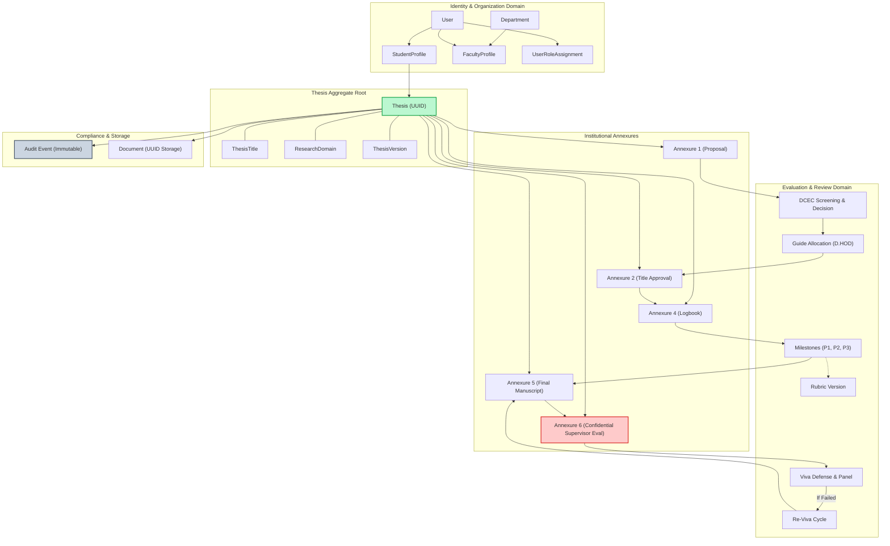

### 21.2 Thesis Lifecycle Domain State Machine

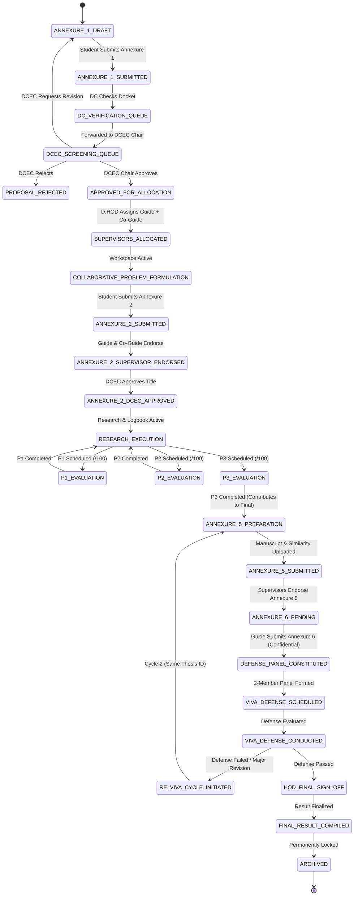

### 21.3 DCEC Domain Relationship Diagram

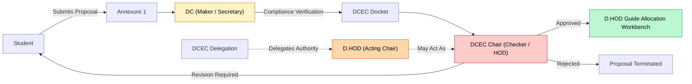

### 21.4 Guide Allocation Domain Diagram

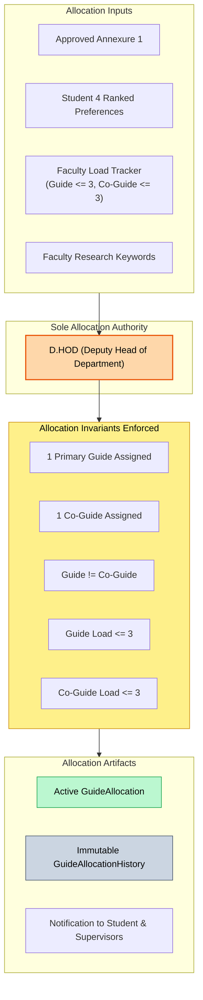

### 21.5 Progress, Dynamic Rubric, and Viva Relationship Diagram

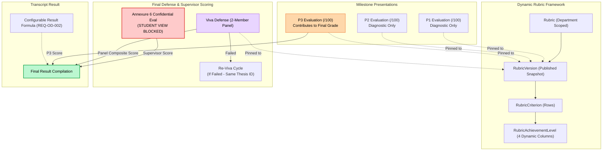

---

## 22. Domain-to-Requirement Traceability

The following matrix maps every domain entity and aggregate root to its governing requirement from [`docs/01_REQUIREMENTS.md`](file:///c:/Users/user/Desktop/niet-dissertation-management-system/docs/01_REQUIREMENTS.md):

| Domain Entity / Aggregate | Domain Module | Governing Requirement IDs | Traceability Notes |
| :--- | :--- | :--- | :--- |
| `User` | Identity | `REQ-AUTH-001`, `REQ-AUTH-002`, `REQ-AUTH-003` | Pre-seeded faculty, SSO student identity |
| `Role` | Identity | `REQ-ROLES-001`, `REQ-ROLES-002` | 10 discrete institutional roles |
| `Permission` | Authorization | `REQ-AUTHZ-001`, `REQ-AUTHZ-002` | Atomic RBAC capabilities |
| `UserRoleAssignment` | Authorization | `REQ-ROLES-001`, `REQ-AUTHZ-001` | Multi-role context and delegation scope |
| `StudentProfile` | Identity | `REQ-ORG-001`, `REQ-AUTH-001` | Student candidate registration |
| `FacultyProfile` | Identity | `REQ-ALLOC-004`, `REQ-ALLOC-005` | Supervisor capacity and domain expertise |
| `Department` | Organization | `REQ-ORG-001`, `REQ-ORG-002`, `REQ-AUTHZ-003` | Multi-department hierarchy & tenant isolation |
| `AcademicSession` | Organization | `REQ-ORG-001` | Academic year and cohort temporal scope |
| `Thesis` (Aggregate Root) | Thesis | `REQ-WF-001`, `REQ-WF-002`, `REQ-VIVA-004` | Central dissertation entity; immutable ID |
| `ThesisTitle` | Thesis | `REQ-ANN1-002`, `REQ-ANN2-001` | Title proposal, approval & uniqueness |
| `ResearchDomain` | Thesis | `REQ-ANN1-001`, `REQ-ALLOC-008` | Research taxonomy & keyword classification |
| `ThesisVersion` | Thesis | `REQ-DOC-005` | Sequential manuscript versioning |
| `Annexure1Submission` | Annexure | `REQ-ANN1-001`, `REQ-ANN-SPEC-001` | Title proposal & 4 ranked preferences |
| `Annexure2Submission` | Annexure | `REQ-ANN2-001`, `REQ-ANN2-002`, `REQ-ANN-SPEC-002` | Formal topic approval docket |
| `Annexure5Submission` | Annexure | `REQ-ANN5-001`, `REQ-ANN5-002`, `REQ-ANN-SPEC-004` | Final manuscript & similarity certificate |
| `Annexure6Evaluation` | Annexure | `REQ-ANN6-001`, `REQ-ANN6-002`, `REQ-ANN-SPEC-005` | Confidential supervisor evaluation (Student blocked) |
| `SupervisorEndorsement`| Annexure | `REQ-ANN2-002`, `REQ-ANN5-004` | Guide and Co-Guide electronic sign-off |
| `DCECDocket` | DCEC | `REQ-DCEC-001`, `REQ-DCEC-MGT-001`, `REQ-DCEC-MGT-002` | DC Maker verification packet |
| `DCECDecision` | DCEC | `REQ-DCEC-002`, `REQ-DCEC-003`, `REQ-DCEC-MGT-003` | DCEC Chair approval decision |
| `DCECDelegation` | DCEC | `REQ-DCEC-003`, `REQ-DCEC-MGT-004` | HOD to D.HOD delegation authority |
| `GuidePreference` | Allocation | `REQ-ANN1-001`, `REQ-ALLOC-008` | 4 ranked supervisor choices |
| `GuideAllocation` | Allocation | `REQ-ALLOC-001`..`007`, `REQ-ALLOC-SPEC-001`..`003` | D.HOD manual assignment (Load $\le 3$) |
| `GuideAllocationHistory`| Allocation | `REQ-ALLOC-009`, `REQ-ALLOC-SPEC-004` | Immutable reallocation history |
| `DigitalLogbookEntry` | Logbook | `REQ-ANN4-001`..`005`, `REQ-ANN-SPEC-003` | Annexure 4 online/offline meeting logs |
| `LogbookVerification` | Logbook | `REQ-ANN4-005` | Supervisor review of meeting entries |
| `PeriodicProgressReport`| Progress | `REQ-PROG-001`, `REQ-PROG-002` | Weekly / monthly progress submissions |
| `MilestoneEvaluation` | Evaluation | `REQ-EVAL-001`..`005`, `REQ-EVAL-P1-001`..`P3-002` | P1, P2, P3 presentations (/100; only P3 counts) |
| `EvaluationCriterionScore`| Evaluation | `REQ-EVAL-006` | Criterion-level scored breakdown |
| `FinalResultCompilation`| Evaluation | `REQ-EVAL-008`, `REQ-ARCH-002` | Final academic grade calculation |
| `Rubric` | Rubric | `REQ-RUB-001`, `REQ-RUB-002` | Dynamic evaluation rubric structure |
| `RubricVersion` | Rubric | `REQ-EVAL-007`, `REQ-RUB-003` | Immutable version snapshot & pinning |
| `RubricCriterion` | Rubric | `REQ-RUB-001` | Rubric row dimension |
| `RubricAchievementLevel`| Rubric | `REQ-RUB-001` | Dynamic 4-column tier descriptor |
| `VivaDefense` | Viva | `REQ-VIVA-001`, `REQ-VIVA-DEF-001`, `REQ-VIVA-DEF-002`| Final oral defense event |
| `DefensePanel` | Viva | `REQ-PANEL-001`, `REQ-VIVA-DEF-001` | 2-member expert evaluation panel |
| `PanelMemberAssignment`| Viva | `REQ-PANEL-001`, `REQ-PANEL-002` | Expert member panel appointment |
| `PanelMemberEvaluation`| Viva | `REQ-VIVA-001`, `REQ-VIVA-DEF-001` | Independent panel member score sheet |
| `ReVivaCycle` | Viva | `REQ-VIVA-003`, `REQ-VIVA-004`, `REQ-VIVA-DEF-002`..`004`| Defense failure retry cycle (Same Thesis ID) |
| `Document` | Document | `REQ-FILE-001`, `REQ-FILE-002`, `REQ-FILE-003` | UUID object storage entity (Prototype $\le 5$ MB) |
| `DocumentVersionRecord`| Document | `REQ-FILE-005` | Sequential file iterations ($v1, v2, v3$) |
| `DocumentAccessPolicy` | Document | `REQ-ANN6-002`, `REQ-NFR-SEC-002` | Confidential document access isolation |
| `AcademicEvent` | Notification | `REQ-NOTIF-001` | Domain event trigger |
| `NotificationMessage` | Notification | `REQ-NOTIF-001`, `REQ-NOTIF-002` | Alert message payload |
| `NotificationDelivery` | Notification | `REQ-NOTIF-001`, `REQ-NOTIF-002` | Per-user delivery and read tracking |
| `AuditEvent` | Audit | `REQ-AUD-001`, `REQ-AUD-002`, `REQ-AUD-003` | Tamper-proof append-only compliance log |
| `SystemConfiguration` | Configuration | `REQ-PROTO-001`, `REQ-PROTO-002` | Runtime configuration and policy parameters |

---

## 23. Anti-Hallucination & Governance Verification

This domain specification has undergone strict verification against all project governance rules:

- [x] **No Application Code Written:** Confirmed zero source code files created.
- [x] **No Database Schema or SQL Created:** Confirmed domain concepts are purely logical; no SQL types or table DDL created.
- [x] **No APIs or UI Components Created:** Confirmed zero endpoints or UI components generated.
- [x] **No Unapproved Academic Policies Invented:** All locked institutional rules are faithfully preserved.
- [x] **All Open Decisions Preserved as Open:** All 13 open decisions from [`docs/01_REQUIREMENTS.md`](file:///c:/Users/user/Desktop/niet-dissertation-management-system/docs/01_REQUIREMENTS.md) remain explicitly unresolved.
- [x] **All Future Concepts Excluded from V1:** AI matching, automated allocation, direct ERP sync, live Turnitin API, and LaTeX validator are formally categorized as `FUTURE`.
- [x] **Single File Scope Respected:** ONLY [`docs/03_DOMAIN_MODEL.md`](file:///c:/Users/user/Desktop/niet-dissertation-management-system/docs/03_DOMAIN_MODEL.md) was modified.
