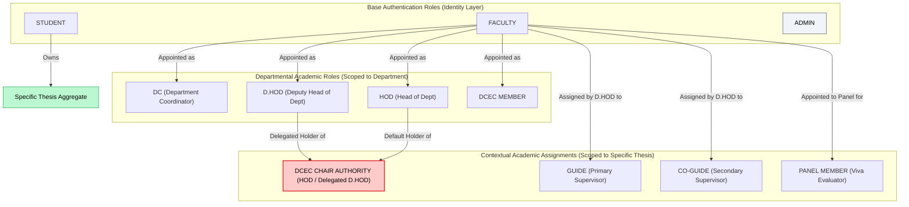
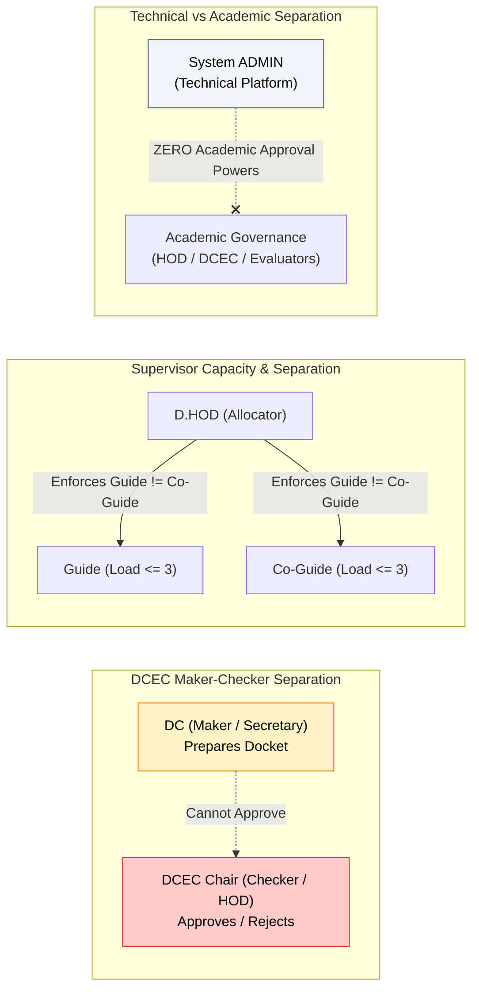
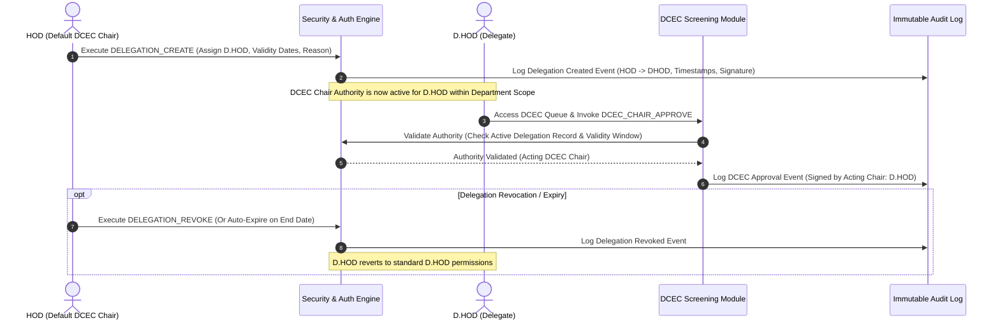
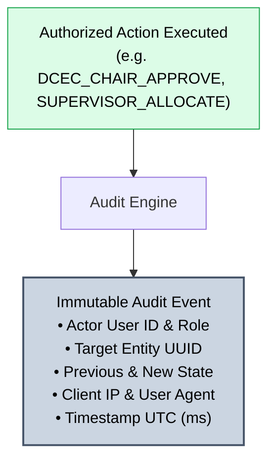
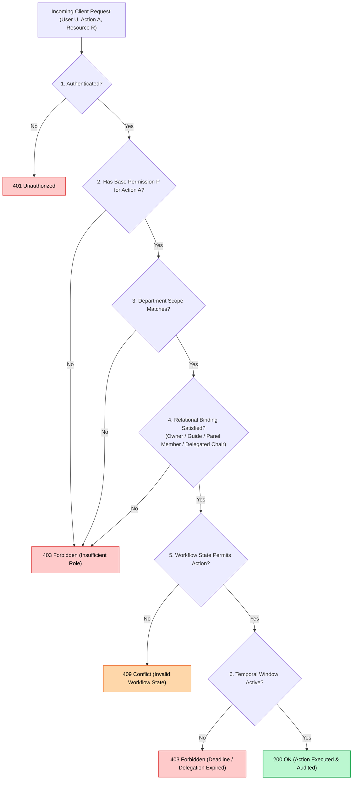

# NIET Dissertation Management System — RBAC & Permission Architecture

**Document ID:** `DOC-04-RBAC`  
**File Path:** [`docs/04_RBAC_MATRIX.md`](file:///c:/Users/user/Desktop/niet-dissertation-management-system/docs/04_RBAC_MATRIX.md)  
**Document Status:** ARCHITECTURE FREEZE BASELINE (PHASE 2C)  
**Last Revised:** 2026-08-15  
**Governing Baselines:** [`docs/00_PROJECT_MASTER.md`](file:///c:/Users/user/Desktop/niet-dissertation-management-system/docs/00_PROJECT_MASTER.md), [`docs/01_REQUIREMENTS.md`](file:///c:/Users/user/Desktop/niet-dissertation-management-system/docs/01_REQUIREMENTS.md), and [`docs/03_DOMAIN_MODEL.md`](file:///c:/Users/user/Desktop/niet-dissertation-management-system/docs/03_DOMAIN_MODEL.md)  
**Institution:** Noida Institute of Engineering & Technology (NIET), Greater Noida  
**Target Program:** M.Tech / M.Tech Integrated Dissertation Lifecycle  

---

## 1. Document Purpose & Authorization Model Overview

This document formally specifies the **Role-Based Access Control (RBAC) and Contextual Permission Architecture** for the NIET Dissertation Management System (DMS). It establishes the definitive inventory of system roles, atomic capabilities, contextual access invariants, separation-of-duty constraints, and negative security boundaries.

### Multi-Layered Authorization Paradigm

The DMS authorization model rejects naive, single-variable role checks (`if (user.role == 'GUIDE')`). Instead, access is evaluated through a strict multi-layered predicate combining identity, institutional role, organizational tenancy, thesis relationship, active delegation, and workflow state:

$$\text{Authorized}(U, P, R) = \text{HasRole}(U, P) \land \text{ScopeValid}(U, R) \land \text{RelationshipBound}(U, R) \land \text{StatePermits}(R, P) \land \text{TemporalActive}(U, R)$$

```
┌────────────────────────────────────────────────────────────────────────────────────────┐
│                               CONTEXTUAL AUTHORIZATION PIPELINE                        │
├────────────────────────────────────────────────────────────────────────────────────────┤
│ 1. Identity & Base Role     : Authenticated User possesses base permission P           │
│ 2. Organizational Tenancy   : User's Department matches Resource's Department Scope    │
│ 3. Relational Binding       : User is the Guide / Co-Guide / Panel Member of record   │
│ 4. Delegation Authority     : User holds an active, unexpired delegation assignment    │
│ 5. Workflow State Guard     : Target entity is in the exact required lifecycle state   │
│ 6. Temporal Window Guard    : Action occurs within the active academic deadline window │
└────────────────────────────────────────────────────────────────────────────────────────┘
```

> [!IMPORTANT]
> **CRITICAL ARCHITECTURAL SEPARATION:**  
> Technical System Administration (`ADMIN`) privileges are **strictly technical** and must never confer academic approval, evaluation, supervisor allocation, or grade submission authority. Academic authority (`DCEC_CHAIR_APPROVE`) requires verified academic standing or formal institutional delegation.

---

## 2. System Role Model: Base Roles vs. Contextual Academic Assignments

The system models participants through two distinct layers: **Base Authentication Roles** and **Contextual Academic Assignments**.



### Distinction Summary

1. **Base Role:** Determines fundamental platform entry (e.g. Student portal vs. Faculty portal vs. Technical Admin console).
2. **Departmental Role:** Confers departmental operational responsibilities (e.g., DC prepares dockets; D.HOD allocates supervisors; HOD reviews department progress).
3. **Contextual Thesis Assignment:** Dynamically binds permissions to a specific thesis record (e.g., a faculty member is a Guide for Thesis A, a Co-Guide for Thesis B, a Viva Panel Member for Thesis C, and has zero supervisory access to Thesis D).

---

## 3. Granular Role Definitions & Authority Boundaries

```
                                  SYSTEM ROLE INVENTORY
┌──────────────────┬──────────────────────┬──────────────────────────────────────────────┐
│ Role Identifier  │ Role Title           │ Primary Scope & System Function              │
├──────────────────┼──────────────────────┼──────────────────────────────────────────────┤
│ ROLE_STUDENT     │ Student Candidate    │ Enrolled M.Tech candidate; submits annexures │
│ ROLE_FACULTY     │ Base Faculty         │ Base teaching/research staff namespace       │
│ ROLE_GUIDE       │ Primary Guide        │ Primary supervisor of record for Thesis T    │
│ ROLE_CO_GUIDE    │ Co-Guide             │ Secondary supervisor of record for Thesis T  │
│ ROLE_DC          │ Department Coord.    │ Maker/Secretary for DCEC screening & dockets │
│ ROLE_DHOD        │ Deputy Head of Dept  │ Sole Guide/Co-Guide allocation authority (V1)│
│ ROLE_HOD         │ Head of Department   │ Academic head; default DCEC Chair (Checker)  │
│ ROLE_DCEC_MEMBER │ DCEC Member          │ Committee reviewer for departmental dockets  │
│ ROLE_DCEC_CHAIR  │ DCEC Chair Authority │ Approval authority (HOD or delegated D.HOD)  │
│ ROLE_PANEL_MEMBER│ Expert Panel Member  │ 2-member viva oral defense evaluator         │
│ ROLE_ADMIN       │ System Administrator │ Technical operations, user provisioning      │
└──────────────────┴──────────────────────┴──────────────────────────────────────────────┘
```

### 3.1 `ROLE_STUDENT` (Candidate)
- **Purpose:** Candidate enrolled in M.Tech dissertation.
- **Authority Level:** Individual student scope only.
- **Normal Responsibilities:** Submits Annexure 1 (proposal with 4 ranked preferences), Annexure 2 (title approval), Annexure 4 (digital logbook entries), weekly/monthly progress reports, Annexure 5 (final dissertation package with Turnitin certificate), presents milestone defenses (P1, P2, P3, Viva).
- **Accessible Resources:** Own student profile, own thesis aggregate, own submitted annexures, own uploaded documents, own received notifications.
- **Explicit Denials:** **PERMANENTLY DENIED access to Annexure 6 (Confidential Supervisor Evaluation).** Denied access to other students' theses, supervisor allocation workbench, rubric administration, DCEC screening queues, audit logs, and configuration.

### 3.2 `ROLE_FACULTY` (Base Faculty Member)
- **Purpose:** Base identity for all academic teaching and research personnel.
- **Authority Level:** Baseline institutional academic standing.
- **Normal Responsibilities:** Maintains faculty profile (research keywords, specializations), views department notices. Does not confer automatic access to any student's thesis unless a specific assignment exists.

### 3.3 `ROLE_GUIDE` (Primary Supervisor of Record)
- **Purpose:** Primary faculty mentor and academic supervisor for a specific candidate.
- **Authority Level:** Contextual authority over assigned thesis records where $\text{GuideFacultyId} = \text{CurrentUserId}$.
- **Normal Responsibilities:** Collaborates on problem formulation, endorses Annexure 2, reviews and verifies Annexure 4 logbook entries, reviews progress reports, endorses Annexure 5, completes confidential Annexure 6 evaluation and scoring.
- **Explicit Denials:** Cannot allocate supervisors, cannot approve DCEC dockets, cannot grade unassigned students, cannot serve as system administrator.

### 3.4 `ROLE_CO_GUIDE` (Secondary / Collaborating Supervisor of Record)
- **Purpose:** Secondary faculty mentor collaborating on research execution.
- **Authority Level:** Contextual authority over assigned thesis records where $\text{CoGuideFacultyId} = \text{CurrentUserId}$.
- **Normal Responsibilities:** Collaborates on problem formulation, endorses Annexure 2, reviews/verifies Annexure 4 logbook entries, endorses Annexure 5.
- **Open Decision Boundary:** Access to Annexure 6 is tracked as `OPEN DECISION` (`REQ-OD-004`).

### 3.5 `ROLE_DC` (Department Coordinator — Maker / Secretary)
- **Purpose:** Academic administrator responsible for DCEC docket compilation and workflow verification.
- **Authority Level:** Department-scoped administrative maker.
- **Normal Responsibilities:** Reviews pending Annexure 1 submissions, verifies candidate eligibility, checks prerequisite compliance, compiles DCEC screening dockets, manages presentation scheduling.
- **Explicit Denials:** **Cannot execute final DCEC approval.** (Approval requires `DCEC_CHAIR_APPROVE`). Cannot override D.HOD allocations.

### 3.6 `ROLE_DHOD` (Deputy Head of Department — Allocation Authority)
- **Purpose:** Senior departmental officer holding sole manual Guide and Co-Guide allocation authority in V1.
- **Authority Level:** Department-scoped supervisor allocator; potential delegate for DCEC Chair.
- **Normal Responsibilities:** Accesses Allocation Workbench, reviews student preferences and faculty capacity loads ($\le 3$), executes manual Guide and Co-Guide allocations, manages supervisor reallocations with recorded justification. When delegated, executes DCEC Chair approvals.
- **Explicit Denials:** Cannot exceed Guide load 3 or Co-Guide load 3. Cannot assign the same faculty member as both Guide and Co-Guide on the same thesis.

### 3.7 `ROLE_HOD` (Head of Department — Department Head & Default DCEC Chair)
- **Purpose:** Chief academic officer of the department and default DCEC Chair (Checker).
- **Authority Level:** Department-wide academic authority.
- **Normal Responsibilities:** Acts as default DCEC Chair (`DCEC_CHAIR_APPROVE`), reviews department compliance dashboards, executes final administrative sign-off on completed dissertations, initiates DCEC Chair delegation to D.HOD when required.
- **Explicit Denials:** Does not possess unrestricted technical database administration privileges.

### 3.8 `ROLE_DCEC_MEMBER` (Committee Member)
- **Purpose:** Departmental faculty committee member participating in screening reviews and milestone presentations.
- **Authority Level:** Department-scoped committee reviewer.
- **Normal Responsibilities:** Views queued screening dockets, enters committee feedback, participates in P1, P2, P3 milestone evaluation panels.

### 3.9 `ROLE_DCEC_CHAIR` (Active Committee Chair Authority)
- **Purpose:** Formal academic approval authority for DCEC screening and title approval.
- **Held By:** HOD by default; held by D.HOD when active `DCECDelegation` exists.
- **Normal Responsibilities:** Executes `DCEC_CHAIR_APPROVE`, `DCEC_CHAIR_REVISE`, `DCEC_CHAIR_REJECT` on Annexure 1 screening dockets and Annexure 2 formal title approvals.
- **Explicit Denials:** Cannot be invoked by System Administrators.

### 3.10 `ROLE_PANEL_MEMBER` (Viva Defense Evaluator)
- **Purpose:** Appointed expert evaluator on the 2-member final defense panel.
- **Authority Level:** Contextual evaluation authority over specifically assigned viva defense sessions.
- **Normal Responsibilities:** Reviews final dissertation manuscript, assesses oral defense using dynamic rubric, submits independent score sheet and qualitative recommendations.
- **Explicit Denials:** Cannot evaluate candidates outside assigned panel sessions.

### 3.11 `ROLE_ADMIN` (System Administrator — Purely Technical)
- **Purpose:** Infrastructure, technical configuration, and user account maintenance.
- **Authority Level:** Platform-level technical administration.
- **Normal Responsibilities:** Pre-seeds user accounts, manages department/program master records, configures system runtime parameters, configures rubric templates (Rubric Builder), monitors technical system health, views audit logs.
- **CRITICAL RESTRICTIONS:** **Admin possesses ZERO academic approval authority.** Admin cannot approve annexures, cannot allocate supervisors, cannot evaluate milestone presentations, cannot submit viva marks, and cannot override academic decisions.

---

## 4. Standardized Permission Naming Convention & Catalog

All permissions adhere strictly to the standardized format: `RESOURCE_ACTION`.

```
                                  PERMISSION CATALOG
┌────────────────────────────────────────────────────────────────────────────────────────┐
│ 1. User & Identity Management      : USER_*, ROLE_*, DELEGATION_*                      │
│ 2. Thesis & Domain Management      : THESIS_*, TITLE_*, DOMAIN_*                       │
│ 3. Annexure Lifecycle Management   : ANNEXURE_1_*, ANNEXURE_2_*, ANNEXURE_5_*,         │
│                                      ANNEXURE_6_*, LOGBOOK_ENTRY_*, PROGRESS_REPORT_*  │
│ 4. DCEC Review & Maker-Checker     : DCEC_QUEUE_*, DCEC_DOCKET_*, DCEC_CHAIR_*         │
│ 5. Guide Allocation Management     : ALLOCATION_QUEUE_*, SUPERVISOR_ALLOCATE,          │
│                                      SUPERVISOR_REALLOCATE, ALLOCATION_HISTORY_*       │
│ 6. Milestone Evaluation & Rubrics  : MILESTONE_*, RESULT_*, RUBRIC_*                   │
│ 7. Viva Defense & Panel Management : PANEL_*, VIVA_*, REVIVA_*                         │
│ 8. Document & Object Storage       : DOCUMENT_*                                        │
│ 9. Notifications & Audit Logging   : NOTIFICATION_*, AUDIT_LOG_*                       │
│ 10. System & Policy Configuration  : CONFIG_*, POLICY_*                                │
└────────────────────────────────────────────────────────────────────────────────────────┘
```

### Complete Permission Inventory

| Permission Identifier | Description | Scope / Nature |
| :--- | :--- | :--- |
| `USER_VIEW` | View user profiles and directory metadata | Technical / Administrative |
| `USER_CREATE` | Pre-seed new user accounts | Technical / Admin Only |
| `USER_UPDATE` | Modify user profile details and status | Technical / Admin Only |
| `ROLE_ASSIGN` | Assign roles and departmental scopes to users | Technical / Admin Only |
| `DELEGATION_CREATE` | Initiate DCEC Chair delegation from HOD to D.HOD | Academic / HOD Only |
| `DELEGATION_REVOKE` | Terminate active DCEC Chair delegation | Academic / HOD Only |
| `DELEGATION_VIEW` | View active and historical DCEC delegations | Administrative / Department |
| `THESIS_CREATE` | Initialize new dissertation record | Student / Automated on Enrolment |
| `THESIS_VIEW` | View thesis metadata and lifecycle state | Contextual (Owner, Supervisor, Dept) |
| `THESIS_UPDATE` | Modify editable draft thesis metadata | Contextual (Student Owner in Draft) |
| `THESIS_ARCHIVE` | Transition completed dissertation to archival lock | Academic / HOD Final Sign-off |
| `TITLE_SUBMIT` | Submit proposed or finalized thesis title | Contextual (Student Owner) |
| `TITLE_APPROVE` | Formal academic approval of thesis title | Academic (DCEC Chair Authority) |
| `DOMAIN_MANAGE` | Create and maintain research taxonomy keywords | Administrative / Department |
| `ANNEXURE_1_CREATE` | Draft initial thesis title proposal | Contextual (Student Owner) |
| `ANNEXURE_1_VIEW` | View Annexure 1 proposal and preferences | Contextual (Student, DC, DCEC, D.HOD) |
| `ANNEXURE_1_UPDATE` | Edit draft Annexure 1 proposal | Contextual (Student Owner in Draft) |
| `ANNEXURE_1_SUBMIT` | Submit Annexure 1 proposal into DC queue | Contextual (Student Owner) |
| `ANNEXURE_2_CREATE` | Draft formal title approval docket | Contextual (Student Owner) |
| `ANNEXURE_2_VIEW` | View Annexure 2 title approval docket | Contextual (Student, Guides, DCEC) |
| `ANNEXURE_2_UPDATE` | Edit Annexure 2 proposal before endorsement | Contextual (Student Owner) |
| `ANNEXURE_2_SUBMIT` | Submit Annexure 2 for supervisor endorsement | Contextual (Student Owner) |
| `ANNEXURE_2_ENDORSE`| Endorse Annexure 2 title approval | Contextual (Assigned Guide & Co-Guide) |
| `ANNEXURE_4_CREATE` | Log new supervisory interaction entry | Contextual (Student Owner) |
| `ANNEXURE_4_VIEW` | View digital logbook interaction entries | Contextual (Student, Assigned Guides) |
| `ANNEXURE_4_UPDATE` | Modify returned logbook entry | Contextual (Student Owner when Returned) |
| `ANNEXURE_4_VERIFY` | Formally verify and sign off logbook entry | Contextual (Assigned Guide & Co-Guide) |
| `ANNEXURE_4_REVISE` | Return logbook entry to student with feedback | Contextual (Assigned Guide & Co-Guide) |
| `ANNEXURE_5_CREATE` | Draft final dissertation submission package | Contextual (Student Owner) |
| `ANNEXURE_5_VIEW` | View final dissertation submission docket | Contextual (Student, Guides, Panel, Dept) |
| `ANNEXURE_5_UPDATE` | Modify final submission package in draft | Contextual (Student Owner) |
| `ANNEXURE_5_SUBMIT` | Submit final manuscript & similarity report | Contextual (Student Owner) |
| `ANNEXURE_5_ENDORSE`| Endorse final dissertation submission | Contextual (Assigned Guide & Co-Guide) |
| `ANNEXURE_6_CREATE` | Create confidential supervisor evaluation | Contextual (Primary Guide of Record) |
| `ANNEXURE_6_VIEW` | View confidential supervisor evaluation | Contextual (Guide, DCEC Chair, Panel) |
| `ANNEXURE_6_UPDATE` | Edit draft supervisor evaluation | Contextual (Primary Guide of Record) |
| `ANNEXURE_6_SUBMIT` | Submit final confidential supervisor evaluation | Contextual (Primary Guide of Record) |
| `DCEC_QUEUE_VIEW` | View pending DCEC screening & approval queue | Departmental (DC, DCEC Members, Chair) |
| `DCEC_DOCKET_PREPARE`| Compile screening docket and compliance checks| Departmental (DC / Maker Only) |
| `DCEC_DOCKET_VERIFY` | Complete preliminary compliance verification | Departmental (DC / Maker Only) |
| `DCEC_CASE_VIEW` | View specific DCEC screening case docket | Departmental (DC, DCEC Members, Chair) |
| `DCEC_CHAIR_APPROVE`| Execute binding DCEC screening / title approval| Academic (DCEC Chair Authority Only) |
| `DCEC_CHAIR_REVISE` | Return proposal with required revisions | Academic (DCEC Chair Authority Only) |
| `DCEC_CHAIR_REJECT` | Terminate and reject dissertation proposal | Academic (DCEC Chair Authority Only) |
| `ALLOCATION_QUEUE_VIEW`| View cleared proposals pending supervisor assignment| Departmental (D.HOD Only) |
| `SUPERVISOR_ALLOCATE`| Execute manual Guide and Co-Guide assignment| Academic / Admin (D.HOD Only) |
| `SUPERVISOR_REALLOCATE`| Execute supervisor reallocation with reason | Academic / Admin (D.HOD Only) |
| `ALLOCATION_HISTORY_VIEW`| View immutable supervisor reallocation history| Departmental (D.HOD, HOD, Admin) |
| `PROGRESS_REPORT_SUBMIT`| Submit weekly/monthly progress summaries | Contextual (Student Owner) |
| `PROGRESS_REPORT_VIEW`| View candidate periodic progress reports | Contextual (Student, Assigned Guides) |
| `PROGRESS_REPORT_ACK`| Review and acknowledge progress reports | Contextual (Assigned Guide & Co-Guide) |
| `MILESTONE_SCHEDULE`| Schedule presentation dates for P1, P2, P3 | Departmental (DC / Maker) |
| `MILESTONE_EVALUATE`| Submit marks and scored rubric for P1/P2/P3 | Academic (Assigned DCEC Evaluators) |
| `MILESTONE_VIEW` | View milestone presentation results and remarks| Contextual (Student, Guides, Dept) |
| `RESULT_CALCULATE` | Execute final grade compilation pipeline | Automated / Academic System |
| `RESULT_SIGN_OFF` | Execute final institutional grade sign-off | Academic (HOD Only) |
| `RUBRIC_CREATE` | Draft evaluation rubric criteria and columns | Technical / Admin (Rubric Builder) |
| `RUBRIC_VIEW` | View published and active rubric templates | Public / Institutional |
| `RUBRIC_UPDATE` | Modify draft rubric criteria before publication| Technical / Admin (Rubric Builder) |
| `RUBRIC_PUBLISH` | Publish rubric version and activate for cohort | Academic / Admin (HOD / Admin) |
| `PANEL_CONSTITUTE` | Appoint 2-member expert viva defense panel | Academic / Dept (HOD / DC) |
| `PANEL_ASSIGN_VIEW` | View appointed defense panel assignments | Departmental (Panel Members, HOD, DC) |
| `VIVA_SCHEDULE` | Schedule date, time, and venue for viva defense| Departmental (DC / Maker) |
| `VIVA_EVALUATE` | Score oral defense via rubric & submit feedback| Academic (Assigned Panel Members) |
| `VIVA_RESULT_SUBMIT`| Finalize composite defense outcome (Pass/Fail)| Academic (Panel Chair / HOD) |
| `REVIVA_INITIATE` | Instantiate new revision cycle on defense failure| Academic System / DCEC Chair |
| `DOCUMENT_UPLOAD` | Upload files to object storage with UUID keys | Authenticated Users (Role Scoped) |
| `DOCUMENT_VIEW` | View document metadata | Contextual (Role & Access Policy) |
| `DOCUMENT_DOWNLOAD`| Download physical document payload | Contextual (Strict Access Policy) |
| `DOCUMENT_REPLACE` | Upload replacement version ($v2, v3$) | Contextual (Document Owner in Revision)|
| `NOTIFICATION_VIEW` | View received in-app notification alerts | Contextual (Recipient User) |
| `NOTIFICATION_MANAGE`| Configure notification delivery channels | Technical / Admin Only |
| `AUDIT_LOG_VIEW` | View compliance event records and system logs | Administrative (Admin, HOD) |
| `AUDIT_REPORT_EXPORT`| Export signed compliance audit trails | Administrative (Admin, HOD) |
| `CONFIG_VIEW` | View system and academic runtime parameters | Technical / Admin |
| `CONFIG_UPDATE` | Modify non-academic system parameters | Technical / Admin Only |
| `POLICY_MANAGE` | Configure academic policy thresholds | Academic / Admin (HOD / Admin) |

---

## 5. Comprehensive Role-Permission Matrix

The following matrix defines the default assignment of atomic capabilities across recognized roles:

```
LEGEND:
[X] = Permitted unconditionally or under base departmental scope
[C] = Contextual Permission (Permitted ONLY when context/ownership condition is satisfied)
[-] = Explicitly Denied / Not Granted
```

| Permission Identifier | STUDENT | FACULTY | GUIDE | CO_GUIDE | DC | D_HOD | HOD | DCEC_MEM | DCEC_CHAIR | PANEL_MEM | ADMIN |
| :--- | :---: | :---: | :---: | :---: | :---: | :---: | :---: | :---: | :---: | :---: | :---: |
| `USER_VIEW` | [C] | [X] | [X] | [X] | [X] | [X] | [X] | [X] | [X] | [X] | [X] |
| `USER_CREATE` | [-] | [-] | [-] | [-] | [-] | [-] | [-] | [-] | [-] | [-] | [X] |
| `USER_UPDATE` | [C] | [C] | [C] | [C] | [-] | [-] | [-] | [-] | [-] | [-] | [X] |
| `ROLE_ASSIGN` | [-] | [-] | [-] | [-] | [-] | [-] | [-] | [-] | [-] | [-] | [X] |
| `DELEGATION_CREATE` | [-] | [-] | [-] | [-] | [-] | [-] | [X] | [-] | [-] | [-] | [-] |
| `DELEGATION_REVOKE` | [-] | [-] | [-] | [-] | [-] | [-] | [X] | [-] | [-] | [-] | [-] |
| `DELEGATION_VIEW` | [-] | [-] | [-] | [-] | [X] | [X] | [X] | [-] | [X] | [-] | [X] |
| `THESIS_CREATE` | [C] | [-] | [-] | [-] | [-] | [-] | [-] | [-] | [-] | [-] | [-] |
| `THESIS_VIEW` | [C] | [-] | [C] | [C] | [X] | [X] | [X] | [X] | [X] | [C] | [X] |
| `THESIS_UPDATE` | [C] | [-] | [-] | [-] | [-] | [-] | [-] | [-] | [-] | [-] | [-] |
| `THESIS_ARCHIVE` | [-] | [-] | [-] | [-] | [-] | [-] | [X] | [-] | [X] | [-] | [-] |
| `TITLE_SUBMIT` | [C] | [-] | [-] | [-] | [-] | [-] | [-] | [-] | [-] | [-] | [-] |
| `TITLE_APPROVE` | [-] | [-] | [-] | [-] | [-] | [-] | [X] | [-] | [X] | [-] | [-] |
| `DOMAIN_MANAGE` | [-] | [-] | [-] | [-] | [X] | [X] | [X] | [-] | [-] | [-] | [X] |
| `ANNEXURE_1_CREATE` | [C] | [-] | [-] | [-] | [-] | [-] | [-] | [-] | [-] | [-] | [-] |
| `ANNEXURE_1_VIEW` | [C] | [-] | [C] | [C] | [X] | [X] | [X] | [X] | [X] | [-] | [X] |
| `ANNEXURE_1_UPDATE` | [C] | [-] | [-] | [-] | [-] | [-] | [-] | [-] | [-] | [-] | [-] |
| `ANNEXURE_1_SUBMIT` | [C] | [-] | [-] | [-] | [-] | [-] | [-] | [-] | [-] | [-] | [-] |
| `ANNEXURE_2_CREATE` | [C] | [-] | [-] | [-] | [-] | [-] | [-] | [-] | [-] | [-] | [-] |
| `ANNEXURE_2_VIEW` | [C] | [-] | [C] | [C] | [X] | [X] | [X] | [X] | [X] | [-] | [X] |
| `ANNEXURE_2_UPDATE` | [C] | [-] | [-] | [-] | [-] | [-] | [-] | [-] | [-] | [-] | [-] |
| `ANNEXURE_2_SUBMIT` | [C] | [-] | [-] | [-] | [-] | [-] | [-] | [-] | [-] | [-] | [-] |
| `ANNEXURE_2_ENDORSE`| [-] | [-] | [C] | [C] | [-] | [-] | [-] | [-] | [-] | [-] | [-] |
| `ANNEXURE_4_CREATE` | [C] | [-] | [-] | [-] | [-] | [-] | [-] | [-] | [-] | [-] | [-] |
| `ANNEXURE_4_VIEW` | [C] | [-] | [C] | [C] | [X] | [X] | [X] | [-] | [-] | [-] | [X] |
| `ANNEXURE_4_UPDATE` | [C] | [-] | [-] | [-] | [-] | [-] | [-] | [-] | [-] | [-] | [-] |
| `ANNEXURE_4_VERIFY` | [-] | [-] | [C] | [C] | [-] | [-] | [-] | [-] | [-] | [-] | [-] |
| `ANNEXURE_4_REVISE` | [-] | [-] | [C] | [C] | [-] | [-] | [-] | [-] | [-] | [-] | [-] |
| `ANNEXURE_5_CREATE` | [C] | [-] | [-] | [-] | [-] | [-] | [-] | [-] | [-] | [-] | [-] |
| `ANNEXURE_5_VIEW` | [C] | [-] | [C] | [C] | [X] | [X] | [X] | [X] | [X] | [C] | [X] |
| `ANNEXURE_5_UPDATE` | [C] | [-] | [-] | [-] | [-] | [-] | [-] | [-] | [-] | [-] | [-] |
| `ANNEXURE_5_SUBMIT` | [C] | [-] | [-] | [-] | [-] | [-] | [-] | [-] | [-] | [-] | [-] |
| `ANNEXURE_5_ENDORSE`| [-] | [-] | [C] | [C] | [-] | [-] | [-] | [-] | [-] | [-] | [-] |
| `ANNEXURE_6_CREATE` | **[-]** | [-] | [C] | **[OD]**| [-] | [-] | [-] | [-] | [-] | [-] | [-] |
| `ANNEXURE_6_VIEW` | **[-]** | [-] | [C] | **[OD]**| [-] | [-] | [X] | [-] | [X] | [C] | [-] |
| `ANNEXURE_6_UPDATE` | **[-]** | [-] | [C] | **[OD]**| [-] | [-] | [-] | [-] | [-] | [-] | [-] |
| `ANNEXURE_6_SUBMIT` | **[-]** | [-] | [C] | **[OD]**| [-] | [-] | [-] | [-] | [-] | [-] | [-] |
| `DCEC_QUEUE_VIEW` | [-] | [-] | [-] | [-] | [X] | [X] | [X] | [X] | [X] | [-] | [X] |
| `DCEC_DOCKET_PREP` | [-] | [-] | [-] | [-] | [X] | [-] | [-] | [-] | [-] | [-] | [-] |
| `DCEC_DOCKET_VERIFY`| [-] | [-] | [-] | [-] | [X] | [-] | [-] | [-] | [-] | [-] | [-] |
| `DCEC_CASE_VIEW` | [-] | [-] | [-] | [-] | [X] | [X] | [X] | [X] | [X] | [-] | [X] |
| `DCEC_CHAIR_APPROVE`| **[-]** | [-] | [-] | [-] | **[-]** | **[C]** | **[X]** | [-] | **[X]** | [-] | **[-]** |
| `DCEC_CHAIR_REVISE` | [-] | [-] | [-] | [-] | [-] | [C] | [X] | [-] | [X] | [-] | [-] |
| `DCEC_CHAIR_REJECT` | [-] | [-] | [-] | [-] | [-] | [C] | [X] | [-] | [X] | [-] | [-] |
| `ALLOCATION_QUEUE_VIEW`| [-]| [-] | [-] | [-] | [-] | [X] | [X] | [-] | [-] | [-] | [X] |
| `SUPERVISOR_ALLOCATE`| [-] | [-] | [-] | [-] | [-] | **[X]** | [-] | [-] | [-] | [-] | **[-]** |
| `SUPERVISOR_REALLOC`| [-] | [-] | [-] | [-] | [-] | **[X]** | [-] | [-] | [-] | [-] | **[-]** |
| `ALLOC_HISTORY_VIEW`| [-] | [-] | [-] | [-] | [-] | [X] | [X] | [-] | [-] | [-] | [X] |
| `PROGRESS_REPORT_SUBMIT`|[C]| [-] | [-] | [-] | [-] | [-] | [-] | [-] | [-] | [-] | [-] |
| `PROGRESS_REPORT_VIEW`| [C]| [-] | [C] | [C] | [X] | [X] | [X] | [-] | [-] | [-] | [X] |
| `PROGRESS_REPORT_ACK` | [-] | [-] | [C] | [C] | [-] | [-] | [-] | [-] | [-] | [-] | [-] |
| `MILESTONE_SCHEDULE` | [-] | [-] | [-] | [-] | [X] | [-] | [X] | [-] | [-] | [-] | [-] |
| `MILESTONE_EVALUATE`| [-] | [-] | [-] | [-] | [-] | [-] | [-] | [C] | [C] | [-] | [-] |
| `MILESTONE_VIEW` | [C] | [-] | [C] | [C] | [X] | [X] | [X] | [X] | [X] | [-] | [X] |
| `RESULT_CALCULATE` | [-] | [-] | [-] | [-] | [-] | [-] | [X] | [-] | [-] | [-] | [-] |
| `RESULT_SIGN_OFF` | [-] | [-] | [-] | [-] | [-] | [-] | [X] | [-] | [-] | [-] | [-] |
| `RUBRIC_CREATE` | [-] | [-] | [-] | [-] | [-] | [-] | [-] | [-] | [-] | [-] | [X] |
| `RUBRIC_VIEW` | [X] | [X] | [X] | [X] | [X] | [X] | [X] | [X] | [X] | [X] | [X] |
| `RUBRIC_UPDATE` | [-] | [-] | [-] | [-] | [-] | [-] | [-] | [-] | [-] | [-] | [X] |
| `RUBRIC_PUBLISH` | [-] | [-] | [-] | [-] | [-] | [-] | [X] | [-] | [-] | [-] | [X] |
| `PANEL_CONSTITUTE` | [-] | [-] | [-] | [-] | [X] | [X] | [X] | [-] | [-] | [-] | [-] |
| `PANEL_ASSIGN_VIEW` | [-] | [-] | [-] | [-] | [X] | [X] | [X] | [-] | [-] | [C] | [X] |
| `VIVA_SCHEDULE` | [-] | [-] | [-] | [-] | [X] | [-] | [X] | [-] | [-] | [-] | [-] |
| `VIVA_EVALUATE` | [-] | [-] | [-] | [-] | [-] | [-] | [-] | [-] | [-] | [C] | [-] |
| `VIVA_RESULT_SUBMIT`| [-] | [-] | [-] | [-] | [-] | [-] | [X] | [-] | [-] | [C] | [-] |
| `REVIVA_INITIATE` | [-] | [-] | [-] | [-] | [-] | [-] | [X] | [-] | [X] | [-] | [-] |
| `DOCUMENT_UPLOAD` | [C] | [-] | [C] | [C] | [X] | [-] | [-] | [-] | [-] | [-] | [X] |
| `DOCUMENT_VIEW` | [C] | [-] | [C] | [C] | [X] | [X] | [X] | [X] | [X] | [C] | [X] |
| `DOCUMENT_DOWNLOAD`| [C] | [-] | [C] | [C] | [X] | [X] | [X] | [X] | [X] | [C] | [X] |
| `DOCUMENT_REPLACE` | [C] | [-] | [-] | [-] | [-] | [-] | [-] | [-] | [-] | [-] | [-] |
| `NOTIFICATION_VIEW`| [C] | [C] | [C] | [C] | [C] | [C] | [C] | [C] | [C] | [C] | [C] |
| `AUDIT_LOG_VIEW` | [-] | [-] | [-] | [-] | [-] | [-] | [X] | [-] | [-] | [-] | [X] |
| `AUDIT_REPORT_EXPORT`|[-]| [-] | [-] | [-] | [-] | [-] | [X] | [-] | [-] | [-] | [X] |
| `CONFIG_VIEW` | [-] | [-] | [-] | [-] | [-] | [-] | [X] | [-] | [-] | [-] | [X] |
| `CONFIG_UPDATE` | [-] | [-] | [-] | [-] | [-] | [-] | [-] | [-] | [-] | [-] | [X] |
| `POLICY_MANAGE` | [-] | [-] | [-] | [-] | [-] | [-] | [X] | [-] | [-] | [-] | [X] |

*(Note: `[OD]` indicates open decision boundary tracked under `REQ-OD-004`)*

---

## 6. Contextual Authorization & ABAC Rules

Contextual rules dictate that possessing a permission string is **necessary but not sufficient**. Access requires evaluating specific relational predicates:

```
                               CONTEXTUAL PREDICATE MATRIX
┌─────────────────────┬──────────────────────────┬────────────────────────────────────────┐
│ Role Context        │ Target Resource          │ Evaluated Access Predicate             │
├─────────────────────┼──────────────────────────┼────────────────────────────────────────┤
│ STUDENT             │ Thesis / Annexures       │ Thesis.StudentId == User.StudentId     │
│ GUIDE               │ Thesis / Endorsements    │ Thesis.GuideFacultyId == User.FacultyId│
│ CO_GUIDE            │ Thesis / Endorsements    │ Thesis.CoGuideFacultyId == User.FacultyId│
│ DCEC_CHAIR (HOD)    │ DCEC Case / Approval     │ Thesis.DepartmentId == User.DeptId     │
│ DCEC_CHAIR (D.HOD)  │ DCEC Case / Approval     │ Active DCECDelegation(HOD -> DHOD)     │
│ PANEL_MEMBER        │ Viva / Defense Rubric    │ User.FacultyId IN Thesis.PanelMembers  │
│ DC / MAKER          │ DCEC Docket Preparation  │ Thesis.DepartmentId == User.DeptId     │
│ D.HOD (ALLOCATOR)   │ Supervisor Allocation    │ Thesis.DepartmentId == User.DeptId     │
└─────────────────────┴──────────────────────────┴────────────────────────────────────────┘
```

### Detailed Predicate Formulations

1. **`Rule-Context-Student-Thesis`:**
   $$\text{CanAccessStudentThesis}(U, T) \iff (U.\text{Role} = \text{STUDENT}) \land (T.\text{StudentId} = U.\text{StudentId})$$

2. **`Rule-Context-Guide-Thesis`:**
   $$\text{CanAccessGuideThesis}(U, T) \iff (U.\text{Role} = \text{GUIDE}) \land (T.\text{GuideFacultyId} = U.\text{FacultyId})$$

3. **`Rule-Context-CoGuide-Thesis`:**
   $$\text{CanAccessCoGuideThesis}(U, T) \iff (U.\text{Role} = \text{CO\_GUIDE}) \land (T.\text{CoGuideFacultyId} = U.\text{FacultyId})$$

4. **`Rule-Context-Panel-Member`:**
   $$\text{CanEvaluateViva}(U, V) \iff (U.\text{Role} = \text{PANEL\_MEMBER}) \land (\exists M \in V.\text{PanelAssignments} : M.\text{FacultyId} = U.\text{FacultyId})$$

5. **`Rule-Context-DCEC-Chair-Approval`:**
   $$\text{CanApproveDCEC}(U, C) \iff (C.\text{DepartmentId} = U.\text{DepartmentId}) \land \Big( (U.\text{Role} = \text{HOD}) \lor \big( U.\text{Role} = \text{D\_HOD} \land \text{IsDelegationActive}(U.\text{FacultyId}, C.\text{DepartmentId}, \text{now}()) \big) \Big)$$

---

## 7. Negative Authorization Matrix (Explicit Security Denials)

To prevent security drift and accidental privilege escalation, the following actions are **EXPLICITLY DENIED** at the policy layer:

| Actor / Role | Attempted Resource / Action | Security Decision | Rationale & Governance Rule |
| :--- | :--- | :---: | :--- |
| `ROLE_STUDENT` | `ANNEXURE_6_VIEW` / `DOWNLOAD` | **STRICT DENIAL** | Confidential supervisor remarks; student access permanently blocked (`REQ-ANN6-002`). |
| `ROLE_STUDENT` | Another Student's `THESIS_VIEW` | **STRICT DENIAL** | Strict tenant isolation; students can only view own thesis. |
| `ROLE_STUDENT` | `RUBRIC_UPDATE` / `PUBLISH` | **STRICT DENIAL** | Academic evaluation criteria are managed by faculty/admin. |
| `ROLE_STUDENT` | `AUDIT_LOG_VIEW` | **STRICT DENIAL** | System audit logs are administrative records. |
| `ROLE_GUIDE` | Unassigned Candidate's `THESIS_VIEW` | **STRICT DENIAL** | Supervisors only possess access to assigned candidates. |
| `ROLE_GUIDE` | `SUPERVISOR_ALLOCATE` | **STRICT DENIAL** | Allocation authority is exclusive to D.HOD (`REQ-ALLOC-002`). |
| `ROLE_CO_GUIDE` | `ANNEXURE_6_VIEW` / `CREATE` | **OPEN DECISION** | Unresolved policy boundary (`REQ-OD-004`). Blocked by default until resolved. |
| `ROLE_DC` | `DCEC_CHAIR_APPROVE` | **STRICT DENIAL** | DC is Maker/Secretary; cannot approve dockets (`REQ-DCEC-001`). |
| `ROLE_PANEL_MEMBER` | Unassigned Candidate's `VIVA_EVALUATE` | **STRICT DENIAL** | Panel evaluators can only score assigned panel sessions (`REQ-PANEL-001`). |
| `ROLE_ADMIN` | `DCEC_CHAIR_APPROVE` | **STRICT DENIAL** | Technical Admin has zero academic approval authority (`REQ-DCEC-004`). |
| `ROLE_ADMIN` | `SUPERVISOR_ALLOCATE` | **STRICT DENIAL** | Admin cannot execute academic supervisor assignments. |
| `ROLE_ADMIN` | `MILESTONE_EVALUATE` / `VIVA_EVALUATE`| **STRICT DENIAL** | Admin cannot assign academic marks or grades. |
| `ROLE_ADMIN` | `ANNEXURE_2_ENDORSE` / `ANNEXURE_5_ENDORSE`| **STRICT DENIAL** | Endorsements require genuine academic supervisor credentials. |

---

## 8. Separation of Duties (SoD) & Conflict of Interest Governance



### Formal Separation Invariants

1. **`SoD-01` (Maker-Checker Isolation):** The Department Coordinator (`ROLE_DC`) who prepares and verifies the screening docket cannot execute the approval decision. `DCEC_CHAIR_APPROVE` is reserved for `ROLE_HOD` or delegated `ROLE_DHOD`.
2. **`SoD-02` (Supervisor Distinctness):** A single faculty member cannot serve as both primary Guide and Co-Guide on the same dissertation record:
   $$\text{GuideFacultyId}(T) \neq \text{CoGuideFacultyId}(T)$$
3. **`SoD-03` (Capacity Load Enforcement):**
   $$\text{ActiveGuideLoad}(F) \le 3 \quad \land \quad \text{ActiveCoGuideLoad}(F) \le 3$$
4. **`SoD-04` (Technical vs. Academic Segregation):** An administrative account holding `ROLE_ADMIN` cannot possess academic roles on active dissertations within the same session.
5. **`SoD-05` (Panel Conflict of Interest Boundary):** Permitting a candidate's primary Guide to serve on that candidate's 2-member viva defense panel is governed by `REQ-OD-008` (Default: Disabled).

---

## 9. DCEC Delegation Authorization Architecture

Administrative delegation permits the Head of Department (HOD) to temporarily transfer DCEC Chair approval authority to an authorized Deputy HOD (D.HOD).



### Delegation Validation Invariants

- **Delegation Scope:** Scoped strictly to the grantor's `DepartmentId`.
- **Target Role Constraint:** Only users with base role `ROLE_DHOD` within the same department may receive delegation.
- **Temporal Enforcement:** $\text{EffectiveFrom} \le \text{now}() \le \text{EffectiveUntil}$.
- **Immutability:** Delegation creation, revocation, and actions taken under delegation generate mandatory security audit records.

---

## 10. Temporal & Workflow-State Authorization Guards

### 10.1 Temporal Authorization Guards

Certain capabilities are valid only within designated temporal windows:
- **Academic Session Window:** Thesis creation and supervisor allocations are permitted only within active academic session dates.
- **Delegation Validity Window:** Delegated DCEC Chair actions are permitted only while `EffectiveFrom` $\le t \le$ `EffectiveUntil`.
- **Milestone Submission Windows:** Progress report and Annexure 5 submissions are governed by published academic calendar deadlines.

### 10.2 Workflow-State Authorization Guards

A user possessing the required role and context is blocked if the thesis entity is in an incompatible workflow state:

| Permission Identifier | Required Pre-Requisite Workflow State | Resulting Post-Action State |
| :--- | :--- | :--- |
| `ANNEXURE_1_SUBMIT` | `ANNEXURE_1_DRAFT` | `ANNEXURE_1_SUBMITTED` |
| `DCEC_DOCKET_VERIFY`| `ANNEXURE_1_SUBMITTED` | `DCEC_SCREENING_QUEUE` |
| `DCEC_CHAIR_APPROVE`| `DCEC_SCREENING_QUEUE` | `APPROVED_FOR_ALLOCATION` |
| `SUPERVISOR_ALLOCATE`| `APPROVED_FOR_ALLOCATION` | `SUPERVISORS_ALLOCATED` |
| `ANNEXURE_2_SUBMIT` | `COLLABORATIVE_PROBLEM_FORMULATION` | `ANNEXURE_2_SUBMITTED` |
| `ANNEXURE_2_ENDORSE`| `ANNEXURE_2_SUBMITTED` | `ANNEXURE_2_SUPERVISOR_ENDORSED` |
| `TITLE_APPROVE` | `ANNEXURE_2_SUPERVISOR_ENDORSED` | `ANNEXURE_2_DCEC_APPROVED` |
| `MILESTONE_EVALUATE`| `P1_SCHEDULED` / `P2_SCHEDULED` / `P3_SCHEDULED` | `P1_COMPLETED` / `P2_COMPLETED` / `P3_COMPLETED` |
| `ANNEXURE_5_SUBMIT` | `ANNEXURE_5_PREPARATION` | `ANNEXURE_5_SUBMITTED` |
| `ANNEXURE_5_ENDORSE`| `ANNEXURE_5_SUBMITTED` | `ANNEXURE_6_PENDING` |
| `ANNEXURE_6_SUBMIT` | `ANNEXURE_6_PENDING` | `DEFENSE_PANEL_CONSTITUTED` |
| `VIVA_EVALUATE` | `VIVA_DEFENSE_SCHEDULED` | `VIVA_DEFENSE_CONDUCTED` |
| `REVIVA_INITIATE` | `VIVA_DEFENSE_CONDUCTED` (where outcome is Failed) | `RE_VIVA_CYCLE_INITIATED` |
| `THESIS_ARCHIVE` | `HOD_FINAL_SIGN_OFF` | `ARCHIVED` |

---

## 11. Security Audit Logging Triggers

Every invocation of an authorized state-changing capability mandates generating a tamper-proof audit record:



### High-Priority Audited Permissions

1. `ROLE_ASSIGN` & `DELEGATION_CREATE` / `DELEGATION_REVOKE`
2. `DCEC_CHAIR_APPROVE`, `DCEC_CHAIR_REVISE`, `DCEC_CHAIR_REJECT`
3. `SUPERVISOR_ALLOCATE` & `SUPERVISOR_REALLOCATE`
4. `ANNEXURE_2_ENDORSE`, `ANNEXURE_5_ENDORSE`, `ANNEXURE_6_SUBMIT`
5. `MILESTONE_EVALUATE` (P1, P2, P3 scoring)
6. `VIVA_EVALUATE`, `VIVA_RESULT_SUBMIT`, `REVIVA_INITIATE`
7. `POLICY_MANAGE` & `CONFIG_UPDATE`

---

## 12. Open RBAC Decisions (Unresolved Boundaries)

In strict accordance with the Anti-Hallucination Rule, the following authorization boundaries remain formally open:

| Open Decision ID | Role / Resource Area | Unresolved Authorization Question | Current RBAC Fallback Behavior |
| :--- | :--- | :--- | :--- |
| `REQ-OD-001` | `ROLE_DCEC_MEMBER` | Minimum quorum threshold and collective voting rights vs single Chair sign-off. | Default to DC verification + DCEC Chair single sign-off. |
| `REQ-OD-003` | `ROLE_DHOD` / `ROLE_HOD` | Formal delegation duration limits, auto-revocation triggers, and re-viva attempt limits. | Manual delegation by HOD with explicit start/end dates. |
| `REQ-OD-004` | `ROLE_CO_GUIDE` | Co-Guide permissions on Annexure 6 (Separate evaluation vs Co-sign vs View-only). | **Blocked by default**; only primary Guide can submit Annexure 6. |
| `REQ-OD-008` | `ROLE_GUIDE` / `ROLE_PANEL_MEMBER` | Conflict of interest rule: Can primary Guide be appointed to candidate's defense panel? | **Blocked by default**; primary Guide excluded from defense panel. |

---

## 13. Future Authorization Capabilities (Slated for Post-V1)

The following permissions are recognized in the system roadmap but are **strictly excluded from V1**:

- `AI_MATCHING_VIEW`: Access to AI supervisor recommendation rankings.
- `AUTO_ALLOCATION_EXECUTE`: Triggering automated optimization solver for Guide allocation.
- `TURNITIN_API_INVOKE`: Programmatic dispatch to external plagiarism detection APIs.
- `ERP_SYNC_TRIGGER`: Background bi-directional ERP data sync execution.

---

## 14. RBAC Architecture Diagrams

### 14.1 Contextual Access Evaluation Pipeline



### 14.2 Annexure 6 Multi-Party Access Control

```mermaid
graph TD
    subgraph Annexure6Resource["Annexure 6 Resource (Confidential Supervisor Evaluation)"]
        A6["Annexure 6 Evaluation Record<br>• Supervisor Score<br>• Dimensional Ratings<br>• Defense Recommendation<br>• Confidential Remarks"]
    end

    STU["Student Candidate"] -.->|STRICT PERMANENT DENIAL| A6
    CG["Co-Guide"] -.->|OPEN DECISION (REQ-OD-004)<br>Blocked by Default| A6
    GUIDE["Primary Guide of Record"] -->|CREATE / VIEW / UPDATE / SUBMIT| A6
    CHAIR["DCEC Chair (HOD / Delegated D.HOD)"] -->|VIEW ONLY| A6
    PANEL["Assigned Viva Panel Member"] -->|VIEW ONLY (Post Panel Formation)| A6
    ADM["System Administrator"] -.->|DENIED (Academic Isolation)| A6

    style STU fill:#fecaca,stroke:#dc2626,stroke-width:2px,color:#000
    style GUIDE fill:#dcfce7,stroke:#16a34a,color:#000
    style CHAIR fill:#e0f2fe,stroke:#0284c7,color:#000
    style PANEL fill:#ede9fe,stroke:#7c3aed,color:#000
    style ADM fill:#f1f5f9,stroke:#475569,color:#000
    style A6 fill:#fee2e2,stroke:#ef4444,stroke-width:2px,color:#000
```

---

## 15. Permission-to-Requirement Traceability Matrix

The following table maps core RBAC permissions to their governing requirements from [`docs/01_REQUIREMENTS.md`](file:///c:/Users/user/Desktop/niet-dissertation-management-system/docs/01_REQUIREMENTS.md):

| Permission Identifier | Governing Requirement ID | Source Document & Section | Rationale / Traceability Note |
| :--- | :--- | :--- | :--- |
| `USER_CREATE` / `USER_UPDATE` | `REQ-AUTH-003`, `REQ-ROLES-001` | `01_REQUIREMENTS.md §16` | Pre-seeded faculty and user directory management |
| `DELEGATION_CREATE` / `REVOKE`| `REQ-DCEC-003`, `REQ-DCEC-MGT-004`| `01_REQUIREMENTS.md §9` | Administrative delegation from HOD to D.HOD |
| `THESIS_CREATE` / `THESIS_VIEW`| `REQ-ORG-001`, `REQ-WF-001` | `01_REQUIREMENTS.md §8` | Candidate dissertation initialization and tracking |
| `ANNEXURE_1_SUBMIT` | `REQ-ANN1-001`, `REQ-ANN1-003` | `01_REQUIREMENTS.md §5.2` | Proposal submission with 4 ranked preferences |
| `DCEC_DOCKET_PREPARE` / `VERIFY`| `REQ-DCEC-001`, `REQ-DCEC-MGT-002`| `01_REQUIREMENTS.md §5.3` | DC Maker/Secretary verification workflow |
| `DCEC_CHAIR_APPROVE` / `REJECT`| `REQ-DCEC-001`, `REQ-DCEC-002`, `REQ-DCEC-004`| `01_REQUIREMENTS.md §5.3` | DCEC Chair checker approval (Admin excluded) |
| `SUPERVISOR_ALLOCATE` / `REALLOC`| `REQ-ALLOC-001`..`007`, `REQ-ALLOC-SPEC-001`..`004`| `01_REQUIREMENTS.md §5.4` | D.HOD manual allocation authority (Load $\le 3$) |
| `ANNEXURE_2_ENDORSE` | `REQ-ANN2-002`, `REQ-ANN-SPEC-002`| `01_REQUIREMENTS.md §5.5` | Supervisor concurrence on formal topic approval |
| `ANNEXURE_4_CREATE` / `VERIFY`| `REQ-ANN4-001`..`005`, `REQ-ANN-SPEC-003`| `01_REQUIREMENTS.md §5.6` | Digital logbook online/offline meeting logs |
| `MILESTONE_EVALUATE` | `REQ-EVAL-001`..`005`, `REQ-EVAL-P1-001`..`P3-002`| `01_REQUIREMENTS.md §5.8` | P1, P2, P3 presentation grading (/100; only P3 counts)|
| `RUBRIC_CREATE` / `PUBLISH` | `REQ-RUB-001`, `REQ-RUB-002`, `REQ-RUB-003`| `01_REQUIREMENTS.md §13` | Dynamic 4-column rubric builder and versioning |
| `ANNEXURE_5_ENDORSE` | `REQ-ANN5-001`, `REQ-ANN5-004` | `01_REQUIREMENTS.md §5.9` | Final manuscript review and plagiarism sign-off |
| `ANNEXURE_6_CREATE` / `SUBMIT`| `REQ-ANN6-001`, `REQ-ANN6-002` | `01_REQUIREMENTS.md §5.10`| Confidential supervisor evaluation (Student blocked)|
| `VIVA_EVALUATE` / `RESULT_SUBMIT`| `REQ-PANEL-001`, `REQ-VIVA-001`..`004`| `01_REQUIREMENTS.md §5.11`| 2-member expert panel oral defense assessment |
| `REVIVA_INITIATE` | `REQ-VIVA-003`, `REQ-VIVA-004` | `01_REQUIREMENTS.md §5.11`| Defense failure retry cycle (Same Thesis ID) |
| `AUDIT_LOG_VIEW` | `REQ-AUD-001`, `REQ-AUD-002`, `REQ-AUD-003`| `01_REQUIREMENTS.md §18`| Immutable, append-only compliance event logging |
| `CONFIG_UPDATE` / `POLICY_MANAGE`| `REQ-PROTO-001`, `REQ-PROTO-002`| `01_REQUIREMENTS.md §22`| System parameters and prototype constraints |

---

## 16. Anti-Hallucination & Governance Verification

This RBAC and Permission specification has been verified against all canonical rules:

- [x] **No Application Code Written:** Confirmed zero source code files created.
- [x] **No Database Schema, Tables, or SQL Created:** Confirmed access rules are conceptual specifications; no SQL, RLS scripts, or Supabase configurations created.
- [x] **No APIs or UI Components Created:** Confirmed zero endpoints or UI components generated.
- [x] **Separation of Admin from Academic Authority Preserved:** System `ADMIN` is strictly forbidden from executing `DCEC_CHAIR_APPROVE`, supervisor allocation, milestone evaluation, and viva grading.
- [x] **D.HOD Sole Allocation Authority Preserved:** D.HOD is the exclusive allocating role in V1, with hard capacity constraints ($\le 3$) and $\text{Guide} \neq \text{Co-Guide}$ enforced.
- [x] **Student Annexure 6 Denial Enforced:** Student view of Annexure 6 is strictly and permanently blocked.
- [x] **Co-Guide Annexure 6 Rights Preserved as Open Decision:** Explicitly categorized under `REQ-OD-004`.
- [x] **Single File Scope Respected:** ONLY [`docs/04_RBAC_MATRIX.md`](file:///c:/Users/user/Desktop/niet-dissertation-management-system/docs/04_RBAC_MATRIX.md) was modified.
