# NIET Dissertation Management System — State Machines & Workflow Architecture

**Document ID:** `DOC-05-STATES`  
**File Path:** [`docs/05_STATE_MACHINES.md`](file:///c:/Users/user/Desktop/niet-dissertation-management-system/docs/05_STATE_MACHINES.md)  
**Document Status:** ARCHITECTURE FREEZE BASELINE (PHASE 2D)  
**Last Revised:** 2026-08-15  
**Governing Baselines:** [`docs/00_PROJECT_MASTER.md`](file:///c:/Users/user/Desktop/niet-dissertation-management-system/docs/00_PROJECT_MASTER.md), [`docs/01_REQUIREMENTS.md`](file:///c:/Users/user/Desktop/niet-dissertation-management-system/docs/01_REQUIREMENTS.md), [`docs/03_DOMAIN_MODEL.md`](file:///c:/Users/user/Desktop/niet-dissertation-management-system/docs/03_DOMAIN_MODEL.md), and [`docs/04_RBAC_MATRIX.md`](file:///c:/Users/user/Desktop/niet-dissertation-management-system/docs/04_RBAC_MATRIX.md)  
**Institution:** Noida Institute of Engineering & Technology (NIET), Greater Noida  
**Target Program:** M.Tech / M.Tech Integrated Dissertation Lifecycle  

---

## 1. Document Purpose & Architectural Abstraction

This document provides the definitive, formal specification of all **Finite State Machines (FSM)**, lifecycle state transitions, guard conditions, trigger events, side effects, rejection branches, revision cycles, and state invariants governing the NIET Dissertation Management System.

### Three-Tier State Handling Architecture

```
┌────────────────────────────────────────────────────────────────────────────────────────┐
│                              THREE-TIER STATE ABSTRACTION                              │
├────────────────────────────────────────────────────────────────────────────────────────┤
│ 1. CONCEPTUAL FINITE STATE MACHINE (This Document - docs/05_STATE_MACHINES.md)          │
│    • Mathematical state graph: States (S), Events (E), Transitions (T: S x E -> S'),    │
│      Guards (G), Preconditions (P), and Side-Effects (SE).                             │
│    • Defines legal vs illegal paths, revision loops, and terminal boundaries.           │
│    • Focus: "What are the deterministic rules governing lifecycle progression?"        │
├────────────────────────────────────────────────────────────────────────────────────────┤
│ 2. DATABASE STATE REPRESENTATION (docs/06_DATABASE_SCHEMA.md)                          │
│    • Stored enum fields, check constraints, foreign keys, and status columns.          │
│    • Technical persistence of current entity status and historical state changelogs.   │
│    • Focus: "How are states stored and relational consistency enforced in PostgreSQL?" │
├────────────────────────────────────────────────────────────────────────────────────────┤
│ 3. APPLICATION RUNTIME ENGINE (src/)                                                   │
│    • State machine transition handlers, transactional guards, and event dispatchers.   │
│    • Evaluates actor authorization and state guards before committing transitions.     │
│    • Focus: "How do software services execute transitions and emit domain events?"     │
└────────────────────────────────────────────────────────────────────────────────────────┘
```

> [!IMPORTANT]
> A state transition cannot occur merely because a database field is updated. Every transition requires: **(1) Verified Actor Role**, **(2) Valid Permission**, **(3) Relational Context Binding**, **(4) Pre-Condition Satisfaction**, **(5) Valid Current State**, and **(6) Immutable Audit Generation**.

---

## 2. State Machine Architectural Principles

1. **Deterministic State Progression:** Every academic entity exists in exactly one well-defined state at any given point in time. Undefined, ambiguous, or implicit states are strictly prohibited.
2. **Explicit Transition Guards:** State transitions are guarded by deterministic pre-conditions (e.g. valid supervisor load $\le 3$, required supervisor endorsements present, Turnitin similarity $< 10\%$). If any guard fails, the transition is rejected.
3. **Non-Destructive Revision Cycles:** When an academic submission is returned for revision (e.g., Annexure 1 returned by DCEC, Annexure 4 returned by Guide, or Viva Defense failed), the system **must never overwrite or delete historical submissions**. It creates a sequential iteration while preserving previous data in immutable audit history.
4. **Thesis Identity Invariance Across Cycles:** If a candidate fails the final viva defense, the primary `ThesisId` **remains strictly unchanged**. A new `ReVivaCycle` is instantiated under the existing thesis identity.
5. **Maker-Checker State Decoupling:** Department Coordinator (`ROLE_DC`) acts as Maker (compiles/verifies screening dockets), while DCEC Chair (`ROLE_DCEC_CHAIR` / `ROLE_HOD`) acts as Checker (executes approval/rejection). Neither actor can bypass the other.
6. **Strict Negative Authorization State Locks:** States representing confidential data (e.g., `ANNEXURE_6_PENDING`, `ANNEXURE_6_SUBMITTED`) enforce complete student visibility lockout across all transition phases.
7. **Explicit Terminal Finality:** Terminal states (`ARCHIVED`, `PROPOSAL_REJECTED_TERMINAL`) are immutable. Once reached, no further transitions are permitted without formal administrative override protocols.

---

## 3. Global Master Workflow Model

The complete M.Tech dissertation lifecycle consists of fourteen (14) sequential phases with structured iteration and remediation loops:

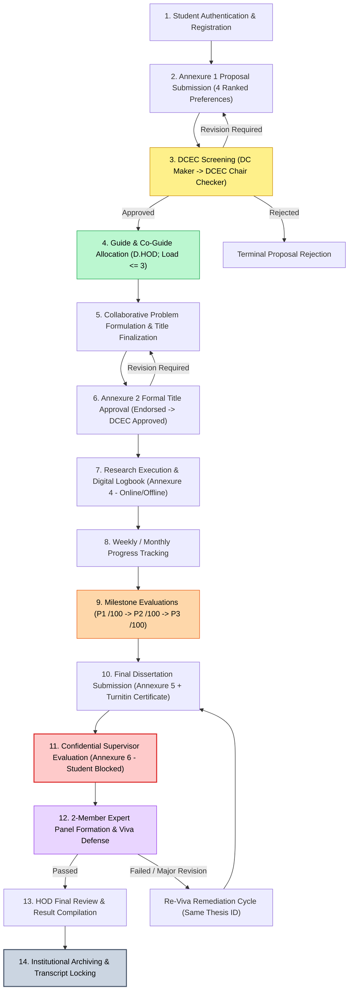

---

## 4. Thesis Lifecycle State Machine

The `Thesis` aggregate root tracks the candidate's journey across twenty-two (22) formal lifecycle states.

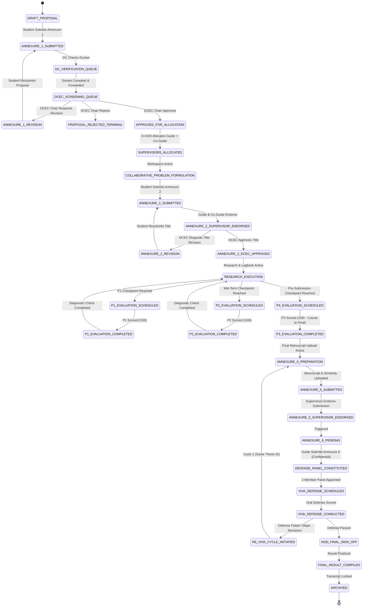

### 4.1 Detailed Thesis State Descriptions

| State Identifier | Business Meaning & Description | Allowed Actors | Permitted Actions | Exit State(s) |
| :--- | :--- | :--- | :--- | :--- |
| `DRAFT_PROPOSAL` | Student is preparing Annexure 1 proposal and selecting 4 ranked preferences. | `ROLE_STUDENT` | `ANNEXURE_1_CREATE`, `ANNEXURE_1_UPDATE`, `ANNEXURE_1_SUBMIT` | `ANNEXURE_1_SUBMITTED` |
| `ANNEXURE_1_SUBMITTED` | Proposal submitted; awaiting preliminary verification by Department Coordinator. | `ROLE_DC`, `ROLE_STUDENT` (view only) | `DCEC_DOCKET_PREPARE`, `DCEC_DOCKET_VERIFY` | `DC_VERIFICATION_QUEUE` |
| `DC_VERIFICATION_QUEUE` | DC is verifying candidate eligibility, documentation, and prerequisite clearance. | `ROLE_DC` | `DCEC_DOCKET_VERIFY`, `DCEC_QUEUE_FORWARD` | `DCEC_SCREENING_QUEUE` |
| `DCEC_SCREENING_QUEUE` | Formal screening docket queued for DCEC review and DCEC Chair approval. | `ROLE_DCEC_CHAIR`, `ROLE_DCEC_MEMBER` | `DCEC_CHAIR_APPROVE`, `DCEC_CHAIR_REVISE`, `DCEC_CHAIR_REJECT` | `APPROVED_FOR_ALLOCATION`, `ANNEXURE_1_REVISION`, `PROPOSAL_REJECTED_TERMINAL` |
| `ANNEXURE_1_REVISION` | DCEC Chair returned proposal with required revisions. | `ROLE_STUDENT` | `ANNEXURE_1_UPDATE`, `ANNEXURE_1_SUBMIT` | `ANNEXURE_1_SUBMITTED` |
| `PROPOSAL_REJECTED_TERMINAL`| Proposal rejected by DCEC Chair. Terminal state for this proposal docket. | `ROLE_STUDENT` (view only), `ROLE_HOD` | None (Terminal) | `[*]` |
| `APPROVED_FOR_ALLOCATION` | Annexure 1 approved by DCEC Chair; awaiting supervisor assignment on D.HOD Workbench. | `ROLE_DHOD` | `ALLOCATION_QUEUE_VIEW`, `SUPERVISOR_ALLOCATE` | `SUPERVISORS_ALLOCATED` |
| `SUPERVISORS_ALLOCATED` | D.HOD has assigned Guide and Co-Guide. Supervisors and candidate notified. | `ROLE_DHOD`, `ROLE_GUIDE`, `ROLE_CO_GUIDE`, `ROLE_STUDENT` | `COLLABORATIVE_WORKSPACE_INIT` | `COLLABORATIVE_PROBLEM_FORMULATION` |
| `COLLABORATIVE_PROBLEM_FORMULATION`| Student, Guide, and Co-Guide are refining problem statement and finalized title. | `ROLE_STUDENT`, `ROLE_GUIDE`, `ROLE_CO_GUIDE` | `ANNEXURE_2_CREATE`, `ANNEXURE_2_SUBMIT` | `ANNEXURE_2_SUBMITTED` |
| `ANNEXURE_2_SUBMITTED` | Annexure 2 submitted by student; awaiting endorsement by Guide and Co-Guide. | `ROLE_GUIDE`, `ROLE_CO_GUIDE` | `ANNEXURE_2_ENDORSE`, `ANNEXURE_2_REQUEST_REVISION` | `ANNEXURE_2_SUPERVISOR_ENDORSED`, `COLLABORATIVE_PROBLEM_FORMULATION` |
| `ANNEXURE_2_SUPERVISOR_ENDORSED`| Endorsed by both supervisors; queued for DCEC formal title approval. | `ROLE_DCEC_CHAIR` | `TITLE_APPROVE`, `DCEC_CHAIR_REVISE` | `ANNEXURE_2_DCEC_APPROVED`, `ANNEXURE_2_REVISION` |
| `ANNEXURE_2_REVISION` | DCEC Chair returned Annexure 2 title for revision. | `ROLE_STUDENT`, `ROLE_GUIDE`, `ROLE_CO_GUIDE` | `ANNEXURE_2_UPDATE`, `ANNEXURE_2_SUBMIT` | `ANNEXURE_2_SUBMITTED` |
| `ANNEXURE_2_DCEC_APPROVED`| Dissertation topic and title formally approved. Enables research & logbook stage. | `ROLE_STUDENT`, `ROLE_GUIDE`, `ROLE_CO_GUIDE` | `RESEARCH_EXECUTION_INIT` | `RESEARCH_EXECUTION` |
| `RESEARCH_EXECUTION` | Active research execution, digital logbook entries (Annexure 4), and progress reports. | `ROLE_STUDENT`, `ROLE_GUIDE`, `ROLE_CO_GUIDE` | `ANNEXURE_4_CREATE`, `ANNEXURE_4_VERIFY`, `PROGRESS_REPORT_SUBMIT` | `P1_EVALUATION_SCHEDULED`, `P2_EVALUATION_SCHEDULED`, `P3_EVALUATION_SCHEDULED` |
| `P1_EVALUATION_SCHEDULED` | Progress Presentation 1 checkpoint scheduled. | `ROLE_DC`, `ROLE_DCEC_MEMBER` | `MILESTONE_EVALUATE` | `P1_EVALUATION_COMPLETED` |
| `P1_EVALUATION_COMPLETED` | P1 evaluated and scored out of 100 (/100). Diagnostic checkpoint completed. | `ROLE_STUDENT`, `ROLE_GUIDE`, `ROLE_DC` | `RESUME_RESEARCH` | `RESEARCH_EXECUTION` |
| `P2_EVALUATION_SCHEDULED` | Progress Presentation 2 checkpoint scheduled. | `ROLE_DC`, `ROLE_DCEC_MEMBER` | `MILESTONE_EVALUATE` | `P2_EVALUATION_COMPLETED` |
| `P2_EVALUATION_COMPLETED` | P2 evaluated and scored out of 100 (/100). Mid-term checkpoint completed. | `ROLE_STUDENT`, `ROLE_GUIDE`, `ROLE_DC` | `RESUME_RESEARCH` | `RESEARCH_EXECUTION` |
| `P3_EVALUATION_SCHEDULED` | Progress Presentation 3 checkpoint scheduled (Pre-submission milestone). | `ROLE_DC`, `ROLE_DCEC_MEMBER` | `MILESTONE_EVALUATE` | `P3_EVALUATION_COMPLETED` |
| `P3_EVALUATION_COMPLETED` | P3 evaluated and scored out of 100 (/100). Contributes to final result calculation. | `ROLE_STUDENT`, `ROLE_GUIDE`, `ROLE_DC` | `ANNEXURE_5_INIT` | `ANNEXURE_5_PREPARATION` |
| `ANNEXURE_5_PREPARATION` | Candidate preparing final dissertation manuscript, synopsis, and Turnitin similarity report. | `ROLE_STUDENT` | `ANNEXURE_5_CREATE`, `ANNEXURE_5_UPDATE`, `ANNEXURE_5_SUBMIT` | `ANNEXURE_5_SUBMITTED` |
| `ANNEXURE_5_SUBMITTED` | Final manuscript package submitted; awaiting endorsement by Guide and Co-Guide. | `ROLE_GUIDE`, `ROLE_CO_GUIDE` | `ANNEXURE_5_ENDORSE`, `ANNEXURE_5_REQUEST_REVISION` | `ANNEXURE_5_SUPERVISOR_ENDORSED`, `ANNEXURE_5_PREPARATION` |
| `ANNEXURE_5_SUPERVISOR_ENDORSED`| Endorsed by supervisors; triggers confidential supervisor evaluation. | System Automated | `TRIGGER_ANNEXURE_6` | `ANNEXURE_6_PENDING` |
| `ANNEXURE_6_PENDING` | Primary Guide completing confidential Annexure 6 evaluation. **(Student Blocked)**. | `ROLE_GUIDE` | `ANNEXURE_6_CREATE`, `ANNEXURE_6_SUBMIT` | `DEFENSE_PANEL_CONSTITUTED` |
| `DEFENSE_PANEL_CONSTITUTED`| Annexure 6 submitted; 2-member expert panel appointed for viva defense. | `ROLE_HOD`, `ROLE_DC` | `VIVA_SCHEDULE` | `VIVA_DEFENSE_SCHEDULED` |
| `VIVA_DEFENSE_SCHEDULED` | Final viva defense date, venue/meeting link, and panel active. | `ROLE_PANEL_MEMBER`, `ROLE_STUDENT` | `VIVA_EVALUATE` | `VIVA_DEFENSE_CONDUCTED` |
| `VIVA_DEFENSE_CONDUCTED` | Oral defense evaluated by 2-member panel; score sheets submitted. | `ROLE_PANEL_MEMBER`, `ROLE_HOD` | `VIVA_RESULT_SUBMIT` | `HOD_FINAL_SIGN_OFF`, `RE_VIVA_CYCLE_INITIATED` |
| `RE_VIVA_CYCLE_INITIATED` | Candidate failed defense or requires major revisions. Instantiates remediation cycle. | `ROLE_STUDENT`, `ROLE_GUIDE` | `INITIATE_REVISION_CYCLE` | `ANNEXURE_5_PREPARATION` |
| `HOD_FINAL_SIGN_OFF` | Defense passed; HOD reviews compliance and signs off on completion. | `ROLE_HOD` | `RESULT_SIGN_OFF` | `FINAL_RESULT_COMPILED` |
| `FINAL_RESULT_COMPILED` | Final grade compiled from P3, supervisor, and viva scores. Transcript generated. | `ROLE_HOD`, `ROLE_ADMIN` | `THESIS_ARCHIVE` | `ARCHIVED` |
| `ARCHIVED` | Completed dissertation package permanently locked in institutional archive. | `ROLE_STUDENT`, `ROLE_FACULTY`, `ROLE_ADMIN` (view only) | None (Terminal Immutable) | `[*]` |

---

## 5. Annexure 1 & DCEC Screening State Machine

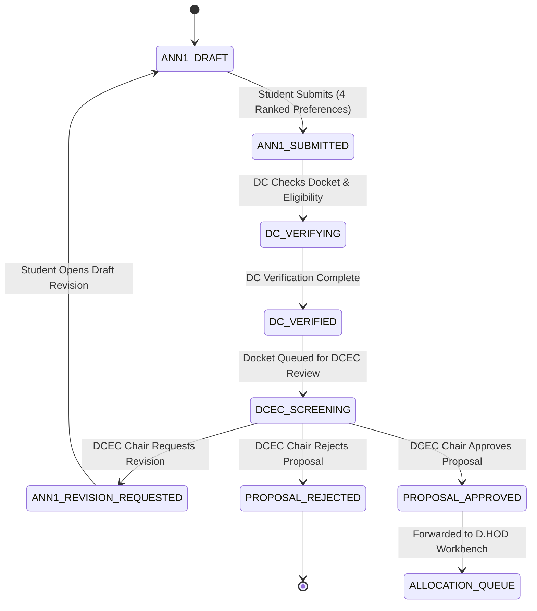

### Transition Matrix: Annexure 1 & DCEC Screening

| Transition ID | From State | Event / Action | Actor | Required Permission | Preconditions & Guards | To State | Side Effects & Audit |
| :--- | :--- | :--- | :--- | :--- | :--- | :--- | :--- |
| `TR-ANN1-01` | `ANN1_DRAFT` | Submit Annexure 1 | `ROLE_STUDENT` | `ANNEXURE_1_SUBMIT` | Student enrolled; exactly 4 distinct faculty preferences; working title non-empty. | `ANN1_SUBMITTED` | Lock draft; emit `ANNEXURE_1_SUBMITTED` event; write `AuditEvent`. |
| `TR-ANN1-02` | `ANN1_SUBMITTED` | Start Verification | `ROLE_DC` | `DCEC_DOCKET_PREPARE` | Docket queued in DC department scope. | `DC_VERIFYING` | Assign DC reviewer lock; write `AuditEvent`. |
| `TR-ANN1-03` | `DC_VERIFYING` | Forward to DCEC | `ROLE_DC` | `DCEC_DOCKET_VERIFY` | Eligibility verified; checklist items marked complete; DC notes entered. | `DCEC_SCREENING` | Compile screening docket; notify DCEC Chair; write `AuditEvent`. |
| `TR-ANN1-04` | `DCEC_SCREENING` | Request Revision | `ROLE_DCEC_CHAIR` | `DCEC_CHAIR_REVISE` | Revision remarks non-empty; Chair authority active. | `ANN1_REVISION_REQUESTED`| Unlock Annexure 1 for editing; notify Student; write `AuditEvent`. |
| `TR-ANN1-05` | `DCEC_SCREENING` | Reject Proposal | `ROLE_DCEC_CHAIR` | `DCEC_CHAIR_REJECT` | Rejection justification non-empty; Chair authority active. | `PROPOSAL_REJECTED` | Set proposal status rejected; notify Student & HOD; write `AuditEvent`. |
| `TR-ANN1-06` | `DCEC_SCREENING` | Approve Proposal | `ROLE_DCEC_CHAIR` | `DCEC_CHAIR_APPROVE` | Chair authority active; docket complete. | `PROPOSAL_APPROVED` | Transition thesis to `APPROVED_FOR_ALLOCATION`; notify D.HOD; write `AuditEvent`. |

---

## 6. Guide / Co-Guide Allocation State Machine

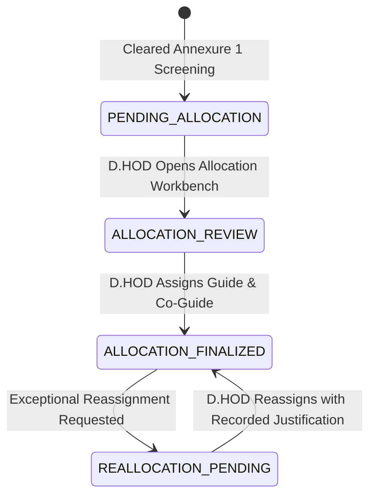

### Transition Matrix: Guide / Co-Guide Allocation

| Transition ID | From State | Event / Action | Actor | Required Permission | Preconditions & Guards | To State | Side Effects & Audit |
| :--- | :--- | :--- | :--- | :--- | :--- | :--- | :--- |
| `TR-ALLOC-01` | `PENDING_ALLOCATION`| Open Workbench | `ROLE_DHOD` | `ALLOCATION_QUEUE_VIEW` | Thesis in `APPROVED_FOR_ALLOCATION`. | `ALLOCATION_REVIEW` | Display 4 student preferences + real-time faculty loads. |
| `TR-ALLOC-02` | `ALLOCATION_REVIEW` | Finalize Allocation | `ROLE_DHOD` | `SUPERVISOR_ALLOCATE` | 1 Guide + 1 Co-Guide assigned; $\text{Guide} \neq \text{Co-Guide}$; $\text{GuideLoad} \le 3$; $\text{CoGuideLoad} \le 3$. | `ALLOCATION_FINALIZED` | Increment faculty load counters; transition thesis to `SUPERVISORS_ALLOCATED`; notify Student, Guide, Co-Guide; write `AuditEvent`. |
| `TR-ALLOC-03` | `ALLOCATION_FINALIZED`| Reallocate Supervisor| `ROLE_DHOD` | `SUPERVISOR_REALLOCATE`| Mandatory justification text non-empty; new faculty load $\le 3$; $\text{Guide} \neq \text{Co-Guide}$. | `ALLOCATION_FINALIZED` | Update `GuideAllocation`; create immutable `GuideAllocationHistory` entry; recalculate loads; notify all parties; write `AuditEvent`. |

---

## 7. Annexure 2 Formal Title Approval State Machine

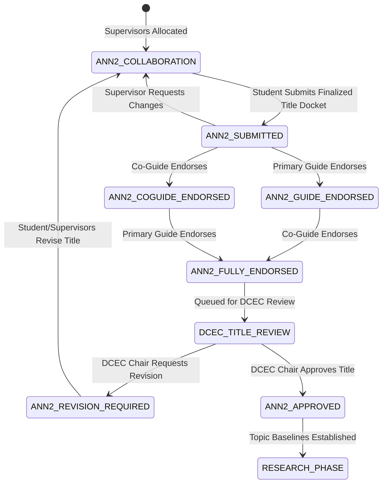

### Transition Matrix: Annexure 2 Title Approval

| Transition ID | From State | Event / Action | Actor | Required Permission | Preconditions & Guards | To State | Side Effects & Audit |
| :--- | :--- | :--- | :--- | :--- | :--- | :--- | :--- |
| `TR-ANN2-01` | `ANN2_COLLABORATION`| Submit Annexure 2 | `ROLE_STUDENT` | `ANNEXURE_2_SUBMIT` | Finalized title, refined problem, methodology, and timeline entered. | `ANN2_SUBMITTED` | Notify Guide & Co-Guide; write `AuditEvent`. |
| `TR-ANN2-02` | `ANN2_SUBMITTED` | Guide Endorse | `ROLE_GUIDE` | `ANNEXURE_2_ENDORSE` | User is assigned primary Guide. | `ANN2_GUIDE_ENDORSED` / `ANN2_FULLY_ENDORSED` | Record Guide sign-off; check if Co-Guide endorsed; write `AuditEvent`. |
| `TR-ANN2-03` | `ANN2_SUBMITTED` | Co-Guide Endorse | `ROLE_CO_GUIDE` | `ANNEXURE_2_ENDORSE` | User is assigned Co-Guide. | `ANN2_COGUIDE_ENDORSED` / `ANN2_FULLY_ENDORSED` | Record Co-Guide sign-off; check if Guide endorsed; write `AuditEvent`. |
| `TR-ANN2-04` | `ANN2_FULLY_ENDORSED`| Approve Title | `ROLE_DCEC_CHAIR` | `TITLE_APPROVE` | Both endorsements verified; DCEC Chair authority active. | `ANN2_APPROVED` | Formal title baselined; transition thesis to `ANNEXURE_2_DCEC_APPROVED`; unlock Annexure 4 logbook; write `AuditEvent`. |
| `TR-ANN2-05` | `DCEC_TITLE_REVIEW` | Request Revision | `ROLE_DCEC_CHAIR` | `DCEC_CHAIR_REVISE` | Revision comments entered; Chair authority active. | `ANN2_REVISION_REQUIRED`| Return to collaborative workspace; notify Student & Supervisors; write `AuditEvent`. |

---

## 8. Digital Logbook (Annexure 4) & Progress Tracking State Machine

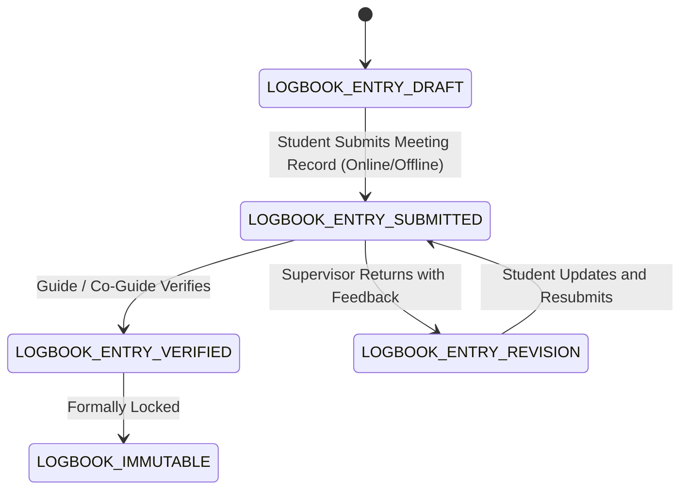

### Transition Matrix: Digital Logbook

| Transition ID | From State | Event / Action | Actor | Required Permission | Preconditions & Guards | To State | Side Effects & Audit |
| :--- | :--- | :--- | :--- | :--- | :--- | :--- | :--- |
| `TR-LOG-01` | `LOGBOOK_ENTRY_DRAFT` | Submit Meeting Entry | `ROLE_STUDENT` | `ANNEXURE_4_CREATE` | Meeting mode specified (Online: URL required; Offline: Location required); agenda and action items entered. | `LOGBOOK_ENTRY_SUBMITTED` | Lock entry; notify assigned Guide & Co-Guide; write `AuditEvent`. |
| `TR-LOG-02` | `LOGBOOK_ENTRY_SUBMITTED`| Verify Entry | `ROLE_GUIDE` / `ROLE_CO_GUIDE` | `ANNEXURE_4_VERIFY` | Verifier is assigned supervisor. | `LOGBOOK_ENTRY_VERIFIED` | Mark entry verified; lock against edits; write `AuditEvent`. |
| `TR-LOG-03` | `LOGBOOK_ENTRY_SUBMITTED`| Return for Revision | `ROLE_GUIDE` / `ROLE_CO_GUIDE` | `ANNEXURE_4_REVISE` | Feedback remarks entered; verifier is assigned supervisor. | `LOGBOOK_ENTRY_REVISION` | Unlock entry for student correction; notify Student; write `AuditEvent`. |

---

## 9. Milestone Presentation Evaluation State Machine (P1, P2, P3)

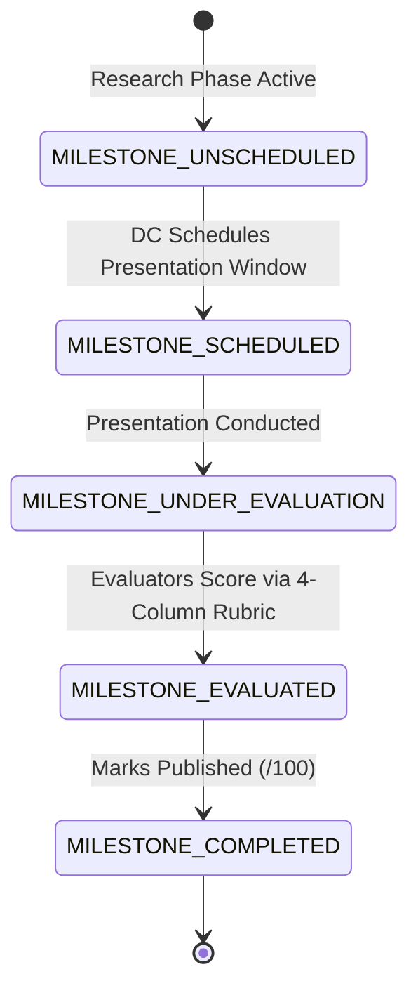

### Transition Matrix: Milestone Evaluations

| Transition ID | From State | Event / Action | Actor | Required Permission | Preconditions & Guards | To State | Side Effects & Audit |
| :--- | :--- | :--- | :--- | :--- | :--- | :--- | :--- |
| `TR-MILE-01` | `MILESTONE_UNSCHEDULED`| Schedule Presentation | `ROLE_DC` | `MILESTONE_SCHEDULE` | Candidate cleared previous prerequisites; presentation date/venue set. | `MILESTONE_SCHEDULED` | Generate calendar notice; notify Student & Committee; write `AuditEvent`. |
| `TR-MILE-02` | `MILESTONE_SCHEDULED` | Submit Evaluation | `ROLE_DCEC_MEMBER` / `ROLE_DCEC_CHAIR` | `MILESTONE_EVALUATE` | Presentation active; active `RubricVersion` pinned; score in range $0..100$. | `MILESTONE_EVALUATED` | Record criterion scores; calculate total (/100); write `AuditEvent`. |
| `TR-MILE-03` | `MILESTONE_EVALUATED` | Publish Marks | `ROLE_DC` / `ROLE_HOD` | `MILESTONE_VIEW` | All committee scores submitted. | `MILESTONE_COMPLETED` | Lock evaluation permanently; if P3, enable Annexure 5 preparation; write `AuditEvent`. |

---

## 10. Dynamic Rubric Lifecycle State Machine

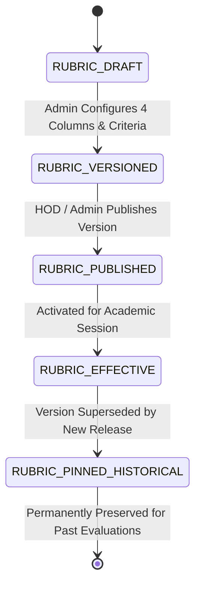

### Transition Matrix: Dynamic Rubric

| Transition ID | From State | Event / Action | Actor | Required Permission | Preconditions & Guards | To State | Side Effects & Audit |
| :--- | :--- | :--- | :--- | :--- | :--- | :--- | :--- |
| `TR-RUB-01` | `RUBRIC_DRAFT` | Finalize Criteria | `ROLE_ADMIN` | `RUBRIC_CREATE` / `UPDATE` | Total max marks = 100; exactly 4 dynamic achievement tiers defined per criterion. | `RUBRIC_VERSIONED` | Assign sequential `VersionNumber` ($v1, v2$); write `AuditEvent`. |
| `TR-RUB-02` | `RUBRIC_VERSIONED` | Publish Version | `ROLE_HOD` / `ROLE_ADMIN` | `RUBRIC_PUBLISH` | Department scope verified; validity start date set. | `RUBRIC_PUBLISHED` | Lock rubric version against modifications; write `AuditEvent`. |
| `TR-RUB-03` | `RUBRIC_PUBLISHED` | Supercede Version | System / Admin | `RUBRIC_PUBLISH` | New rubric version published for department. | `RUBRIC_PINNED_HISTORICAL`| Archive previous version; maintain foreign keys on historical evaluations; write `AuditEvent`. |

---

## 11. Final Submission (Annexure 5) & Confidential Supervisor Evaluation (Annexure 6) State Machine

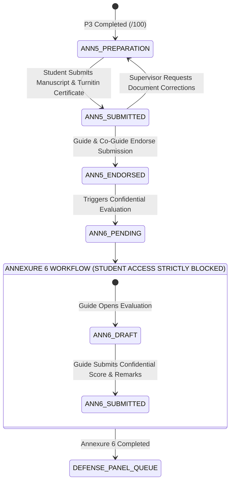

### Transition Matrix: Annexure 5 & Annexure 6

| Transition ID | From State | Event / Action | Actor | Required Permission | Preconditions & Guards | To State | Side Effects & Audit |
| :--- | :--- | :--- | :--- | :--- | :--- | :--- | :--- |
| `TR-ANN5-01` | `ANN5_PREPARATION` | Submit Final Package | `ROLE_STUDENT` | `ANNEXURE_5_SUBMIT` | Final manuscript PDF uploaded; Turnitin certificate uploaded; Plagiarism $< 10\%$; AI similarity $= 0\%$. | `ANN5_SUBMITTED` | Lock manuscript; notify Supervisors; write `AuditEvent`. |
| `TR-ANN5-02` | `ANN5_SUBMITTED` | Endorse Annexure 5 | `ROLE_GUIDE` & `ROLE_CO_GUIDE` | `ANNEXURE_5_ENDORSE` | Verified similarity report and manuscript quality. | `ANN5_ENDORSED` | Trigger Annexure 6 pending state; write `AuditEvent`. |
| `TR-ANN6-01` | `ANN6_PENDING` | Submit Confidential Eval | `ROLE_GUIDE` | `ANNEXURE_6_SUBMIT` | Supervisor score entered; dimensional ratings completed; recommendation selected; **User is primary Guide**. | `DEFENSE_PANEL_QUEUE` | Lock Annexure 6; **STRICT STUDENT BLOCK ACTIVE**; notify HOD to form panel; write `AuditEvent`. |

---

## 12. Viva Defense & Re-Viva Failure Remediation State Machine

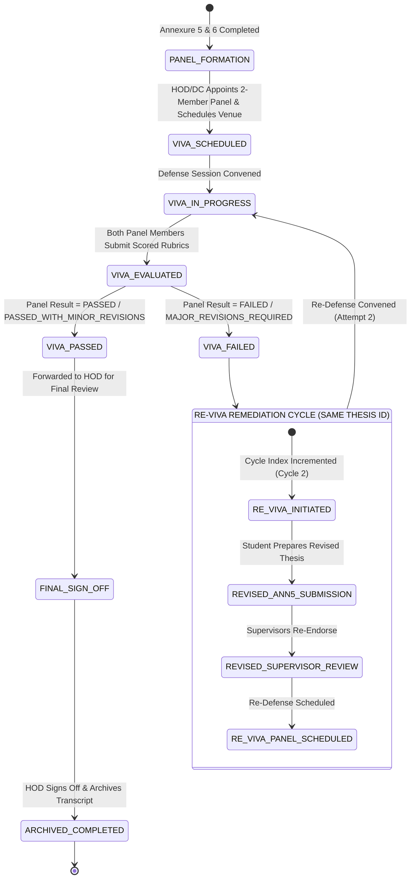

### Transition Matrix: Viva Defense & Re-Viva Remediation

| Transition ID | From State | Event / Action | Actor | Required Permission | Preconditions & Guards | To State | Side Effects & Audit |
| :--- | :--- | :--- | :--- | :--- | :--- | :--- | :--- |
| `TR-VIVA-01` | `PANEL_FORMATION` | Appoint Panel | `ROLE_HOD` / `ROLE_DC` | `PANEL_CONSTITUTE` | Exactly 2 expert evaluators appointed; conflict-of-interest check passed. | `VIVA_SCHEDULED` | Issue panel appointment notices; write `AuditEvent`. |
| `TR-VIVA-02` | `VIVA_SCHEDULED` | Submit Panel Scores | `ROLE_PANEL_MEMBER` | `VIVA_EVALUATE` | User is appointed panel member; active viva rubric scored. | `VIVA_EVALUATED` | Record independent score sheet; compile composite result; write `AuditEvent`. |
| `TR-VIVA-03` | `VIVA_EVALUATED` | Finalize Pass Result | `ROLE_HOD` / Panel Chair | `VIVA_RESULT_SUBMIT` | Composite outcome = `PASSED` or `PASSED_WITH_MINOR_REVISIONS`. | `FINAL_SIGN_OFF` | Compile final grade (P3 + Ann 6 + Viva); notify Student; write `AuditEvent`. |
| `TR-VIVA-04` | `VIVA_EVALUATED` | Record Viva Failure | `ROLE_HOD` / Panel Chair | `VIVA_RESULT_SUBMIT` | Composite outcome = `FAILED` or `MAJOR_REVISIONS_REQUIRED`. | `RE_VIVA_INITIATED` | Instantiate `ReVivaCycle`; increment `DefenseCycleIndex = 2`; **ThesisId remains unchanged**; write `AuditEvent`. |
| `TR-VIVA-05` | `FINAL_SIGN_OFF` | Archive Completed | `ROLE_HOD` | `THESIS_ARCHIVE` | All corrections certified; final transcript generated. | `ARCHIVED_COMPLETED` | Lock dissertation permanently; set status `ARCHIVED`; write `AuditEvent`. |

---

## 13. Comprehensive State Transition Catalog

```
                                  MASTER TRANSITION CATALOG
┌───────────────┬───────────────────────────────┬───────────────────────────────┬──────────────────────┐
│ Domain        │ From State                    │ To State                      │ Triggering Actor     │
├───────────────┼───────────────────────────────┼───────────────────────────────┼──────────────────────┤
│ Annexure 1    │ DRAFT_PROPOSAL                │ ANNEXURE_1_SUBMITTED          │ Student              │
│ DCEC Review   │ ANNEXURE_1_SUBMITTED          │ DCEC_SCREENING_QUEUE          │ DC (Maker)           │
│ DCEC Review   │ DCEC_SCREENING_QUEUE          │ APPROVED_FOR_ALLOCATION       │ DCEC Chair (Checker) │
│ Allocation    │ APPROVED_FOR_ALLOCATION       │ SUPERVISORS_ALLOCATED         │ D.HOD (Allocator)    │
│ Annexure 2    │ COLLABORATIVE_FORMULATION     │ ANNEXURE_2_SUBMITTED          │ Student              │
│ Annexure 2    │ ANNEXURE_2_SUBMITTED          │ ANNEXURE_2_SUPERVISOR_ENDORSED│ Guide & Co-Guide     │
│ Annexure 2    │ ANNEXURE_2_SUPERVISOR_ENDORSED│ ANNEXURE_2_DCEC_APPROVED      │ DCEC Chair (Checker) │
│ Logbook       │ LOGBOOK_ENTRY_SUBMITTED       │ LOGBOOK_ENTRY_VERIFIED        │ Guide / Co-Guide     │
│ Milestones    │ P1_SCHEDULED / P2 / P3        │ P1_COMPLETED / P2 / P3        │ DCEC Evaluators      │
│ Annexure 5    │ ANNEXURE_5_SUBMITTED          │ ANNEXURE_5_SUPERVISOR_ENDORSED│ Guide & Co-Guide     │
│ Annexure 6    │ ANNEXURE_6_PENDING            │ DEFENSE_PANEL_CONSTITUTED     │ Primary Guide Only   │
│ Viva Defense  │ VIVA_DEFENSE_SCHEDULED        │ VIVA_DEFENSE_CONDUCTED        │ 2-Member Panel       │
│ Re-Viva Retry │ VIVA_DEFENSE_CONDUCTED (Fail) │ RE_VIVA_CYCLE_INITIATED       │ Panel Chair / HOD    │
│ Archiving     │ HOD_FINAL_SIGN_OFF            │ ARCHIVED                      │ HOD                  │
└───────────────┴───────────────────────────────┴───────────────────────────────┴──────────────────────┘
```

---

## 14. Prohibited / Illegal Transitions Matrix

The following transitions violate institutional governance and are **programmatically blocked** by state machine guards:

| Attempted Source State | Attempted Action / Event | Attempted Target State | Violating Actor | Reason for Strict Prohibition |
| :--- | :--- | :--- | :--- | :--- |
| `DRAFT_PROPOSAL` | Direct Defense Request | `VIVA_DEFENSE_SCHEDULED` | Student | Cannot skip proposal screening, allocation, research, and milestone evaluations. |
| `APPROVED_FOR_ALLOCATION`| Self-Allocation | `SUPERVISORS_ALLOCATED` | Student / Guide | Sole allocation authority in V1 is D.HOD (`REQ-ALLOC-002`). |
| `APPROVED_FOR_ALLOCATION`| Over-Capacity Allocation | `SUPERVISORS_ALLOCATED` | D.HOD | Hard constraint violation: $\text{GuideLoad} > 3$ or $\text{CoGuideLoad} > 3$. |
| `APPROVED_FOR_ALLOCATION`| Identical Supervisor Assignment| `SUPERVISORS_ALLOCATED` | D.HOD | Hard constraint violation: $\text{Guide} == \text{Co-Guide}$ (`REQ-ALLOC-006`). |
| `ANNEXURE_1_SUBMITTED` | Direct Approval | `APPROVED_FOR_ALLOCATION` | DC (Maker) | DC cannot approve screening; approval requires DCEC Chair (`REQ-DCEC-001`). |
| `ANNEXURE_6_PENDING` | View / Access Attempt | `ANNEXURE_6_VIEW` | Student | **Confidential record lock:** Student access permanently denied (`REQ-ANN6-002`). |
| `RESEARCH_EXECUTION` | Direct Final Submission | `ANNEXURE_5_SUBMITTED` | Student | Cannot submit Annexure 5 before completing Milestone Presentation 3 (P3). |
| `VIVA_DEFENSE_CONDUCTED` (Fail)| Issue New Thesis ID | `NEW_THESIS_RECORD` | System / Admin | Viva failure creates `ReVivaCycle` under the **SAME immutable Thesis ID**. |
| `ARCHIVED` | Edit / Mutate Record | Any Previous State | Any User / Admin | Archived dissertations are permanently sealed legal academic records. |

---

## 15. Terminal States Catalog

| Terminal State Identifier | Domain Entity | Reopening Policy | Archival / Historical Preservation Rule |
| :--- | :--- | :--- | :--- |
| `ARCHIVED` | `Thesis` | **NEVER REOPENED** | Permanently sealed legal transcript record. All files, dockets, rubrics, and audit logs are retained. |
| `PROPOSAL_REJECTED_TERMINAL`| `Annexure1Submission` | **NEVER REOPENED** | Proposal docket terminated. Preserved in audit history; student must submit new proposal topic. |
| `LOGBOOK_IMMUTABLE` | `DigitalLogbookEntry` | **NEVER REOPENED** | Verified supervisory meeting minutes cannot be retroactively altered. |
| `MILESTONE_COMPLETED` | `MilestoneEvaluation` | **NEVER REOPENED** | Scored presentation rubric permanently locked to active `RubricVersionId`. |
| `RUBRIC_PINNED_HISTORICAL` | `RubricVersion` | **NEVER REOPENED** | Superseded rubric version preserved forever to maintain integrity of past evaluations. |

---

## 16. State Invariants

The state machine architecture strictly enforces the following ten (10) institutional invariants:

1. **`INV-01` (Thesis Identity Stability):** The primary `ThesisId` remains strictly unchanged through all revisions, supervisor reallocations, and viva failure cycles.
2. **`INV-02` (Historical Evaluation Immutability):** P1, P2, P3, Annexure 6, and Viva evaluation score sheets are write-once and permanently pinned to their respective `RubricVersionId`.
3. **`INV-03` (P3 Contribution Exclusivity):** Only P3 scores contribute to the final result calculation. P1 and P2 remain historical formative milestones.
4. **`INV-04` (Supervisor Capacity Hard Limits):** $\text{ActiveGuideLoad}(F) \le 3 \land \text{ActiveCoGuideLoad}(F) \le 3$.
5. **`INV-05` (Supervisor Distinctness):** $\text{GuideFacultyId}(T) \neq \text{CoGuideFacultyId}(T)$.
6. **`INV-06` (Sole Allocation Authority):** D.HOD is the exclusive allocating role in V1; no faculty accept/decline workflow exists.
7. **`INV-07` (Annexure 6 Student Lockout):** Students permanently possess zero read/write access to Annexure 6.
8. **`INV-08` (Maker-Checker Decoupling):** Department Coordinator cannot approve DCEC dockets; DCEC Chair cannot bypass DC compliance verification.
9. **`INV-09` (Sequential Document Versioning):** Document replacements during revisions generate sequential versions ($v1, v2, v3$) without destroying past files.
10. **`INV-10` (Tamper-Proof Audit Logging):** Every state transition generates an immutable, append-only `AuditEvent`.

---

## 17. Cross-Domain Workflow Dependencies

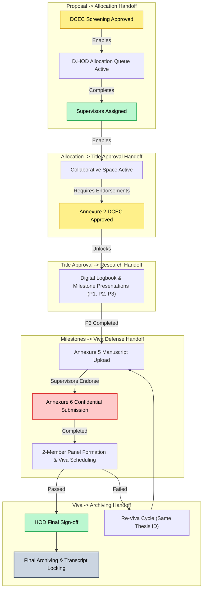

---

## 18. Requirement Traceability Matrix

The following matrix maps state machines and key transitions to their governing requirements in [`docs/01_REQUIREMENTS.md`](file:///c:/Users/user/Desktop/niet-dissertation-management-system/docs/01_REQUIREMENTS.md):

| State Machine / Transition ID | Governing Requirement ID | Source Document & Section | Rationale / Traceability Note |
| :--- | :--- | :--- | :--- |
| `Thesis Lifecycle FSM` | `REQ-WF-001`, `REQ-WF-002` | `01_REQUIREMENTS.md §8` | 14-phase deterministic lifecycle progression |
| `TR-ANN1-01`..`TR-ANN1-06` | `REQ-ANN1-001`..`003`, `REQ-DCEC-001`..`005` | `01_REQUIREMENTS.md §5.2, §5.3` | Annexure 1 proposal & DCEC Maker-Checker screening |
| `TR-ALLOC-01`..`TR-ALLOC-03` | `REQ-ALLOC-001`..`009`, `REQ-ALLOC-SPEC-001`..`004`| `01_REQUIREMENTS.md §5.4, §10` | D.HOD manual allocation authority (Load $\le 3$) |
| `TR-ANN2-01`..`TR-ANN2-05` | `REQ-ANN2-001`..`003`, `REQ-ANN-SPEC-002` | `01_REQUIREMENTS.md §5.5, §11` | Annexure 2 title approval & supervisor endorsements |
| `TR-LOG-01`..`TR-LOG-03` | `REQ-ANN4-001`..`005`, `REQ-ANN-SPEC-003` | `01_REQUIREMENTS.md §5.6, §11` | Digital logbook online/offline meeting tracking |
| `TR-MILE-01`..`TR-MILE-03` | `REQ-EVAL-001`..`005`, `REQ-EVAL-P1-001`..`P3-002` | `01_REQUIREMENTS.md §5.8, §12` | P1, P2, P3 presentation grading (/100; only P3 counts) |
| `TR-RUB-01`..`TR-RUB-03` | `REQ-RUB-001`..`003` | `01_REQUIREMENTS.md §13` | Dynamic 4-column rubric versioning & pinning |
| `TR-ANN5-01`..`TR-ANN5-02` | `REQ-ANN5-001`..`004`, `REQ-ANN-SPEC-004` | `01_REQUIREMENTS.md §5.9, §11` | Final dissertation submission & Turnitin certificate |
| `TR-ANN6-01` | `REQ-ANN6-001`, `REQ-ANN6-002`, `REQ-ANN-SPEC-005`| `01_REQUIREMENTS.md §5.10, §11`| Confidential supervisor evaluation (Student blocked)|
| `TR-VIVA-01`..`TR-VIVA-03` | `REQ-PANEL-001`, `REQ-VIVA-001`, `REQ-VIVA-002` | `01_REQUIREMENTS.md §5.11, §14`| 2-member panel oral defense assessment |
| `TR-VIVA-04` (Re-Viva) | `REQ-VIVA-003`, `REQ-VIVA-004`, `REQ-VIVA-DEF-002`..`004`| `01_REQUIREMENTS.md §5.11, §14`| Defense failure retry cycle (**Same Thesis ID**) |
| `TR-VIVA-05` (Archiving) | `REQ-ARCH-001`..`003` | `01_REQUIREMENTS.md §5.12` | HOD sign-off & permanent archival locking |

---

## 19. Open State-Machine Decisions

In strict accordance with the Anti-Hallucination Rule, the following workflow boundaries are preserved as unresolved:

| Open Decision ID | Workflow Area | Unresolved State-Machine Question | Temporary Fallback Behavior |
| :--- | :--- | :--- | :--- |
| `REQ-OD-001` | DCEC Review | Quorum voting threshold mechanics (unanimous vs majority). | DC verification + DCEC Chair single sign-off. |
| `REQ-OD-002` | Result Calculation | Exact formula weighting P3, Annexure 6, and Viva Panel scores. | Configurable parameter engine placeholder. |
| `REQ-OD-003` | Re-Viva Lifecycle | Maximum allowable re-viva attempts and semester extension penalty limits. | State machine supports $N$-cycles pending policy cap. |
| `REQ-OD-004` | Annexure 6 | Co-Guide participation in Annexure 6 workflow. | Co-Guide blocked by default; primary Guide submits. |
| `REQ-OD-008` | Viva Panel | Conflict-of-interest rule permitting primary Guide on defense panel. | Primary Guide excluded from defense panel by default. |

---

## 20. Future Workflow Concepts (Slated for Post-V1)

The following workflow transitions are recognized in the architectural roadmap but **strictly excluded from Version 1**:

- `TR-FUT-AI-MATCH`: Automated semantic matching transitions dispatching AI supervisor recommendations.
- `TR-FUT-AUTO-ALLOC`: Automated linear programming solver executing multi-candidate supervisor allocations.
- `TR-FUT-TURNITIN-API`: Background webhook listener polling similarity scores directly from Turnitin / DrillBit.
- `TR-FUT-ERP-SYNC`: Bi-directional background daemon syncing student lifecycle states with NIET campus ERP.

---

## 21. Anti-Hallucination & Governance Verification

This state machine specification has undergone rigorous verification against all project governance rules:

- [x] **No Application Code Written:** Confirmed zero source code files created.
- [x] **No Database Schema or SQL Migrations Created:** Confirmed state models are finite state specifications; no SQL types, enums, or table DDL created.
- [x] **No APIs or UI Components Created:** Confirmed zero endpoints or UI components generated.
- [x] **All 14 Master Lifecycle Phases Formally Mapped:** Complete deterministic state machine covering proposal to archiving.
- [x] **D.HOD Allocation & Capacity Invariants Enforced:** Hard constraints ($\le 3$, $\text{Guide} \neq \text{Co-Guide}$) and direct allocation preserved.
- [x] **P1, P2, P3 Milestone Rules Enforced:** Scored /100; only P3 contributes to final result.
- [x] **Viva Failure Retry Architecture Enforced:** Failure initiates `ReVivaCycle` under the **SAME immutable Thesis ID**.
- [x] **Student Annexure 6 Lockout Enforced:** Student permanently denied access across all states.
- [x] **Single File Scope Respected:** ONLY [`docs/05_STATE_MACHINES.md`](file:///c:/Users/user/Desktop/niet-dissertation-management-system/docs/05_STATE_MACHINES.md) was modified.
