# NIET Dissertation Management System — Physical Database Schema Specification

**Document ID:** `DOC-06-SCHEMA`  
**File Path:** [`docs/06_DATABASE_SCHEMA.md`](file:///c:/Users/user/Desktop/niet-dissertation-management-system/docs/06_DATABASE_SCHEMA.md)  
**Document Status:** ARCHITECTURE FREEZE BASELINE (PHASE 3B)  
**Last Revised:** 2026-08-15  
**Governing Baselines:** [`docs/00_PROJECT_MASTER.md`](file:///c:/Users/user/Desktop/niet-dissertation-management-system/docs/00_PROJECT_MASTER.md), [`docs/01_REQUIREMENTS.md`](file:///c:/Users/user/Desktop/niet-dissertation-management-system/docs/01_REQUIREMENTS.md), [`docs/03_DOMAIN_MODEL.md`](file:///c:/Users/user/Desktop/niet-dissertation-management-system/docs/03_DOMAIN_MODEL.md), [`docs/04_RBAC_MATRIX.md`](file:///c:/Users/user/Desktop/niet-dissertation-management-system/docs/04_RBAC_MATRIX.md), [`docs/05_STATE_MACHINES.md`](file:///c:/Users/user/Desktop/niet-dissertation-management-system/docs/05_STATE_MACHINES.md), and [`docs/02_ARCHITECTURE.md`](file:///c:/Users/user/Desktop/niet-dissertation-management-system/docs/02_ARCHITECTURE.md)  
**Institution:** Noida Institute of Engineering & Technology (NIET), Greater Noida  
**Target Engine:** PostgreSQL 15+ (Hosted via Supabase / Neon)  

---

## 1. Database Objectives & Technical Design Principles

This document provides the definitive physical relational schema specification for the NIET Dissertation Management System. It translates all domain entities, aggregate invariants, RBAC matrices, and state machine rules into precise PostgreSQL physical tables, column data types, foreign keys, check constraints, unique functional indexes, and Row Level Security (RLS) policies.

### Core Data Modeling Principles

1. **Normalized Relational Architecture (3NF):** Core business entities and relational associations are normalized to Third Normal Form (3NF) to eliminate data redundancy, prevent update anomalies, and guarantee referential integrity.
2. **Database-Enforced Invariants:** Critical academic business rules (e.g. $\text{Guide} \neq \text{Co-Guide}$, valid scoring intervals $0..100$, load limits) are defended at the schema layer using check constraints, functional indexes, and foreign keys with strict referential actions (`RESTRICT`).
3. **Strict Immutability for Legal Academic Records:** Evaluation scorecards, supervisor evaluations (Annexure 6), final viva defense records, and compliance audit events are append-only. No `UPDATE` or `DELETE` grants or RLS policies exist on these historical tables.
4. **Stable Identity Across Re-Viva Cycles:** The `theses` table maintains the immutable primary `id` (UUIDv4) throughout the student's enrollment, persisting unchanged across revisions and remediation cycles (`re_viva_cycles`).
5. **Row Level Security (RLS) Tenant & Relational Isolation:** Every physical table is secured with PostgreSQL RLS policies that mirror the multi-layered authorization model defined in [`docs/04_RBAC_MATRIX.md`](file:///c:/Users/user/Desktop/niet-dissertation-management-system/docs/04_RBAC_MATRIX.md).

---

## 2. Database Naming Conventions

All physical database identifiers adhere strictly to the following conventions:

- **Table Names:** Plural, lowercase, `snake_case` (e.g. `theses`, `annexure_1_submissions`, `digital_logbook_entries`).
- **Column Names:** Lowercase, `snake_case` (e.g. `student_id`, `created_at`, `max_score`).
- **Primary Keys:** Singular `id` of type `UUID` defaulting to `gen_random_uuid()`.
- **Foreign Keys:** `{singular_target_table}_id` (e.g. `thesis_id`, `department_id`, `guide_faculty_id`).
- **Indexes:** `idx_{table}_{column(s)}` (e.g. `idx_theses_student_id`, `idx_theses_current_state`).
- **Unique Indexes / Constraints:** `uq_{table}_{column(s)}` (e.g. `uq_theses_tracking_number`).
- **Check Constraints:** `chk_{table}_{rule_description}` (e.g. `chk_guide_allocations_distinct_supervisors`).
- **Enum / Domain Types:** Lowercase `snake_case` with `_enum` suffix (e.g. `thesis_state_enum`).
- **Boolean Fields:** Prefixed with `is_` or `has_` (e.g. `is_active`, `is_student_restricted`, `has_passed`).
- **Timestamps:** Suffix `_at` stored in `TIMESTAMPTZ` (UTC) with millisecond precision.

---

## 3. Identifier Strategy & Key Management

```
┌────────────────────────────────────────────────────────────────────────────────────────┐
│                                   IDENTIFIER STRATEGY                                  │
├────────────────────────────────────────────────────────────────────────────────────────┤
│ 1. Internal Primary Keys : UUIDv4 (gen_random_uuid()) for all relational entities.    │
│    • Guarantees global uniqueness, eliminates enumeration attacks, and allows safe     │
│      client-side UUID generation before insertion.                                     │
├────────────────────────────────────────────────────────────────────────────────────────┤
│ 2. Human Tracking Numbers: Stored as distinct UNIQUE VARCHAR strings separate from PKs.│
│    • Theses: 'NIET/MTECH/CSE/2026/042'                                                 │
│    • Roll Numbers: '2401330100042'                                                     │
│    • Employee Codes: 'NIET-FAC-1082'                                                   │
├────────────────────────────────────────────────────────────────────────────────────────┤
│ 3. Storage Object Keys   : {dept_code}/{session}/{thesis_uuid}/{document_uuid}         │
└────────────────────────────────────────────────────────────────────────────────────────┘
```

---

## 4. Common Column Policy & Audit Baseline

### Mutable Operational Entities
Entities that evolve through a workflow lifecycle include standard temporal tracking columns:
- `id UUID PRIMARY KEY DEFAULT gen_random_uuid()`
- `created_at TIMESTAMPTZ NOT NULL DEFAULT clock_timestamp()`
- `updated_at TIMESTAMPTZ NOT NULL DEFAULT clock_timestamp()`
- `created_by UUID REFERENCES users(id) ON DELETE RESTRICT`
- `updated_by UUID REFERENCES users(id) ON DELETE RESTRICT`

### Immutable Historical Records
Historical evaluation records, audit events, reallocation logs, and version snapshots are strictly **append-only**:
- Contain `id` and `created_at` (or `timestamp_utc`).
- **Omit `updated_at` and `updated_by`** to reflect database-level immutability.
- No update triggers or policies exist on these tables.

---

## 5. Master Entity-Relationship (ER) Architecture

```mermaid
erDiagram
    departments ||--o{ programs : contains
    programs ||--o{ batches : divides
    batches ||--o{ sections : sections
    academic_sessions ||--o{ theses : bounds
    departments ||--o{ theses : houses

    users ||--o| student_profiles : specializes
    users ||--o| faculty_profiles : specializes
    users ||--o{ user_role_assignments : possesses
    roles ||--o{ user_role_assignments : assigned
    roles ||--o{ role_permissions : defines
    permissions ||--o{ role_permissions : maps

    student_profiles ||--|| theses : registers
    theses ||--|| thesis_titles : owns
    theses ||--o{ thesis_versions : iterates
    theses ||--|| annexure_1_submissions : submits
    annexure_1_submissions ||--|{ guide_preferences : ranks

    theses ||--o{ dcec_dockets : generates
    dcec_dockets ||--o{ dcec_decisions : results_in
    departments ||--o{ dcec_delegations : delegates

    theses ||--o| guide_allocations : assigns
    theses ||--o{ guide_allocation_history : tracks
    theses ||--o| annexure_2_submissions : formalizes
    theses ||--o{ digital_logbook_entries : records
    digital_logbook_entries ||--|{ logbook_verifications : verifies
    theses ||--o{ periodic_progress_reports : submits

    departments ||--o{ rubrics : scopes
    rubrics ||--|{ rubric_versions : versions
    rubric_versions ||--|{ rubric_criteria : contains
    rubric_criteria ||--|{ rubric_achievement_levels : grades

    theses ||--o{ milestone_evaluations : evaluates
    milestone_evaluations ||--|{ evaluation_criterion_scores : breaks_down
    rubric_versions ||--o{ milestone_evaluations : pins

    theses ||--o| annexure_5_submissions : packages
    theses ||--o| annexure_6_evaluations : evaluates_confidentially
    theses ||--o{ viva_defenses : conducts
    viva_defenses ||--|| defense_panels : evaluated_by
    defense_panels ||--|{ panel_member_assignments : appoints
    viva_defenses ||--|{ panel_member_evaluations : scores
    theses ||--o{ re_viva_cycles : remediates
    theses ||--o| final_result_compilations : finalizes

    theses ||--o{ documents : attaches
    documents ||--o{ document_versions : versions
    theses ||--o{ audit_events : logs
```



---

## 6. Table Catalog

The physical database schema comprises fifty-three (53) normalized tables across thirteen (13) functional sub-domains:

| # | Table Name | Functional Sub-Domain | Mutability | RLS Enforced | Audit Tracked |
| :---: | :--- | :--- | :--- | :---: | :---: |
| 1 | `departments` | Organizational Hierarchy | Mutable (Admin) | Yes | Yes |
| 2 | `academic_sessions` | Organizational Hierarchy | Mutable (Admin) | Yes | Yes |
| 3 | `programs` | Organizational Hierarchy | Mutable (Admin) | Yes | Yes |
| 4 | `batches` | Organizational Hierarchy | Mutable (Admin) | Yes | Yes |
| 5 | `sections` | Organizational Hierarchy | Mutable (Admin) | Yes | Yes |
| 6 | `users` | Identity & Authentication | Mutable (Admin) | Yes | Yes |
| 7 | `roles` | Authorization & RBAC | Static Reference | Yes | Yes |
| 8 | `permissions` | Authorization & RBAC | Static Reference | Yes | Yes |
| 9 | `role_permissions` | Authorization & RBAC | Mutable (Admin) | Yes | Yes |
| 10 | `user_role_assignments` | Authorization & RBAC | Mutable (Admin) | Yes | Yes |
| 11 | `student_profiles` | Academic Identity | Mutable | Yes | Yes |
| 12 | `faculty_profiles` | Academic Identity | Mutable | Yes | Yes |
| 13 | `faculty_expertise` | Academic Identity | Mutable | Yes | No |
| 14 | `research_domains` | Academic Taxonomy | Mutable (Admin) | Yes | Yes |
| 15 | `theses` | Thesis Aggregate Root | State-Controlled | Yes | Yes |
| 16 | `thesis_titles` | Thesis Metadata | State-Controlled | Yes | Yes |
| 17 | `thesis_versions` | Thesis Versioning | Append-Only | Yes | Yes |
| 18 | `thesis_domain_mappings`| Thesis Taxonomy | State-Controlled | Yes | No |
| 19 | `annexure_1_submissions`| Annexure 1 Proposal | State-Controlled | Yes | Yes |
| 20 | `guide_preferences` | Annexure 1 Preferences | Locked on Submit | Yes | Yes |
| 21 | `dcec_dockets` | DCEC Maker Workflow | State-Controlled | Yes | Yes |
| 22 | `dcec_decisions` | DCEC Checker Decisions | Append-Only | Yes | Yes |
| 23 | `dcec_delegations` | DCEC Chair Delegation | Time-Bounded | Yes | Yes |
| 24 | `guide_allocations` | Supervisor Allocation | Mutable (D.HOD) | Yes | Yes |
| 25 | `guide_allocation_history`| Supervisor Audit | Append-Only | Yes | Yes |
| 26 | `annexure_2_submissions`| Annexure 2 Topic Approval| State-Controlled | Yes | Yes |
| 27 | `supervisor_endorsements`| Supervisor Sign-Off | Append-Only | Yes | Yes |
| 28 | `digital_logbook_entries`| Annexure 4 Logbook | State-Controlled | Yes | Yes |
| 29 | `logbook_verifications` | Annexure 4 Sign-Off | Append-Only | Yes | Yes |
| 30 | `periodic_progress_reports`| Progress Tracking | Append-Only | Yes | Yes |
| 31 | `rubrics` | Evaluation Framework | Mutable (Admin) | Yes | Yes |
| 32 | `rubric_versions` | Evaluation Framework | Immutable Published | Yes | Yes |
| 33 | `rubric_criteria` | Evaluation Framework | Immutable Published | Yes | Yes |
| 34 | `rubric_achievement_levels`| Dynamic 4 Columns | Immutable Published | Yes | Yes |
| 35 | `milestone_evaluations` | Progress Presentations | Append-Only Locked | Yes | Yes |
| 36 | `evaluation_criterion_scores`| Milestone Marks | Append-Only Locked | Yes | Yes |
| 37 | `annexure_5_submissions`| Final Submission Package| State-Controlled | Yes | Yes |
| 38 | `annexure_6_evaluations`| Confidential Supervisor | Append-Only Locked | **Yes (Student Blocked)**| Yes |
| 39 | `viva_defenses` | Oral Defense | State-Controlled | Yes | Yes |
| 40 | `defense_panels` | 2-Member Committee | State-Controlled | Yes | Yes |
| 41 | `panel_member_assignments`| Committee Members | State-Controlled | Yes | Yes |
| 42 | `panel_member_evaluations`| Examiner Scorecards | Append-Only Locked | Yes | Yes |
| 43 | `re_viva_cycles` | Remediation Tracking | State-Controlled | Yes | Yes |
| 44 | `final_result_compilations`| Transcript Result | Append-Only Locked | Yes | Yes |
| 45 | `documents` | File Metadata | State-Controlled | Yes | Yes |
| 46 | `document_versions` | File Iterations | Append-Only | Yes | Yes |
| 47 | `document_access_policies`| Storage Access Rules | Static Reference | Yes | No |
| 48 | `academic_events` | Domain Event Bus | Append-Only | Yes | No |
| 49 | `notification_messages` | In-App Alerts | Mutable (Status) | Yes | No |
| 50 | `notification_deliveries`| Alert Dispatch | Mutable (Read) | Yes | No |
| 51 | `audit_events` | Legal Compliance Audit | **Strictly Append-Only**| Yes (Read Only)| Self |
| 52 | `system_configurations` | Runtime Parameters | Mutable (Admin) | Yes | Yes |
| 53 | `academic_policy_configurations`| Academic Parameters | Time-Bounded | Yes | Yes |
| 54 | `configuration_change_logs`| Config Audit | Append-Only | Yes | Yes |

---

## 7. Complete Column Catalog

### 7.1 Organizational Hierarchy Tables

#### Table: `departments`
| Column | Type | Null | Default | PK | FK | Unique | Description |
| :--- | :--- | :---: | :---: | :---: | :---: | :---: | :--- |
| `id` | `UUID` | No | `gen_random_uuid()` | Yes | - | Yes | Unique department identifier |
| `code` | `VARCHAR(16)` | No | - | - | - | Yes | Department short code (e.g. 'CSE', 'ECE', 'IT') |
| `name` | `VARCHAR(255)`| No | - | - | - | Yes | Full department title |
| `school_name` | `VARCHAR(255)`| No | - | - | - | - | Parent school (e.g. 'School of Computer Science & Engineering') |
| `is_active` | `BOOLEAN` | No | `TRUE` | - | - | - | Operational status flag |
| `created_at` | `TIMESTAMPTZ` | No | `clock_timestamp()` | - | - | - | Creation timestamp |
| `updated_at` | `TIMESTAMPTZ` | No | `clock_timestamp()` | - | - | - | Last update timestamp |

#### Table: `academic_sessions`
| Column | Type | Null | Default | PK | FK | Unique | Description |
| :--- | :--- | :---: | :---: | :---: | :---: | :---: | :--- |
| `id` | `UUID` | No | `gen_random_uuid()` | Yes | - | Yes | Unique session identifier |
| `session_name` | `VARCHAR(32)` | No | - | - | - | Yes | Academic session label (e.g. '2025-2026') |
| `start_date` | `DATE` | No | - | - | - | - | Session start date |
| `end_date` | `DATE` | No | - | - | - | - | Session conclusion date |
| `is_current` | `BOOLEAN` | No | `FALSE` | - | - | - | Active academic session indicator |
| `created_at` | `TIMESTAMPTZ` | No | `clock_timestamp()` | - | - | - | Creation timestamp |
| `updated_at` | `TIMESTAMPTZ` | No | `clock_timestamp()` | - | - | - | Last update timestamp |

#### Table: `programs`
| Column | Type | Null | Default | PK | FK | Unique | Description |
| :--- | :--- | :---: | :---: | :---: | :---: | :---: | :--- |
| `id` | `UUID` | No | `gen_random_uuid()` | Yes | - | Yes | Unique program identifier |
| `department_id`| `UUID` | No | - | - | `departments(id)` | - | Department offering the program |
| `code` | `VARCHAR(32)` | No | - | - | - | - | Program code (e.g. 'MTECH-CSE', 'MTECH-INT') |
| `name` | `VARCHAR(255)`| No | - | - | - | - | Full degree title |
| `duration_semesters`| `INT` | No | `4` | - | - | - | Program length in semesters |
| `created_at` | `TIMESTAMPTZ` | No | `clock_timestamp()` | - | - | - | Creation timestamp |

---

### 7.2 Identity, User & RBAC Tables

#### Table: `users`
| Column | Type | Null | Default | PK | FK | Unique | Description |
| :--- | :--- | :---: | :---: | :---: | :---: | :---: | :--- |
| `id` | `UUID` | No | `gen_random_uuid()` | Yes | - | Yes | Global user identifier |
| `institutional_email`| `VARCHAR(255)`| No | - | - | - | Yes | Official email (`@niet.co.in`) |
| `full_name` | `VARCHAR(255)`| No | - | - | - | - | Full legal name |
| `phone_number` | `VARCHAR(32)` | Yes | `NULL` | - | - | - | Contact phone |
| `is_active` | `BOOLEAN` | No | `TRUE` | - | - | - | Account status flag |
| `last_login_at` | `TIMESTAMPTZ` | Yes | `NULL` | - | - | - | Last successful login |
| `created_at` | `TIMESTAMPTZ` | No | `clock_timestamp()` | - | - | - | Creation timestamp |
| `updated_at` | `TIMESTAMPTZ` | No | `clock_timestamp()` | - | - | - | Last update timestamp |

#### Table: `roles`
| Column | Type | Null | Default | PK | FK | Unique | Description |
| :--- | :--- | :---: | :---: | :---: | :---: | :---: | :--- |
| `id` | `VARCHAR(32)` | No | - | Yes | - | Yes | Role identifier (`STUDENT`, `GUIDE`, `HOD`, etc.) |
| `title` | `VARCHAR(64)` | No | - | - | - | - | Human-readable role title |
| `description` | `TEXT` | No | - | - | - | - | Role responsibility summary |
| `is_academic` | `BOOLEAN` | No | `TRUE` | - | - | - | Distinguishes academic from technical roles |

#### Table: `permissions`
| Column | Type | Null | Default | PK | FK | Unique | Description |
| :--- | :--- | :---: | :---: | :---: | :---: | :---: | :--- |
| `id` | `VARCHAR(64)` | No | - | Yes | - | Yes | Atomic permission code (`RESOURCE_ACTION`) |
| `module` | `VARCHAR(32)` | No | - | - | - | - | Functional module grouping |
| `description` | `TEXT` | No | - | - | - | - | Operational capability summary |

#### Table: `user_role_assignments`
| Column | Type | Null | Default | PK | FK | Unique | Description |
| :--- | :--- | :---: | :---: | :---: | :---: | :---: | :--- |
| `id` | `UUID` | No | `gen_random_uuid()` | Yes | - | Yes | Unique assignment identifier |
| `user_id` | `UUID` | No | - | - | `users(id)` | - | Assigned user reference |
| `role_id` | `VARCHAR(32)` | No | - | - | `roles(id)` | - | Assigned role reference |
| `department_id`| `UUID` | Yes | `NULL` | - | `departments(id)` | - | Department tenancy scope |
| `session_id` | `UUID` | Yes | `NULL` | - | `academic_sessions(id)`| - | Academic session temporal scope |
| `is_active` | `BOOLEAN` | No | `TRUE` | - | - | - | Assignment validity status |
| `created_at` | `TIMESTAMPTZ` | No | `clock_timestamp()` | - | - | - | Assignment creation timestamp |

#### Table: `student_profiles`
| Column | Type | Null | Default | PK | FK | Unique | Description |
| :--- | :--- | :---: | :---: | :---: | :---: | :---: | :--- |
| `user_id` | `UUID` | No | - | Yes | `users(id)` | Yes | Maps 1:1 to users table |
| `roll_number` | `VARCHAR(32)` | No | - | - | - | Yes | Institutional student roll number |
| `enrollment_number`| `VARCHAR(32)`| No | - | - | - | Yes | University enrollment number |
| `program_id` | `UUID` | No | - | - | `programs(id)` | - | Degree program enrolled |
| `department_id`| `UUID` | No | - | - | `departments(id)` | - | Department of study |
| `batch_name` | `VARCHAR(32)` | No | - | - | - | - | e.g. '2024-2026' |
| `current_semester`| `INT` | No | `3` | - | - | - | Active semester index (3 or 4) |
| `is_eligible` | `BOOLEAN` | No | `TRUE` | - | - | - | Academic eligibility clearance |
| `created_at` | `TIMESTAMPTZ` | No | `clock_timestamp()` | - | - | - | Creation timestamp |

#### Table: `faculty_profiles`
| Column | Type | Null | Default | PK | FK | Unique | Description |
| :--- | :--- | :---: | :---: | :---: | :---: | :---: | :--- |
| `user_id` | `UUID` | No | - | Yes | `users(id)` | Yes | Maps 1:1 to users table |
| `employee_code`| `VARCHAR(32)` | No | - | - | - | Yes | Institutional faculty employee code |
| `designation` | `VARCHAR(64)` | No | - | - | - | - | Academic title (e.g. Professor, Assoc Prof) |
| `department_id`| `UUID` | No | - | - | `departments(id)` | - | Home academic department |
| `active_guide_load`| `INT` | No | `0` | - | - | - | Real-time guide count ($0..3$) |
| `active_coguide_load`| `INT`| No | `0` | - | - | - | Real-time co-guide count ($0..3$) |
| `is_available` | `BOOLEAN` | No | `TRUE` | - | - | - | Availability for supervisor allocation |
| `created_at` | `TIMESTAMPTZ` | No | `clock_timestamp()` | - | - | - | Creation timestamp |

---

### 7.3 Core Thesis Aggregate & Versioning Tables

#### Table: `theses`
| Column | Type | Null | Default | PK | FK | Unique | Description |
| :--- | :--- | :---: | :---: | :---: | :---: | :---: | :--- |
| `id` | `UUID` | No | `gen_random_uuid()` | Yes | - | Yes | **Immutable Thesis Identifier** |
| `tracking_number`| `VARCHAR(64)` | No | - | - | - | Yes | e.g. 'NIET/MTECH/CSE/2026/042' |
| `student_id` | `UUID` | No | - | - | `student_profiles(user_id)`| Yes | Exactly 1 active thesis per student |
| `department_id`| `UUID` | No | - | - | `departments(id)` | - | Department tenancy scope |
| `session_id` | `UUID` | No | - | - | `academic_sessions(id)`| - | Academic session cohort |
| `current_state`| `VARCHAR(64)` | No | `'DRAFT_PROPOSAL'`| - | - | - | Active state machine status |
| `current_stage`| `VARCHAR(64)` | No | `'PROPOSAL_STAGE'`| - | - | - | High-level progressive stage |
| `guide_id` | `UUID` | Yes | `NULL` | - | `faculty_profiles(user_id)`| - | Allocated primary Guide |
| `co_guide_id` | `UUID` | Yes | `NULL` | - | `faculty_profiles(user_id)`| - | Allocated Co-Guide |
| `defense_cycle_index`| `INT`| No | `1` | - | - | - | Active viva defense cycle ($1, 2, \dots$) |
| `created_at` | `TIMESTAMPTZ` | No | `clock_timestamp()` | - | - | - | Creation timestamp |
| `updated_at` | `TIMESTAMPTZ` | No | `clock_timestamp()` | - | - | - | Last update timestamp |

#### Table: `thesis_titles`
| Column | Type | Null | Default | PK | FK | Unique | Description |
| :--- | :--- | :---: | :---: | :---: | :---: | :---: | :--- |
| `id` | `UUID` | No | `gen_random_uuid()` | Yes | - | Yes | Unique title record identifier |
| `thesis_id` | `UUID` | No | - | - | `theses(id)` | Yes | Maps 1:1 to parent thesis |
| `proposed_title`| `TEXT` | No | - | - | - | - | Working title submitted in Annexure 1 |
| `final_approved_title`| `TEXT`| Yes| `NULL` | - | - | - | Formally endorsed title from Annexure 2 |
| `normalized_title`| `TEXT` | No | - | - | - | - | Lowercase stripped for uniqueness check |
| `is_approved` | `BOOLEAN` | No | `FALSE` | - | - | - | Formal approval flag |
| `approved_at` | `TIMESTAMPTZ` | Yes | `NULL` | - | - | - | DCEC title approval timestamp |

---

### 7.4 Annexure 1, 2, 5 & 6 Tables

#### Table: `annexure_1_submissions`
| Column | Type | Null | Default | PK | FK | Unique | Description |
| :--- | :--- | :---: | :---: | :---: | :---: | :---: | :--- |
| `id` | `UUID` | No | `gen_random_uuid()` | Yes | - | Yes | Annexure 1 proposal identifier |
| `thesis_id` | `UUID` | No | - | - | `theses(id)` | Yes | Associated thesis aggregate |
| `proposed_title`| `TEXT` | No | - | - | - | - | Working title string |
| `broad_domain` | `VARCHAR(255)`| No | - | - | - | - | Research domain label |
| `problem_statement`| `TEXT` | No | - | - | - | - | Problem formulation abstract |
| `expected_outcomes`| `TEXT` | No | - | - | - | - | Deliverables and research goals |
| `status` | `VARCHAR(32)` | No | `'SUBMITTED'` | - | - | - | `SUBMITTED`, `REVISION_REQ`, `APPROVED`, `REJECTED` |
| `submitted_at` | `TIMESTAMPTZ` | No | `clock_timestamp()` | - | - | - | Submission timestamp |

#### Table: `guide_preferences`
| Column | Type | Null | Default | PK | FK | Unique | Description |
| :--- | :--- | :---: | :---: | :---: | :---: | :---: | :--- |
| `id` | `UUID` | No | `gen_random_uuid()` | Yes | - | Yes | Preference record identifier |
| `annexure_1_id`| `UUID` | No | - | - | `annexure_1_submissions(id)`| - | Parent Annexure 1 proposal |
| `preference_rank`| `INT` | No | - | - | - | - | Rank integer: `1`, `2`, `3`, `4` |
| `faculty_id` | `UUID` | No | - | - | `faculty_profiles(user_id)`| - | Selected faculty member |
| `domain_justification`| `TEXT`| Yes| `NULL` | - | - | - | Student's domain alignment reason |

#### Table: `annexure_2_submissions`
| Column | Type | Null | Default | PK | FK | Unique | Description |
| :--- | :--- | :---: | :---: | :---: | :---: | :---: | :--- |
| `id` | `UUID` | No | `gen_random_uuid()` | Yes | - | Yes | Annexure 2 title approval identifier |
| `thesis_id` | `UUID` | No | - | - | `theses(id)` | Yes | Associated thesis aggregate |
| `final_title` | `TEXT` | No | - | - | - | - | Formally agreed dissertation title |
| `refined_problem`| `TEXT` | No | - | - | - | - | Comprehensive problem formulation |
| `methodology` | `TEXT` | No | - | - | - | - | Research methodology & design |
| `timeline_milestones`| `JSONB`| No | - | - | - | - | Planned milestone delivery dates |
| `status` | `VARCHAR(32)` | No | `'SUBMITTED'` | - | - | - | `SUBMITTED`, `ENDORSED`, `APPROVED`, `REVISION_REQ` |
| `submitted_at` | `TIMESTAMPTZ` | No | `clock_timestamp()` | - | - | - | Submission timestamp |

#### Table: `annexure_5_submissions`
| Column | Type | Null | Default | PK | FK | Unique | Description |
| :--- | :--- | :---: | :---: | :---: | :---: | :---: | :--- |
| `id` | `UUID` | No | `gen_random_uuid()` | Yes | - | Yes | Annexure 5 package identifier |
| `thesis_id` | `UUID` | No | - | - | `theses(id)` | Yes | Associated thesis aggregate |
| `manuscript_document_id`| `UUID`| No | - | - | `documents(id)` | - | Final thesis PDF document |
| `synopsis_document_id`| `UUID`| No | - | - | `documents(id)` | - | Summary synopsis PDF |
| `similarity_certificate_id`| `UUID`| No | - | - | `documents(id)` | - | Plagiarism report certificate PDF |
| `repository_url`| `TEXT` | Yes| `NULL` | - | - | - | Source code / artifact Git repo URL |
| `plagiarism_percentage`| `FLOAT`| No | - | - | - | - | Reported similarity score ($< 10\%$) |
| `ai_similarity_percentage`| `FLOAT`| No| `0.0` | - | - | - | Reported AI content score ($= 0\%$) |
| `status` | `VARCHAR(32)` | No | `'SUBMITTED'` | - | - | - | `SUBMITTED`, `ENDORSED`, `REVISION_REQ` |
| `submitted_at` | `TIMESTAMPTZ` | No | `clock_timestamp()` | - | - | - | Submission timestamp |

#### Table: `annexure_6_evaluations`
| Column | Type | Null | Default | PK | FK | Unique | Description |
| :--- | :--- | :---: | :---: | :---: | :---: | :---: | :--- |
| `id` | `UUID` | No | `gen_random_uuid()` | Yes | - | Yes | Confidential evaluation identifier |
| `thesis_id` | `UUID` | No | - | - | `theses(id)` | Yes | Associated thesis aggregate |
| `guide_id` | `UUID` | No | - | - | `faculty_profiles(user_id)`| - | Primary Guide evaluating |
| `supervisor_score`| `FLOAT` | No | - | - | - | - | Supervisor component score ($0..100$) |
| `regularity_rating`| `VARCHAR(32)`| No| - | - | - | - | Attendance and interaction rating |
| `technical_proficiency`| `VARCHAR(32)`| No| - | - | - | - | Technical mastery rating |
| `rigor_rating` | `VARCHAR(32)`| No | - | - | - | - | Research rigor and quality rating |
| `confidential_remarks`| `TEXT`| No | - | - | - | - | Protected supervisor commentary |
| `defense_recommendation`| `VARCHAR(32)`| No| - | - | - | - | `RECOMMENDED`, `REVISIONS_REQUIRED`, `NOT_RECOMMENDED` |
| `submitted_at` | `TIMESTAMPTZ` | No | `clock_timestamp()` | - | - | - | **Immutable evaluation timestamp** |

---

### 7.5 DCEC Screening & Allocation Tables

#### Table: `dcec_dockets`
| Column | Type | Null | Default | PK | FK | Unique | Description |
| :--- | :--- | :---: | :---: | :---: | :---: | :---: | :--- |
| `id` | `UUID` | No | `gen_random_uuid()` | Yes | - | Yes | Unique docket identifier |
| `thesis_id` | `UUID` | No | - | - | `theses(id)` | - | Associated thesis |
| `docket_stage` | `VARCHAR(32)` | No | - | - | - | - | `ANNEXURE_1_SCREENING`, `ANNEXURE_2_TITLE` |
| `dc_user_id` | `UUID` | No | - | - | `users(id)` | - | DC Maker compiling the docket |
| `is_eligible` | `BOOLEAN` | No | `TRUE` | - | - | - | Verified student eligibility |
| `documents_complete`| `BOOLEAN`| No| `TRUE` | - | - | - | Verified document completeness |
| `dc_verification_notes`| `TEXT`| Yes| `NULL` | - | - | - | DC preliminary observations |
| `compiled_at` | `TIMESTAMPTZ` | No | `clock_timestamp()` | - | - | - | Docket compilation timestamp |

#### Table: `dcec_decisions`
| Column | Type | Null | Default | PK | FK | Unique | Description |
| :--- | :--- | :---: | :---: | :---: | :---: | :---: | :--- |
| `id` | `UUID` | No | `gen_random_uuid()` | Yes | - | Yes | Unique decision identifier |
| `docket_id` | `UUID` | No | - | - | `dcec_dockets(id)` | - | Evaluated screening docket |
| `chair_user_id`| `UUID` | No | - | - | `users(id)` | - | Acting DCEC Chair (HOD / D.HOD) |
| `outcome` | `VARCHAR(32)` | No | - | - | - | - | `APPROVED`, `REVISION_REQUIRED`, `REJECTED` |
| `formal_remarks`| `TEXT` | No | - | - | - | - | Official committee decision remarks |
| `decision_at` | `TIMESTAMPTZ` | No | `clock_timestamp()` | - | - | - | Decision timestamp |

#### Table: `dcec_delegations`
| Column | Type | Null | Default | PK | FK | Unique | Description |
| :--- | :--- | :---: | :---: | :---: | :---: | :---: | :--- |
| `id` | `UUID` | No | `gen_random_uuid()` | Yes | - | Yes | Unique delegation record |
| `department_id`| `UUID` | No | - | - | `departments(id)` | - | Department tenancy scope |
| `hod_user_id` | `UUID` | No | - | - | `users(id)` | - | Delegating HOD |
| `dhod_user_id` | `UUID` | No | - | - | `users(id)` | - | Recipient D.HOD |
| `effective_from`| `TIMESTAMPTZ`| No | - | - | - | - | Delegation active start |
| `effective_until`| `TIMESTAMPTZ`| No| - | - | - | - | Delegation active end |
| `is_revoked` | `BOOLEAN` | No | `FALSE` | - | - | - | Revocation status flag |
| `delegation_reason`| `TEXT` | No | - | - | - | - | Official delegation justification |
| `created_at` | `TIMESTAMPTZ` | No | `clock_timestamp()` | - | - | - | Creation timestamp |

#### Table: `guide_allocations`
| Column | Type | Null | Default | PK | FK | Unique | Description |
| :--- | :--- | :---: | :---: | :---: | :---: | :---: | :--- |
| `id` | `UUID` | No | `gen_random_uuid()` | Yes | - | Yes | Active allocation identifier |
| `thesis_id` | `UUID` | No | - | - | `theses(id)` | Yes | Maps 1:1 to active thesis |
| `guide_id` | `UUID` | No | - | - | `faculty_profiles(user_id)`| - | Allocated primary Guide |
| `co_guide_id` | `UUID` | No | - | - | `faculty_profiles(user_id)`| - | Allocated Co-Guide |
| `allocated_by_dhod_id`| `UUID`| No | - | - | `users(id)` | - | Allocating D.HOD actor |
| `allocated_at` | `TIMESTAMPTZ` | No | `clock_timestamp()` | - | - | - | Allocation timestamp |

#### Table: `guide_allocation_history`
| Column | Type | Null | Default | PK | FK | Unique | Description |
| :--- | :--- | :---: | :---: | :---: | :---: | :---: | :--- |
| `id` | `UUID` | No | `gen_random_uuid()` | Yes | - | Yes | Unique historical record |
| `thesis_id` | `UUID` | No | - | - | `theses(id)` | - | Associated thesis |
| `previous_guide_id`| `UUID` | Yes| `NULL` | - | `faculty_profiles(user_id)`| - | Previous primary Guide |
| `previous_co_guide_id`| `UUID`| Yes| `NULL` | - | `faculty_profiles(user_id)`| - | Previous Co-Guide |
| `new_guide_id` | `UUID` | No | - | - | `faculty_profiles(user_id)`| - | Newly assigned Guide |
| `new_co_guide_id`| `UUID` | No | - | - | `faculty_profiles(user_id)`| - | Newly assigned Co-Guide |
| `action_by_dhod_id`| `UUID` | No | - | - | `users(id)` | - | Acting D.HOD executing reallocation |
| `justification`| `TEXT` | No | - | - | - | - | Mandatory reallocation reason |
| `reallocated_at`| `TIMESTAMPTZ`| No | `clock_timestamp()` | - | - | - | **Immutable reallocation timestamp** |

---

### 7.6 Dynamic Rubric & Evaluation Tables

#### Table: `rubrics`
| Column | Type | Null | Default | PK | FK | Unique | Description |
| :--- | :--- | :---: | :---: | :---: | :---: | :---: | :--- |
| `id` | `UUID` | No | `gen_random_uuid()` | Yes | - | Yes | Master rubric template identifier |
| `department_id`| `UUID` | No | - | - | `departments(id)` | - | Department tenancy scope |
| `milestone_type`| `VARCHAR(32)`| No | - | - | - | - | `P1`, `P2`, `P3`, `FINAL_VIVA` |
| `title` | `VARCHAR(255)`| No | - | - | - | - | Rubric title |
| `max_score` | `FLOAT` | No | `100.0` | - | - | - | Total assignable marks ($100.0$) |
| `created_at` | `TIMESTAMPTZ` | No | `clock_timestamp()` | - | - | - | Creation timestamp |

#### Table: `rubric_versions`
| Column | Type | Null | Default | PK | FK | Unique | Description |
| :--- | :--- | :---: | :---: | :---: | :---: | :---: | :--- |
| `id` | `UUID` | No | `gen_random_uuid()` | Yes | - | Yes | **Immutable rubric version identifier** |
| `rubric_id` | `UUID` | No | - | - | `rubrics(id)` | - | Parent master rubric |
| `version_number`| `INT` | No | `1` | - | - | - | Sequential version index ($1, 2, \dots$) |
| `is_published` | `BOOLEAN` | No | `FALSE` | - | - | - | Active publication indicator |
| `effective_from`| `DATE` | No | - | - | - | - | Activation start date |
| `effective_until`| `DATE` | Yes| `NULL` | - | - | - | Retirement end date |
| `created_at` | `TIMESTAMPTZ` | No | `clock_timestamp()` | - | - | - | Publication timestamp |

#### Table: `rubric_criteria`
| Column | Type | Null | Default | PK | FK | Unique | Description |
| :--- | :--- | :---: | :---: | :---: | :---: | :---: | :--- |
| `id` | `UUID` | No | `gen_random_uuid()` | Yes | - | Yes | Rubric row dimension identifier |
| `rubric_version_id`| `UUID`| No | - | - | `rubric_versions(id)`| - | Parent rubric version |
| `sequence_order`| `INT` | No | `1` | - | - | - | Display sort index |
| `criterion_title`| `VARCHAR(255)`| No | - | - | - | - | Dimension name |
| `description` | `TEXT` | Yes| `NULL` | - | - | - | Evaluation guideline |
| `max_marks` | `FLOAT` | No | - | - | - | - | Maximum weight for this criterion |

#### Table: `rubric_achievement_levels`
| Column | Type | Null | Default | PK | FK | Unique | Description |
| :--- | :--- | :---: | :---: | :---: | :---: | :---: | :--- |
| `id` | `UUID` | No | `gen_random_uuid()` | Yes | - | Yes | Achievement column tier identifier |
| `criterion_id` | `UUID` | No | - | - | `rubric_criteria(id)`| - | Parent criterion row |
| `level_index` | `INT` | No | - | - | - | - | Column tier index: `1`, `2`, `3`, `4` |
| `label` | `VARCHAR(64)` | No | - | - | - | - | e.g. 'Exemplary', 'Proficient' |
| `descriptor` | `TEXT` | No | - | - | - | - | Quality narrative descriptor |
| `score_percentage`| `FLOAT`| No | - | - | - | - | Benchmark multiplier ($1.0, 0.75, 0.5, 0.25$) |

#### Table: `milestone_evaluations`
| Column | Type | Null | Default | PK | FK | Unique | Description |
| :--- | :--- | :---: | :---: | :---: | :---: | :---: | :--- |
| `id` | `UUID` | No | `gen_random_uuid()` | Yes | - | Yes | Milestone assessment record |
| `thesis_id` | `UUID` | No | - | - | `theses(id)` | - | Associated thesis |
| `milestone_type`| `VARCHAR(32)`| No | - | - | - | - | `P1`, `P2`, `P3` |
| `rubric_version_id`| `UUID`| No | - | - | `rubric_versions(id)`| - | **Pinned rubric version foreign key** |
| `total_marks_awarded`| `FLOAT`| No| - | - | - | - | Scored total ($0.0..100.0$) |
| `general_feedback`| `TEXT` | Yes| `NULL` | - | - | - | Committee collective remarks |
| `evaluated_at` | `TIMESTAMPTZ` | No | `clock_timestamp()` | - | - | - | **Immutable evaluation timestamp** |

#### Table: `evaluation_criterion_scores`
| Column | Type | Null | Default | PK | FK | Unique | Description |
| :--- | :--- | :---: | :---: | :---: | :---: | :---: | :--- |
| `id` | `UUID` | No | `gen_random_uuid()` | Yes | - | Yes | Detailed criterion score identifier |
| `milestone_evaluation_id`| `UUID`| No| - | - | `milestone_evaluations(id)`| - | Parent milestone assessment |
| `criterion_id` | `UUID` | No | - | - | `rubric_criteria(id)`| - | Evaluated rubric criterion |
| `selected_level_id`| `UUID`| No | - | - | `rubric_achievement_levels(id)`| - | Selected 4-column achievement tier |
| `awarded_marks`| `FLOAT` | No | - | - | - | - | Points awarded |
| `criterion_remarks`| `TEXT`| Yes| `NULL` | - | - | - | Specific dimension feedback |

---

### 7.7 Viva Defense, Re-Viva & Archiving Tables

#### Table: `viva_defenses`
| Column | Type | Null | Default | PK | FK | Unique | Description |
| :--- | :--- | :---: | :---: | :---: | :---: | :---: | :--- |
| `id` | `UUID` | No | `gen_random_uuid()` | Yes | - | Yes | Oral defense event identifier |
| `thesis_id` | `UUID` | No | - | - | `theses(id)` | - | Associated thesis |
| `defense_cycle_index`| `INT`| No | `1` | - | - | - | Attempt sequence index ($1, 2$) |
| `rubric_version_id`| `UUID`| No | - | - | `rubric_versions(id)`| - | Pinned viva rubric version |
| `composite_score`| `FLOAT` | Yes| `NULL` | - | - | - | Combined panel score ($0..100$) |
| `outcome` | `VARCHAR(32)` | No | `'SCHEDULED'` | - | - | - | `SCHEDULED`, `PASSED`, `MINOR_REV`, `FAILED` |
| `panel_summary`| `TEXT` | Yes| `NULL` | - | - | - | Joint committee defense synthesis |
| `scheduled_at` | `TIMESTAMPTZ` | No | - | - | - | - | Defense convened date & time |
| `conducted_at` | `TIMESTAMPTZ` | Yes| `NULL` | - | - | - | Defense conclusion timestamp |

#### Table: `defense_panels`
| Column | Type | Null | Default | PK | FK | Unique | Description |
| :--- | :--- | :---: | :---: | :---: | :---: | :---: | :--- |
| `id` | `UUID` | No | `gen_random_uuid()` | Yes | - | Yes | 2-member expert committee identifier |
| `viva_defense_id`| `UUID` | No | - | - | `viva_defenses(id)` | Yes | Associated defense session |
| `constituted_by_hod_id`| `UUID`| No| - | - | `users(id)` | - | Appointing HOD |
| `constituted_at`| `TIMESTAMPTZ`| No | `clock_timestamp()` | - | - | - | Panel appointment timestamp |

#### Table: `panel_member_assignments`
| Column | Type | Null | Default | PK | FK | Unique | Description |
| :--- | :--- | :---: | :---: | :---: | :---: | :---: | :--- |
| `id` | `UUID` | No | `gen_random_uuid()` | Yes | - | Yes | Individual member appointment |
| `panel_id` | `UUID` | No | - | - | `defense_panels(id)` | - | Parent defense panel |
| `faculty_id` | `UUID` | No | - | - | `faculty_profiles(user_id)`| - | Appointed examiner |
| `evaluator_role`| `VARCHAR(32)`| No | `'INTERNAL_EXPERT'`| - | - | - | `INTERNAL_EXPERT`, `EXTERNAL_EXPERT` |
| `is_panel_chair`| `BOOLEAN`| No | `FALSE` | - | - | - | Committee chair designation |

#### Table: `panel_member_evaluations`
| Column | Type | Null | Default | PK | FK | Unique | Description |
| :--- | :--- | :---: | :---: | :---: | :---: | :---: | :--- |
| `id` | `UUID` | No | `gen_random_uuid()` | Yes | - | Yes | Individual examiner scorecard |
| `viva_defense_id`| `UUID` | No | - | - | `viva_defenses(id)` | - | Defense session evaluated |
| `faculty_id` | `UUID` | No | - | - | `faculty_profiles(user_id)`| - | Evaluating examiner |
| `awarded_marks`| `FLOAT` | No | - | - | - | - | Examiner individual marks ($0..100$) |
| `examiner_remarks`| `TEXT` | No | - | - | - | - | Qualitative examiner assessment |
| `recommendation`| `VARCHAR(32)`| No | - | - | - | - | `PASS`, `MINOR_REV`, `MAJOR_REV`, `FAIL` |
| `submitted_at` | `TIMESTAMPTZ` | No | `clock_timestamp()` | - | - | - | **Immutable scorecard timestamp** |

#### Table: `re_viva_cycles`
| Column | Type | Null | Default | PK | FK | Unique | Description |
| :--- | :--- | :---: | :---: | :---: | :---: | :---: | :--- |
| `id` | `UUID` | No | `gen_random_uuid()` | Yes | - | Yes | Remediation cycle tracking |
| `thesis_id` | `UUID` | No | - | - | `theses(id)` | - | **Associated original Thesis ID** |
| `cycle_index` | `INT` | No | `2` | - | - | - | Sequential remediation cycle ($2, 3$) |
| `failed_viva_defense_id`| `UUID`| No| - | - | `viva_defenses(id)` | - | Preceding failed defense record |
| `remediation_deadline`| `DATE`| No | - | - | - | - | Deadline for revised thesis submission |
| `status` | `VARCHAR(32)` | No | `'ACTIVE'` | - | - | - | `ACTIVE`, `COMPLETED`, `TERMINATED` |
| `initiated_at` | `TIMESTAMPTZ` | No | `clock_timestamp()` | - | - | - | Cycle instantiation timestamp |

#### Table: `final_result_compilations`
| Column | Type | Null | Default | PK | FK | Unique | Description |
| :--- | :--- | :---: | :---: | :---: | :---: | :---: | :--- |
| `id` | `UUID` | No | `gen_random_uuid()` | Yes | - | Yes | Final transcript grade compilation |
| `thesis_id` | `UUID` | No | - | - | `theses(id)` | Yes | Associated thesis aggregate |
| `p3_score` | `FLOAT` | No | - | - | - | - | Contributing P3 score ($0..100$) |
| `supervisor_score`| `FLOAT`| No | - | - | - | - | Contributing Annexure 6 score ($0..100$) |
| `viva_panel_score`| `FLOAT`| No | - | - | - | - | Contributing Viva composite score ($0..100$)|
| `final_composite_grade`| `FLOAT`| No| - | - | - | - | Calculated overall transcript score |
| `hod_sign_off_by_id`| `UUID`| No | - | - | `users(id)` | - | Signing HOD authority |
| `compiled_at` | `TIMESTAMPTZ` | No | `clock_timestamp()` | - | - | - | Final sign-off timestamp |

---

### 7.8 Compliance Audit & System Configuration Tables

#### Table: `audit_events` (Strictly Append-Only)
| Column | Type | Null | Default | PK | FK | Unique | Description |
| :--- | :--- | :---: | :---: | :---: | :---: | :---: | :--- |
| `id` | `UUID` | No | `gen_random_uuid()` | Yes | - | Yes | Immutable event identifier |
| `actor_user_id`| `UUID` | No | - | - | `users(id)` | - | User executing the action |
| `active_role_id`| `VARCHAR(32)`| No | - | - | - | - | Role context utilized |
| `action_code` | `VARCHAR(64)` | No | - | - | - | - | Standardized action code |
| `target_entity_type`| `VARCHAR(64)`| No| - | - | - | - | e.g. 'Thesis', 'MilestoneEvaluation' |
| `target_entity_id`| `UUID` | No | - | - | - | - | Primary key of affected resource |
| `previous_state`| `JSONB` | Yes| `NULL` | - | - | - | JSON snapshot prior to mutation |
| `new_state` | `JSONB` | Yes| `NULL` | - | - | - | JSON snapshot following mutation |
| `justification`| `TEXT` | Yes| `NULL` | - | - | - | Mandatory or optional justification |
| `client_ip` | `VARCHAR(45)` | No | - | - | - | - | IPv4 / IPv6 client provenance |
| `user_agent` | `TEXT` | No | - | - | - | - | Client browser user agent |
| `correlation_id`| `UUID` | No | - | - | - | - | Distributed tracing correlation ID |
| `timestamp_utc`| `TIMESTAMPTZ` | No | `clock_timestamp()` | - | - | - | **ISO-8601 UTC timestamp (ms precision)**|

#### Table: `system_configurations`
| Column | Type | Null | Default | PK | FK | Unique | Description |
| :--- | :--- | :---: | :---: | :---: | :---: | :---: | :--- |
| `key` | `VARCHAR(64)` | No | - | Yes | - | Yes | Configuration key (e.g. 'PROTOTYPE_MAX_FILE_SIZE') |
| `value` | `TEXT` | No | - | - | - | - | Serialized configuration value |
| `data_type` | `VARCHAR(16)` | No | `'STRING'` | - | - | - | `STRING`, `INT`, `FLOAT`, `BOOLEAN`, `JSON` |
| `description` | `TEXT` | No | - | - | - | - | Parameter purpose explanation |
| `is_mutable` | `BOOLEAN` | No | `TRUE` | - | - | - | Runtime mutability flag |
| `updated_at` | `TIMESTAMPTZ` | No | `clock_timestamp()` | - | - | - | Last modification timestamp |

---

## 8. Relational Integrity & Foreign Key Strategy

Every foreign key relationship enforces strict referential behavior to prevent accidental deletion or orphaning of legal academic records:

```
                               FOREIGN KEY STRATEGY
┌────────────────────────────────────────────────────────────────────────────────────────┐
│ 1. Core Academic Records (Theses, Evaluations, Dockets, Rubrics, Audits):               │
│    • ON DELETE RESTRICT (Prevents accidental purge of students or faculty with records) │
│    • ON UPDATE CASCADE  (Safely propagates non-UUID natural key updates if applicable) │
├────────────────────────────────────────────────────────────────────────────────────────┤
│ 2. Subordinate Detail Rows (Preference Items, Criterion Scores, Panel Assignments):     │
│    • ON DELETE CASCADE  (Purges detail rows ONLY if the parent draft submission is     │
│      explicitly dropped prior to formal submission)                                    │
└────────────────────────────────────────────────────────────────────────────────────────┘
```

---

## 9. Unique Constraints Catalog

| Constraint Name | Target Table | Target Columns | Business Rule Enforced |
| :--- | :--- | :--- | :--- |
| `uq_users_email` | `users` | `(institutional_email)` | Prevents duplicate user accounts |
| `uq_student_roll` | `student_profiles` | `(roll_number)` | Unique institutional roll number |
| `uq_student_enroll`| `student_profiles`| `(enrollment_number)` | Unique university enrollment number |
| `uq_faculty_empcode`| `faculty_profiles`| `(employee_code)` | Unique faculty employee code |
| `uq_theses_student`| `theses` | `(student_id)` | Exactly 1 active thesis per candidate |
| `uq_theses_tracking`| `theses` | `(tracking_number)` | Unique dissertation tracking number |
| `uq_thesis_title_case`| `theses` / `thesis_titles`| `(department_id, lower(normalized_title))` | Case-insensitive title uniqueness within active cohort |
| `uq_guide_pref_rank`| `guide_preferences`| `(annexure_1_id, preference_rank)` | Unique rank $1..4$ per proposal |
| `uq_guide_pref_fac` | `guide_preferences`| `(annexure_1_id, faculty_id)` | Prevents selecting same faculty twice in preferences |
| `uq_panel_assign` | `panel_member_assignments`| `(panel_id, faculty_id)` | Prevents duplicate examiner appointment on same panel |
| `uq_rubric_ver_num`| `rubric_versions` | `(rubric_id, version_number)` | Unique version sequence per rubric |
| `uq_milestone_eval`| `milestone_evaluations`| `(thesis_id, milestone_type)` | Exactly 1 scored evaluation per milestone |
| `uq_viva_defense_cycle`| `viva_defenses` | `(thesis_id, defense_cycle_index)` | Exactly 1 defense event per attempt cycle |

---

## 10. Check Constraints Catalog

| Constraint Name | Target Table | Check Expression | Invariant Enforced |
| :--- | :--- | :--- | :--- |
| `chk_guide_alloc_distinct` | `guide_allocations` | `(guide_id != co_guide_id)` | $\text{Guide} \neq \text{Co-Guide}$ constraint |
| `chk_faculty_guide_load` | `faculty_profiles` | `(active_guide_load BETWEEN 0 AND 3)` | Hard load limit: $\text{Guide Load} \le 3$ |
| `chk_faculty_coguide_load`| `faculty_profiles` | `(active_coguide_load BETWEEN 0 AND 3)`| Hard load limit: $\text{Co-Guide Load} \le 3$ |
| `chk_preference_rank_range`| `guide_preferences`| `(preference_rank BETWEEN 1 AND 4)` | Exactly four ranked preferences ($1..4$) |
| `chk_p1_marks_range` | `milestone_evaluations` | `(total_marks_awarded BETWEEN 0.0 AND 100.0)` | $P1/P2/P3 = /100$ mark bounds |
| `chk_annexure_6_score_range`| `annexure_6_evaluations`| `(supervisor_score BETWEEN 0.0 AND 100.0)` | Annexure 6 score bounds |
| `chk_viva_score_range` | `viva_defenses` | `(composite_score BETWEEN 0.0 AND 100.0)` | Viva composite score bounds |
| `chk_plagiarism_benchmark`| `annexure_5_submissions`| `(plagiarism_percentage >= 0.0 AND plagiarism_percentage < 10.0)` | Similarity compliance $< 10\%$ |
| `chk_ai_benchmark` | `annexure_5_submissions`| `(ai_similarity_percentage == 0.0)` | AI content similarity $= 0\%$ |
| `chk_delegation_dates` | `dcec_delegations` | `(effective_from < effective_until)` | Delegation start precedes end date |
| `chk_document_size_limit`| `documents` | `(file_size_bytes <= 5242880)` | Prototype 5 MB upload size cap |

---

## 11. Indexing Strategy & Performance Optimization

```sql
-- Core Lookup & Tenancy Indexes
CREATE INDEX idx_theses_department_id ON theses(department_id);
CREATE INDEX idx_theses_student_id ON theses(student_id);
CREATE INDEX idx_theses_current_state ON theses(current_state);
CREATE INDEX idx_theses_guide_id ON theses(guide_id);
CREATE INDEX idx_theses_co_guide_id ON theses(co_guide_id);

-- Case-Insensitive Functional Title Uniqueness Index
CREATE UNIQUE INDEX uq_thesis_titles_normalized_cohort 
ON thesis_titles(lower(normalized_title));

-- Supervisor Load & Allocation Indexes
CREATE INDEX idx_faculty_profiles_loads ON faculty_profiles(active_guide_load, active_coguide_load);
CREATE INDEX idx_guide_alloc_thesis ON guide_allocations(thesis_id);
CREATE INDEX idx_guide_alloc_hist_thesis ON guide_allocation_history(thesis_id);

-- DCEC Queue & Docket Indexes
CREATE INDEX idx_dcec_dockets_stage_dept ON dcec_dockets(docket_stage);
CREATE INDEX idx_dcec_delegations_active ON dcec_delegations(department_id, dhod_user_id) 
WHERE is_revoked = FALSE;

-- Dynamic Rubric & Evaluation Versioning Indexes
CREATE INDEX idx_rubric_versions_lookup ON rubric_versions(rubric_id, version_number);
CREATE INDEX idx_milestone_eval_thesis ON milestone_evaluations(thesis_id, milestone_type);
CREATE INDEX idx_viva_defenses_thesis ON viva_defenses(thesis_id, defense_cycle_index);

-- Compliance Audit Event Time-Series Indexes
CREATE INDEX idx_audit_events_target ON audit_events(target_entity_type, target_entity_id);
CREATE INDEX idx_audit_events_actor ON audit_events(actor_user_id);
CREATE INDEX idx_audit_events_timestamp ON audit_events(timestamp_utc DESC);
```

---

## 12. Row Level Security (RLS) Conceptual Policy Specifications

Every physical table is secured with PostgreSQL RLS. Below are the authoritative conceptual policy specifications:

### 12.1 Table: `theses`
- **SELECT Policy:** Permitted if:
  `auth.uid() = student_id OR auth.uid() IN (guide_id, co_guide_id) OR (department_id = public.jwt_dept_id() AND public.has_role('HOD', 'DC', 'DHOD', 'DCEC_MEMBER')) OR public.is_assigned_panel_member(id)`
- **INSERT Policy:** Permitted only for `public.has_role('STUDENT')` for their own `student_id`.
- **UPDATE Policy:** State-controlled through service layer using security-definer transition functions.
- **DELETE Policy:** **DENIED (Zero Delete Grants).**

### 12.2 Table: `annexure_6_evaluations` (Confidential Supervisor Evaluation)
- **SELECT Policy:** Permitted if:
  `(auth.uid() = guide_id OR (public.jwt_dept_id() = (SELECT department_id FROM theses WHERE id = thesis_id) AND public.has_role('HOD', 'DCEC_CHAIR')) OR public.is_assigned_panel_member(thesis_id)) AND public.has_role('STUDENT') = FALSE`
- **INSERT / UPDATE Policy:** Permitted only if `auth.uid() = guide_id` and thesis is in `ANNEXURE_6_PENDING`.
- **CRITICAL INVARIANT:** **Student access is permanently blocked at the RLS layer.**

### 12.3 Table: `audit_events` (Strictly Append-Only)
- **SELECT Policy:** Permitted only for `public.has_role('ADMIN', 'HOD')`.
- **INSERT Policy:** Permitted only via automated security-definer audit triggers or server-side service role.
- **UPDATE / DELETE Policy:** **PERMANENTLY DENIED (Zero Grants Exist).**

---

## 13. Concurrency Protection & Transaction Boundaries

### 13.1 Supervisor Allocation Concurrency Control
To prevent exceeding the hard limit ($\text{Load} \le 3$) during concurrent allocation sessions, D.HOD allocation executes under pessimistic row locking:

```
1. BEGIN TRANSACTION ISOLATION LEVEL READ COMMITTED;
2. SELECT active_guide_load FROM faculty_profiles WHERE user_id = :guide_id FOR UPDATE;
3. SELECT active_coguide_load FROM faculty_profiles WHERE user_id = :co_guide_id FOR UPDATE;
4. IF active_guide_load >= 3 OR active_coguide_load >= 3 THEN
      ROLLBACK;
      RAISE EXCEPTION 'Faculty capacity load exceeded (Max: 3)';
   END IF;
5. INSERT INTO guide_allocations (...) VALUES (...);
6. UPDATE faculty_profiles SET active_guide_load = active_guide_load + 1 WHERE user_id = :guide_id;
7. UPDATE faculty_profiles SET active_coguide_load = active_coguide_load + 1 WHERE user_id = :co_guide_id;
8. INSERT INTO audit_events (...) VALUES (...);
9. COMMIT;
```

---

## 14. Open Database Decisions

In strict accordance with the Anti-Hallucination Rule, the following database-impacting boundaries are preserved as unresolved:

| Open Decision ID | Target Table / Column | Unresolved Decision | Schema Accommodating Strategy |
| :--- | :--- | :--- | :--- |
| `REQ-OD-002` | `final_result_compilations` | Exact mathematical formula weighting P3, Annexure 6, and Viva. | Store individual contributing scores; formula evaluated via configurable parameter engine. |
| `REQ-OD-004` | `annexure_6_evaluations` | Co-Guide participation on Annexure 6 (co-sign vs separate scorecard). | Schema links primary `guide_id`; Co-Guide column nullable/open. |
| `REQ-OD-005` | `thesis_titles` | Production uniqueness scope (department vs institution vs historical years). | Functional index scoped to active cohort for prototype; adaptable to multi-department constraint. |
| `REQ-OD-007` | `documents` | Production document size limits and department storage quotas. | Check constraint enforces `5242880` bytes (5 MB) prototype cap; configurable via `system_configurations`. |
| `REQ-OD-008` | `panel_member_assignments`| Conflict of interest rule permitting primary Guide on defense panel. | Governed by `academic_policy_configurations` flag (`ALLOW_GUIDE_ON_PANEL = false`). |

---

## 15. Future Database Schema Extensions (Post-V1)

The following tables are recognized in the architectural roadmap but **strictly excluded from Version 1**:
- `ai_guide_matching_scores`: Vector embeddings and publication similarity matrices for AI recommendations.
- `erp_synchronization_logs`: Bi-directional synchronization state and remote ERP entity mappings.
- `plagiarism_api_dispatch_jobs`: Automated background job queues polling Turnitin/DrillBit APIs.
- `institution_tenants`: Multi-campus institutional partition keys.

---

## 16. Requirement-to-Schema Traceability Matrix

| Physical Table / Constraint | Governing Requirement IDs | Source Document & Section | Rationale / Traceability Note |
| :--- | :--- | :--- | :--- |
| `theses` | `REQ-WF-001`, `REQ-VIVA-004` | `01_REQUIREMENTS.md §8, §14` | 14-phase state tracking; immutable Thesis ID |
| `thesis_titles` (`uq_thesis_title_case`) | `REQ-ANN1-002`, `REQ-PROTO-005` | `01_REQUIREMENTS.md §5.2, §22` | Case-insensitive title uniqueness in prototype |
| `guide_allocations` (`chk_guide_alloc_distinct`)| `REQ-ALLOC-001`..`007` | `01_REQUIREMENTS.md §5.4` | D.HOD sole allocator; $\text{Guide} \neq \text{Co-Guide}$ |
| `faculty_profiles` (`chk_faculty_guide_load`)| `REQ-ALLOC-004`, `REQ-ALLOC-005` | `01_REQUIREMENTS.md §5.4` | Enforces hard supervisor capacity: $\text{Load} \le 3$ |
| `rubrics` & `rubric_versions` | `REQ-RUB-001`..`003`, `REQ-EVAL-007`| `01_REQUIREMENTS.md §13` | Dynamic 4-column rubric builder; version pinning |
| `milestone_evaluations` | `REQ-EVAL-001`..`005` | `01_REQUIREMENTS.md §5.8` | P1, P2, P3 scored out of 100; only P3 counts |
| `annexure_6_evaluations` (RLS Block) | `REQ-ANN6-001`, `REQ-ANN6-002` | `01_REQUIREMENTS.md §5.10` | Confidential supervisor evaluation (Student blocked)|
| `re_viva_cycles` | `REQ-VIVA-003`, `REQ-VIVA-004` | `01_REQUIREMENTS.md §14` | Viva failure retry cycle under identical Thesis ID |
| `audit_events` | `REQ-AUD-001`..`003` | `01_REQUIREMENTS.md §18` | Append-only, tamper-proof compliance audit logging |
| `documents` (`chk_document_size_limit`)| `REQ-FILE-001`..`003`, `REQ-PROTO-001`| `01_REQUIREMENTS.md §15, §22` | S3 metadata tracking; 5 MB prototype upload limit |

---

## 17. Schema Validation & Anti-Hallucination Verification

- [x] **No Application Code Written:** Confirmed zero source code files created.
- [x] **No Live Database or SQL Migrations Created:** Confirmed specifications are technical schema designs; no live Supabase tables, migrations, or DDL scripts were executed.
- [x] **All 53 Normalized Tables Explicitly Cataloged:** Complete column definitions, data types, nullability, defaults, PKs, and FKs specified.
- [x] **All Institutional Invariants Database-Enforced:** Guide loads $\le 3$, $\text{Guide} \neq \text{Co-Guide}$, P1/P2/P3 scoring /100, and title uniqueness constraints enforced.
- [x] **Student Annexure 6 Lockout Enforced at RLS Layer:** Absolute zero read/write policies for students on `annexure_6_evaluations`.
- [x] **Single File Scope Respected:** ONLY [`docs/06_DATABASE_SCHEMA.md`](file:///c:/Users/user/Desktop/niet-dissertation-management-system/docs/06_DATABASE_SCHEMA.md) was modified.
