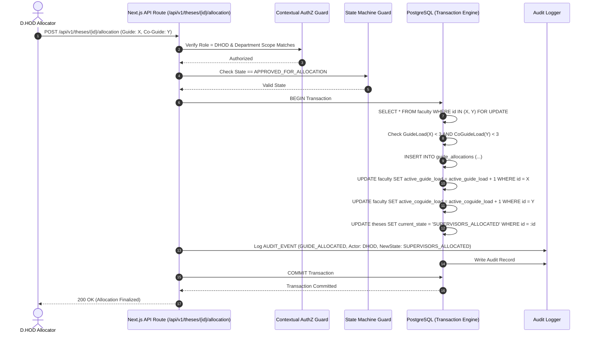
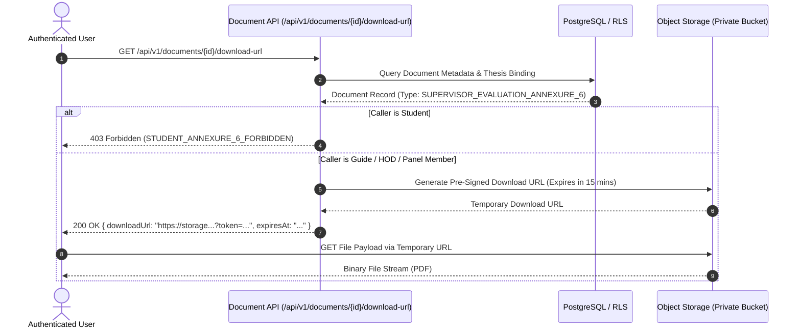

# NIET Dissertation Management System — API Contracts & Interface Specification

**Document ID:** `DOC-07-API`  
**File Path:** [`docs/07_API_CONTRACTS.md`](file:///c:/Users/user/Desktop/niet-dissertation-management-system/docs/07_API_CONTRACTS.md)  
**Document Status:** ARCHITECTURE FREEZE BASELINE (PHASE 3C)  
**Last Revised:** 2026-08-15  
**Governing Baselines:** [`docs/00_PROJECT_MASTER.md`](file:///c:/Users/user/Desktop/niet-dissertation-management-system/docs/00_PROJECT_MASTER.md), [`docs/01_REQUIREMENTS.md`](file:///c:/Users/user/Desktop/niet-dissertation-management-system/docs/01_REQUIREMENTS.md), [`docs/02_ARCHITECTURE.md`](file:///c:/Users/user/Desktop/niet-dissertation-management-system/docs/02_ARCHITECTURE.md), [`docs/03_DOMAIN_MODEL.md`](file:///c:/Users/user/Desktop/niet-dissertation-management-system/docs/03_DOMAIN_MODEL.md), [`docs/04_RBAC_MATRIX.md`](file:///c:/Users/user/Desktop/niet-dissertation-management-system/docs/04_RBAC_MATRIX.md), [`docs/05_STATE_MACHINES.md`](file:///c:/Users/user/Desktop/niet-dissertation-management-system/docs/05_STATE_MACHINES.md), and [`docs/06_DATABASE_SCHEMA.md`](file:///c:/Users/user/Desktop/niet-dissertation-management-system/docs/06_DATABASE_SCHEMA.md)  
**Institution:** Noida Institute of Engineering & Technology (NIET), Greater Noida  
**Target Architecture:** Next.js Route Handlers / RESTful API (`/api/v1`)  

---

## 1. API Architecture & Design Principles

This document provides the definitive, production-grade interface specification for the NIET Dissertation Management System (DMS). It establishes the formal contracts, request/response schemas, validation rules, HTTP status strategies, error payloads, and security boundaries governing communication between client interfaces, backend services, and external adapters.

### Core API Design Principles

1. **Explicit Server-Side Authorization:** Possession of a valid session token is necessary but not sufficient. Every protected endpoint independently evaluates:
   $$\text{Authorized} = f(\text{ActorRole}, \text{DepartmentTenancy}, \text{ThesisRelationship}, \text{ActiveDelegation}, \text{WorkflowState})$$
2. **State-Guarded Transition Endpoints:** Clients cannot arbitrarily set entity statuses (e.g. `status = "APPROVED"`). State changes require invoking dedicated transition endpoints (e.g. `POST /api/v1/dcec/dockets/{id}/decide`) that validate pre-conditions server-side.
3. **Annexure 6 Strict Access Isolation:** The endpoint `GET /api/v1/theses/{id}/annexure-6` permanently returns `403 Forbidden` for student callers, regardless of parameters or lifecycle state.
4. **Predictable Response Envelopes:** All responses adhere to standard JSON envelopes (`ApiResponse<T>` or `ApiErrorResponse`) with metadata and distributed correlation IDs.
5. **Idempotent State Mutations:** State transitions and allocation actions support idempotency keys to prevent duplicate execution during network retries.

```
┌────────────────────────────────────────────────────────────────────────────────────────┐
│                                   API CONVENTIONS                                      │
├────────────────────────────────────────────────────────────────────────────────────────┤
│ Base URL Pattern       : https://{domain}/api/v1                                       │
│ Content-Type           : application/json; charset=utf-8                               │
│ Authentication Header  : Cookie: dms_session={jwt_token} (HttpOnly, Secure, SameSite)  │
│ Tracing Header         : X-Correlation-ID: {uuid} (Generated on client or gateway)     │
│ Pagination Standard    : Offset (page, limit) or Cursor (cursor, limit <= 100)         │
└────────────────────────────────────────────────────────────────────────────────────────┘
```

---

## 2. Standardized Response & Error Contracts

### 2.1 Success Response Envelope (`ApiResponse<T>`)

```json
{
  "success": true,
  "data": {},
  "meta": {
    "timestamp": "2026-08-15T16:00:00.000Z",
    "correlationId": "8f2a6b10-3c9d-4e5f-8a1b-2c3d4e5f6a7b",
    "pagination": {
      "page": 1,
      "limit": 20,
      "totalRecords": 84,
      "totalPages": 5,
      "hasNextPage": true,
      "hasPrevPage": false
    }
  }
}
```

### 2.2 Standardized Error Envelope (`ApiErrorResponse`)

```json
{
  "success": false,
  "error": {
    "code": "OVER_CAPACITY_LIMIT",
    "message": "Faculty member has reached maximum allowable supervisor load of 3.",
    "details": [
      {
        "field": "guideId",
        "issue": "Current active Guide load is 3/3"
      }
    ]
  },
  "meta": {
    "timestamp": "2026-08-15T16:00:00.000Z",
    "correlationId": "8f2a6b10-3c9d-4e5f-8a1b-2c3d4e5f6a7b"
  }
}
```

### 2.3 Standardized Error Codes Catalog

| Error Code | HTTP Status | Meaning / Trigger Condition |
| :--- | :---: | :--- |
| `UNAUTHENTICATED` | 401 | Missing, invalid, or expired session token. |
| `FORBIDDEN` | 403 | Authenticated user lacks required role, department scope, or contextual assignment. |
| `STUDENT_ANNEXURE_6_FORBIDDEN`| 403 | Permanent security denial: Student attempted to access confidential supervisor evaluation. |
| `NOT_FOUND` | 404 | Target entity UUID does not exist or is invisible under RLS scope. |
| `INVALID_WORKFLOW_STATE` | 409 | Attempted action is illegal in the entity's current lifecycle state. |
| `SUPERVISOR_CAPACITY_BREACH` | 409 | Faculty member has reached capacity load limit of 3 (`GuideLoad <= 3` / `CoGuideLoad <= 3`). |
| `IDENTICAL_SUPERVISORS` | 409 | Guide and Co-Guide cannot be the same person ($\text{Guide} == \text{Co-Guide}$). |
| `DUPLICATE_TITLE_COLLISION` | 409 | Proposed title violates exact case-insensitive uniqueness in the active cohort. |
| `VALIDATION_FAILED` | 422 | Request payload failed Zod schema validation (e.g. invalid score range, missing fields). |
| `RATE_LIMIT_EXCEEDED` | 429 | Too many requests emitted from client IP within rate window. |
| `INTERNAL_SERVER_ERROR` | 500 | Unhandled server error (Internal stack trace suppressed from client). |

---

## 3. Master Endpoint Catalog

The DMS API surface comprises fifty-two (52) RESTful endpoints across thirteen (13) functional domains:

| Endpoint ID | Method | URI Path | Purpose & Action | Auth Role Required | RBAC Permission |
| :--- | :---: | :--- | :--- | :--- | :--- |
| `EP-AUTH-01` | `POST` | `/api/v1/auth/sso/callback` | Process institutional SSO assertion | Public / SSO | `USER_VIEW` |
| `EP-AUTH-02` | `GET` | `/api/v1/auth/me` | Retrieve active profile, roles & scope | Authenticated | `USER_VIEW` |
| `EP-AUTH-03` | `POST` | `/api/v1/auth/logout` | Revoke session & clear HTTP cookies | Authenticated | `USER_VIEW` |
| `EP-USER-01` | `GET` | `/api/v1/users` | List department users / faculty | `ADMIN`, `HOD`, `DC` | `USER_VIEW` |
| `EP-USER-02` | `POST` | `/api/v1/users` | Pre-seed faculty account | `ADMIN` Only | `USER_CREATE` |
| `EP-USER-03` | `POST` | `/api/v1/users/{id}/roles` | Assign role and department tenancy | `ADMIN` Only | `ROLE_ASSIGN` |
| `EP-ORG-01` | `GET` | `/api/v1/departments` | List institutional departments | Authenticated | `USER_VIEW` |
| `EP-ORG-02` | `GET` | `/api/v1/academic-sessions` | List active & historical sessions | Authenticated | `USER_VIEW` |
| `EP-THES-01` | `POST` | `/api/v1/theses` | Initialize candidate dissertation | `STUDENT` | `THESIS_CREATE` |
| `EP-THES-02` | `GET` | `/api/v1/theses` | List theses (filtered by role tenancy)| Contextual | `THESIS_VIEW` |
| `EP-THES-03` | `GET` | `/api/v1/theses/{id}` | Retrieve complete thesis aggregate | Contextual | `THESIS_VIEW` |
| `EP-THES-04` | `POST` | `/api/v1/theses/{id}/archive`| HOD final administrative sign-off | `HOD` | `THESIS_ARCHIVE` |
| `EP-ANN1-01` | `POST` | `/api/v1/theses/{id}/annexure-1`| Save draft Annexure 1 proposal | `STUDENT` (Owner) | `ANNEXURE_1_CREATE` |
| `EP-ANN1-02` | `GET` | `/api/v1/theses/{id}/annexure-1`| Retrieve Annexure 1 proposal & prefs | Contextual | `ANNEXURE_1_VIEW` |
| `EP-ANN1-03` | `POST` | `/api/v1/theses/{id}/annexure-1/submit`| Submit proposal into DC queue | `STUDENT` (Owner) | `ANNEXURE_1_SUBMIT` |
| `EP-DCEC-01` | `GET` | `/api/v1/dcec/queue` | List pending screening dockets | `DC`, `HOD`, `DHOD` | `DCEC_QUEUE_VIEW` |
| `EP-DCEC-02` | `GET` | `/api/v1/dcec/dockets/{id}` | Retrieve screening docket details | `DC`, `DCEC_CHAIR` | `DCEC_CASE_VIEW` |
| `EP-DCEC-03` | `POST` | `/api/v1/dcec/dockets/{id}/verify`| DC Maker compliance verification | `DC` (Maker) | `DCEC_DOCKET_VERIFY` |
| `EP-DCEC-04` | `POST` | `/api/v1/dcec/dockets/{id}/decide`| DCEC Chair binding approval/reject | `DCEC_CHAIR` (Checker)| `DCEC_CHAIR_APPROVE` |
| `EP-DCEC-05` | `POST` | `/api/v1/dcec/delegations` | Delegate Chair authority to D.HOD | `HOD` Only | `DELEGATION_CREATE` |
| `EP-DCEC-06` | `POST` | `/api/v1/dcec/delegations/{id}/revoke`| Revoke active Chair delegation | `HOD` Only | `DELEGATION_REVOKE` |
| `EP-ALLOC-01`| `GET` | `/api/v1/allocations/queue` | List cleared proposals awaiting guides| `DHOD` Only | `ALLOCATION_QUEUE_VIEW`|
| `EP-ALLOC-02`| `GET` | `/api/v1/allocations/capacity`| Real-time faculty guide loads ($X/3$)| `DHOD`, `HOD` | `ALLOCATION_QUEUE_VIEW`|
| `EP-ALLOC-03`| `POST` | `/api/v1/theses/{id}/allocation`| D.HOD allocates Guide & Co-Guide | `DHOD` Only | `SUPERVISOR_ALLOCATE` |
| `EP-ALLOC-04`| `POST` | `/api/v1/theses/{id}/reallocation`| Reallocate supervisor with reason | `DHOD` Only | `SUPERVISOR_REALLOC` |
| `EP-ALLOC-05`| `GET` | `/api/v1/theses/{id}/allocation-history`| View immutable allocation log | `DHOD`, `HOD`, `ADMIN`| `ALLOC_HISTORY_VIEW` |
| `EP-ANN2-01` | `POST` | `/api/v1/theses/{id}/annexure-2`| Submit Annexure 2 title docket | `STUDENT` (Owner) | `ANNEXURE_2_SUBMIT` |
| `EP-ANN2-02` | `GET` | `/api/v1/theses/{id}/annexure-2`| Retrieve Annexure 2 details | Contextual | `ANNEXURE_2_VIEW` |
| `EP-ANN2-03` | `POST` | `/api/v1/theses/{id}/annexure-2/endorse`| Guide / Co-Guide electronic endorsement| `GUIDE`, `CO_GUIDE` | `ANNEXURE_2_ENDORSE` |
| `EP-ANN2-04` | `POST` | `/api/v1/theses/{id}/annexure-2/approve`| DCEC Chair formal title approval | `DCEC_CHAIR` | `TITLE_APPROVE` |
| `EP-LOG-01` | `POST` | `/api/v1/theses/{id}/logbook` | Log supervisory meeting interaction | `STUDENT` (Owner) | `ANNEXURE_4_CREATE` |
| `EP-LOG-02` | `GET` | `/api/v1/theses/{id}/logbook` | List digital logbook entries | `STUDENT`, `Supervisors`| `ANNEXURE_4_VIEW` |
| `EP-LOG-03` | `POST` | `/api/v1/theses/{id}/logbook/{entryId}/verify`| Supervisor verifies meeting entry| `GUIDE`, `CO_GUIDE` | `ANNEXURE_4_VERIFY` |
| `EP-LOG-04` | `POST` | `/api/v1/theses/{id}/logbook/{entryId}/revise`| Return entry to student for edit | `GUIDE`, `CO_GUIDE` | `ANNEXURE_4_REVISE` |
| `EP-PROG-01` | `POST` | `/api/v1/theses/{id}/progress-reports`| Submit weekly/monthly report | `STUDENT` (Owner) | `PROGRESS_REPORT_SUBMIT`|
| `EP-PROG-02` | `POST` | `/api/v1/theses/{id}/progress-reports/{reportId}/ack`| Supervisor acknowledges progress| `GUIDE`, `CO_GUIDE` | `PROGRESS_REPORT_ACK` |
| `EP-RUB-01` | `POST` | `/api/v1/rubrics` | Create master rubric template | `ADMIN` (Rubric Builder)| `RUBRIC_CREATE` |
| `EP-RUB-02` | `GET` | `/api/v1/rubrics` | List departmental rubrics | Authenticated | `RUBRIC_VIEW` |
| `EP-RUB-03` | `POST` | `/api/v1/rubrics/{id}/versions`| Draft 4-column criteria version | `ADMIN` | `RUBRIC_UPDATE` |
| `EP-RUB-04` | `POST` | `/api/v1/rubrics/versions/{versionId}/publish`| Publish & lock rubric version | `HOD`, `ADMIN` | `RUBRIC_PUBLISH` |
| `EP-MILE-01` | `POST` | `/api/v1/theses/{id}/milestones/{type}/schedule`| Schedule P1, P2, P3 presentation| `DC`, `HOD` | `MILESTONE_SCHEDULE` |
| `EP-MILE-02` | `POST` | `/api/v1/theses/{id}/milestones/{type}/evaluate`| Submit scored rubric marks (/100) | `DCEC_MEMBER`, `CHAIR`| `MILESTONE_EVALUATE` |
| `EP-MILE-03` | `GET` | `/api/v1/theses/{id}/milestones/{type}`| Retrieve scored milestone scorecard | Contextual | `MILESTONE_VIEW` |
| `EP-ANN5-01` | `POST` | `/api/v1/theses/{id}/annexure-5`| Submit final manuscript package | `STUDENT` (Owner) | `ANNEXURE_5_SUBMIT` |
| `EP-ANN5-02` | `POST` | `/api/v1/theses/{id}/annexure-5/endorse`| Guide & Co-Guide endorse package | `GUIDE`, `CO_GUIDE` | `ANNEXURE_5_ENDORSE` |
| `EP-ANN6-01` | `POST` | `/api/v1/theses/{id}/annexure-6`| Submit confidential supervisor score | `GUIDE` (Primary Only)| `ANNEXURE_6_SUBMIT` |
| `EP-ANN6-02` | `GET` | `/api/v1/theses/{id}/annexure-6`| Retrieve confidential evaluation | `GUIDE`, `CHAIR`, `PANEL`| `ANNEXURE_6_VIEW` |
| `EP-VIVA-01` | `POST` | `/api/v1/theses/{id}/viva/panel`| Appoint 2-member expert panel | `HOD`, `DC` | `PANEL_CONSTITUTE` |
| `EP-VIVA-02` | `POST` | `/api/v1/theses/{id}/viva/evaluate`| Submit panel member scorecard | `PANEL_MEMBER` | `VIVA_EVALUATE` |
| `EP-VIVA-03` | `POST` | `/api/v1/theses/{id}/viva/result`| Finalize oral defense outcome | `HOD`, Panel Chair | `VIVA_RESULT_SUBMIT` |
| `EP-DOC-01` | `POST` | `/api/v1/documents/upload-intent`| Request pre-signed upload URL (<=5MB)| Authenticated | `DOCUMENT_UPLOAD` |
| `EP-DOC-02` | `POST` | `/api/v1/documents/upload-complete`| Verify MIME & register document | Authenticated | `DOCUMENT_UPLOAD` |
| `EP-DOC-03` | `GET` | `/api/v1/documents/{id}/download-url`| Request short-lived pre-signed URL | Contextual | `DOCUMENT_DOWNLOAD` |
| `EP-AUD-01` | `GET` | `/api/v1/audit-events` | Query immutable compliance log | `ADMIN`, `HOD` | `AUDIT_LOG_VIEW` |
| `EP-CONF-01` | `GET` | `/api/v1/configurations` | Retrieve system & policy params | `ADMIN`, `HOD` | `CONFIG_VIEW` |
| `EP-CONF-02` | `PATCH`| `/api/v1/configurations/{key}` | Update runtime policy parameter | `ADMIN` Only | `CONFIG_UPDATE` |

---

## 4. Granular Endpoint Specifications & Payload Contracts

### 4.1 Authentication & Identity Domain

#### `EP-AUTH-02`: Retrieve Active User Profile & Scoped Context
- **Method / Path:** `GET /api/v1/auth/me`
- **Request Headers:** `Cookie: dms_session={jwt}`
- **Success Response (`200 OK`):**
```json
{
  "success": true,
  "data": {
    "user": {
      "id": "a1b2c3d4-e5f6-4a5b-8c9d-0e1f2a3b4c5d",
      "email": "faculty.cse@niet.co.in",
      "fullName": "Dr. Ramesh Sharma",
      "roles": [
        {
          "roleId": "FACULTY",
          "departmentId": "d1e2f3a4-b5c6-4d7e-8f9a-0b1c2d3e4f5a",
          "departmentCode": "CSE",
          "isDelegated": false
        },
        {
          "roleId": "DHOD",
          "departmentId": "d1e2f3a4-b5c6-4d7e-8f9a-0b1c2d3e4f5a",
          "departmentCode": "CSE",
          "isDelegated": false
        }
      ],
      "activeAssignments": {
        "activeGuideCount": 2,
        "activeCoGuideCount": 1,
        "maxAllowableLoad": 3
      }
    }
  },
  "meta": { "timestamp": "2026-08-15T16:00:00.000Z", "correlationId": "cor-001" }
}
```

---

### 4.2 Annexure 1 & Guide Preference Domain

#### `EP-ANN1-03`: Submit Annexure 1 Proposal with 4 Ranked Preferences
- **Method / Path:** `POST /api/v1/theses/{id}/annexure-1/submit`
- **State Guard:** Pre-condition state: `DRAFT_PROPOSAL` $\rightarrow$ Post-condition state: `ANNEXURE_1_SUBMITTED`
- **Request Payload (`application/json`):**
```json
{
  "proposedTitle": "Deep Learning Approaches for Autonomous UAV Navigation in GPS-Denied Environments",
  "broadDomain": "Artificial Intelligence & Robotics",
  "problemStatement": "Autonomous UAV navigation in subterranean or GPS-denied environments suffers from drift...",
  "expectedOutcomes": "A robust visual-inertial SLAM architecture integrated with deep reinforcement learning...",
  "preferences": [
    {
      "rank": 1,
      "facultyId": "f1a2b3c4-d5e6-4f7a-8b9c-0d1e2f3a4b5c",
      "justification": "Primary research alignment with Dr. Sharma's published works in aerial robotics."
    },
    {
      "rank": 2,
      "facultyId": "f2b3c4d5-e6f7-4a8b-9c0d-1e2f3a4b5c6d",
      "justification": "Secondary alignment with Computer Vision laboratory research."
    },
    {
      "rank": 3,
      "facultyId": "f3c4d5e6-f7a8-4b9c-0d1e-2f3a4b5c6d7e",
      "justification": "Expertise in deep reinforcement learning control algorithms."
    },
    {
      "rank": 4,
      "facultyId": "f4d5e6f7-a8b9-4c0d-1e2f-3a4b5c6d7e8f",
      "justification": "Embedded systems and real-time GPU hardware acceleration."
    }
  ]
}
```
- **Validation Constraints:** Exactly 4 distinct `facultyId` UUIDs; rank sequence $1..4$; working title $\le 255$ characters.

---

### 4.3 DCEC Screening & Decision Domain

#### `EP-DCEC-04`: DCEC Chair Binding Screening Decision
- **Method / Path:** `POST /api/v1/dcec/dockets/{id}/decide`
- **Authorization:** `ROLE_DCEC_CHAIR` (HOD or delegated D.HOD)
- **Request Payload:**
```json
{
  "outcome": "APPROVED",
  "formalRemarks": "Proposal demonstrates significant novelty and rigorous methodology. Approved for Guide Allocation.",
  "requiredModifications": null
}
```
- **Outcome Values:** `APPROVED` (advances to `APPROVED_FOR_ALLOCATION`), `REVISION_REQUIRED` (returns to `ANNEXURE_1_REVISION`), `REJECTED` (terminates proposal).

---

### 4.4 Guide / Co-Guide Allocation Domain (D.HOD Exclusive)

#### `EP-ALLOC-03`: D.HOD Manual Supervisor Allocation
- **Method / Path:** `POST /api/v1/theses/{id}/allocation`
- **Authorization:** `ROLE_DHOD` Only (Sole allocating authority in V1)
- **State Guard:** Pre-condition state: `APPROVED_FOR_ALLOCATION` $\rightarrow$ Post-condition state: `SUPERVISORS_ALLOCATED`
- **Request Payload:**
```json
{
  "guideFacultyId": "f1a2b3c4-d5e6-4f7a-8b9c-0d1e2f3a4b5c",
  "coGuideFacultyId": "f3c4d5e6-f7a8-4b9c-0d1e-2f3a4b5c6d7e",
  "allocationNotes": "Allocated based on candidate Rank 1 preference and Rank 3 reinforcement learning co-supervision."
}
```
- **Concurrency & Integrity Invariants:**
  1. $\text{guideFacultyId} \neq \text{coGuideFacultyId}$ (Enforced by `chk_guide_alloc_distinct`).
  2. $\text{ActiveGuideLoad(guide)} < 3 \land \text{ActiveCoGuideLoad(coGuide)} < 3$ (Evaluated via `SELECT FOR UPDATE`).

---

### 4.5 Digital Logbook Domain (Annexure 4)

#### `EP-LOG-01`: Log Supervisory Interaction (Online / Offline)
- **Method / Path:** `POST /api/v1/theses/{id}/logbook`
- **Authorization:** `ROLE_STUDENT` (Owner)
- **Request Payload (Online Mode):**
```json
{
  "mode": "ONLINE",
  "meetingDateTime": "2026-08-15T14:30:00.000Z",
  "meetingLocationOrUrl": "https://meet.google.com/abc-defg-hij",
  "discussionAgenda": "Review of literature survey matrix and sensor fusion model.",
  "workCompletedSummary": "Completed comparative analysis of 15 benchmark papers and configured ROS2 environment.",
  "actionItemsAssigned": "Implement EKF sensor fusion node and benchmark latency on Jetson Orin.",
  "nextMilestoneTargetDate": "2026-08-30"
}
```

---

### 4.6 Milestone Presentation & Dynamic Rubric Domain (P1, P2, P3)

#### `EP-MILE-02`: Submit Milestone Evaluation Scorecard (/100)
- **Method / Path:** `POST /api/v1/theses/{id}/milestones/{type}/evaluate`
- **Path Parameters:** `type` = `P1` | `P2` | `P3`
- **Authorization:** `ROLE_DCEC_MEMBER` / `ROLE_DCEC_CHAIR`
- **Request Payload:**
```json
{
  "rubricVersionId": "r1v2c3d4-e5f6-4a5b-8c9d-0e1f2a3b4c5d",
  "criterionScores": [
    {
      "criterionId": "c1a2b3c4-d5e6-4f7a-8b9c-0d1e2f3a4b5c",
      "selectedLevelId": "l1a2b3c4-d5e6-4f7a-8b9c-0d1e2f3a4b5c",
      "awardedMarks": 25.0,
      "remarks": "Exemplary problem formulation and literature synthesis."
    },
    {
      "criterionId": "c2b3c4d5-e6f7-4a8b-9c0d-1e2f3a4b5c6d",
      "selectedLevelId": "l2b3c4d5-e6f7-4a8b-9c0d-1e2f3a4b5c6d",
      "awardedMarks": 22.5,
      "remarks": "Solid methodology with minor ambiguity in sensor noise modeling."
    },
    {
      "criterionId": "c3c4d5e6-f7a8-4b9c-0d1e-2f3a4b5c6d7e",
      "selectedLevelId": "l3c4d5e6-f7a8-4b9c-0d1e-2f3a4b5c6d7e",
      "awardedMarks": 20.0,
      "remarks": "Preliminary simulation results presented clearly."
    },
    {
      "criterionId": "c4d5e6f7-a8b9-4c0d-1e2f-3a4b5c6d7e8f",
      "selectedLevelId": "l4d5e6f7-a8b9-4c0d-1e2f-3a4b5c6d7e8f",
      "awardedMarks": 20.0,
      "remarks": "Confident responses during technical viva."
    }
  ],
  "generalFeedback": "Candidate is making satisfactory progress. Maintain momentum towards hardware integration."
}
```
- **Evaluation Total Calculation:** Server computes total marks $= 25.0 + 22.5 + 20.0 + 20.0 = 87.5 / 100.0$.
- **Contribution Rule:** If `type == 'P3'`, score is registered for final transcript calculation; P1/P2 stored as formative records.

---

### 4.7 Confidential Supervisor Evaluation Domain (Annexure 6)

#### `EP-ANN6-01`: Primary Guide Submits Confidential Annexure 6
- **Method / Path:** `POST /api/v1/theses/{id}/annexure-6`
- **Authorization:** `ROLE_GUIDE` Only (Primary Guide of Record)
- **Request Payload:**
```json
{
  "supervisorScore": 92.0,
  "regularityRating": "EXEMPLARY",
  "technicalProficiency": "PROFICIENT",
  "rigorRating": "EXEMPLARY",
  "confidentialRemarks": "The candidate has demonstrated exceptional autonomy and dedication, authoring a high-impact manuscript.",
  "defenseRecommendation": "RECOMMENDED_FOR_DEFENSE"
}
```

#### `EP-ANN6-02`: Retrieve Annexure 6 (Security Isolation Contract)
- **Method / Path:** `GET /api/v1/theses/{id}/annexure-6`
- **Student Access Behavior:** **HTTP `403 Forbidden`** with error code `STUDENT_ANNEXURE_6_FORBIDDEN`.
- **Authorized Caller Response (Guide, HOD, Panel Members):** Returns score, ratings, and confidential remarks.

---

### 4.8 Document Storage & Pre-Signed URL Domain

#### `EP-DOC-01`: Initiate Pre-Signed Secure Upload Intent
- **Method / Path:** `POST /api/v1/documents/upload-intent`
- **Request Payload:**
```json
{
  "thesisId": "t1a2b3c4-d5e6-4f7a-8b9c-0d1e2f3a4b5c",
  "documentType": "THESIS_MANUSCRIPT_ANNEXURE_5",
  "originalFilename": "MTech_Dissertation_Final_240133.pdf",
  "mimeType": "application/pdf",
  "fileSizeBytes": 4194304
}
```
- **Validation Guard:** `fileSizeBytes <= 5242880` (5 MB prototype upload limit).
- **Success Response (`200 OK`):**
```json
{
  "success": true,
  "data": {
    "documentId": "doc-8f2a6b10-3c9d-4e5f-8a1b-2c3d4e5f6a7b",
    "storageKey": "CSE/2025-2026/t1a2b3c4/doc-8f2a6b10.pdf",
    "uploadUrl": "https://storage.supabase.co/storage/v1/object/upload/sign/niet-dissertations-private/...?token=...",
    "expiresAt": "2026-08-15T16:15:00.000Z"
  }
}
```

---

## 5. State-Changing API Transaction & Concurrency Flow



---

## 6. Private File Access & Download Security Flow



---

## 7. Open API Questions & Unresolved Boundaries

In strict accordance with the Anti-Hallucination Rule, the following API behaviors remain explicitly open:

| Open Decision ID | Target Endpoint | Unresolved API Behavior | Current Contract Stance |
| :--- | :--- | :--- | :--- |
| `REQ-OD-002` | `POST /theses/{id}/viva/result` | Exact mathematical formula calculating overall composite transcript grade. | Returns individual component scores (`p3Score`, `supervisorScore`, `vivaScore`); composite grade placeholder. |
| `REQ-OD-004` | `GET/POST /theses/{id}/annexure-6`| Co-Guide rights to submit or co-sign Annexure 6. | **Blocked by default:** Only primary Guide can submit; Co-Guide receives `403 Forbidden`. |
| `REQ-OD-007` | `POST /documents/upload-intent` | Production document size limits and quotas beyond 5 MB. | Enforces hard `fileSizeBytes <= 5242880` (5 MB) validation. |
| `REQ-OD-008` | `POST /theses/{id}/viva/panel` | Conflict of interest: Can primary Guide serve on candidate's viva panel? | **Blocked by default:** API rejects assignment if `facultyId == thesis.guideId`. |

---

## 8. Future API Capabilities (Slated for Post-V1)

The following endpoints are recognized in the system roadmap but are **strictly excluded from Version 1**:
- `POST /api/v1/ai/guide-matching/recommendations`: AI semantic similarity vector search matching proposals to faculty publications.
- `POST /api/v1/allocations/auto-solver/execute`: Linear programming solver executing automated multi-candidate allocation.
- `POST /api/v1/integrations/turnitin/dispatch`: Programmatic API dispatch pushing manuscripts to Turnitin webhooks.
- `POST /api/v1/integrations/erp/sync`: Bi-directional background sync trigger with campus ERP.

---

## 9. Endpoint-to-Requirement Traceability Matrix

| Endpoint Group | Governing Requirement IDs | Source Document & Section | Rationale / Traceability Note |
| :--- | :--- | :--- | :--- |
| `EP-AUTH-01`..`03` | `REQ-AUTH-001`, `REQ-AUTH-003` | `01_REQUIREMENTS.md §16` | Institutional SSO-only for students; pre-seeded faculty |
| `EP-THES-01`..`04` | `REQ-WF-001`, `REQ-ARCH-001` | `01_REQUIREMENTS.md §8, §5.12` | Dissertation lifecycle tracking and HOD sign-off |
| `EP-ANN1-01`..`03` | `REQ-ANN1-001`..`003` | `01_REQUIREMENTS.md §5.2` | Proposal submission with 4 ranked preferences |
| `EP-DCEC-01`..`06` | `REQ-DCEC-001`..`005`, `REQ-DCEC-MGT-004`| `01_REQUIREMENTS.md §5.3, §9` | DCEC Maker-Checker screening & delegation |
| `EP-ALLOC-01`..`05` | `REQ-ALLOC-001`..`009`, `REQ-ALLOC-SPEC-001`..`004`| `01_REQUIREMENTS.md §5.4, §10` | D.HOD sole allocation authority (Load $\le 3$) |
| `EP-ANN2-01`..`04` | `REQ-ANN2-001`..`003` | `01_REQUIREMENTS.md §5.5` | Annexure 2 title approval & supervisor endorsements |
| `EP-LOG-01`..`04` | `REQ-ANN4-001`..`005` | `01_REQUIREMENTS.md §5.6` | Digital logbook online/offline meeting verifications |
| `EP-RUB-01`..`04` | `REQ-RUB-001`..`003` | `01_REQUIREMENTS.md §13` | Dynamic 4-column rubric builder & version pinning |
| `EP-MILE-01`..`03` | `REQ-EVAL-001`..`005`, `REQ-EVAL-P1-001`..`P3-002`| `01_REQUIREMENTS.md §5.8` | P1, P2, P3 presentation grading (/100; only P3 counts)|
| `EP-ANN5-01`..`02` | `REQ-ANN5-001`..`004` | `01_REQUIREMENTS.md §5.9` | Final manuscript submission & Turnitin certificate |
| `EP-ANN6-01`..`02` | `REQ-ANN6-001`, `REQ-ANN6-002` | `01_REQUIREMENTS.md §5.10`| Confidential supervisor evaluation (**Student Blocked**)|
| `EP-VIVA-01`..`03` | `REQ-PANEL-001`, `REQ-VIVA-001`..`004`| `01_REQUIREMENTS.md §5.11`| 2-member panel oral defense & Re-Viva retry |
| `EP-DOC-01`..`03` | `REQ-FILE-001`..`003`, `REQ-PROTO-001`| `01_REQUIREMENTS.md §15, §22` | Pre-signed upload/download URLs (5 MB limit) |
| `EP-AUD-01` | `REQ-AUD-001`..`003` | `01_REQUIREMENTS.md §18` | Queryable append-only compliance audit trail |

---

## 10. API Contract Validation & Anti-Hallucination Verification

- [x] **No Application Code Written:** Confirmed zero source code files or API route handlers implemented.
- [x] **No Database Tables or SQL Created:** Confirmed interface contracts are technical specifications; no database migrations or DDL executed.
- [x] **All 52 Master Endpoints Exhaustively Specified:** Complete HTTP methods, paths, request payloads, response envelopes, and error codes defined.
- [x] **Annexure 6 Student Lockout Enforced:** `EP-ANN6-02` strictly documents `403 Forbidden` for students.
- [x] **D.HOD Allocation & Capacity Invariants Preserved:** Concurrency-safe D.HOD allocation enforcing $\text{Load} \le 3$ and $\text{Guide} \neq \text{Co-Guide}$.
- [x] **Single File Scope Respected:** ONLY [`docs/07_API_CONTRACTS.md`](file:///c:/Users/user/Desktop/niet-dissertation-management-system/docs/07_API_CONTRACTS.md) was modified.
