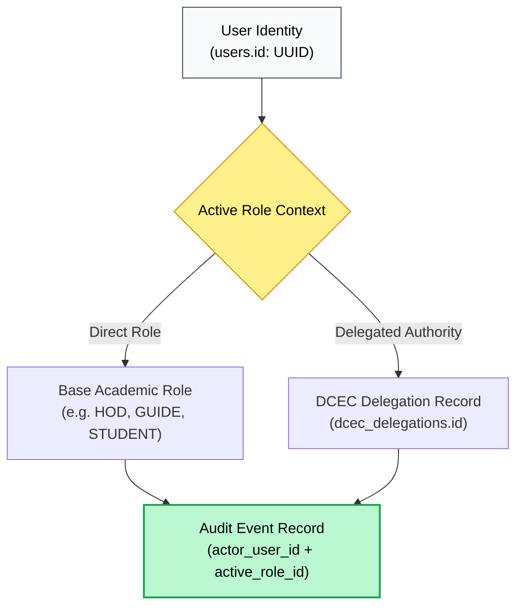
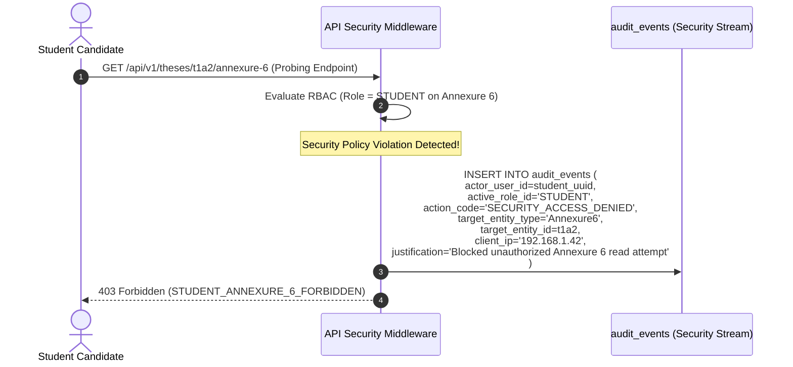

# NIET Dissertation Management System — Audit Trail & Compliance Model

**Document ID:** `DOC-08-AUDIT`  
**File Path:** [`docs/08_AUDIT_MODEL.md`](file:///c:/Users/user/Desktop/niet-dissertation-management-system/docs/08_AUDIT_MODEL.md)  
**Document Status:** ARCHITECTURE FREEZE BASELINE (PHASE 3D)  
**Last Revised:** 2026-08-15  
**Governing Baselines:** [`docs/00_PROJECT_MASTER.md`](file:///c:/Users/user/Desktop/niet-dissertation-management-system/docs/00_PROJECT_MASTER.md), [`docs/01_REQUIREMENTS.md`](file:///c:/Users/user/Desktop/niet-dissertation-management-system/docs/01_REQUIREMENTS.md), [`docs/02_ARCHITECTURE.md`](file:///c:/Users/user/Desktop/niet-dissertation-management-system/docs/02_ARCHITECTURE.md), [`docs/03_DOMAIN_MODEL.md`](file:///c:/Users/user/Desktop/niet-dissertation-management-system/docs/03_DOMAIN_MODEL.md), [`docs/04_RBAC_MATRIX.md`](file:///c:/Users/user/Desktop/niet-dissertation-management-system/docs/04_RBAC_MATRIX.md), [`docs/05_STATE_MACHINES.md`](file:///c:/Users/user/Desktop/niet-dissertation-management-system/docs/05_STATE_MACHINES.md), [`docs/06_DATABASE_SCHEMA.md`](file:///c:/Users/user/Desktop/niet-dissertation-management-system/docs/06_DATABASE_SCHEMA.md), and [`docs/07_API_CONTRACTS.md`](file:///c:/Users/user/Desktop/niet-dissertation-management-system/docs/07_API_CONTRACTS.md)  
**Institution:** Noida Institute of Engineering & Technology (NIET), Greater Noida  
**Target Program:** M.Tech / M.Tech Integrated Dissertation Governance  

---

## 1. Document Purpose & Audit Objectives

This document establishes the definitive **Audit Trail & Legal Compliance Architecture** for the NIET Dissertation Management System (DMS). It defines the data models, event schemas, capture mechanisms, immutability controls, and querying boundaries necessary to provide full historical reconstructability, non-repudiation, and regulatory traceability for all academically significant and security-sensitive actions across the institution.

### Core Audit Objectives

1. **Academic Non-Repudiation:** Guarantee that every academic decision (proposal screening, supervisor allocation, milestone evaluation, viva defense outcome) is permanently linked to the acting faculty authority with timestamped evidence.
2. **Historical Workflow Reconstructability:** Enable institutional authorities (HOD, DCEC, Academic Council) to reconstruct the complete state evolution of any dissertation at any point in its multi-year lifecycle.
3. **Security Accountability & Anomaly Detection:** Track all privilege delegations, administrative modifications, authentication events, and unauthorized access attempts (such as student attempts to view confidential Annexure 6 records).
4. **Append-Only Tamper Resistance:** Ensure audit records cannot be altered, overwritten, backdated, or deleted by any user or technical administrator.
5. **Privacy & Data Minimization:** Prevent audit streams from becoming accidental side-channels for sensitive secrets, credentials, or confidential evaluation narratives.

---

## 2. Core Audit Design Principles

1. **Append-Only Immutability:** Audit records are write-once, read-only (`WORM`). The database tier contains **zero `UPDATE` or `DELETE` grants** or RLS policies for audit entities.
2. **Atomic Transactional Capture:** Academically critical state mutations and their corresponding audit event records execute within the **same ACID database transaction**. If audit emission fails, the business mutation rolls back.
3. **Actor Context Disambiguation:** Audit records capture not only the authenticated user identity (UUID) but also the specific **active academic role**, department tenancy, and delegation context utilized at the moment of execution.
4. **Complete Pre/Post State Deltas:** State-changing events record structured JSON snapshots of the entity state immediately before (`previous_state`) and after (`new_state`) the transaction.
5. **Strict Server-Generated Timestamps:** All event timestamps are generated exclusively by the database server clock (`clock_timestamp()` in UTC). Client-supplied timestamps are untrusted.
6. **Zero-Secret Logging:** Passwords, JWT session secrets, API tokens, and full document binary payloads are strictly excluded from audit metadata.

---

## 3. Structural Triad: Audit Logs vs. Application Logs vs. Security Logs

The architecture strictly decouples three distinct logging domains to prevent mixing technical diagnostic noise with legal academic records:

```
┌────────────────────────────────────────────────────────────────────────────────────────┐
│                                 LOGGING DOMAIN TRIAD                                   │
├────────────────────────────────────────────────────────────────────────────────────────┤
│ 1. Legal Academic Audit Trail (audit_events Table) :                                   │
│    • Purpose     : Institutional compliance, grade verification, decision audit.       │
│    • Target Store: Relational PostgreSQL database (Append-Only, Protected by RLS).     │
│    • Retention   : Permanent / Long-term regulatory archival.                          │
├────────────────────────────────────────────────────────────────────────────────────────┤
│ 2. Security Incident Log (Security Events / WAF Streams) :                              │
│    • Purpose     : Intrusion detection, brute-force mitigation, unauthorized probes.   │
│    • Target Store: Application logging stream / SIEM adapter.                          │
│    • Retention   : 90-180 days rolling window.                                         │
├────────────────────────────────────────────────────────────────────────────────────────┤
│ 3. Technical Application Diagnostic Log (Stdout / Winston / Pino) :                     │
│    • Purpose     : Software debugging, performance metrics, unhandled stack traces.    │
│    • Target Store: Ephemeral container logs / Cloud watch stream.                      │
│    • Retention   : 14-30 days rolling window.                                          │
└────────────────────────────────────────────────────────────────────────────────────────┘
```

---

## 4. Conceptual Audit Event Model & Field Catalog

Every auditable interaction in the DMS produces an `AuditEvent` record adhering to the following schema:

```
                                AUDIT EVENT MODEL
┌──────────────────────┬────────────────────────┬────────────────────────────────────────┐
│ Field Name           │ Type Concept           │ Description & Invariant                │
├──────────────────────┼────────────────────────┼────────────────────────────────────────┤
│ id                   │ UUID (PK)              │ Globally unique event identifier       │
│ actor_user_id        │ UUID (FK users.id)     │ Authenticated user executing action    │
│ active_role_id       │ VARCHAR(32)            │ Role utilized (e.g. 'DHOD', 'GUIDE')   │
│ delegation_id        │ UUID (Nullable FK)     │ Active delegation context if acting    │
│ action_code          │ VARCHAR(64)            │ Standardized action verb               │
│ target_entity_type   │ VARCHAR(64)            │ Domain entity type (e.g. 'Thesis')     │
│ target_entity_id     │ UUID                   │ Primary key of affected resource       │
│ previous_state       │ JSONB (Nullable)       │ Pre-mutation entity snapshot           │
│ new_state            │ JSONB (Nullable)       │ Post-mutation entity snapshot          │
│ justification        │ TEXT (Nullable)        │ Mandatory institutional justification  │
│ client_ip            │ VARCHAR(45)            │ IPv4/IPv6 client provenance address    │
│ user_agent           │ TEXT                   │ Client browser user-agent header       │
│ correlation_id       │ UUID                   │ Distributed request tracing identifier │
│ timestamp_utc        │ TIMESTAMPTZ            │ Authoritative UTC database timestamp   │
└──────────────────────┴────────────────────────┴────────────────────────────────────────┘
```

---

## 5. Actor & Authority Representation Model

The audit system distinguishes between base identity, assigned academic role, and delegated institutional authority:



### Critical Actor Invariants
- **Technical Administrator Isolation:** When `ROLE_ADMIN` provisions users or configures system settings, the audit log records `active_role_id = 'ADMIN'`. Administrators cannot emit academic action codes (e.g. `DCEC_CHAIR_APPROVE` or `SUPERVISOR_ALLOCATE`).
- **DCEC Chair Disambiguation:** When D.HOD acts as DCEC Chair under formal delegation, the audit record stores `actor_user_id = dhod_user_id`, `active_role_id = 'DCEC_CHAIR'`, and `delegation_id = delegation_uuid`.

---

## 6. Domain-Specific Audit Models

### 6.1 DCEC Screening & Decision Audit Model
- **Maker-Checker Traceability:**
  - Maker step: Department Coordinator compiles docket $\rightarrow$ Emits `DCEC_DOCKET_VERIFIED` with checklist boolean flags in `new_state`.
  - Checker step: DCEC Chair evaluates docket $\rightarrow$ Emits `DCEC_DECISION_SUBMITTED` capturing `outcome` (`APPROVED`, `REVISION_REQUIRED`, `REJECTED`), formal remarks, and state transition to `APPROVED_FOR_ALLOCATION`.
- **Chair Delegation Audit:** HOD executing delegation emits `DCEC_DELEGATION_CREATED` capturing `hod_user_id`, `dhod_user_id`, `effective_from`, `effective_until`, and mandatory `justification`.

### 6.2 Supervisor Allocation & Reallocation Audit Model
- **D.HOD Sole Allocation Capture:** D.HOD assigns supervisors $\rightarrow$ Emits `SUPERVISOR_ALLOCATED` capturing:
  ```json
  {
    "thesisId": "t1a2b3c4-...",
    "guideFacultyId": "f1a2b3c4-...",
    "coGuideFacultyId": "f3c4d5e6-...",
    "guideLoadAfter": 3,
    "coGuideLoadAfter": 2
  }
  ```
- **Reallocation Audit Trail:** Any supervisor adjustment emits `SUPERVISOR_REALLOCATED` capturing previous supervisor IDs, new supervisor IDs, and mandatory textual `justification`. Previous records remain permanently preserved in `guide_allocation_history`.

### 6.3 Dynamic Rubric & Versioning Audit Model
- **Version Locking Audit:** Publishing a rubric version emits `RUBRIC_VERSION_PUBLISHED` capturing `rubric_id`, `version_number`, total max score (100.0), and 4-column achievement criteria criteria snapshots.
- **Historical Immutability Invariant:** Audit records prove that subsequent rubric revisions never mutate historical evaluation scorecards.

### 6.4 Milestone Presentation Evaluation Audit Model (P1, P2, P3)
- **Criterion Mark Breakdown:** Evaluator submits scoresheet $\rightarrow$ Emits `MILESTONE_EVALUATION_SUBMITTED` capturing `rubric_version_id`, criterion-level scores ($c_1, c_2, c_3, c_4$), awarded total marks ($0.0..100.0$), and qualitative feedback.
- **Grading Exclusivity:** P3 evaluation audit explicitly marks `is_contributing_to_final_grade = true`; P1/P2 evaluations marked `is_formative_checkpoint = true`.

### 6.5 Confidential Supervisor Evaluation (Annexure 6) Audit & Security Boundary
- **Confidential Submission Capture:** Primary Guide submits Annexure 6 $\rightarrow$ Emits `ANNEXURE_6_SUBMITTED` capturing `supervisor_score` ($0..100$), rating dimensions, and recommendation.
- **Anti-Side-Channel Invariant:** The confidential textual remarks are **hashed or omitted** from public audit views to prevent the audit trail from leaking confidential remarks to unauthorized roles.
- **Unauthorized Access Attempt Audit:** If a student attempts `GET /api/v1/theses/{id}/annexure-6`, the system blocks the request and emits `SECURITY_ACCESS_DENIED` capturing the candidate's `student_id`, IP address, and attempted endpoint.

### 6.6 Viva Defense & Re-Viva Failure Remediation Audit Model
- **Defense Result Audit:** Panel Chair submits outcome $\rightarrow$ Emits `VIVA_RESULT_FINALIZED` capturing composite score, attempt index ($1$), and outcome (`PASSED`, `FAILED`).
- **Remediation Invariant:** If `outcome == 'FAILED'`, the transaction instantiates a new remediation cycle and emits `RE_VIVA_CYCLE_INITIATED` with `cycle_index = 2`, preserving the **exact same `ThesisId`**.

---

## 7. Master Audit Event Catalog

The following catalog defines all thirty-four (34) official audit event types in the DMS:

| Event ID | Action Code | Domain | Target Resource | Actor Context | Mandatory Justification | State Transition Triggered |
| :--- | :--- | :--- | :--- | :--- | :---: | :--- |
| `AUD-AUTH-01` | `AUTH_SSO_LOGIN` | Authentication | `User` | All Users | No | None |
| `AUD-AUTH-02` | `AUTH_SESSION_LOGOUT`| Authentication | `User` | All Users | No | None |
| `AUD-USER-01` | `USER_PRESEEDED` | Identity | `User` | `ADMIN` | Yes | None |
| `AUD-USER-02` | `ROLE_ASSIGNED` | Identity / RBAC| `UserRole` | `ADMIN` | Yes | None |
| `AUD-THES-01` | `THESIS_INITIALIZED` | Thesis | `Thesis` | `STUDENT` | No | $\rightarrow$ `DRAFT_PROPOSAL` |
| `AUD-THES-02` | `THESIS_ARCHIVED` | Thesis | `Thesis` | `HOD` | Yes | $\rightarrow$ `ARCHIVED` |
| `AUD-ANN1-01` | `ANNEXURE_1_SAVED` | Proposal | `Annexure1` | `STUDENT` | No | None (Draft update) |
| `AUD-ANN1-02` | `ANNEXURE_1_SUBMITTED`| Proposal | `Annexure1` | `STUDENT` | No | $\rightarrow$ `ANNEXURE_1_SUBMITTED` |
| `AUD-DCEC-01` | `DCEC_DOCKET_VERIFIED`| DCEC | `DCECDocket` | `DC` (Maker) | No | $\rightarrow$ `DC_VERIFICATION_QUEUE` |
| `AUD-DCEC-02` | `DCEC_CHAIR_APPROVED`| DCEC | `DCEC胜Decision`| `DCEC_CHAIR` | No | $\rightarrow$ `APPROVED_FOR_ALLOCATION` |
| `AUD-DCEC-03` | `DCEC_REVISION_ORDERED`| DCEC | `DCECDecision`| `DCEC_CHAIR` | Yes | $\rightarrow$ `ANNEXURE_1_REVISION` |
| `AUD-DCEC-04` | `DCEC_PROPOSAL_REJECTED`| DCEC | `DCECDecision`| `DCEC_CHAIR` | Yes | $\rightarrow$ `PROPOSAL_REJECTED_TERMINAL` |
| `AUD-DELEG-01`| `DELEGATION_GRANTED` | DCEC Governance| `DCECDelegation`| `HOD` | Yes | Delegated Chair active |
| `AUD-DELEG-02`| `DELEGATION_REVOKED` | DCEC Governance| `DCECDelegation`| `HOD` | Yes | Delegated Chair revoked |
| `AUD-ALLOC-01`| `SUPERVISOR_ALLOCATED`| Allocation | `GuideAllocation`| `DHOD` Only | No | $\rightarrow$ `SUPERVISORS_ALLOCATED` |
| `AUD-ALLOC-02`| `SUPERVISOR_REALLOCATED`| Allocation | `GuideAllocation`| `DHOD` Only | **Yes (Required)**| Preserved in history |
| `AUD-ANN2-01` | `ANNEXURE_2_SUBMITTED`| Title Approval | `Annexure2` | `STUDENT` | No | $\rightarrow$ `ANNEXURE_2_SUBMITTED` |
| `AUD-ANN2-02` | `ANNEXURE_2_ENDORSED` | Title Approval | `Annexure2` | `GUIDE`, `CO_GUIDE`| No | $\rightarrow$ `ANNEXURE_2_ENDORSED` |
| `AUD-ANN2-03` | `TITLE_FORMALLY_APPROVED`| Title Approval | `ThesisTitle` | `DCEC_CHAIR` | No | $\rightarrow$ `TITLE_APPROVED_RESEARCH_ACTIVE` |
| `AUD-LOG-01` | `LOGBOOK_ENTRY_CREATED`| Logbook | `LogbookEntry` | `STUDENT` | No | $\rightarrow$ `SUBMITTED_FOR_VERIFICATION` |
| `AUD-LOG-02` | `LOGBOOK_ENTRY_VERIFIED`| Logbook | `LogbookEntry` | `GUIDE`, `CO_GUIDE`| No | $\rightarrow$ `VERIFIED_ACCEPTED` |
| `AUD-LOG-03` | `LOGBOOK_ENTRY_RETURNED`| Logbook | `LogbookEntry` | `GUIDE`, `CO_GUIDE`| Yes | $\rightarrow$ `RETURNED_FOR_REVISION` |
| `AUD-RUB-01` | `RUBRIC_CREATED` | Rubric | `Rubric` | `ADMIN` | No | Draft Rubric template |
| `AUD-RUB-02` | `RUBRIC_VERSION_PUBLISHED`| Rubric | `RubricVersion`| `HOD`, `ADMIN` | Yes | Pinned for future scoring |
| `AUD-MILE-01` | `MILESTONE_SCHEDULED`| Evaluation | `Milestone` | `DC`, `HOD` | No | Scheduled presentation |
| `AUD-MILE-02` | `MILESTONE_EVALUATED` | Evaluation | `MilestoneEval` | `DCEC_MEMBER` | No | Scored scorecard locked |
| `AUD-ANN5-01` | `ANNEXURE_5_SUBMITTED`| Final Submission| `Annexure5` | `STUDENT` | No | $\rightarrow$ `ANNEXURE_5_SUBMITTED` |
| `AUD-ANN5-02` | `ANNEXURE_5_ENDORSED` | Final Submission| `Annexure5` | `GUIDE`, `CO_GUIDE`| No | $\rightarrow$ `ANNEXURE_5_ENDORSED` |
| `AUD-ANN6-01` | `ANNEXURE_6_SUBMITTED`| Evaluation | `Annexure6` | `GUIDE` (Primary) | No | $\rightarrow$ `ANNEXURE_6_SUBMITTED` |
| `AUD-PANEL-01`| `PANEL_CONSTITUTED` | Viva | `DefensePanel` | `HOD` | No | 2-member panel appointed |
| `AUD-VIVA-01` | `VIVA_SCORE_SUBMITTED`| Viva | `PanelEval` | `PANEL_MEMBER` | No | Examiner score locked |
| `AUD-VIVA-02` | `VIVA_RESULT_PASSED` | Viva | `VivaDefense` | `HOD`, Panel Chair| No | $\rightarrow$ `VIVA_PASSED_RESULT_CONSOLIDATION` |
| `AUD-VIVA-03` | `VIVA_RESULT_FAILED` | Viva | `VivaDefense` | `HOD`, Panel Chair| Yes | $\rightarrow$ `RE_VIVA_CYCLE_INITIALIZED` |
| `AUD-SEC-01` | `SECURITY_ACCESS_DENIED`| Security | `ProtectedResource`| Any Actor | No | Blocked unauthorized attempt |

---

## 8. Audit Event Generation & State Transition Flow

```mermaid
sequenceDiagram
    autonumber
    actor Actor as D.HOD Authority
    participant API as API Route Handler
    participant DB as PostgreSQL Transaction Engine
    participant AuditTable as audit_events (Append-Only)

    Actor->>API: Execute Reallocation (Thesis: T, NewGuide: G2, Reason: "Domain Realignment")
    API->>DB: BEGIN Transaction
    DB->>DB: SELECT * FROM theses WHERE id = 'T' (Read Previous State)
    DB->>DB: UPDATE guide_allocations SET guide_id = 'G2' WHERE thesis_id = 'T'
    DB->>DB: INSERT INTO guide_allocation_history (Previous: G1, New: G2, Reason: "...")
    
    API->>AuditTable: INSERT INTO audit_events (<br>actor_user_id, active_role_id='DHOD',<br>action_code='SUPERVISOR_REALLOCATED',<br>previous_state={guide_id: G1},<br>new_state={guide_id: G2},<br>justification="Domain Realignment",<br>timestamp=clock_timestamp()<br>)
    
    DB->>DB: COMMIT Transaction
    DB-->>API: Success (Transaction & Audit Committed Atomically)
    API-->>Actor: 200 OK (Reallocation Complete & Audited)
```

---

## 9. Security Event & Anomaly Flow (Annexure 6 Protection)



---

## 10. Audit Querying, Access Control & Visibility Rules

Audit records are protected by database Row Level Security (RLS) to prevent unauthorized inspection:

| Role Category | Audit Access Scope | Filtering & Masking Rules |
| :--- | :--- | :--- |
| `ROLE_ADMIN` | Global technical audit events (`USER_*`, `ROLE_*`, `CONFIG_*`). | System configuration and provisioning logs; cannot alter audit rows. |
| `ROLE_HOD` | Departmental academic audit events (`THESIS_*`, `DCEC_*`, `ALLOC_*`, `VIVA_*`). | Scoped strictly to candidate theses within home `department_id`. |
| `ROLE_DC` / `ROLE_DHOD`| Scoped workflow operational logs (screening dockets, allocation history). | Operational queues; cannot view confidential supervisor comments. |
| `ROLE_FACULTY` / `STUDENT`| Zero direct access to `audit_events` table. | Access audit data only through specialized application timeline views. |

---

## 11. Open Audit Questions

In strict accordance with the Anti-Hallucination Rule, the following audit policies remain open pending institutional confirmation:

| Open Decision ID | Audit Dimension | Unresolved Policy Question | Prototype Baseline Stance |
| :--- | :--- | :--- | :--- |
| `REQ-OD-006` | Retention | Institutional legal retention duration for audit records post-graduation (5 years vs 10 years vs permanent). | Prototype retains records for 1-year rolling; production schema supports indefinite retention. |
| `REQ-OD-012` | Archival SLA | Disaster recovery target RPO and compliance audit backup export frequency. | Daily automated database logical dumps. |

---

## 12. Future Audit Features (Slated for Post-V1)

1. **`FUT-AUD-ANOMALY`:** Machine learning model detecting irregular grading patterns or rapid supervisor reallocations.
2. **`FUT-AUD-SIEM`:** Programmatic syslog/CEF adapter streaming security events to an institutional Security Operations Center (SOC).
3. **`FUT-AUD-WORM`:** Hardware-enforced Write-Once-Read-Many cloud storage tier for irreversible multi-year compliance archival.

---

## 13. Audit Traceability Matrix

| Audit Subsystem | Governing Requirement IDs | Source Document & Section | Rationale / Traceability Note |
| :--- | :--- | :--- | :--- |
| **Append-Only Auditing**| `REQ-AUD-001`..`003` | `01_REQUIREMENTS.md §18` | Legal compliance trail with immutable state capture |
| **DCEC Audit** | `REQ-DCEC-001`..`005` | `01_REQUIREMENTS.md §5.3` | Maker DC verification and Checker Chair decision logging |
| **Supervisor Allocation**| `REQ-ALLOC-001`..`009` | `01_REQUIREMENTS.md §5.4` | D.HOD sole allocation and reallocation justification trail |
| **Milestone Grading** | `REQ-EVAL-001`..`005` | `01_REQUIREMENTS.md §5.8` | P1, P2, P3 scorecards logged (/100; only P3 counts) |
| **Annexure 6 Isolation**| `REQ-ANN6-001`, `REQ-ANN6-002` | `01_REQUIREMENTS.md §5.10`| Confidential supervisor evaluation & student denial audit |
| **Viva Defense Retry** | `REQ-VIVA-001`..`004` | `01_REQUIREMENTS.md §5.11, §14`| Oral defense pass/fail & Re-Viva under SAME Thesis ID |

---

## 14. Anti-Hallucination & Governance Verification

- [x] **No Application Code Written:** Confirmed zero source code files created.
- [x] **No Live Database Tables Created:** Confirmed audit specifications are architectural models; no SQL migrations executed.
- [x] **All 34 Master Audit Events Cataloged:** Complete action codes, target entities, actor contexts, and state transition mappings specified.
- [x] **Zero-Secret Logging Invariant Enforced:** Passwords, tokens, and confidential document payloads strictly excluded from audit schemas.
- [x] **Single File Scope Respected:** ONLY [`docs/08_AUDIT_MODEL.md`](file:///c:/Users/user/Desktop/niet-dissertation-management-system/docs/08_AUDIT_MODEL.md) was modified.
