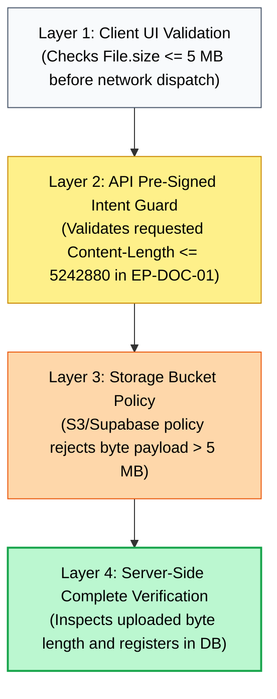
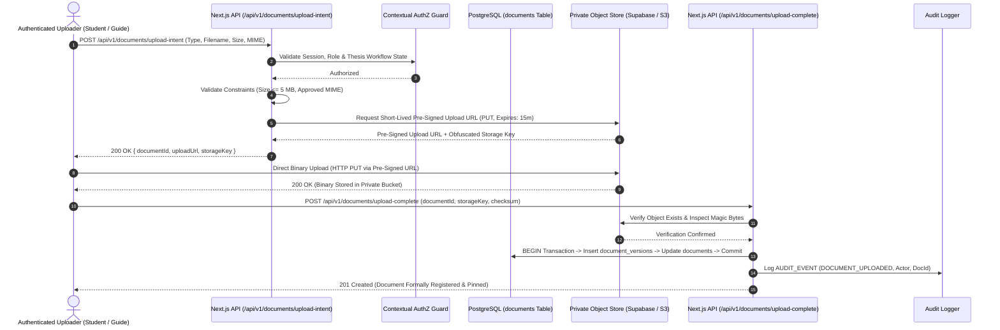
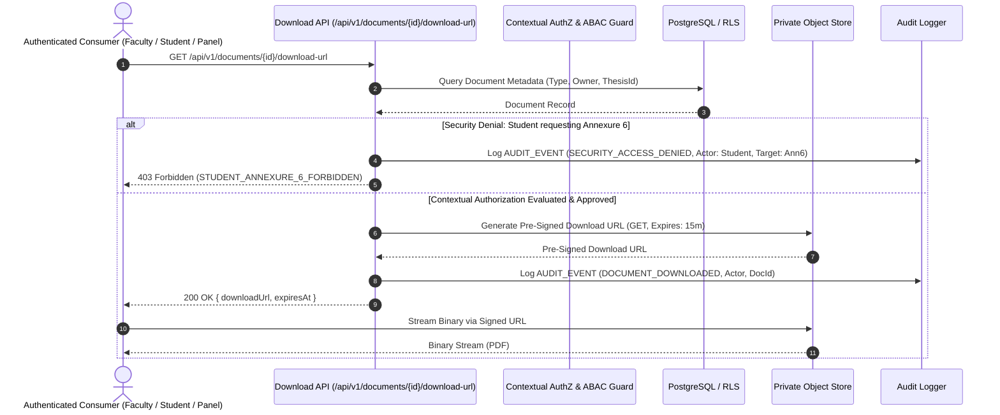
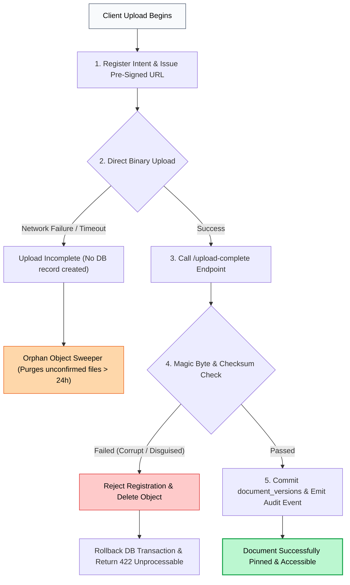

# NIET Dissertation Management System — File Storage & Document Architecture

**Document ID:** `DOC-09-STORAGE`  
**File Path:** [`docs/09_FILE_STORAGE.md`](file:///c:/Users/user/Desktop/niet-dissertation-management-system/docs/09_FILE_STORAGE.md)  
**Document Status:** ARCHITECTURE FREEZE BASELINE (PHASE 3E)  
**Last Revised:** 2026-08-15  
**Governing Baselines:** [`docs/00_PROJECT_MASTER.md`](file:///c:/Users/user/Desktop/niet-dissertation-management-system/docs/00_PROJECT_MASTER.md), [`docs/01_REQUIREMENTS.md`](file:///c:/Users/user/Desktop/niet-dissertation-management-system/docs/01_REQUIREMENTS.md), [`docs/02_ARCHITECTURE.md`](file:///c:/Users/user/Desktop/niet-dissertation-management-system/docs/02_ARCHITECTURE.md), [`docs/03_DOMAIN_MODEL.md`](file:///c:/Users/user/Desktop/niet-dissertation-management-system/docs/03_DOMAIN_MODEL.md), [`docs/04_RBAC_MATRIX.md`](file:///c:/Users/user/Desktop/niet-dissertation-management-system/docs/04_RBAC_MATRIX.md), [`docs/05_STATE_MACHINES.md`](file:///c:/Users/user/Desktop/niet-dissertation-management-system/docs/05_STATE_MACHINES.md), [`docs/06_DATABASE_SCHEMA.md`](file:///c:/Users/user/Desktop/niet-dissertation-management-system/docs/06_DATABASE_SCHEMA.md), [`docs/07_API_CONTRACTS.md`](file:///c:/Users/user/Desktop/niet-dissertation-management-system/docs/07_API_CONTRACTS.md), and [`docs/08_AUDIT_MODEL.md`](file:///c:/Users/user/Desktop/niet-dissertation-management-system/docs/08_AUDIT_MODEL.md)  
**Institution:** Noida Institute of Engineering & Technology (NIET), Greater Noida  
**Target Program:** M.Tech / M.Tech Integrated Dissertation Governance  

---

## 1. Document Purpose & Storage Objectives

This document establishes the authoritative **File Storage, Document Management & Binary Security Architecture** for the NIET Dissertation Management System (DMS). It defines the storage abstraction, metadata linkage, upload/download lifecycles, cryptographic validation, versioning rules, access matrices, and threat models governing digital assets throughout the dissertation lifecycle.

### Core Storage Objectives

1. **Strict Confidentiality & Private Storage:** All institutional dissertation manuscripts, similarity reports, and particularly confidential supervisor evaluations (Annexure 6) are stored in private-by-default object storage. **Direct public bucket URLs are strictly prohibited.**
2. **Document Integrity & Anti-Tampering:** Digital files are cryptographically validated using SHA-256 checksums, magic-byte inspection, and strict file size bounds to prevent content corruption and executable payload injection.
3. **Historical Version Preservation:** Iterative submissions (e.g. initial proposal drafts, revised manuscripts following viva feedback) maintain sequential, immutable versions ($v1, v2, v3$). Historical files cannot be silently overwritten.
4. **Zero-Budget Operating Feasibility (₹0 Initial Cost):** Storage architecture is optimized to operate entirely within verified free tiers (e.g. Supabase Storage / Cloudflare R2) with strict upload caps (5 MB prototype limit) and zero vendor lock-in.
5. **Defense-in-Depth Authorization:** File access requires server-side evaluation of caller identity, active role, department tenancy, and workflow state before generating short-lived (15-minute) pre-signed access tokens.

---

## 2. Core File Storage Principles

1. **Decoupled Binary vs. Metadata Architecture:** Binary file payloads are stored in private cloud object storage. All descriptive metadata (original filename, MIME type, byte size, cryptographic hash, uploader identity, version index) is managed exclusively within PostgreSQL relational tables (`documents` and `document_versions`).
2. **Unpredictable Obfuscated Storage Keys:** Physical storage paths utilize non-sequential UUIDs and departmental namespaces. Guessable sequential numeric paths or user-supplied filenames are never used as physical storage keys.
3. **Zero Direct Browser-to-Storage Exposure:** Clients never possess administrative storage credentials. Uploads and downloads execute exclusively via short-lived, cryptographically signed URLs generated on-demand by the application server.
4. **Permanent Student Lockout on Annexure 6:** The confidential supervisor evaluation document type is permanently blocked from student retrieval across the UI, API, Storage pre-signed token generator, and database RLS tiers.

---

## 3. Structural Hierarchy: Document vs. Version vs. Storage Object vs. Upload Event

```
┌────────────────────────────────────────────────────────────────────────────────────────┐
│                               DOCUMENT ABSTRACTION HIERARCHY                           │
├────────────────────────────────────────────────────────────────────────────────────────┤
│ 1. Document Aggregate Root (documents Table) :                                         │
│    • Conceptual academic artifact bound to a thesis (e.g. 'Final Thesis Manuscript').  │
│    • Tracks active/latest version ID, document type, and owner student/faculty ID.     │
├────────────────────────────────────────────────────────────────────────────────────────┤
│ 2. Document Version (document_versions Table) :                                        │
│    • Immutable snapshot representing a specific iteration (v1, v2, v3).               │
│    • Stores SHA-256 checksum, exact byte size, upload timestamp, and uploader UUID.    │
├────────────────────────────────────────────────────────────────────────────────────────┤
│ 3. Storage Object (Private S3/Supabase Storage Bucket) :                               │
│    • Physical binary stream addressed by unique key: {dept}/{session}/{thesis}/{uuid} │
│    • Private-by-default, AES-256 encrypted at rest, accessible only via signed token.  │
├────────────────────────────────────────────────────────────────────────────────────────┤
│ 4. Upload Event (Audit & Temporary Intent) :                                           │
│    • Transient operation registering intent, validating constraints, and auditing.     │
└────────────────────────────────────────────────────────────────────────────────────────┘
```

---

## 4. Supported Document Types Catalog

The DMS governs eight (8) official academic document categories:

| Document Type Code | Academic Purpose | Owner / Uploader | Immutability Trigger | Confidentiality Level |
| :--- | :--- | :--- | :--- | :--- |
| `ANNEXURE_1_PROPOSAL` | Initial research problem statement & preferences. | Student Candidate | On DCEC Submission | Departmental |
| `ANNEXURE_2_TITLE_DOCKET` | Refined problem formulation & methodology. | Student Candidate | On DCEC Approval | Departmental |
| `LOGBOOK_ATTACHMENT` | Supervisory meeting minutes or artifact logs. | Student Candidate | On Supervisor Verification | Supervisors & Student |
| `THESIS_MANUSCRIPT_ANNEXURE_5`| Complete final dissertation PDF manuscript. | Student Candidate | On Guide Endorsement | Institutional / Panel |
| `SYNOPSIS_DOCUMENT` | Executive summary of dissertation research. | Student Candidate | On Guide Endorsement | Institutional / Panel |
| `SIMILARITY_CERTIFICATE` | Authenticated Turnitin/DrillBit report certificate. | Student Candidate | On Guide Endorsement | Institutional / Panel |
| `SUPERVISOR_EVAL_ANNEXURE_6` | Confidential evaluation and defense recommendation. | Primary Guide Only | On Submission | **CONFIDENTIAL (Student Blocked)**|
| `VIVA_PRESENTATION_SLIDES` | Defense slide deck and presentation materials. | Student Candidate | On Oral Defense Convening| Committee & Panel |

---

## 5. File Size Policy & Multi-Tier Validation

```
                               FILE SIZE ENFORCEMENT
┌────────────────────────────────────────────────────────────────────────────────────────┐
│ 1. Prototype Maximum Upload Cap  : 5,242,880 bytes (5.0 MB) per file.                  │
│ 2. Production Institutional Cap  : OPEN (Pending institutional infrastructure analysis)│
└────────────────────────────────────────────────────────────────────────────────────────┘
```

### Multi-Layer Enforcement Pipeline



---

## 6. File Type & Content Validation (MIME & Magic Bytes)

To prevent file-disguised malware and executable attacks, files undergo strict content inspection:

1. **Extension Whitelisting:** Permitted extensions are restricted to `.pdf`, `.docx` (for draft revisions), and `.pptx` (for presentation decks).
2. **MIME-Type Verification:** HTTP `Content-Type` header must match approved MIME types (`application/pdf`, `application/vnd.openxmlformats-officedocument.wordprocessingml.document`).
3. **Magic Byte Signature Inspection:** Server-side verification inspects initial binary magic bytes before confirming upload completion:
   - **PDF Signature:** `%PDF-` (`0x25 0x50 0x44 0x46`)
   - **OOXML Signature (DOCX/PPTX):** `PK\x03\x04` (`0x50 0x4B 0x03 0x04`)

---

## 7. Complete Upload Lifecycle Architecture



---

## 8. Secure Download & Access Lifecycle



---

## 9. Physical Storage Key Design & Directory Hierarchy

Storage objects are partitioned deterministically within the private bucket `niet-dissertations-private`:

```
niet-dissertations-private/
├── {department_code}/                  # e.g. 'CSE', 'ECE', 'IT'
│   └── {academic_session}/             # e.g. '2025-2026'
│       └── {thesis_uuid}/              # Immutable Thesis UUID (e.g. 't1a2b3c4-...')
│           ├── annexure-1/
│           │   └── {document_uuid}_v1.pdf
│           ├── annexure-2/
│           │   └── {document_uuid}_v1.pdf
│           ├── annexure-5/
│           │   ├── manuscript_{document_uuid}_v1.pdf
│           │   ├── synopsis_{document_uuid}_v1.pdf
│           │   └── similarity_{document_uuid}_v1.pdf
│           ├── annexure-6/
│           │   └── confidential_eval_{document_uuid}_v1.pdf
│           └── logbook/
│               └── meeting_{meeting_uuid}_{document_uuid}.pdf
```

---

## 10. Storage Authorization Matrix

| Document Category | Student | Guide | Co-Guide | DC | D.HOD | HOD | DCEC Chair | Viva Panel | System Admin |
| :--- | :---: | :---: | :---: | :---: | :---: | :---: | :---: | :---: | :---: |
| `ANNEXURE_1_PROPOSAL` | `ALLOW (Own)` | `ALLOW` | `ALLOW` | `ALLOW` | `ALLOW` | `ALLOW` | `ALLOW` | `ALLOW` | `METADATA` |
| `ANNEXURE_2_TITLE_DOCKET` | `ALLOW (Own)` | `ALLOW` | `ALLOW` | `ALLOW` | `ALLOW` | `ALLOW` | `ALLOW` | `ALLOW` | `METADATA` |
| `LOGBOOK_ATTACHMENT` | `ALLOW (Own)` | `ALLOW` | `ALLOW` | `DENY` | `DENY` | `ALLOW` | `DENY` | `DENY` | `METADATA` |
| `THESIS_MANUSCRIPT_ANNEXURE_5`| `ALLOW (Own)`| `ALLOW` | `ALLOW` | `ALLOW` | `ALLOW` | `ALLOW` | `ALLOW` | `ALLOW` | `METADATA` |
| `SIMILARITY_CERTIFICATE` | `ALLOW (Own)` | `ALLOW` | `ALLOW` | `ALLOW` | `ALLOW` | `ALLOW` | `ALLOW` | `ALLOW` | `METADATA` |
| `SUPERVISOR_EVAL_ANNEXURE_6` | **`DENIED`** | `ALLOW` | `OPEN` | `DENY` | `DENY` | `ALLOW` | `ALLOW` | `ALLOW` | `METADATA` |
| `VIVA_PRESENTATION_SLIDES` | `ALLOW (Own)` | `ALLOW` | `ALLOW` | `ALLOW` | `ALLOW` | `ALLOW` | `ALLOW` | `ALLOW` | `METADATA` |

> [!NOTE]
> `METADATA` indicates that System Administrators possess technical visibility over storage object metadata, byte counts, and system quotas, but do not possess academic evaluation access.

---

## 11. Storage Provider Abstraction Interface

To guarantee complete portability and prevent vendor lock-in, the DMS domain services interact with file storage through a provider-independent TypeScript interface:

```typescript
export interface StorageProvider {
  /**
   * Generates a short-lived pre-signed PUT URL for direct client upload.
   */
  getUploadUrl(params: {
    storageKey: string;
    maxSizeBytes: number;
    mimeType: string;
    expiresInSeconds: number;
  }): Promise<{ uploadUrl: string; expiresAt: Date }>;

  /**
   * Generates a short-lived pre-signed GET URL for secure authenticated download.
   */
  getDownloadUrl(params: {
    storageKey: string;
    expiresInSeconds: number;
  }): Promise<{ downloadUrl: string; expiresAt: Date }>;

  /**
   * Verifies that the physical storage object exists and matches expected byte length.
   */
  verifyObject(params: {
    storageKey: string;
  }): Promise<{ exists: boolean; sizeBytes: number; mimeType: string; sha256Checksum: string }>;

  /**
   * Soft-archives or purges an object (governed by institutional retention policy).
   */
  deleteObject(params: {
    storageKey: string;
  }): Promise<{ success: boolean }>;
}
```

---

## 12. File Security Threat Modeling

| # | Threat Scenario | Potential Impact | Architectural Mitigation Strategy | Status |
| :---: | :--- | :--- | :--- | :---: |
| 1 | **Direct Object Reference (IDOR)** | Student accesses peer's manuscript or Annexure 6. | Pre-signed download URLs require strict ABAC evaluation on every request. | **V1 Enforced** |
| 2 | **Public Bucket Exposure** | Search engines index student theses. | Bucket ACLs configured as strictly Private (`public = false`). Direct public URLs return 403. | **V1 Enforced** |
| 3 | **Pre-Signed URL Leakage** | Shared link exposes file to unauthorized parties. | Short 15-minute token TTL + audit logging of download token generation. | **V1 Enforced** |
| 4 | **Path Traversal Attacks** | Malicious filename overwrites system assets (`../../etc`).| Physical storage keys are server-generated UUIDs; user filenames stored only as metadata. | **V1 Enforced** |
| 5 | **MIME-Type Spoofing** | Executable disguised as `.pdf` is uploaded. | Server-side magic-byte inspection verifying `%PDF-` header before registration. | **V1 Enforced** |
| 6 | **Denial of Service (Oversized Files)**| Huge uploads consume storage quota and bandwidth. | Multi-tier size validation enforcing 5 MB cap on client, API, and storage bucket levels. | **V1 Enforced** |
| 7 | **Silent Document Tampering** | Manuscript modified in-place after defense approval. | Immutable version records; document versions pinned by cryptographic SHA-256 hashes. | **V1 Enforced** |
| 8 | **Malware / Macro Payloads** | Malicious Office macro executes during review. | Disallow active macros; convert Office drafts to PDF before formal committee review. | **V1 Enforced** |
| 9 | **Storage Enumeration Attacks** | Attacker probes sequential URLs to harvest files. | Obfuscated UUID storage paths eliminate brute-force enumeration vulnerability. | **V1 Enforced** |
| 10| **Orphaned Storage Objects** | Incomplete uploads waste cloud storage allowance. | Automated daily cleanup script deleting unconfirmed storage objects older than 24 hours. | **V1 Enforced** |
| 11| **Malware Injection in PDF** | Embedded zero-day PDF exploit infects faculty machine.| Future background ClamAV scanning container pipeline. | **Future (Post-V1)**|

---

## 13. Failure Handling & Consistency Recovery Flow



---

## 14. Zero-Cost Infrastructure Evaluation

```
                               ZERO-COST STORAGE EVALUATION
┌──────────────────────┬────────────────────────┬────────────────────────────────────────┐
│ Storage Provider     │ Free Tier Allowance    │ Architectural Assessment & Trade-Offs  │
├──────────────────────┼────────────────────────┼────────────────────────────────────────┤
│ Supabase Storage     │ 1.0 GB Storage         │ • Native PostgreSQL RLS integration.   │
│ (Recommended for V1) │ 2.0 GB Bandwidth/mo    │ • Built-in pre-signed URL generator.   │
│                      │ 50 MB Max File Size    │ • Zero infrastructure setup overhead.  │
├──────────────────────┼────────────────────────┼────────────────────────────────────────┤
│ Cloudflare R2        │ 10.0 GB Storage        │ • Zero egress bandwidth fees.          │
│ (Alternative)        │ 10M Read Operations/mo │ • Requires external S3 client setup.   │
├──────────────────────┼────────────────────────┼────────────────────────────────────────┤
│ AWS S3 Free Tier     │ 5.0 GB Storage         │ • 12-month time limit (Expires).       │
│                      │ 20,000 GET Requests    │ • Risk of surprise credit card bills.  │
└──────────────────────┴────────────────────────┴────────────────────────────────────────┘
```

---

## 15. Open Storage Questions

In strict accordance with the Anti-Hallucination Rule, the following storage items remain open pending institutional confirmation:

| Open Decision ID | Storage Dimension | Unresolved Policy Question | Prototype Technical Stance |
| :--- | :--- | :--- | :--- |
| `REQ-OD-004` | Authorization | Co-Guide permissions to view or download Annexure 6 evaluation. | **Blocked by default:** Only primary Guide and Chair can access. |
| `REQ-OD-006` | Retention | Institutional legal retention duration for dissertation PDFs post-graduation. | Prototype retains files for 1-year rolling; production supports permanent archival. |
| `REQ-OD-007` | Quotas | Production document upload size limits beyond prototype 5 MB cap. | Hard-coded 5 MB limit in prototype; configurable via `system_configurations`. |
| `REQ-OD-011` | Cloud Hosting | Official production hosting infrastructure (Cloud S3 vs NIET On-Premise SAN/NAS). | Provider-independent `StorageProvider` interface ensures instant portability. |

---

## 16. Future Storage Features (Slated for Post-V1)

1. **`FUT-STORE-CLAMAV`:** Automated asynchronous antivirus container pipeline scanning newly uploaded PDFs.
2. **`FUT-STORE-OCR`:** Optical Character Recognition indexing scanned certificates and signed endorsement forms.
3. **`FUT-STORE-VECTOR`:** Embedding extraction pipeline vectorizing full manuscript text for semantic plagiarism search.

---

## 17. Storage Traceability Matrix

| Storage Architectural Rule | Governing Requirement IDs | Source Document & Section | Rationale / Traceability Note |
| :--- | :--- | :--- | :--- |
| **Private Object Storage** | `REQ-FILE-001`, `REQ-NFR-SEC-002` | `01_REQUIREMENTS.md §15, §6.1`| All files private; direct public URLs prohibited |
| **Prototype 5 MB Upload Cap** | `REQ-PROTO-001`, `REQ-FILE-003` | `01_REQUIREMENTS.md §22, §15` | Multi-layer file size validation ($\le 5\text{ MB}$) |
| **Annexure 6 Student Lockout**| `REQ-ANN6-001`, `REQ-ANN6-002` | `01_REQUIREMENTS.md §5.10` | Confidential supervisor evaluation isolation |
| **Document Versioning** | `REQ-FILE-002`, `REQ-VIVA-004` | `01_REQUIREMENTS.md §15, §14` | Sequential $v1, v2$ version tracking under same thesis |
| **Pre-Signed Token Delivery** | `REQ-NFR-SEC-002`, `REQ-AUTHZ-003`| `01_REQUIREMENTS.md §6.1, §17` | Short-lived 15-minute tokenized download access |
| **Append-Only File Audit** | `REQ-AUD-001`..`003` | `01_REQUIREMENTS.md §18` | Upload, download, and denied attempts logged |

---

## 18. Anti-Hallucination & Governance Verification

- [x] **No Application Code Written:** Confirmed zero source code files created.
- [x] **No Storage Buckets Created:** Confirmed specifications are technical designs; no cloud storage buckets or S3 resources instantiated.
- [x] **No API Keys or Credentials Created:** Confirmed zero secrets or service credentials generated.
- [x] **Annexure 6 Student Denial Enforced Across All Layers:** Absolute zero read/download capability for students on confidential evaluations.
- [x] **5 MB Prototype Cap & 1-Year Retention Preserved:** Directly aligned with `REQ-PROTO-001` and `REQ-PROTO-002`.
- [x] **Single File Scope Respected:** ONLY [`docs/09_FILE_STORAGE.md`](file:///c:/Users/user/Desktop/niet-dissertation-management-system/docs/09_FILE_STORAGE.md) was modified.
