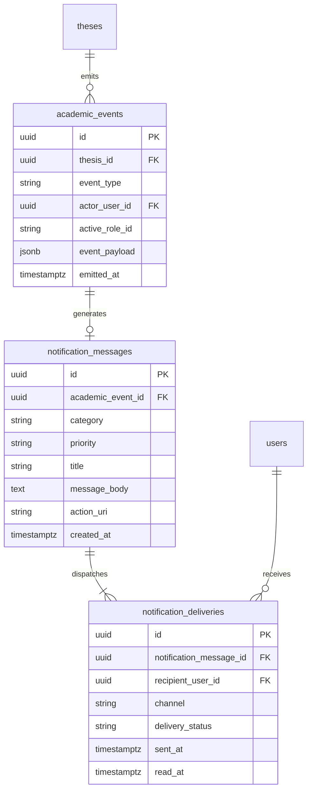
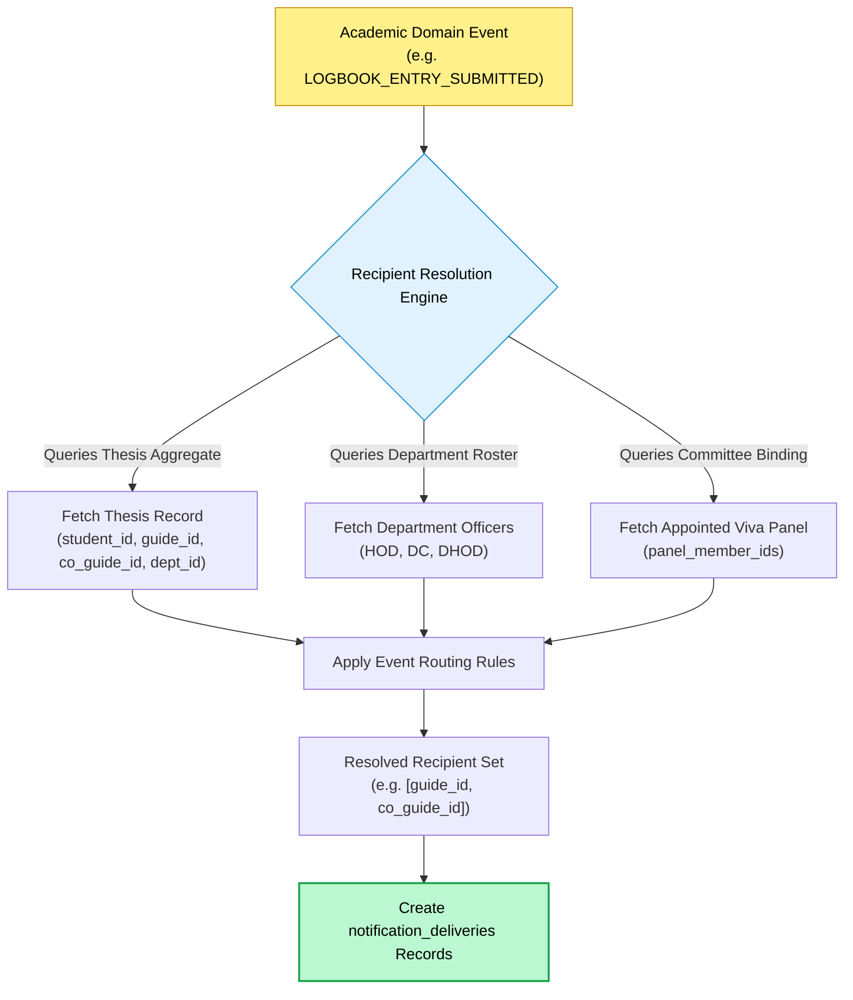
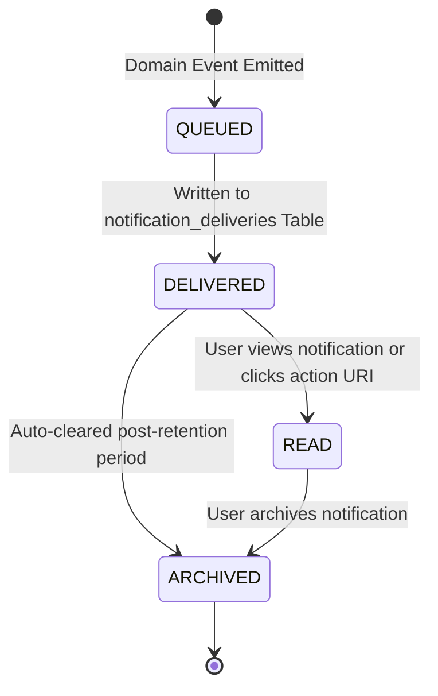
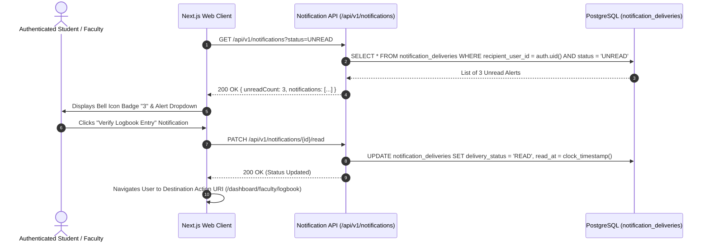
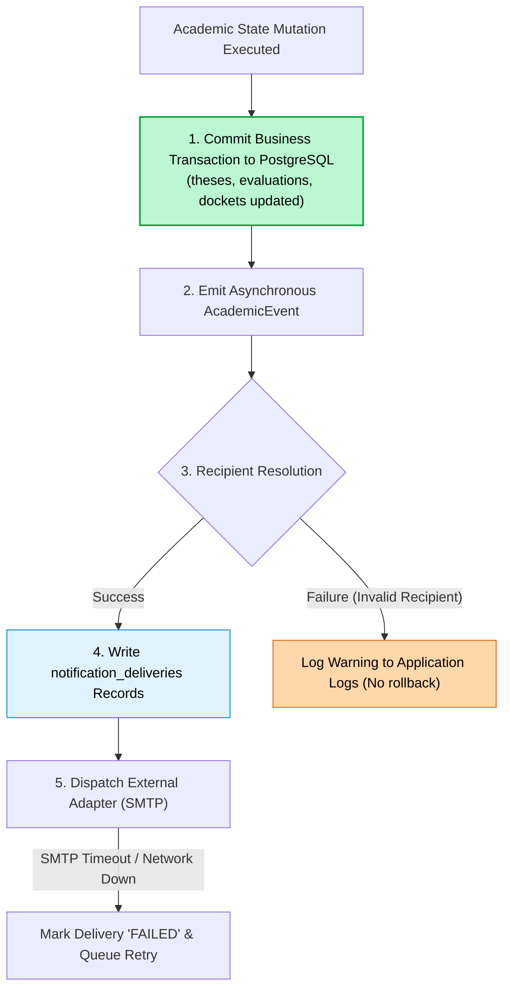

# NIET Dissertation Management System — Notification Model & Communication Architecture

**Document ID:** `DOC-10-NOTIF`  
**File Path:** [`docs/10_NOTIFICATION_MODEL.md`](file:///c:/Users/user/Desktop/niet-dissertation-management-system/docs/10_NOTIFICATION_MODEL.md)  
**Document Status:** ARCHITECTURE FREEZE BASELINE (PHASE 3F)  
**Last Revised:** 2026-08-15  
**Governing Baselines:** [`docs/00_PROJECT_MASTER.md`](file:///c:/Users/user/Desktop/niet-dissertation-management-system/docs/00_PROJECT_MASTER.md), [`docs/01_REQUIREMENTS.md`](file:///c:/Users/user/Desktop/niet-dissertation-management-system/docs/01_REQUIREMENTS.md), [`docs/02_ARCHITECTURE.md`](file:///c:/Users/user/Desktop/niet-dissertation-management-system/docs/02_ARCHITECTURE.md), [`docs/03_DOMAIN_MODEL.md`](file:///c:/Users/user/Desktop/niet-dissertation-management-system/docs/03_DOMAIN_MODEL.md), [`docs/04_RBAC_MATRIX.md`](file:///c:/Users/user/Desktop/niet-dissertation-management-system/docs/04_RBAC_MATRIX.md), [`docs/05_STATE_MACHINES.md`](file:///c:/Users/user/Desktop/niet-dissertation-management-system/docs/05_STATE_MACHINES.md), [`docs/06_DATABASE_SCHEMA.md`](file:///c:/Users/user/Desktop/niet-dissertation-management-system/docs/06_DATABASE_SCHEMA.md), [`docs/07_API_CONTRACTS.md`](file:///c:/Users/user/Desktop/niet-dissertation-management-system/docs/07_API_CONTRACTS.md), [`docs/08_AUDIT_MODEL.md`](file:///c:/Users/user/Desktop/niet-dissertation-management-system/docs/08_AUDIT_MODEL.md), and [`docs/09_FILE_STORAGE.md`](file:///c:/Users/user/Desktop/niet-dissertation-management-system/docs/09_FILE_STORAGE.md)  
**Institution:** Noida Institute of Engineering & Technology (NIET), Greater Noida  
**Target Program:** M.Tech / M.Tech Integrated Dissertation Governance  

---

## 1. Document Purpose & Notification Objectives

This document establishes the definitive **Notification Model & Asynchronous Communication Architecture** for the NIET Dissertation Management System (DMS). It defines how academic lifecycle events, departmental screening queues, supervisor allocations, logbook verifications, milestone presentations, and viva defense outcomes generate structured, role-aware, and secure notifications for candidates, faculty, and administrative officers.

### Core Notification Objectives

1. **Timely Academic Workflow Visibility:** Keep all dissertation stakeholders informed of required actions (e.g. logbook entries requiring guide verification, proposals pending DCEC screening, milestones scheduled).
2. **Contextual & Role-Aware Delivery:** Ensure notification messages are dispatched strictly to authorized participants based on active role, department scope, and relational thesis binding.
3. **Decoupled Transactional Resilience:** Guarantee that notification generation and delivery failures **never invalidate or roll back committed academic database transactions**.
4. **Anti-Leakage Security Boundary:** Ensure notification payloads never leak confidential academic evaluations (e.g. Annexure 6 supervisor scores or remarks to students) or private system secrets.
5. **Zero-Budget Initial Operating Feasibility (₹0 Cost):** Establish an in-app first notification architecture with an extensible, provider-independent adapter interface for external channels (e.g. SMTP email) without requiring paid third-party communication APIs.

---

## 2. Core Notification Principles

1. **Derived Exclusively from Authoritative Domain Events:** Notifications are downstream artifacts triggered by successful state machine mutations and domain events (`AcademicEvent`). Notifications **never drive or mutate workflow state directly**.
2. **Notification Receipt ≠ Academic Sign-Off:** Reading or acknowledging a notification is purely an informational tracking event; it **never executes an approval, endorsement, or grading action**.
3. **Destination Resource Authorization Preservation:** Notification payloads contain deep links to application views. The destination route independently evaluates RBAC/ABAC authorization; possessing a notification link does not grant resource access.
4. **Strict Data Minimization:** Notification messages contain only high-level status alerts, action summaries, and navigation links. Full document binaries, raw grade formulas, and passwords are strictly excluded.
5. **Deduplication & Idempotency:** Duplicate domain event emissions (e.g. from network retries) must not generate duplicate user alerts. Every notification is uniquely bounded by `(academic_event_id, recipient_user_id)`.

---

## 3. Structural Triad: Academic Event vs. Notification Message vs. Notification Delivery

```
┌────────────────────────────────────────────────────────────────────────────────────────┐
│                              NOTIFICATION ARCHITECTURAL TRIAD                          │
├────────────────────────────────────────────────────────────────────────────────────────┤
│ 1. Academic Domain Event (academic_events Table) :                                     │
│    • Authoritative, immutable event record emitted by the core domain transaction.     │
│    • Example: 'DCEC_CHAIR_APPROVED' on Thesis UUID 't1a2b3c4-...'.                     │
├────────────────────────────────────────────────────────────────────────────────────────┤
│ 2. Notification Message (notification_messages Table) :                                │
│    • Formatted, user-friendly communication payload derived from the domain event.     │
│    • Contains title, short narrative body, severity category, and deep-link action URI.│
├────────────────────────────────────────────────────────────────────────────────────────┤
│ 3. Notification Delivery (notification_deliveries Table) :                             │
│    • Concrete per-recipient delivery record tracking channel, read status, & timestamp.│
│    • Example: Recipient 'Student User X', Channel 'IN_APP', Status 'UNREAD'.           │
└────────────────────────────────────────────────────────────────────────────────────────┘
```

---

## 4. Conceptual Entity Model & Field Catalog



---

## 5. Notification Categories & Priority Tiers

### 5.1 Functional Notification Categories
1. `CATEGORY_WORKFLOW`: High-level stage progressions (e.g. proposal approved, research active).
2. `CATEGORY_ACTION_REQUIRED`: Explicit tasks requiring recipient action (e.g. verify logbook, endorse title).
3. `CATEGORY_SCREENING`: DCEC committee dockets, verifications, and decisions.
4. `CATEGORY_ALLOCATION`: Guide and Co-Guide assignment announcements.
5. `CATEGORY_EVALUATION`: Milestone presentation schedules and scored feedback releases.
6. `CATEGORY_DEFENSE`: Oral viva panel appointments, schedules, and final outcomes.
7. `CATEGORY_GOVERNANCE`: Authority delegations, revocations, and system announcements.

### 5.2 Priority Tiers
- **`URGENT`:** Critical time-sensitive actions (e.g. oral defense convened, revision cycle initiated).
- **`HIGH`:** Required workflow reviews (e.g. Annexure 1 screening docket, Annexure 5 final endorsement).
- **`NORMAL`:** Standard progress updates (e.g. logbook entry verified, guide assigned).
- **`INFORMATIONAL`:** Routine status notices (e.g. proposal draft saved, rubric published).

---

## 6. Recipient Resolution Engine & Multi-Role Logic

When a domain event occurs, the Recipient Resolution Engine resolves target user UUIDs based on role, department tenancy, and thesis relationships:



---

## 7. Master Notification Event Catalog

The following catalog defines twenty-six (26) official academic notification triggers across the dissertation lifecycle:

| Event ID | Academic Trigger | Source Domain | Target Recipients | Category | Priority | Action Deep Link | Traceability ID |
| :--- | :--- | :--- | :--- | :--- | :---: | :--- | :--- |
| `NOTIF-ANN1-SUBMIT` | Candidate submits Annexure 1 | Proposal | `DC`, `HOD` | `SCREENING` | `HIGH` | `/dashboard/dc/screening` | `REQ-ANN1-003` |
| `NOTIF-DCEC-VERIFY` | DC compiles screening docket | DCEC | `DCEC_CHAIR` | `SCREENING` | `HIGH` | `/dashboard/hod/dcec-queue` | `REQ-DCEC-001` |
| `NOTIF-DCEC-APPROVE`| DCEC Chair approves proposal | DCEC | `STUDENT`, `DHOD` | `WORKFLOW` | `NORMAL` | `/dashboard/student/proposal` | `REQ-DCEC-003` |
| `NOTIF-DCEC-REVISE` | DCEC Chair orders revision | DCEC | `STUDENT`, `DC` | `ACTION_REQUIRED` | `HIGH` | `/dashboard/student/proposal` | `REQ-DCEC-004` |
| `NOTIF-DCEC-REJECT` | DCEC Chair rejects proposal | DCEC | `STUDENT`, `DC` | `WORKFLOW` | `URGENT` | `/dashboard/student/proposal` | `REQ-DCEC-005` |
| `NOTIF-ALLOC-GUIDE` | D.HOD allocates supervisors | Allocation | `STUDENT`, `GUIDE`, `CO_GUIDE` | `ALLOCATION` | `NORMAL` | `/dashboard/student/supervisors` | `REQ-ALLOC-001` |
| `NOTIF-ALLOC-REALLOC`| D.HOD adjusts supervisor | Allocation | `STUDENT`, `Old/New Guides` | `ALLOCATION` | `HIGH` | `/dashboard/student/supervisors` | `REQ-ALLOC-007` |
| `NOTIF-ANN2-SUBMIT` | Candidate submits Annexure 2 | Title Approval | `GUIDE`, `CO_GUIDE` | `ACTION_REQUIRED` | `HIGH` | `/dashboard/faculty/endorsements` | `REQ-ANN2-001` |
| `NOTIF-ANN2-ENDORSE`| Guide endorses Annexure 2 | Title Approval | `DCEC_CHAIR`, `STUDENT` | `SCREENING` | `NORMAL` | `/dashboard/hod/title-approvals` | `REQ-ANN2-002` |
| `NOTIF-ANN2-APPROVE`| DCEC Chair approves title | Title Approval | `STUDENT`, `GUIDE`, `CO_GUIDE`| `WORKFLOW` | `NORMAL` | `/dashboard/student/overview` | `REQ-ANN2-003` |
| `NOTIF-LOG-SUBMIT` | Candidate logs meeting entry | Logbook | `GUIDE`, `CO_GUIDE` | `ACTION_REQUIRED` | `NORMAL` | `/dashboard/faculty/logbook` | `REQ-ANN4-001` |
| `NOTIF-LOG-VERIFY` | Supervisor verifies entry | Logbook | `STUDENT` | `WORKFLOW` | `NORMAL` | `/dashboard/student/logbook` | `REQ-ANN4-004` |
| `NOTIF-LOG-RETURN` | Supervisor returns entry | Logbook | `STUDENT` | `ACTION_REQUIRED` | `HIGH` | `/dashboard/student/logbook` | `REQ-ANN4-005` |
| `NOTIF-RUB-PUBLISH` | Rubric version published | Rubrics | Department Faculty | `GOVERNANCE` | `INFORMATIONAL`| `/dashboard/rubrics` | `REQ-RUB-003` |
| `NOTIF-MILE-SCHEDULE`| Presentation scheduled | Evaluation | `STUDENT`, `GUIDE`, `Panel` | `EVALUATION` | `HIGH` | `/dashboard/student/milestones` | `REQ-EVAL-001` |
| `NOTIF-MILE-EVALUATE`| P1/P2/P3 evaluation released| Evaluation | `STUDENT`, `GUIDE`, `CO_GUIDE`| `EVALUATION` | `NORMAL` | `/dashboard/student/milestones` | `REQ-EVAL-005` |
| `NOTIF-ANN5-SUBMIT` | Final manuscript submitted | Final Submission| `GUIDE`, `CO_GUIDE` | `ACTION_REQUIRED` | `HIGH` | `/dashboard/faculty/manuscripts` | `REQ-ANN5-001` |
| `NOTIF-ANN5-ENDORSE`| Supervisors endorse Annexure 5| Final Submission| `HOD`, `DC`, `STUDENT` | `WORKFLOW` | `NORMAL` | `/dashboard/hod/final-packages` | `REQ-ANN5-004` |
| `NOTIF-ANN6-SUBMIT` | Guide submits Annexure 6 | Evaluation | `HOD`, `DCEC_CHAIR` (**Student Denied**)| `EVALUATION` | `NORMAL` | `/dashboard/hod/confidential-eval`| `REQ-ANN6-001` |
| `NOTIF-PANEL-APPOINT`| Viva examiners appointed | Viva Defense | Appointed Panel Members | `DEFENSE` | `HIGH` | `/dashboard/panel/assignments` | `REQ-PANEL-001` |
| `NOTIF-VIVA-SCHEDULE`| Oral defense convened | Viva Defense | `STUDENT`, `Panel`, `GUIDE` | `DEFENSE` | `URGENT` | `/dashboard/student/viva` | `REQ-VIVA-001` |
| `NOTIF-VIVA-PASS` | Candidate passes viva defense| Viva Defense | `STUDENT`, `GUIDE`, `HOD` | `WORKFLOW` | `URGENT` | `/dashboard/student/transcript` | `REQ-VIVA-002` |
| `NOTIF-VIVA-FAIL` | Candidate requires Re-Viva | Viva Defense | `STUDENT`, `GUIDE`, `HOD` | `ACTION_REQUIRED` | `URGENT` | `/dashboard/student/re-viva` | `REQ-VIVA-003` |
| `NOTIF-DELEG-GRANT` | HOD delegates DCEC Chair | Governance | Recipient `DHOD` | `GOVERNANCE` | `NORMAL` | `/dashboard/dhod/dcec-chair` | `REQ-DCEC-MGT-004`|
| `NOTIF-DELEG-REVOKE`| HOD revokes Chair delegation| Governance | Recipient `DHOD` | `GOVERNANCE` | `NORMAL` | `/dashboard/dhod/overview` | `REQ-DCEC-MGT-004`|
| `NOTIF-SEC-ALERT` | Unauthorized access probe | Security | System `ADMIN` | `GOVERNANCE` | `URGENT` | `/dashboard/admin/audit-logs` | `REQ-NFR-SEC-002`|

---

## 8. Role-Aware Notification Matrix

| Academic Trigger Event | Student | Guide | Co-Guide | DC | D.HOD | HOD | Panel Member | Admin |
| :--- | :---: | :---: | :---: | :---: | :---: | :---: | :---: | :---: |
| `Annexure 1 Submitted` | `SENDER` | `DENY` | `DENY` | **`RECIPIENT`**| `DENY` | **`RECIPIENT`**| `DENY` | `DENY` |
| `Proposal Approved (DCEC)`| **`RECIPIENT`**| `DENY` | `DENY` | `DENY` | **`RECIPIENT`**| `SENDER` | `DENY` | `DENY` |
| `Supervisors Allocated` | **`RECIPIENT`**| **`RECIPIENT`**| **`RECIPIENT`**| `DENY` | `SENDER` | `DENY` | `DENY` | `DENY` |
| `Annexure 2 Endorsement Req`| `SENDER` | **`RECIPIENT`**| **`RECIPIENT`**| `DENY` | `DENY` | `DENY` | `DENY` | `DENY` |
| `Logbook Entry Verification`| `SENDER` | **`RECIPIENT`**| **`RECIPIENT`**| `DENY` | `DENY` | `DENY` | `DENY` | `DENY` |
| `Milestone Evaluation Released`| **`RECIPIENT`**| **`RECIPIENT`**| **`RECIPIENT`**| `DENY` | `DENY` | `DENY` | `SENDER` | `DENY` |
| `Annexure 6 Submitted` | **`DENY (BLOCKED)`**| `SENDER` | `OPEN` | `DENY` | `DENY` | **`RECIPIENT`**| **`RECIPIENT`**| `DENY` |
| `Viva Defense Scheduled` | **`RECIPIENT`**| **`RECIPIENT`**| **`RECIPIENT`**| `DENY` | `DENY` | **`RECIPIENT`**| **`RECIPIENT`**| `DENY` |
| `Viva Defense Outcome` | **`RECIPIENT`**| **`RECIPIENT`**| **`RECIPIENT`**| `DENY` | `DENY` | **`RECIPIENT`**| `SENDER` | `DENY` |

---

## 9. Notification Security & Annexure 6 Anti-Leakage Guardrails

```
┌────────────────────────────────────────────────────────────────────────────────────────┐
│                          ANNEXURE 6 ANTI-LEAKAGE SECURITY GUARDRAIL                    │
├────────────────────────────────────────────────────────────────────────────────────────┤
│ 1. Student Exclusion Invariant :                                                       │
│    • When a Guide submits Annexure 6 ('NOTIF-ANN6-SUBMIT'), the Recipient Engine       │
│      STRICTLY OMITS the student candidate from the recipient list.                     │
├────────────────────────────────────────────────────────────────────────────────────────┤
│ 2. Payload Neutrality :                                                                │
│    • Notifications dispatched to HOD/Panel state ONLY: "Supervisor evaluation has been  │
│      submitted for Thesis [TrackingNo]".                                               │
│    • Numerical scores, rating tiers, and confidential remarks are NEVER embedded in     │
│      the notification payload.                                                         │
└────────────────────────────────────────────────────────────────────────────────────────┘
```

---

## 10. Read / Unread Status Model & Lifecycle



### Invariants:
- `DELIVERED`: Available in the user's in-app notification center.
- `READ`: `read_at` timestamp recorded upon user interaction (`PATCH /api/v1/notifications/{id}/read`).
- Reading a notification **never alters underlying dissertation state**.

---

## 11. In-App Notification Center & Client Delivery Flow



---

## 12. External Channel Adapter Architecture (Zero-Budget Extensibility)

To satisfy the ₹0 initial cost mandate while preparing for institutional email integration:

```typescript
export interface NotificationChannelAdapter {
  /**
   * Dispatches a notification payload to an external communication channel.
   */
  dispatch(payload: {
    recipientEmail?: string;
    recipientPhone?: string;
    title: string;
    body: string;
    actionUri: string;
    priority: 'URGENT' | 'HIGH' | 'NORMAL' | 'INFORMATIONAL';
  }): Promise<{ success: boolean; channelMessageId?: string; error?: string }>;
}
```

```
                               NOTIFICATION CHANNELS
┌──────────────────────┬────────────────────────┬────────────────────────────────────────┐
│ Delivery Channel     │ Implementation Status  │ Operating Cost & Infrastructure        │
├──────────────────────┼────────────────────────┼────────────────────────────────────────┤
│ In-App Notification  │ **Required for V1**    │ ₹0 (Direct PostgreSQL persistence)     │
│ Console / Mock Email │ **Required for Dev**   │ ₹0 (Terminal logging of email payloads)│
│ Institutional SMTP   │ Extensible Adapter     │ ₹0 (Uses existing campus mail server)  │
│ SMS / WhatsApp Alert │ Future Roadmap         │ Post-V1 Paid Gateway Integration       │
└──────────────────────┴────────────────────────┴────────────────────────────────────────┘
```

---

## 13. Failure Handling & Transactional Independence



> [!IMPORTANT]
> **CRITICAL TRANSACTIONAL INVARIANT:**  
> A failure in the notification subsystem (e.g. SMTP server unreachable, push network drop) **never rolls back the committed academic state mutation**. The dissertation advancement remains legally valid.

---

## 14. Notification vs. Audit Trail Decoupling

| Dimension | Notification Subsystem (`notification_deliveries`) | Compliance Audit Trail (`audit_events`) |
| :--- | :--- | :--- |
| **Primary Purpose** | Operational awareness and task prompts for users. | Legal accountability, non-repudiation, and forensics.|
| **Target Audience** | Individual participants (Student, Guide, HOD). | Compliance auditors, Academic Council, Administrators.|
| **Immutability** | Mutable delivery status (`UNREAD` $\rightarrow$ `READ`). | **Strictly Append-Only (Zero UPDATE/DELETE grants).**|
| **Data Payload** | User-friendly message and deep-link action URI. | Complete pre/post state JSON snapshots & IP/Actor data.|
| **Transactional Binding**| Asynchronous downstream processing. | Atomic synchronous execution with business mutation.|

---

## 15. Open Notification Questions

In strict accordance with the Anti-Hallucination Rule, the following communication items remain open pending institutional confirmation:

| Open Decision ID | Notification Dimension | Unresolved Policy Question | Prototype Stance |
| :--- | :--- | :--- | :--- |
| `REQ-OD-013` | External SMTP | Official institutional SMTP gateway hostnames, ports, and TLS credentials. | Default to in-app delivery + console logging in development. |
| `REQ-OD-004` | Confidentiality | Should Co-Guides receive notification upon Annexure 6 submission? | **Blocked by default:** Notifications sent only to Primary Guide and HOD. |
| `REQ-OD-006` | Retention | Institutional retention policy for archived in-app notifications. | Prototype retains notifications for 1-year rolling; production supports auto-purge. |

---

## 16. Future Notification Features (Slated for Post-V1)

1. **`FUT-NOTIF-SMS`:** Urgent SMS gateway alerts for oral defense scheduling and emergency deadline notices.
2. **`FUT-NOTIF-WHATSAPP`:** Official institutional WhatsApp Business API dispatcher for meeting reminders.
3. **`FUT-NOTIF-DIGEST`:** Weekly faculty digest summarizing pending logbook verifications and upcoming milestone presentation dates.

---

## 17. Notification Traceability Matrix

| Notification Subsystem | Governing Requirement IDs | Source Document & Section | Rationale / Traceability Note |
| :--- | :--- | :--- | :--- |
| **In-App Alerts** | `REQ-WF-001`, `REQ-PROTO-001` | `01_REQUIREMENTS.md §8, §22` | Core awareness center operating at ₹0 cost |
| **DCEC Screening Alerts**| `REQ-DCEC-001`..`005` | `01_REQUIREMENTS.md §5.3` | Maker-Checker queue prompts for DC and Chair |
| **Supervisor Allocation**| `REQ-ALLOC-001`, `REQ-ALLOC-007`| `01_REQUIREMENTS.md §5.4` | Allocation and reallocation notices to supervisors/student|
| **Logbook Verifications**| `REQ-ANN4-001`..`005` | `01_REQUIREMENTS.md §5.6` | Prompts supervisors when meetings require sign-off |
| **Milestone Scoring** | `REQ-EVAL-001`..`005` | `01_REQUIREMENTS.md §5.8` | Scorecard release alerts for P1, P2, P3 (/100) |
| **Annexure 6 Isolation** | `REQ-ANN6-001`, `REQ-ANN6-002` | `01_REQUIREMENTS.md §5.10` | Student exclusion from confidential supervisor notices |
| **Viva Defense Alerts** | `REQ-VIVA-001`..`004` | `01_REQUIREMENTS.md §5.11, §14`| Committee appointment, oral schedule, and retry alerts |

---

## 18. Anti-Hallucination & Governance Verification

- [x] **No Application Code Written:** Confirmed zero source code files created.
- [x] **No External Providers Connected:** Confirmed zero SMTP/Email API connections or third-party gateways configured.
- [x] **No API Keys or Secrets Created:** Confirmed zero credentials generated.
- [x] **Annexure 6 Anti-Leakage Guardrail Enforced:** Students strictly omitted from confidential evaluation notifications.
- [x] **All 26 Master Notification Triggers Cataloged:** Complete event mappings, priorities, and deep links specified.
- [x] **Single File Scope Respected:** ONLY [`docs/10_NOTIFICATION_MODEL.md`](file:///c:/Users/user/Desktop/niet-dissertation-management-system/docs/10_NOTIFICATION_MODEL.md) was modified.
