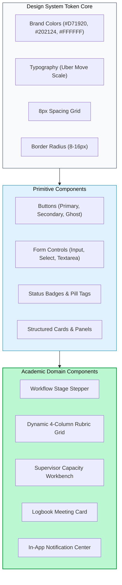
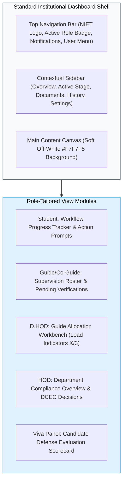

# NIET Dissertation Management System — UI Design System & Component Guidelines

**Document ID:** `DOC-11-UI`  
**File Path:** [`docs/11_UI_DESIGN_SYSTEM.md`](file:///c:/Users/user/Desktop/niet-dissertation-management-system/docs/11_UI_DESIGN_SYSTEM.md)  
**Document Status:** ARCHITECTURE FREEZE BASELINE (PHASE 3G)  
**Last Revised:** 2026-08-15  
**Governing Baselines:** [`docs/00_PROJECT_MASTER.md`](file:///c:/Users/user/Desktop/niet-dissertation-management-system/docs/00_PROJECT_MASTER.md), [`docs/01_REQUIREMENTS.md`](file:///c:/Users/user/Desktop/niet-dissertation-management-system/docs/01_REQUIREMENTS.md), [`docs/02_ARCHITECTURE.md`](file:///c:/Users/user/Desktop/niet-dissertation-management-system/docs/02_ARCHITECTURE.md), [`docs/03_DOMAIN_MODEL.md`](file:///c:/Users/user/Desktop/niet-dissertation-management-system/docs/03_DOMAIN_MODEL.md), [`docs/04_RBAC_MATRIX.md`](file:///c:/Users/user/Desktop/niet-dissertation-management-system/docs/04_RBAC_MATRIX.md), [`docs/05_STATE_MACHINES.md`](file:///c:/Users/user/Desktop/niet-dissertation-management-system/docs/05_STATE_MACHINES.md), [`docs/06_DATABASE_SCHEMA.md`](file:///c:/Users/user/Desktop/niet-dissertation-management-system/docs/06_DATABASE_SCHEMA.md), [`docs/07_API_CONTRACTS.md`](file:///c:/Users/user/Desktop/niet-dissertation-management-system/docs/07_API_CONTRACTS.md), [`docs/08_AUDIT_MODEL.md`](file:///c:/Users/user/Desktop/niet-dissertation-management-system/docs/08_AUDIT_MODEL.md), [`docs/09_FILE_STORAGE.md`](file:///c:/Users/user/Desktop/niet-dissertation-management-system/docs/09_FILE_STORAGE.md), and [`docs/10_NOTIFICATION_MODEL.md`](file:///c:/Users/user/Desktop/niet-dissertation-management-system/docs/10_NOTIFICATION_MODEL.md)  
**Institution:** Noida Institute of Engineering & Technology (NIET), Greater Noida  
**Target Program:** M.Tech / M.Tech Integrated Dissertation Platform  

---

## 1. Document Purpose & Design Objectives

This document establishes the definitive **UI Design System, Component Guidelines & Visual Identity Specification** for the NIET Dissertation Management System (DMS). It defines the visual tokens, typography hierarchies, layout grids, component behaviors, accessibility standards, and responsive interactions required to deliver a **Modern SaaS + University ERP + Premium Institutional Platform** visual language for NIET Greater Noida.

### Primary Visual & UX Objectives

1. **Institutional Authority & Modernity:** Position NIET as a forward-looking technological institution. The visual language balances academic rigor with the sleek, high-efficiency aesthetics of a 2026 digital SaaS product. **Generic or outdated legacy ERP styling is strictly prohibited.**
2. **Strict Color Harmony & Brand Discipline:** Anchor the platform in official NIET brand colors (Primary NIET Red `#D71920` and Dark Charcoal `#202124`) using calibrated proportional ratios (65–75% Neutral White/Off-White canvas, 5–10% Red accents).
3. **Typographic Clarity & Hierarchy:** Enforce `Uber Move` as the primary institutional typeface (`Uber Move Medium` for structure, headings, navigation, and interactive controls; `Uber Move Regular` for readable body copy).
4. **Academic Workflow Usability:** Provide intuitive interfaces for complex academic workflows (dynamic 4-column rubric scoring grids, supervisor allocation workbenches, interactive dissertation progress timelines, and digital meeting logbooks).
5. **Universal Accessibility (WCAG 2.1 AA):** Ensure high color contrast, visible focus rings, ARIA semantics, keyboard navigability, and responsive adaptations across desktop, laptop, tablet, and mobile devices.

---

## 2. Brand Identity & Official Asset Protection

The visual identity is anchored by official NIET institutional visual assets.

```
┌────────────────────────────────────────────────────────────────────────────────────────┐
│                              OFFICIAL ASSET USAGE RULES                                │
├────────────────────────────────────────────────────────────────────────────────────────┤
│ 1. NIET LOGO.png              : Header, Authentication, Footer, Official Credentials.  │
│    • Rendering Policy         : object-fit: contain; strict original aspect ratio.     │
│    • Prohibitions             : NO redrawing, AI generation, color alteration, filters.│
├────────────────────────────────────────────────────────────────────────────────────────┤
│ 2. College image.png          : Landing Hero Visual, Authentication Side Banner.       │
│    • Rendering Policy         : object-fit: cover; preserves architectural focal point.│
├────────────────────────────────────────────────────────────────────────────────────────┤
│ 3. Cover page.png             : Institutional Splash, Authentication Background.       │
│    • Rendering Policy         : object-fit: cover; high-resolution photographic depth. │
├────────────────────────────────────────────────────────────────────────────────────────┤
│ 4. NIET Educational Illustr.  : Onboarding Guides, Empty States, Workflow Explanations.│
│    • Rendering Policy         : object-fit: contain; paired with institutional copy.   │
└────────────────────────────────────────────────────────────────────────────────────────┘
```

---

## 3. Brand Colors & Calibrated Proportional System

```
                                 COLOR PROPORTION SYSTEM
┌──────────────────────────────┬────────────────────────┬────────────────────────────────┐
│ Color Name & Hex Code        │ Target Surface Ratio   │ Primary UI Roles               │
├──────────────────────────────┼────────────────────────┼────────────────────────────────┤
│ Pure White (#FFFFFF)         │ 65–75% (Combined)      │ Primary canvas, cards, modals. │
│ Soft Off-White (#F7F7F5)     │                        │ Dashboard background canvas.   │
├──────────────────────────────┼────────────────────────┼────────────────────────────────┤
│ Dark Charcoal (#202124)      │ 15–20%                 │ Headings, primary text, darks. │
├──────────────────────────────┼────────────────────────┼────────────────────────────────┤
│ Primary NIET Red (#D71920)   │ 5–10% (Restrained)     │ Primary CTAs, active states.   │
├──────────────────────────────┼────────────────────────┼────────────────────────────────┤
│ Light Blue (#DCEFFF)         │ 2–5% (Supporting Only) │ Informational callouts.        │
├──────────────────────────────┼────────────────────────┼────────────────────────────────┤
│ Border Gray (#E5E7EB)        │ Structural Linework    │ Dividers, inputs, card borders.│
│ Text Gray (#6B7280)          │ Secondary Typography   │ Metadata, helper descriptions. │
└──────────────────────────────┴────────────────────────┴────────────────────────────────┘
```

### Semantic Status Palette
- **Success (`#16A34A` / Bg `#DCFCE7`):** Verified logbooks, endorsed packages, passed viva defenses.
- **Warning (`#EA580C` / Bg `#FFEDD5`):** Revisions required, pending reviews, nearing deadlines.
- **Error / Critical (`#DC2626` / Bg `#FEE2E2`):** Rejected proposals, failed defenses, capacity breaches.
- **Information (`#0284C7` / Bg `#E0F2FE`):** Pinned rubric notices, scheduling updates.

---

## 4. Typography & Typographic Scale

The platform utilizes **`Uber Move`** across all interfaces to project confidence, clarity, and institutional modernity.

```
                                TYPOGRAPHIC SCALE
┌──────────────────────┬────────────────────────┬─────────────┬──────────────┬───────────┐
│ Level / Element      │ Font Face              │ Size (rem)  │ Line Height  │ Weight    │
├──────────────────────┼────────────────────────┼─────────────┼──────────────┼───────────┤
│ Display / Hero       │ Uber Move Medium       │ 2.50rem     │ 1.20         │ 500       │
│ Heading 1 (H1)       │ Uber Move Medium       │ 2.00rem     │ 1.25         │ 500       │
│ Heading 2 (H2)       │ Uber Move Medium       │ 1.50rem     │ 1.30         │ 500       │
│ Heading 3 (H3)       │ Uber Move Medium       │ 1.25rem     │ 1.40         │ 500       │
│ Subheading / Lead    │ Uber Move Regular      │ 1.125rem    │ 1.50         │ 400       │
│ Body Copy (Default)  │ Uber Move Regular      │ 1.00rem     │ 1.50         │ 400       │
│ Body Small / Meta    │ Uber Move Regular      │ 0.875rem    │ 1.45         │ 400       │
│ Caption / Badge Text │ Uber Move Medium       │ 0.75rem     │ 1.40         │ 500       │
│ Buttons & Nav Items  │ Uber Move Medium       │ 0.9375rem   │ 1.00         │ 500       │
└──────────────────────┴────────────────────────┴─────────────┴──────────────┴───────────┘
```

> [!NOTE]
> If `Uber Move` is unavailable in specific development environments, the font stack falls back to `system-ui, -apple-system, BlinkMacSystemFont, "Segoe UI", Roboto, sans-serif`.

---

## 5. Design Tokens Specification

### 5.1 Spacing Tokens (8px Base Grid)
- `space-1` = `8px` (`0.5rem`)
- `space-2` = `16px` (`1.0rem`)
- `space-3` = `24px` (`1.5rem`)
- `space-4` = `32px` (`2.0rem`)
- `space-6` = `48px` (`3.0rem`)
- `space-8` = `64px` (`4.0rem`)
- `space-10` = `80px` (`5.0rem`)

### 5.2 Border Radius Tokens
- `radius-sm` = `6px` (Small chips, nested tags)
- `radius-md` = `8px–10px` (Default buttons, input fields, select dropdowns)
- `radius-lg` = `12px–16px` (Dashboard cards, table containers, dialogs)
- `radius-xl` = `16px–20px` (Large modal panels, hero enclosures)
- `radius-full` = `9999px` (Pill badges, avatars, status indicators)

### 5.3 Elevation & Shadow Tokens
- `shadow-subtle` = `0 1px 3px 0 rgba(32, 33, 36, 0.05), 0 1px 2px -1px rgba(32, 33, 36, 0.05)`
- `shadow-card` = `0 4px 6px -1px rgba(32, 33, 36, 0.05), 0 2px 4px -2px rgba(32, 33, 36, 0.05)`
- `shadow-modal` = `0 20px 25px -5px rgba(32, 33, 36, 0.10), 0 8px 10px -6px rgba(32, 33, 36, 0.05)`

### 5.4 Transition & Motion Tokens
- `transition-fast` = `150ms cubic-bezier(0.4, 0, 0.2, 1)` (Button hovers, focus rings)
- `transition-normal` = `250ms cubic-bezier(0.4, 0, 0.2, 1)` (Dropdowns, tab switches, cards)
- `transition-slow` = `350ms cubic-bezier(0.4, 0, 0.2, 1)` (Modal entries, drawer transitions)

---

## 6. Core Component Catalog & Interaction Standards



### 6.1 Button System
1. **Primary Button:** Background `#D71920`, Text `#FFFFFF`, Radius `8-10px`, Font `Uber Move Medium`. Hover: Background `#B5141A`, `shadow-subtle`.
2. **Secondary Button:** Background `#FFFFFF`, Text `#202124`, Border `1px solid #E5E7EB`. Hover: Background `#F7F7F5`.
3. **Tertiary / Ghost Button:** Transparent background, Text `#202124` or `#D71920`. Hover: Background `rgba(215, 25, 32, 0.05)`.
4. **Destructive Button:** Background `#DC2626`, Text `#FFFFFF`. Used for irreversible actions (e.g. proposal rejection).

### 6.2 Form Control System
- **Input Fields & Textareas:** White background, `1px solid #E5E7EB` border, `Uber Move` typography, `8-10px` radius.
- **Active Focus State:** `2px solid #D71920` outline with `2px` offset (`focus:ring-2 focus:ring-[#D71920]`).
- **Validation Errors:** High-contrast `#DC2626` border with inline error text and warning icon below the field.

---

## 7. Dynamic 4-Column Rubric UI Component

The dynamic rubric interface renders an interactive 4-column achievement scoring grid:

```
┌────────────────────────────────────────────────────────────────────────────────────────┐
│                        DYNAMIC 4-COLUMN RUBRIC SCORING GRID                            │
├─────────────────────┬──────────────────┬──────────────────┬────────────────────────────┤
│ Criteria Dimension  │ Exemplary (100%) │ Proficient (75%) │ Needs Impr. (50%) | (25%)  │
├─────────────────────┼──────────────────┼──────────────────┼────────────────────────────┤
│ Problem Statement   │ [●] Clear, novel │ [○] Adequately   │ [○] Ambiguous or weak      │
│ (Max: 25.0 Marks)   │     formulation  │     defined      │     literature grounding   │
│                     │     (25.0 Pts)   │     (18.75 Pts)  │     (12.5 Pts)             │
├─────────────────────┼──────────────────┼──────────────────┼────────────────────────────┤
│ Research Rigor      │ [○] Rigorous ROS2│ [●] Solid design │ [○] Incomplete validation  │
│ (Max: 25.0 Marks)   │     methodology  │     with minor   │     pipeline               │
│                     │     (25.0 Pts)   │     gaps (18.75) │     (12.5 Pts)             │
├─────────────────────┴──────────────────┴──────────────────┴────────────────────────────┤
│ Calculated Total: 43.75 / 50.0 Marks                       [ Submit Scored Evaluation ]│
└────────────────────────────────────────────────────────────────────────────────────────┘
```

- **Interactive State:** Clicking an achievement tier radio card highlights the cell in `#DCEFFF` border with `#202124` text and live-updates the composite total.

---

## 8. Academic Table System & Responsive Mobile Transformation

### Desktop View
- Sticky header with `#F7F7F5` background and `Uber Move Medium` typography.
- Alternating row hover states (`hover:bg-[#F7F7F5]`).
- Status indicators rendered with semantic pill badges (Icon + Text).

### Mobile Responsive Transformation
On screens $< 768\text{px}$, tables transform from wide horizontal data grids into **stacked card components**:
- Each row renders as an isolated card with labeled key-value metadata rows.
- Primary actions (Review, Endorse, Download) render as full-width secondary buttons at the card base.

---

## 9. Role-Tailored Dashboard Layouts



---

## 10. Responsive Breakpoint Strategy

```
                               RESPONSIVE BREAKPOINTS
┌──────────────────────┬────────────────────────┬────────────────────────────────────────┐
│ Breakpoint Name      │ Viewport Width         │ Layout Adaptations                     │
├──────────────────────┼────────────────────────┼────────────────────────────────────────┤
│ sm                   │ >= 640px               │ Single-column stacked cards, compact.  │
│ md                   │ >= 768px               │ 2-column grids, collapsible sidebar.   │
│ lg                   │ >= 1024px              │ Full dashboard layout, persistent nav. │
│ xl                   │ >= 1280px              │ 3-column analytics, spacious tables.   │
│ 2xl                  │ >= 1536px              │ Max content container width: 1440px.   │
└──────────────────────┴────────────────────────┴────────────────────────────────────────┘
```

---

## 11. Security-Aware UX & Annexure 6 Isolation

1. **Strict UI Isolation for Annexure 6:** The candidate student portal contains **zero tabs, links, buttons, or placeholder references** to Annexure 6.
2. **No Client-Side Authority Assumptions:** UI buttons (e.g. `Approve Proposal` or `Allocate Guide`) are rendered based on server-verified session roles. Clicking an action triggers server-side validation; hidden UI elements are never relied upon for security.
3. **Obfuscated Document Actions:** Download buttons trigger API pre-signed token generation rather than revealing permanent S3 paths.

---

## 12. Accessibility (WCAG 2.1 AA) Standards

1. **Color Contrast:** All body text meets minimum contrast ratio $\ge 4.5:1$ against white/off-white backgrounds (`#202124` text on `#FFFFFF` yields $16.1:1$).
2. **Keyboard Focus Navigation:** All interactive elements support sequential keyboard navigation with visible, high-contrast focus rings (`outline: 2px solid #D71920`).
3. **Screen Reader Semantics:** Semantic HTML5 landmarks (`<header>`, `<nav>`, `<main>`, `<aside>`, `<footer>`) and ARIA roles (`role="status"`, `aria-live="polite"`, `aria-expanded`).

---

## 13. Zero-Cost Implementation Strategy

The design system is architected to be fully implemented using open-source, zero-cost technologies:
- **Styling Engine:** Tailwind CSS / Vanilla CSS utilizing CSS Custom Properties for design tokens.
- **Iconography:** Lucide Icons / Heroicons (Open-source MIT licensed icons rendered in clean charcoal).
- **Component Primitives:** Radix UI / Headless UI unstyled accessible primitives.
- **Zero Paid Subscriptions:** Zero commercial UI kit licenses or external font CDNs required.

---

## 14. Open UI Design Questions

In strict accordance with the Anti-Hallucination Rule, the following design items remain open pending institutional confirmation:

| Open Decision ID | UI Area | Unresolved Design Question | Prototype Stance |
| :--- | :--- | :--- | :--- |
| `REQ-OD-014` | Typography | Official institutional webfont licensing for `Uber Move`. | Implement with local/hosted `Uber Move` with clean sans-serif fallbacks. |
| `REQ-OD-015` | Iconography | Official institutional icon family standard. | Default to clean charcoal Lucide icon set. |

---

## 15. Future UI Capabilities (Slated for Post-V1)

1. **`FUT-UI-DARKMODE`:** High-contrast Dark Mode theme for low-light research environments.
2. **`FUT-UI-CHARTS`:** Interactive SVG research domain distribution and departmental completion velocity charts.
3. **`FUT-UI-PALETTE`:** Quick command palette (`Cmd+K` / `Ctrl+K`) for rapid faculty search and navigation.

---

## 16. Requirement Traceability Matrix

| UI Component / Token | Governing Requirement IDs | Source Document & Section | Rationale / Traceability Note |
| :--- | :--- | :--- | :--- |
| **NIET Red & Charcoal Palette**| `REQ-UI-001`, `REQ-BRAND-001`| `01_REQUIREMENTS.md §19` | Brand colors locked (#D71920, #202124) |
| **Uber Move Typography** | `REQ-UI-002` | `01_REQUIREMENTS.md §19` | Primary institutional typeface |
| **Dynamic Rubric Grid** | `REQ-RUB-001`..`003` | `01_REQUIREMENTS.md §13` | Interactive 4-column achievement scoring UI |
| **Annexure 6 UI Isolation** | `REQ-ANN6-002`, `REQ-NFR-SEC-002`| `01_REQUIREMENTS.md §5.10, §6.1`| Zero UI exposure of confidential evaluation to students|
| **Supervisor Capacity Badge**| `REQ-ALLOC-004`, `REQ-ALLOC-005`| `01_REQUIREMENTS.md §5.4` | Real-time capacity indicators ($X/3$) on allocator UI |
| **WCAG 2.1 AA Standards** | `REQ-NFR-ACC-001`, `REQ-NFR-ACC-002`| `01_REQUIREMENTS.md §6.3` | High contrast, visible focus, ARIA semantics |

---

## 17. Anti-Hallucination & Governance Verification

- [x] **No Application Code Written:** Confirmed zero React components or CSS files created.
- [x] **Exact Brand Colors Locked:** `#D71920` (Red), `#202124` (Charcoal), `#FFFFFF` (White), `#F7F7F5` (Off-White), `#DCEFFF` (Light Blue).
- [x] **`Uber Move` Primary Typeface Preserved:** Specified across all typographic scales.
- [x] **Official NIET Visual Assets Preserved:** Strict aspect ratio and rendering rules established for all 4 official assets.
- [x] **Single File Scope Respected:** ONLY [`docs/11_UI_DESIGN_SYSTEM.md`](file:///c:/Users/user/Desktop/niet-dissertation-management-system/docs/11_UI_DESIGN_SYSTEM.md) was modified.
