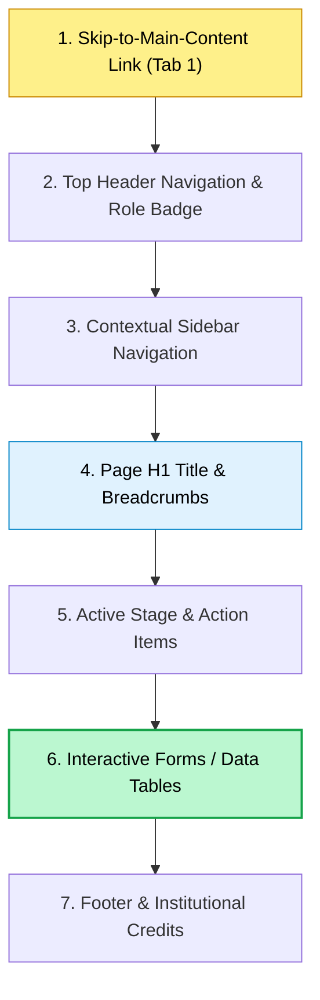
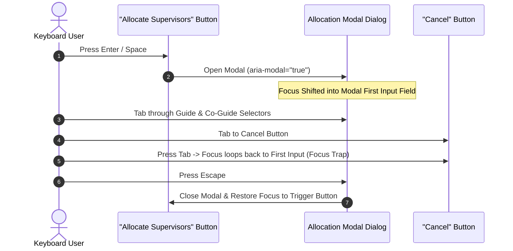
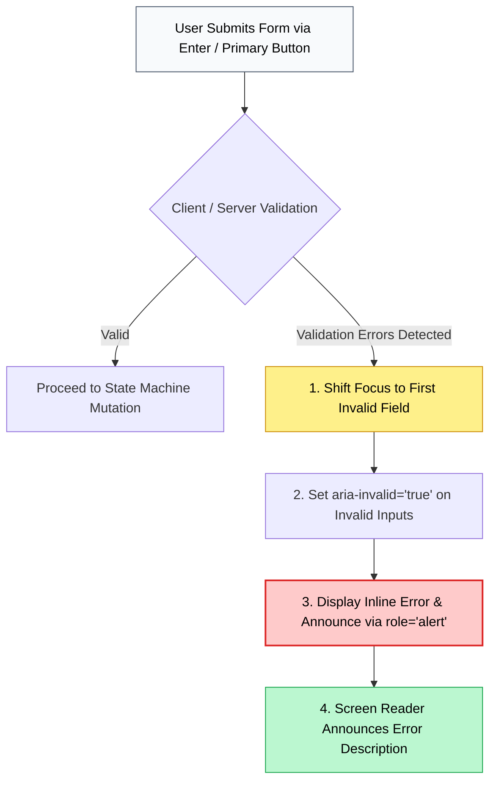

# NIET Dissertation Management System — Accessibility (a11y) Specification

**Document ID:** `DOC-12-A11Y`  
**File Path:** [`docs/12_ACCESSIBILITY.md`](file:///c:/Users/user/Desktop/niet-dissertation-management-system/docs/12_ACCESSIBILITY.md)  
**Document Status:** ARCHITECTURE FREEZE BASELINE (PHASE 3H)  
**Last Revised:** 2026-08-15  
**Governing Baselines:** [`docs/00_PROJECT_MASTER.md`](file:///c:/Users/user/Desktop/niet-dissertation-management-system/docs/00_PROJECT_MASTER.md), [`docs/01_REQUIREMENTS.md`](file:///c:/Users/user/Desktop/niet-dissertation-management-system/docs/01_REQUIREMENTS.md), [`docs/02_ARCHITECTURE.md`](file:///c:/Users/user/Desktop/niet-dissertation-management-system/docs/02_ARCHITECTURE.md), [`docs/03_DOMAIN_MODEL.md`](file:///c:/Users/user/Desktop/niet-dissertation-management-system/docs/03_DOMAIN_MODEL.md), [`docs/04_RBAC_MATRIX.md`](file:///c:/Users/user/Desktop/niet-dissertation-management-system/docs/04_RBAC_MATRIX.md), [`docs/05_STATE_MACHINES.md`](file:///c:/Users/user/Desktop/niet-dissertation-management-system/docs/05_STATE_MACHINES.md), [`docs/06_DATABASE_SCHEMA.md`](file:///c:/Users/user/Desktop/niet-dissertation-management-system/docs/06_DATABASE_SCHEMA.md), [`docs/07_API_CONTRACTS.md`](file:///c:/Users/user/Desktop/niet-dissertation-management-system/docs/07_API_CONTRACTS.md), [`docs/08_AUDIT_MODEL.md`](file:///c:/Users/user/Desktop/niet-dissertation-management-system/docs/08_AUDIT_MODEL.md), [`docs/09_FILE_STORAGE.md`](file:///c:/Users/user/Desktop/niet-dissertation-management-system/docs/09_FILE_STORAGE.md), [`docs/10_NOTIFICATION_MODEL.md`](file:///c:/Users/user/Desktop/niet-dissertation-management-system/docs/10_NOTIFICATION_MODEL.md), and [`docs/11_UI_DESIGN_SYSTEM.md`](file:///c:/Users/user/Desktop/niet-dissertation-management-system/docs/11_UI_DESIGN_SYSTEM.md)  
**Institution:** Noida Institute of Engineering & Technology (NIET), Greater Noida  
**Target Standard:** WCAG 2.1 Level AA Architectural Design Benchmark  

---

## 1. Document Purpose & Accessibility Objectives

This document establishes the definitive **Accessibility (a11y) Architecture, Interaction Standards & Testing Specification** for the NIET Dissertation Management System (DMS). It establishes the engineering rules, semantic structures, focus management protocols, keyboard interactions, screen reader semantics, and testing frameworks required to ensure the platform is inclusive, operable, and universally usable for all students, faculty members, and administrators, including persons with visual, auditory, motor, or cognitive disabilities.

### Core Accessibility Objectives

1. **Architectural WCAG 2.1 Level AA Benchmark:** Design and structure all frontend components, forms, tables, rubrics, and workflows to satisfy Web Content Accessibility Guidelines (WCAG) 2.1 Level AA success criteria. *(Note: Formal third-party certification is an audit milestone; this document defines the engineering design baseline).*
2. **Complete Keyboard Operability (No Mouse Dependency):** Guarantee that 100% of platform features—from proposal submission and dynamic 4-column rubric scoring to supervisor allocation and logbook verification—are fully operable via standard keyboard controls without keyboard traps.
3. **Robust Screen Reader Compatibility:** Provide semantic HTML5 structures, programmatic label-to-control bindings, descriptive alternative text, and polite live region announcements for dynamic state changes.
4. **Strict Color Contrast & Color-Independent Status:** Ensure all text and interactive controls maintain minimum contrast ratios ($\ge 4.5:1$ for normal body text; $\ge 3.0:1$ for large text and interactive components) and communicate workflow status using text, icons, and structure rather than color alone.
5. **Accessibility Preserves Security & RBAC Boundaries:** Screen readers and assistive technologies receive identical authorization boundaries. Accessibility structures **never expose restricted metadata or confidential Annexure 6 records to students**.

---

## 2. The POUR Framework Applied to NIET Dissertation Governance

```
┌────────────────────────────────────────────────────────────────────────────────────────┐
│                                  POUR PRINCIPLES MATRIX                                │
├────────────────────────────────────────────────────────────────────────────────────────┤
│ 1. Perceivable   : Content and UI components must be presentable to users in ways      │
│                    they can perceive (Text alternatives, high contrast, zoom <= 200%). │
├────────────────────────────────────────────────────────────────────────────────────────┤
│ 2. Operable      : UI components and navigation must be operable via keyboard, touch,   │
│                    and voice inputs without timing traps or confusing gestures.        │
├────────────────────────────────────────────────────────────────────────────────────────┤
│ 3. Understandable: Information and operation of UI must be understandable (Predictable │
│                    navigation, clear error messages, consistent academic terminology). │
├────────────────────────────────────────────────────────────────────────────────────────┤
│ 4. Robust        : Content must be robust enough to be interpreted reliably by a wide  │
│                    variety of user agents, including modern assistive technologies.    │
└────────────────────────────────────────────────────────────────────────────────────────┘
```

---

## 3. Keyboard Navigation & Logical Tab Hierarchy

Every interactive element in the DMS participates in a predictable, top-to-bottom, left-to-right sequential tab order matching visual layout flow.



### Standard Keyboard Interaction Keybindings

| Key / Sequence | Target Component Context | Expected Standard Behavior |
| :--- | :--- | :--- |
| `Tab` | Global / Forms / Controls | Moves focus to the next focusable interactive control. |
| `Shift + Tab` | Global / Forms / Controls | Moves focus to the previous focusable interactive control. |
| `Enter` | Buttons / Links / Submits | Activates the focused button, follows link, or submits form. |
| `Space` | Checkboxes / Radios / Buttons| Toggles checkbox state, selects radio button, triggers button. |
| `Arrow Keys (↑/↓/←/→)`| Radios / Tabs / Rubric Grid | Navigates between items in a tab list, radio group, or achievement grid. |
| `Escape` | Modals / Dialogs / Dropdowns | Dismisses open modal, closes dropdown menu, restores trigger focus. |
| `Home` / `End` | Tab Lists / Pagination Lists | Moves focus to the first or last element in a collection. |

---

## 4. Focus Management & Visible Focus Ring Architecture

To ensure users navigating with keyboards always have unambiguous visual confirmation of focused controls:

1. **Global High-Contrast Focus Ring:** Interactive elements render a prominent `2px solid #D71920` (NIET Red) focus ring with a `2px` white offset ring (`outline: 2px solid #D71920; outline-offset: 2px;`).
2. **Never Remove Focus Outlines:** CSS rules setting `outline: none` without providing an equivalent visible focus ring are strictly prohibited.
3. **Programmatic Focus Shifting on Error:** Upon submitting a form with validation errors, programmatic focus automatically shifts to the first invalid field, accompanied by an `aria-describedby` reference to the error message.
4. **Modal Dialog Focus Trapping & Restoration:** When a modal dialog opens, focus is programmatically shifted into the modal's primary interactive element and trapped within the dialog container. Upon dismissal, focus is restored to the triggering button.



---

## 5. Screen Reader Support & Native Semantic HTML Hierarchy

Screen reader compatibility prioritizes native HTML5 semantic elements over complex ARIA workarounds.

```
                               SEMANTIC LANDMARK HIERARCHY
┌────────────────────────────────────────────────────────────────────────────────────────┐
│ <header role="banner">         : NIET branding, institutional title, top nav bar.      │
│ <nav aria-label="Main Nav">    : Role-tailored dashboard navigation links.             │
│ <main id="main-content">       : Primary page title (H1) and active workflow workspace.│
│ <aside aria-label="Context">   : Progress timelines, supervisor contact cards.         │
│ <footer role="contentinfo">    : Institutional compliance and version metadata.        │
└────────────────────────────────────────────────────────────────────────────────────────┘
```

### Heading Hierarchy Rules
- Every page has exactly one `<h1>` defining the primary context (e.g. `<h1>Candidate Dissertation Workspace</h1>`).
- Subsections use strictly nested headings (`<h2>` $\rightarrow$ `<h3>` $\rightarrow$ `<h4>`) without skipping levels (e.g. never jump from `<h2>` directly to `<h4>`).

---

## 6. Color Contrast Validation & Palette Conformance

The locked NIET design system palette has been verified against WCAG 2.1 AA contrast requirements:

| Foreground Element | Background Surface | Contrast Ratio | WCAG 2.1 AA Compliance | Permitted Use Cases |
| :--- | :--- | :---: | :---: | :--- |
| **Dark Charcoal (`#202124`)** | Pure White (`#FFFFFF`) | **16.1 : 1** | **PASS (Exceeds AAA)** | All body copy, headings, primary labels. |
| **Dark Charcoal (`#202124`)** | Soft Off-White (`#F7F7F5`)| **15.4 : 1** | **PASS (Exceeds AAA)** | Dashboard text, card headings, table data. |
| **Pure White (`#FFFFFF`)** | Primary NIET Red (`#D71920`)| **4.6 : 1** | **PASS (Level AA)** | Primary CTA button text, badge text. |
| **Secondary Gray (`#6B7280`)**| Pure White (`#FFFFFF`) | **4.6 : 1** | **PASS (Level AA)** | Helper text, metadata descriptions. |
| **Success Green (`#16A34A`)** | Green Tint Bg (`#DCFCE7`)| **4.8 : 1** | **PASS (Level AA)** | Verified logbook badges, passed defense tags. |
| **Warning Orange (`#EA580C`)**| Orange Tint Bg (`#FFEDD5`)| **4.5 : 1** | **PASS (Level AA)** | Revision required badges, pending reviews. |
| **Critical Red (`#DC2626`)** | Red Tint Bg (`#FEE2E2`) | **5.1 : 1** | **PASS (Level AA)** | Error text, rejected proposal indicators. |

---

## 7. Color-Independent Communication Standards

```
┌────────────────────────────────────────────────────────────────────────────────────────┐
│                       COLOR-INDEPENDENT MULTI-CHANNEL SIGNALS                          │
├────────────────────────────────────────────────────────────────────────────────────────┤
│ 1. State / Status Badges    : Combined [Icon] + [Text Label] + [Semantic Background]   │
│    • Example                : [✓ Checkmark Icon] "VERIFIED_ACCEPTED" (Green Tint)      │
│    • Example                : [⚠ Warning Icon]   "REVISION_REQUIRED" (Orange Tint)     │
├────────────────────────────────────────────────────────────────────────────────────────┤
│ 2. Required Form Fields     : Asterisk symbol (*) + text indicator "(Required)" +      │
│                               aria-required="true" (Never just red border).            │
├────────────────────────────────────────────────────────────────────────────────────────┤
│ 3. Form Validation Errors   : [✕ Alert Icon] + High-Contrast Error Text + Error Border │
└────────────────────────────────────────────────────────────────────────────────────────┘
```

---

## 8. Typography & Zoom Accessibility

1. **Fluid Typography:** Typography scales smoothly using `rem` units based on browser default root font size (`16px`).
2. **200% Browser Zoom Support:** Layouts remain fully functional, readable, and non-overlapping when browser zoom is set to 200% without horizontal scrollbars on desktop displays.
3. **Adequate Line Spacing:** Body copy maintains line height $\ge 1.45$ and paragraph spacing $\ge 1.5\times$ font size to support users with dyslexia or cognitive processing challenges.

---

## 9. Responsive & Touch Accessibility

- **Minimum Touch Target Size:** Interactive touch targets on mobile/tablet viewports maintain minimum dimensions of **$44 \times 44\text{px}$** (or $48 \times 48\text{px}$ where space permits).
- **Adequate Spacing Between Targets:** Minimum `8px` gap between adjacent interactive buttons to prevent accidental activations.
- **Responsive Stacked Cards:** Academic data tables transform into accessible stacked card components on mobile screens ($< 768\text{px}$), maintaining semantic key-value pairs.

---

## 10. Form Accessibility Architecture

```html
<!-- Canonical Accessible Form Field Pattern (Conceptual HTML Structure) -->
<div class="form-group">
  <label for="proposed-title" id="title-label">
    Proposed Dissertation Title <span class="required-indicator" aria-hidden="true">*</span>
    <span class="sr-only">(Required)</span>
  </label>
  <input
    id="proposed-title"
    type="text"
    aria-labelledby="title-label"
    aria-describedby="title-help title-error"
    aria-required="true"
    aria-invalid="false"
  />
  <p id="title-help" class="helper-text">
    Must be concise, technically descriptive, and maximum 255 characters.
  </p>
  <p id="title-error" class="error-message" role="alert" style="display: none;">
    Title is required and must not match an existing active dissertation title.
  </p>
</div>
```

---

## 11. Error State & Live Region Announcement Flow



---

## 12. Dynamic 4-Column Rubric Grid Accessibility

The dynamic rubric interface represents complex multi-dimensional scoring accessible to screen reader and keyboard users:

```
┌────────────────────────────────────────────────────────────────────────────────────────┐
│                         ACCESSIBLE RUBRIC SEMANTIC GRID                                │
├────────────────────────────────────────────────────────────────────────────────────────┤
│ <fieldset role="radiogroup" aria-labelledby="criterion-1-title">                       │
│   <legend id="criterion-1-title">                                                      │
│     Problem Formulation (Max Weight: 25.0 Marks)                                       │
│   </legend>                                                                            │
│   <!-- Achievement Tier Radio Cards -->                                                │
│   <input type="radio" id="crit-1-tier-1" name="crit-1" value="25.0" />                 │
│   <label for="crit-1-tier-1">                                                          │
│     Exemplary (25.0 Pts): Clear, novel formulation grounded in recent IEEE literature. │
│   </label>                                                                             │
│ </fieldset>                                                                            │
└────────────────────────────────────────────────────────────────────────────────────────┘
```
- Arrow keys (`←`/`→`) cycle through the 4 achievement levels, updating the calculated score live in an `aria-live="polite"` tally region.

---

## 13. File Upload Accessibility (5 MB Prototype Cap)

1. **Dual Input Mechanism:** Drag-and-drop file upload zones are always backed by a standard, accessible `<input type="file" accept=".pdf" aria-label="Upload Thesis Manuscript">` element reachable via `Tab` and activatable via `Enter`/`Space`.
2. **Progress & Verification Announcements:** As the file uploads via pre-signed URL, progress is reported via an accessible progress meter (`role="progressbar" aria-valuenow="75" aria-valuemin="0" aria-valuemax="100"`).
3. **Size Violation Feedback:** If a file exceeds 5 MB (`5,242,880 bytes`), focus shifts immediately to an error message reading: *"File size exceeds the 5 MB limit. Please compress your PDF before re-uploading."*

---

## 14. Motion Accessibility & Reduced Motion Preference

```css
/* Conceptual CSS Motion Rule */
@media (prefers-reduced-motion: reduce) {
  *,
  *::before,
  *::after {
    animation-duration: 0.01ms !important;
    animation-iteration-count: 1 !important;
    transition-duration: 0.01ms !important;
    scroll-behavior: auto !important;
  }
}
```
- When `prefers-reduced-motion` is detected, modal dialogs appear instantly without slide animations, dropdowns toggle without fades, and progress bars update value without continuous sweeping motion.

---

## 15. Accessibility + RBAC Security: Annexure 6 Isolation

```
┌────────────────────────────────────────────────────────────────────────────────────────┐
│                        ACCESSIBILITY TREE SECURITY ISOLATION                           │
├────────────────────────────────────────────────────────────────────────────────────────┤
│ 1. Zero Hidden DOM Artifacts :                                                         │
│    • Inaccessible or restricted features (e.g. Annexure 6 for students) are NEVER      │
│      rendered in the DOM with 'display: none' or 'visibility: hidden'.                 │
│    • They are completely excluded from the server-rendered DOM tree.                   │
├────────────────────────────────────────────────────────────────────────────────────────┤
│ 2. ARIA & Accessible Name Protection :                                                 │
│    • No aria-label, tooltip text, or screen reader announcement exposes confidential   │
│      supervisor marks, ratings, or remarks to candidate students.                      │
└────────────────────────────────────────────────────────────────────────────────────────┘
```

---

## 16. Component Accessibility Specifications Catalog

| Component Concept | Primary Accessible Roles & Attributes | Keyboard Handling | Focus Behavior |
| :--- | :--- | :--- | :--- |
| **Button** | `<button type="button">`, `aria-disabled="true"` | `Enter`, `Space` | Visible red focus ring |
| **Text Input / Textarea**| `<input>`, `<textarea>`, `aria-describedby` | Standard text editing | Red focus ring, shifts on error |
| **Select Dropdown** | `<select>` or `role="combobox"`, `aria-expanded`| `↑/↓` navigate, `Enter` selects | Focuses container on open |
| **Checkbox / Radio** | `<input type="checkbox/radio">`, `aria-checked` | `Space` toggles, Arrows cycle | Circular/Box focus ring |
| **Modal Dialog** | `role="dialog"`, `aria-modal="true"`, `aria-labelledby`| `Escape` closes, `Tab` trapped | Trapped in modal, restored on exit|
| **Data Table** | `<table>`, `<th>` with `scope="col"`, `aria-sort`| Header `Enter` toggles sort | Cells selectable, tab between rows|
| **Tab List** | `role="tablist"`, `role="tab"`, `aria-selected` | `←/→` switch tabs, `Space` activate| Focus follows active tab |
| **Status Badge** | `<span>` with text + icon, `role="status"` | Non-interactive (Tab skips) | None |
| **Progress Bar** | `role="progressbar"`, `aria-valuenow`, `aria-valuemax`| Non-interactive | `aria-live="polite"` updates |
| **File Uploader** | Standard `<input type="file">`, `aria-describedby`| `Enter/Space` opens OS picker | Focuses picker trigger |
| **Notification Item**| `role="article"`, `aria-label="Unread Notification"`| `Enter` follows deep link | Action button focusable |

---

## 17. Accessibility Testing Strategy & Test Case Matrix

| Test ID | Area | Verification Goal | Testing Methodology | Priority |
| :--- | :--- | :--- | :--- | :---: |
| `A11Y-TEST-01` | Keyboard | Full workflow operable via keyboard only (No mouse). | Manual Tab/Shift-Tab sweep through all 14 phases. | **CRITICAL** |
| `A11Y-TEST-02` | Focus | Focus is trapped in modals and restored upon dismissal. | Manual verification of dialogs and drawers. | **CRITICAL** |
| `A11Y-TEST-03` | Contrast | All text elements meet minimum $4.5:1$ contrast ratio. | Automated axe-core / Lighthouse contrast sweep. | **HIGH** |
| `A11Y-TEST-04` | Screen Reader| NVDA / VoiceOver correctly announces form validation errors. | Screen reader execution on proposal and logbook forms.| **CRITICAL** |
| `A11Y-TEST-05` | Screen Reader| Dynamic 4-column rubric grid navigates via arrow keys. | VoiceOver execution on milestone evaluation grid. | **HIGH** |
| `A11Y-TEST-06` | Touch Targets| All mobile buttons meet minimum $44 \times 44\text{px}$ target size.| Mobile emulation audit in Chrome DevTools. | **HIGH** |
| `A11Y-TEST-07` | Zoom | Page usable at 200% browser zoom without layout breakage. | Manual browser zoom testing at $1280 \times 800\text{px}$. | **HIGH** |
| `A11Y-TEST-08` | Reduced Motion| Animations cease when `prefers-reduced-motion` enabled.| OS accessibility setting toggle verification. | **NORMAL** |
| `A11Y-TEST-09` | RBAC Security| Screen readers cannot inspect or detect Annexure 6 on student UI.| DOM tree inspection and screen reader audit. | **CRITICAL** |

---

## 18. Open Accessibility Questions

In strict accordance with the Anti-Hallucination Rule, the following accessibility items remain open pending institutional review:

| Open Decision ID | Accessibility Dimension | Unresolved Policy Question | Engineering Stance |
| :--- | :--- | :--- | :--- |
| `REQ-OD-016` | Automated Testing | Official automated accessibility testing framework in CI/CD pipeline. | Recommend `axe-core / Playwright-axe` in GitHub Actions. |
| `REQ-OD-017` | Uploaded Content | Institutional accessibility requirements for candidate-uploaded PDF manuscripts (tagged PDF/UA standards). | System ensures UI accessibility; uploaded PDF formatting is student responsibility in V1. |

---

## 19. Future Accessibility Features (Slated for Post-V1)

1. **`FUT-A11Y-PDFUA`:** Automated server-side PDF accessibility checker validating heading tags and alt text in submitted manuscripts.
2. **`FUT-A11Y-AUDIT`:** Commissioning a formal third-party VPAT / WCAG certification audit.
3. **`FUT-A11Y-VOICE`:** Voice-assisted dictation support for faculty evaluation commentary.

---

## 20. Requirement Traceability Matrix

| Accessibility Specification Area | Governing Requirement IDs | Source Document & Section | Rationale / Traceability Note |
| :--- | :--- | :--- | :--- |
| **WCAG 2.1 AA Standards** | `REQ-NFR-ACC-001`, `REQ-NFR-ACC-002`| `01_REQUIREMENTS.md §6.3` | Architectural accessibility benchmark |
| **Keyboard Navigation** | `REQ-NFR-ACC-002` | `01_REQUIREMENTS.md §6.3` | Complete mouse-independent operability |
| **Color Contrast & Red/Charcoal**| `REQ-UI-001`, `REQ-BRAND-001` | `01_REQUIREMENTS.md §19` | High-contrast NIET brand palette conformance |
| **Screen Reader Semantics** | `REQ-NFR-ACC-001` | `01_REQUIREMENTS.md §6.3` | Native HTML5 landmark hierarchy and ARIA roles |
| **Annexure 6 Isolation in a11y**| `REQ-ANN6-002`, `REQ-NFR-SEC-002`| `01_REQUIREMENTS.md §5.10, §6.1`| Zero accessibility tree exposure of Annexure 6 |
| **Touch Targets & Mobile Tables**| `REQ-NFR-RESP-001` | `01_REQUIREMENTS.md §6.2` | Minimum $44\times 44\text{px}$ targets; stacked card tables |

---

## 21. Anti-Hallucination & Governance Verification

- [x] **No Application Code Written:** Confirmed zero React components, CSS stylesheets, or HTML files created.
- [x] **No False Certification Claimed:** WCAG 2.1 AA clearly documented as an architectural design target rather than a certified claim.
- [x] **Locked Brand Colors Preserved:** `#D71920`, `#202124`, `#FFFFFF`, `#F7F7F5`, `#DCEFFF` evaluated and validated for contrast without color modification.
- [x] **Annexure 6 Security Invariant Preserved:** Screen readers and accessibility trees strictly isolate confidential supervisor evaluations from students.
- [x] **Single File Scope Respected:** ONLY [`docs/12_ACCESSIBILITY.md`](file:///c:/Users/user/Desktop/niet-dissertation-management-system/docs/12_ACCESSIBILITY.md) was modified.
