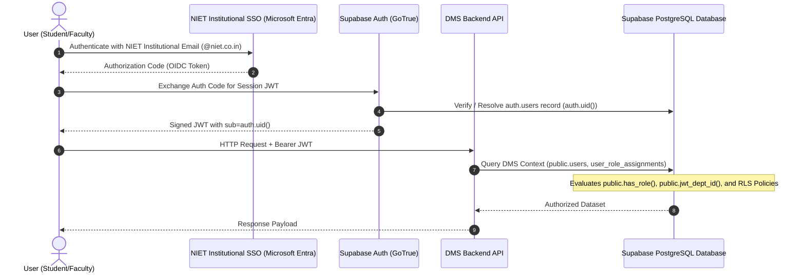
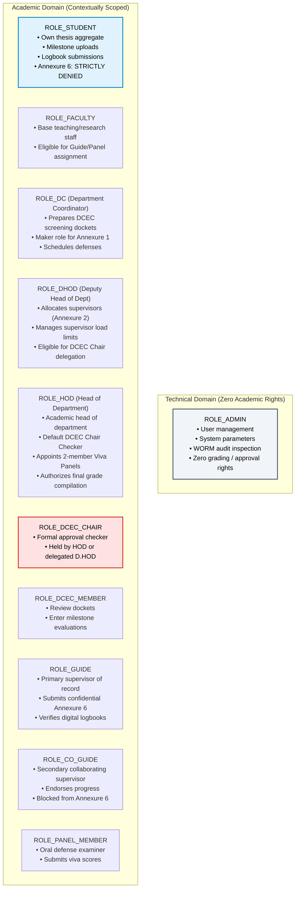
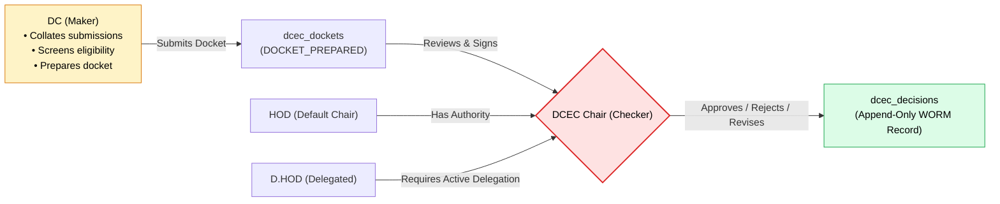

# NIET Dissertation Management System — Identity & Authentication Architecture

**Document ID:** `DOC-16-AUTH-IDENTITY`  
**File Path:** [`docs/16_IDENTITY_AUTHENTICATION_ARCHITECTURE.md`](file:///c:/Users/user/Desktop/niet-dissertation-management-system/docs/16_IDENTITY_AUTHENTICATION_ARCHITECTURE.md)  
**Document Status:** BASELINE ARCHITECTURAL SPECIFICATION (PHASE 5A)  
**Last Revised:** 2026-08-16  
**Governing Documents:** [`docs/00_PROJECT_MASTER.md`](file:///c:/Users/user/Desktop/niet-dissertation-management-system/docs/00_PROJECT_MASTER.md), [`docs/02_ARCHITECTURE.md`](file:///c:/Users/user/Desktop/niet-dissertation-management-system/docs/02_ARCHITECTURE.md), [`docs/04_RBAC_MATRIX.md`](file:///c:/Users/user/Desktop/niet-dissertation-management-system/docs/04_RBAC_MATRIX.md), [`docs/06_DATABASE_SCHEMA.md`](file:///c:/Users/user/Desktop/niet-dissertation-management-system/docs/06_DATABASE_SCHEMA.md), [`docs/13_SECURITY.md`](file:///c:/Users/user/Desktop/niet-dissertation-management-system/docs/13_SECURITY.md), [`docs/15_OPEN_DECISIONS.md`](file:///c:/Users/user/Desktop/niet-dissertation-management-system/docs/15_OPEN_DECISIONS.md)  
**Target Program:** M.Tech / M.Tech Integrated Dissertation Lifecycle  
**Target Host Engine:** Supabase Managed Cloud (PostgreSQL 17.6)  

---

## 1. Document Purpose & Scope

This document specifies the authoritative **Identity, Authentication, and Session Architecture** for the NIET Dissertation Management System (DMS). It establishes the exact mappings connecting external identity providers (Microsoft Entra ID / NIET SSO), authentication mechanisms (Supabase Auth / Session Tokens), database identity (`users`, `student_profiles`, `faculty_profiles`), and runtime authorization predicates (`user_role_assignments`, `public.*` security helpers).

---

## 2. End-to-End Identity Pipeline

Identity and authorization flow through eight deterministic pipeline stages:

```
┌────────────────────────────────────────────────────────────────────────────────────────┐
│                                END-TO-END IDENTITY PIPELINE                            │
├────────────────────────────────────────────────────────────────────────────────────────┤
│ 1. External Identity       : User logs in via Microsoft Entra ID (NIET Domain SSO)     │
│ 2. Auth Provider           : OAuth2 / OpenID Connect (OIDC) IdP token issuance        │
│ 3. Supabase Auth           : Validates external token, creates/resolves auth.users     │
│ 4. JWT & auth.uid()        : Supabase issues signed JWT with unique auth.uid() (UUID)  │
│ 5. DMS Users Table         : Maps auth.uid() ──► public.users.id via institutional_email│
│ 6. Academic Profile        : Resolves student_profiles or faculty_profiles record      │
│ 7. Role & Tenancy Scope    : Queries public.user_role_assignments (is_active = TRUE)  │
│ 8. Contextual Predicates   : RLS & API check relationship, delegation, and state       │
└────────────────────────────────────────────────────────────────────────────────────────┘
```



---

## 3. Detailed Identity Mappings & Entity Linkages

| Pipeline Stage | Source Entity | Target Entity | Key Identifier | Verification Mechanism | Fallback / Guard Condition |
|---|---|---|---|---|---|
| **SSO $\rightarrow$ Auth** | Entra ID Claim | `auth.users` | `email` (`@niet.co.in`) | Verified OIDC token signature | Reject if non-institutional email domain |
| **Auth $\rightarrow$ DMS User** | `auth.users.id` | `public.users.id` | `UUID` (identical) or matching `institutional_email` | Foreign Key / Email match trigger | Reject if user not pre-provisioned in DMS roster |
| **DMS $\rightarrow$ Student** | `public.users.id` | `public.student_profiles` | `user_id` (PK/FK) | `student_profiles.user_id = users.id` | NULL if faculty or admin |
| **DMS $\rightarrow$ Faculty** | `public.users.id` | `public.faculty_profiles` | `user_id` (PK/FK) | `faculty_profiles.user_id = users.id` | NULL if student |
| **DMS $\rightarrow$ Roles** | `public.users.id` | `public.user_role_assignments` | `user_id` + `role_id` + `department_id` | `is_active = TRUE` filter | Deny role capabilities if `is_active = FALSE` |
| **DMS $\rightarrow$ Tenancy** | `user_role_assignments` | `public.jwt_dept_id()` | `department_id` (`UUID`) | JWT `app_metadata` with DB fallback | Queries active assignment table if JWT claim missing |

---

## 4. Microsoft Entra ID / NIET SSO Boundary

To maintain rigorous development velocity without fabricating unverified institutional parameters, the SSO architecture is strictly bifurcated:

```
┌───────────────────────────────────────┬────────────────────────────────────────┐
│       IMPLEMENTABLE NOW (LOCAL/DEV)   │       DEPENDENT ON NIET IT (PROD)       │
├───────────────────────────────────────┼────────────────────────────────────────┤
│ • Pre-seeded test identities in DB    │ • Microsoft Azure Tenant ID            │
│ • Secure cookie & Bearer JWT sessions │ • Registered Enterprise App Client ID  │
│ • Supabase Local Auth / Mock OIDC     │ • Client Secret / Certificate Key      │
│ • Canonical user_role_assignments     │ • Institutional Domain Whitelist       │
│ • Complete RLS contextual policies    │ • Active Directory Graph API Roster    │
│ • Multi-role role switching logic     │ • Campus Firewall / Proxy Whitelisting │
└───────────────────────────────────────┴────────────────────────────────────────┘
```

> [!IMPORTANT]
> **DEVELOPMENT INVARIANT:**  
> Development and testing must use deterministic development identities (e.g. `student1@niet.co.in`, `hod_cse@niet.co.in`) seeded in `public.users` and `auth.users`. No code should assume live Azure AD endpoints are reachable during local offline development.

---

## 5. Canonical Role Hierarchy & Tenancy Scoping

The DMS authorization system recognizes eleven (11) base canonical roles in `public.roles`:



---

## 6. Contextual Authorization & RLS Helper Functions

Authorization in NIET DMS does **not** rely on naive client-side role checks (`user.role === 'HOD'`). All database operations are evaluated through **contextual security-definer helper functions** executing in the `public` schema:

### 6.1 Function Catalog & Logic

1. **`public.jwt_dept_id() -> UUID`**
   - **Purpose:** Extracts the active department tenancy for the current session.
   - **Logic:** Reads `auth.jwt() -> 'app_metadata' ->> 'department_id'`. If NULL or malformed, queries `public.user_role_assignments` where `user_id = auth.uid()` and `is_active = TRUE`.
2. **`public.has_role(VARIADIC allowed_roles text[]) -> BOOLEAN`**
   - **Purpose:** Checks whether the authenticated user holds any of the specified active roles.
   - **Logic:** Evaluates `EXISTS (SELECT 1 FROM public.user_role_assignments WHERE user_id = auth.uid() AND is_active = TRUE AND role_id = ANY(allowed_roles))`.
3. **`public.is_assigned_guide(p_thesis_id UUID) -> BOOLEAN`**
   - **Purpose:** Verifies whether `auth.uid()` is the primary guide of record on the specific thesis.
   - **Logic:** `SELECT EXISTS (SELECT 1 FROM public.theses WHERE id = p_thesis_id AND guide_id = auth.uid())`.
4. **`public.is_assigned_coguide(p_thesis_id UUID) -> BOOLEAN`**
   - **Purpose:** Verifies whether `auth.uid()` is the co-guide of record on the specific thesis.
   - **Logic:** `SELECT EXISTS (SELECT 1 FROM public.theses WHERE id = p_thesis_id AND co_guide_id = auth.uid())`.
5. **`public.is_assigned_panel_member(p_thesis_id UUID) -> BOOLEAN`**
   - **Purpose:** Verifies whether `auth.uid()` is appointed on the active 2-member defense panel for the specific thesis.
   - **Logic:** Joins `public.viva_defenses`, `public.defense_panels`, and `public.panel_member_assignments` matching `p_thesis_id` and `auth.uid()`.
6. **`public.is_active_dcec_chair(p_department_id UUID) -> BOOLEAN`**
   - **Purpose:** Evaluates whether `auth.uid()` has valid DCEC Chair checker authority for the department.
   - **Logic:** Returns TRUE if user has active `ROLE_HOD` in `p_department_id` OR holds an active, unrevoked delegation in `public.dcec_delegations` where `clock_timestamp()` is between `effective_from` and `effective_until`.

---

## 7. DCEC Authority & Delegation Architecture

The Departmental Candidate Evaluation Committee (DCEC) operates under a strict **Maker-Checker separation**:



### Delegation Rules:
- **Delegator:** Only active `ROLE_HOD` can create delegations in `public.dcec_delegations`.
- **Delegatee:** Must be an active `ROLE_DHOD` or senior faculty within the same `department_id`.
- **Validity Window:** Time-bounded by `effective_from` and `effective_until`.
- **Revocation:** Instantly revokable by setting `is_revoked = TRUE`.
- **Admin Invariant:** Technical `ADMIN` cannot grant themselves DCEC Chair approval authority.

---

## 8. Identity Lifecycle & Exception Handling

| Identity Scenario | System Behavior & Invariant | Error / Audit Code |
|---|---|---|
| **Unknown SSO Identity** | If external user authenticates via SSO but does not exist in `public.users`, authentication succeeds in Supabase Auth but DMS API returns HTTP 403 (Unregistered Institutional Identity). Auto-registration without admin roster match is forbidden. | `ERR_AUTH_UNREGISTERED_IDENTITY` |
| **Unmapped User (No Role)** | If `public.users` record exists but has 0 active entries in `user_role_assignments`, all RLS policies deny access. User sees "Pending Institutional Role Assignment" holding page. | `ERR_AUTH_NO_ACTIVE_ROLE` |
| **Multi-Role User** | If a faculty member holds multiple active roles (e.g. `FACULTY` + `DC` in Dept A + `GUIDE` for Thesis X), all active roles are evaluated union-wise by `public.has_role()`. The API allows explicit session role narrowing. | `INFO_MULTI_ROLE_ACTIVE` |
| **Revoked / Inactive Role** | If `user_role_assignments.is_active` is set to `FALSE`, `public.has_role()` immediately returns `FALSE` on the next query (zero database latency). | `WARN_ROLE_INACTIVE` |
| **Deactivated User** | If `public.users.is_active` is set to `FALSE`, authentication middleware and RLS deny all operations across all endpoints. | `ERR_ACCOUNT_DISABLED` |

---

## 9. Security Boundaries & Threat Invariants

1. **Zero Client Trust:** RLS policies evaluate `auth.uid()` and relational joins; client-supplied user IDs in request bodies are ignored for authorization decisions.
2. **Student Isolation:** Students can only SELECT theses where `student_id = auth.uid()`. Cross-student thesis read/update is structurally impossible at the database layer.
3. **Annexure 6 Permanent Lockout:** The confidential supervisor evaluation (`public.annexure_6_evaluations`) is protected by `has_role('STUDENT') = FALSE` on both SELECT and INSERT policies. Students cannot access supervisor ratings before or after defense.
4. **WORM Immutability:** Audit events, configuration logs, milestone scores, and final viva results cannot be altered or deleted once written.
5. **Admin Academic Isolation:** System administrators have zero grants to insert or alter grades, viva decisions, or supervisor allocations.
